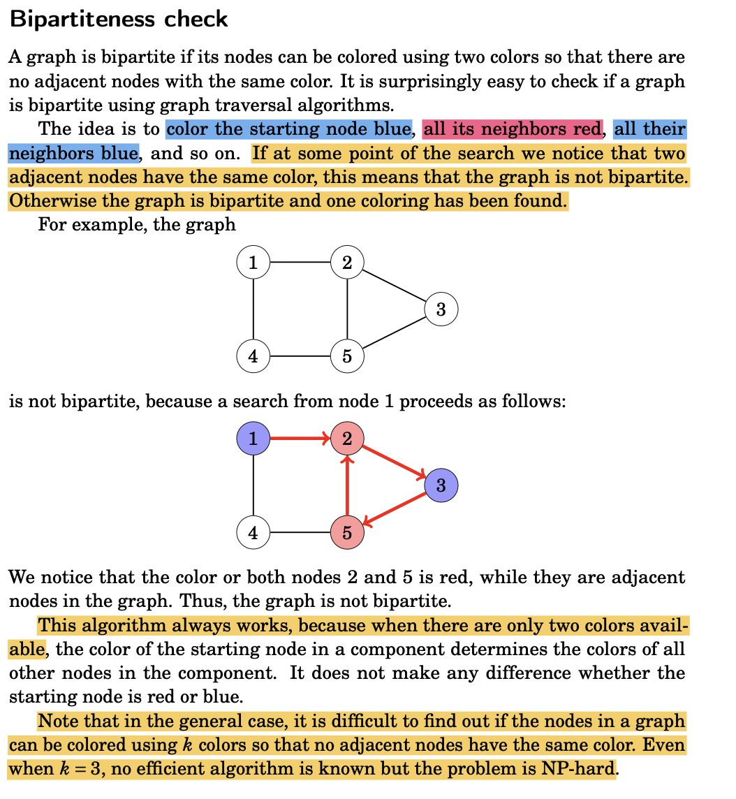
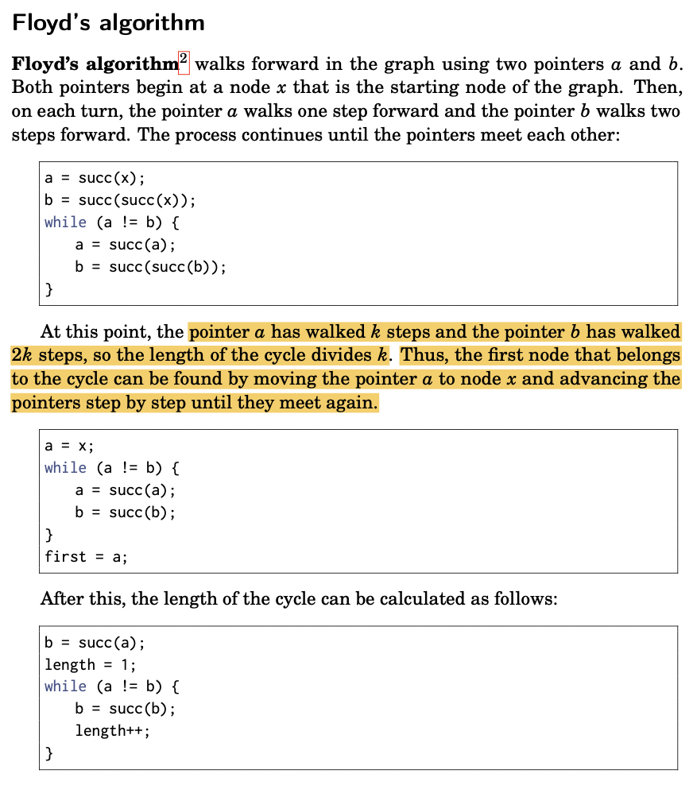

# Graph

## **Notes**

* Graph representation: use `defaultdict`

```python
# input matrix = [[2,1,1],[2,3,1],[3,4,1]] : [from,to,weight]; src = k; dst = X
from collections import defaultdict
graph = defaultdict(list)
# making adjacency list
for i,j,w in matrix:
    graph[i].append((j,w))
```

## 0. BFS/DFS : both `O(V+E)`


FOR SHORTES PATH: **USE BFS!!!!!!!!!!!!!!!!!!!!**

\*\*E.g.: \*\*Below CSES: Labyrinth; DFS doesnt work!!!




```python
from collections import deque

dirs = [(-1,0),(0,1),(1,0),(0,-1)]
vis = [[False for _ in m]for _ in n]    # order of n & m is very imp here!!
def bfs(grid: List[List[int]])
    
    n, m = len(grid), len(grid[0])
    de = deque()
    de.append(K)
    vis[K] = True
    
    while de:
        top_x,top_y = de.popleft()
        for dx, dy in dirs:
            x = top_x + dx
            y = top_y + dy
            if 0<=x<n and 0<=y<m and not vis[x][y]:
                de.append((x,y))
                vis[x][y] = True    
```



```python
dfs(x):
    vis[x] = True
    for i in graph[x]:
        if not vis[i]:
            dfs(i)
```



```python
''' If you hit a border, this is not an island '''
dirs = [(0,1),(0,-1),(1,0),(-1,0)]
cnt = 0

N, M = len(grid), len(grid[0])
    
def dfs(sx,sy):
    if sx == 0 or sy == 0 or sx == N-1 or sy == M-1:
        return 0
    grid[sx][sy] = 2
    res = 1
    for dx,dy in dirs:
        x, y = sx+dx, sy+dy
        if 0<=x<N and 0<=y<M and grid[x][y]==0:
            res *= dfs(x,y)
    return res

for i in range(1,N-1):
    for j in range(1,M-1):
        if grid[i][j] == 0:
            cnt += dfs(i,j)
return cnt
```



```python
N,M = len(g), len(g[0])
dirs = [(0,1),(0,-1),(1,0),(-1,0)]
Q = deque()

def dfs(sx,sy):
    g[sx][sy] = 2           # paint this island with color '2'
    Q.append((sx,sy))
    
    for dx,dy in dirs:
        x, y = sx+dx , sy+dy
        if 0<=x<N and 0<=y<M and g[x][y] == 1:
            dfs(x,y)
            
#1. find first island & add to Q(for bfs later)
island1Found = False
for i in range(N):
    for j in range(M):
        if g[i][j] == 1:
            dfs(i,j)
            island1Found = True
            break
    if island1Found:
        break

#2. BFS - step by step expand island#1(col:2) until it collides with island#2(col:1)
dist = 0
while Q:
    # print(g)
    l = len(Q)
    for i in range(l):
        sx,sy = Q.popleft()

        for dx,dy in dirs:
            x, y = sx+dx , sy+dy
            if 0<=x<N and 0<=y<M:
                if g[x][y] == 1:
                    return dist
                if g[x][y] != 2:
                    g[x][y] = 2
                    Q.append((x,y))
    dist += 1
return -1


'''
elegant solution: =============================
1. First Do a DFS on one connected component, mark them visited, add them to the queue
2. Second Do a BFS to find the second connected component cause BFS guarantees Shortest Path optimally.

diagram: https://leetcode.com/problems/shortest-bridge/discuss/189293/C%2B%2B-BFS-Island-Expansion-%2B-UF-Bonus
'''
```



```python
I = lambda: map(int, input().split())

n, m = I()

adj = defaultdict(list)

for _ in range(m):
    x,y = I()
    adj[x].append(y)
    adj[y].append(x)
    
# op1: copy of path( this shit cost me coinbase job 😖)=========    
vis = set()
Q = deque()
path = [1]
is_solved = False
Q.append((1,path))

while Q:
    x,p = Q.popleft()
    if x == n:
        is_solved = True
        path = p
        break
    if x in vis:
        continue
    vis.add(x)
    
    for y in adj[x]:
        new_path = p.copy()
        new_path.append(y)
        Q.append((y,new_path))
    

if not is_solved:
    print('IMPOSSIBLE')
else:
    print(len(path))
    print(*path, end = ' ')

# opt#2: par[] is always reliable ============================
vis = set()
Q = deque()

par = [-1 for _ in range(n+1)]
Q.append((1,-1))

while Q:
    x,p = Q.popleft()
    if x in vis:
        continue
    vis.add(x)
    par[x] = p
    if x == n:
        break
    
    for y in adj[x]:
        Q.append((y,x))    

if par[n] == -1:
    print('IMPOSSIBLE')
else:
    path = []
    x = n
    while x != -1:
        path.append(x)
        x = par[x]
    path.reverse()
    print(len(path))
    print(*path, end = ' ')
```



```python
I = lambda: map(int, input().split())
n, m = I()

grid = [['x' for _ in range(m)] for _ in range(n)]
monsters = []
start = None

for i in range(n):
    s = str(input())
    for j in range(m):
        grid[i][j] = s[j]
        if s[j] == 'M':
            monsters.append((i,j))
        if grid[i][j] == 'A':
            start = (i,j)

times = [[float('inf') for _ in range(m)] for _ in range(n)]
dirs = [(0,1,'R'),(0,-1,'L'),(1,0,'D'),(-1,0,'U')]

# 1.populate monsters reaching time ===========================
Q = deque()
vis = set()
for mx,my in monsters:
    Q.append((mx,my,0))

while Q:
    mx,my, t = Q.popleft()
    vis.add((mx,my))
    
    times[mx][my] = min(t,times[mx][my])
    for dx,dy,_ in dirs:
        x,y = mx+dx, my+dy
        if 0<=x<n and 0<=y<m and (x,y) not in vis and grid[x][y] != '#':
            Q.append((x,y,t+1))

# 2. start your escape 🏃‍♂️🏃‍♂️🏃‍♂️🏃‍♂️🏃‍♂️🏃‍♂️🏃‍♂️ ===========================
Q = deque()
vis.clear()
Q.append((start[0],start[1],0,[]))
escape_possible = False
path = []

while Q:
    x,y,t,p = Q.popleft()
    if x == n-1 or x == 0 or y == 0 or y == m-1:
        escape_possible = True
        path = p
        break
    vis.add((x,y))
    
    for dx,dy,dr in dirs:
        nx,ny = x+dx,y+dy
        if 0<=nx<n and 0<=ny<m and (nx,ny) not in vis and grid[nx][ny] == '.' and times[nx][ny] > t:
            new_path = p.copy()
            new_path.append(dr)
            Q.append((nx,ny,t+1,new_path))
    
if not escape_possible:
    print('NO')
else:
    print('YES')
    print(len(path))
    print(''.join(path))
```



```python
def calcEquation(self, equations: List[List[str]], values: List[float], queries: List[List[str]]) -> List[float]:
    G = collections.defaultdict(dict)
    for (x, y), v in zip(equations, values):
        G[x][y] = v
        G[y][x] = 1/v
        
    def bfs(src, dst):
        if not (src in G and dst in G): return -1.0
        q, seen = [(src, 1.0)], set()
        for x, v in q:
            if x == dst: 
                return v
            seen.add(x)
            for y in G[x]:
                if y not in seen: 
                    q.append((y, v*G[x][y]))
        return -1.0
    return [bfs(s, d) for s, d in queries]
```



* [x] [339. Evaluate Division](https://leetcode.com/problems/evaluate-division/) **@coinbase**
* [x] CSES: [Message Route](https://cses.fi/problemset/task/1667/) | BFS+backtrack ✅✅ | this shit costed me @coinbase job 😖😖
* [x] [490. The Maze](https://leetfree.com/problems/the-maze)
* [x] [130. Surrounded Regions](https://leetcode.com/problems/surrounded-regions/)
* [x] [1020.Number of Enclaves](https://leetcode.com/problems/number-of-enclaves/)
* [x] [1376.Time Needed to Inform All Employees](https://leetcode.com/problems/time-needed-to-inform-all-employees/)
* [x] [1254.Number of Closed Islands](https://leetcode.com/problems/number-of-closed-islands/)
* [x] [200. Number of Islands](https://leetcode.com/problems/number-of-islands/)
* [x] [841.Keys and Rooms](https://leetcode.com/problems/keys-and-rooms/)
* [x] [895. Max Area of Island](https://leetcode.com/problems/max-area-of-island/)
* [x] [733. Flood Fill](https://leetcode.com/problems/flood-fill/)
* [x] [542. 01 Matrix](https://leetcode.com/problems/01-matrix/) ✅
* [x] [1162.As Far from Land as Possible](https://leetcode.com/problems/as-far-from-land-as-possible/) | **DP**(2 traversal)\*\*: \*\*(i) top\_to\_bottom (ii) bottom\_to\_top
* [x] [994.Rotting Oranges](https://leetcode.com/problems/rotting-oranges/) 🍊🍊
* [x] [1091.Shortest Path in Binary Matrix](https://leetcode.com/problems/shortest-path-in-binary-matrix/) //see 'Why DP doesnt work here!!'
  * _i.e. for a lonnngggg zigzag path going through (7,0)....->(1,1)->... ; by you wont have value of dp\[7]\[0] when you're calculating dp\[1]\[1]_
* [x] [797.All Paths From Source to Target](https://leetcode.com/problems/all-paths-from-source-to-target/) | dfs + backtrack
* [x] [332.Reconstruct Itinerary](https://leetcode.com/problems/reconstruct-itinerary/) | dfs + backtrack ✅✈️
* [x] [1443.Minimum Time to Collect All Apples in a Tree](https://leetcode.com/problems/minimum-time-to-collect-all-apples-in-a-tree/) 🍎
* [x] [934.Shortest Bridge](https://leetcode.com/problems/shortest-bridge/) | **@Google** | BFS+DFS ✅
* [ ] CSES:[ Grid Paths](https://cses.fi/problemset/task/1625) ✅✅✅🐽| [WilliamLin](https://www.youtube.com/watch?v=dZ\_6MS14Mg4\&t=2440s\&ab\_channel=WilliamLin)
* [x] CSES: [Labyrinth](https://cses.fi/problemset/task/1193) ==> DFS fails, **ALWAYS USE BFS for SHORTEST PATH ✅✅**
* [x] CSES: [Monsters](https://cses.fi/problemset/task/1194) | `Lava Flow Problem✅✅✅🔥🔥` | [video](https://www.youtube.com/watch?v=hB59dxdDLII\&ab\_channel=Dardev)
* [ ] CSES: [Swap Game](https://cses.fi/problemset/task/1670)
* [x] LC [818. Race Car](https://leetcode.com/problems/race-car/) 😎✅✅
  * [x] Similar: LC [1654.Minimum Jumps to Reach Home](https://leetcode.com/problems/minimum-jumps-to-reach-home/) ✅| must do| DP se nhi honge aise Questions
  * [x] LC [1533.Minimum Number of Days to Eat N Oranges](https://leetcode.com/problems/minimum-number-of-days-to-eat-n-oranges/) | BFS or DP 💪✅
* [x] LC [847. Shortest Path Visiting All Nodes](https://leetcode.com/problems/shortest-path-visiting-all-nodes/) 🐽| BFS + bitmask
* [x] LC [**127. Word Ladder**](https://leetcode.com/problems/word-ladder/) | &[ **126.Word Ladder II**](https://leetcode.com/problems/word-ladder-ii/) - amazon@happy !!!!!!!!!!!!!!!!!!!!!!!!!!!!!!!!!!!!!!!!!!!!!!!!!!🤯



```python
def minTime(self, n: int, edges: List[List[int]], hasApple: List[bool]) -> int:
    G = defaultdict(list)

    for u,v in edges:
        G[u].append(v) 
        G[v].append(u) 

    vis = set()
    def dfs(s):
        if s in vis:
            return 0
        vis.add(s)
        # dfs on child           
        dist = 0
        for t in G[s]:
            dist += dfs(t)
        if dist > 0: return dist+2
        return 2 if hasApple[s] else 0

    return max(dfs(0)-2, 0)
```



```python
def bfs(pos, vel):
    Q = deque()
    Q.append((0,pos,vel))   # (move,pos,vel)
    res = float('inf')
    while Q:
        m,p,v = Q.popleft()
        
        if p == target:
            res = min(res,m)
        if m >= res:
            continue
        
        # keep moving forward
        Q.append((m+1,p+v,v*2))
        
        #3. Only consider changing the direction of the car if one of the following conditions is true
        #   i.  The car is driving away from the target.
        #   ii. The car will pass the target in the next move.  
        if (p+v>target and v>0) or (p+v<target and v<0):
            Q.append((m+1, p, -1 if v > 0 else 1))

    return res

return bfs(0,1)
```



```python
def minimumJumps(self, forbidden: List[int], a: int, b: int, x: int) -> int:
    forbidden = set(forbidden)
    visited = set()
    limit = max(x, max(forbidden)) + a + b
    queue = [(0, 0, False)]
    while queue:
        pos, step, back = queue.pop(0)
        if pos > limit or pos < 0 or pos in forbidden or (pos, back) in visited:
            continue
        if pos == x:
            return step
        queue.append((pos+a, step+1, False))
        if not back: queue.append((pos-b, step+1, True))
        visited.add((pos, back))
    return -1
```



```python
from collections import deque
def minDays(self, n: int) -> int:
    #1. DP ===================================================
    MEMO = {}
    def dp(n):
        if n <= 1:
            return n
        
        if n in MEMO: return MEMO[n]
        
        op1 = n%2 + dp(n//2)
        op2 = n%3 + dp(n//3)
        
        MEMO[n] = 1 + min(op1,op2)
        return MEMO[n]

    return dp(n)
    
    #So, the choice we have is to 
    #      1. eat n % 2 oranges one-by-one and then swallow n / 2, 
    #      2. or eat n % 3 oranges so that we can gobble 2 * n / 3

    # BFS ========================================================
    
    def bfs(n):
        Q = deque()
        vis = set()
        Q.append((n,0))
        
        while Q:
            # implement for this level
            for _ in range(len(Q)):
                x,move = Q.popleft()
                if x == 0:
                    return move
                if (x-1) not in vis:
                    Q.append((x-1,move+1))
                    vis.add(x-1)
                if x%2 == 0 and x//2 not in vis:
                    Q.append((x//2,move+1))
                    vis.add(x//2)
                if x%3 == 0 and x//3 not in vis:
                    Q.append((x//3,move+1))
                    vis.add(x//3)

    return bfs(n)
```



```python
def ladderLength(self, beginWord: str, endWord: str, wordList: List[str]) -> int:

    if endWord not in wordList or not endWord or not beginWord or not wordList:
        return 0
    L = len(beginWord)
    all_combo_dict = defaultdict(list)
    for word in wordList:
        for i in range(L):
            all_combo_dict[word[:i] + "*" + word[i+1:]].append(word) 
    queue = deque([(beginWord, 1)])
    visited = set()
    visited.add(beginWord)
    while queue:
        current_word, level = queue.popleft()
        for i in range(L):
            intermediate_word = current_word[:i] + "*" + current_word[i+1:]
            for word in all_combo_dict[intermediate_word]:
                if word == endWord:
                    return level + 1
                if word not in visited:
                    visited.add(word)
                    queue.append((word, level + 1))
    return 0
```



```python
def findLadders(self, beginWord: str, endWord: str, wordList: List[str]) -> List[List[str]]:

    L = len(beginWord)
    if len(endWord) != L or endWord not in wordList:
        return []

    # preprocess wordList
    all_word_comobs = defaultdict(list)
    for word in wordList:
        for i in range(L):
            new_word = word[:i] + '*' + word[i+1:]
            all_word_comobs[new_word].append(word)

    # start BFS
    res = []
    Q = deque()
    vis = set([beginWord])

    curr_path = [beginWord]
    Q.append((beginWord, curr_path))

    while Q and not res:
        lenq = len(Q)
        local_vis = set()

        for l in range(lenq):
            x, path = Q.popleft()
            print(f' x = {x} , path = {path}')
            for i in range(0,L):
                y =  x[:i]+'*' + x[i+1:]
                list_y = all_word_comobs[y]

                for z in list_y:
                    if z == endWord:
                        res.append(path+[endWord])    #found
                    if z not in vis:
                        Q.append((z,path+[z]))
                        local_vis.add(z)
        vis = vis.union(local_vis)
    return res
```



```python
def findItinerary(self, tickets: List[List[str]]) -> List[str]:

    ''' #1. DFS + Backtrack  O(N!) ======================== '''
    G = defaultdict(list)

    for f,t in tickets:
        G[f].append(t)


    def dfs(x):           
        dstns = sorted(G[x])
        for i in dstns:
            iten.append(i)
            G[x].remove(i)
            dfs(i)
            if len(iten) == len(tickets) + 1:
                return iten
            G[x].append(i)
            iten.pop()

    iten = ["JFK"]
    return dfs("JFK")
    '''
    COMPLEXITY:
    O(n!) where n is the number of edges(or tickets). 
        Because in the backtracking solution you are trying different permutations of the edges
    '''

    ''' #2. Construct Eurler Path  O(E log E) =================================  '''
    def dfs(x):
        while G[x]:
            i = G[x].pop()
            dfs(i)
        euler_path.append(x)

    for x in G:
        G[x] = sorted(G[x], reverse = True)

    euler_path = []
    dfs("JFK")
    return euler_path[::-1]
    '''
    COMPLEXITY:
     time and space complexity of usual Euler Path Finding algorighm is O(E+V) = O(E), 
        because we traverse each edge only once and number of edges is more than number of vertixes - 1 in Eulerian graph. 
        However here we sort our list for every node, so complexity will be O(E log E)
    '''
```



```python
def updateMatrix(self, mat: List[List[int]]) -> List[List[int]]:
    m, n = len(mat), len(mat[0])
    DIR = [0, 1, 0, -1, 0]

    q = deque([])
    for r in range(m):
        for c in range(n):
            if mat[r][c] == 0:
                q.append((r, c))
            else:
                mat[r][c] = -1  # Marked as not processed yet!

    while q:
        r, c = q.popleft()
        for i in range(4):
            nr, nc = r + DIR[i], c + DIR[i + 1]
            if nr < 0 or nr == m or nc < 0 or nc == n or mat[nr][nc] != -1: continue
            mat[nr][nc] = mat[r][c] + 1
            q.append((nr, nc))
    return mat
'''
BFS from 0-cells
Complexity

Time: O(M * N), where M is number of rows, N is number of columns in the matrix.
Space: O(M * N), space for the queue.
'''    
      
```



## 1. Single Source Shortest/Longest Path - SSSP/SSLP

### **1.1 For DAGs ( e.g. Trees)**

#### 1.1.1 SSSP

* Can be done easily in `O(E+V)` using topological sort.
  * \->Ever heard of Dijkstra's on trees? Lol no.
* Ref [video](https://www.youtube.com/watch?v=TXkDpqjDMHA\&list=PLDV1Zeh2NRsDGO4--qE8yH72HFL1Km93P\&index=17\&ab\_channel=WilliamFiset)



```python
topo_list = [...]     # get any topological order of the DAG
dist = [sys.maxint]*n
dist[s] = 0
for node in topo_list:
    for x in node.neighbors:
        if dist[x] > dist[node] + graph[node][x].weight:
            dist[x] = dist[node] + graph[node][x].weight
```



#### 1.1.2 SSLP

* while SSLP on undirected graphs is <mark style="color:orange;">**NP-HARD**</mark> for DAGs, it could be easily solved in O(E+V).
* **Logic**:
  * multiply all edges with `-1` --> find shorted path --> multiply all edges with `-1` again
* Ref [video](https://www.youtube.com/watch?v=TXkDpqjDMHA\&list=PLDV1Zeh2NRsDGO4--qE8yH72HFL1Km93P\&index=17\&ab\_channel=WilliamFiset)

### 1.2 For Graphs (non-DAG wale)

#### 1.2.1 Dijkstra :: <mark style="color:orange;">`(V+E)logV`</mark>

* Fastest among three
* Fails when _negative cycle_ exists in graph
* cute animation: [video](https://www.youtube.com/watch?v=EFg3u\_E6eHU\&ab\_channel=SpanningTree)
* <mark style="color:yellow;">**WHY DIJKSTRA's ( Dijkstra's VS BFS):**</mark>
  * Dijkstra and BFS, **both are the same algorithm.**&#x20;
    * <mark style="color:yellow;">**saral bhasha mei =>**</mark> <mark style="color:yellow;"></mark><mark style="color:yellow;">every question of SSSP can be done bijkstra;s; just diff is Dijkstra's is faster</mark>
  * Dijkstra using priority\_queue whereas BFS using a queue.
  * Hence: **BFS is slow =>** Time complexity is more than O(E+V) because many of the edges are repeated twice
  * While **Dijkstra's is fast =>** (V+E)logV
* **IMPLEMENTATIONS:**
  * 1.2.1.1 Lazy Implementation
    * **Why Lazy ?** because it inserts duplicate key-val pairs & then _lazily_ deletes them.
    * This is done because: insertion in PQ(`NlogN`) is more efficient than update( `N` ) in PQ
    * \*\*Why Bad: \*\*for _dense_ graphs we end up with several \_stale outdate \_key-value pair in PQ
  * **1.2.1.2** Eager Implementation
    * This avoids duplicate key-value pair & supports efficient value updates( `logN`) by using `Index PQ`

**1.2.2 Bellman-Ford :: **<mark style="color:orange;">**`VE`**</mark>**` ``🔔`**

* Use when _negative cycles_ exist in graph.
* <mark style="color:yellow;">**Negative cycle sunte hi kaan mei ghanti 🔔(bell) bajni chahiye**</mark>


**Negative Cycle** means there exists (i)a cycle OR (ii)self loop in graph, whose net sum == 0. Negative edges doesn't ensure negative cycle.

\*\*How to find Negative Cycle: \*\*using Bellman-ford.

* **Logic**: For a regular graph, shorted dist path to any node can have _atmax_ (N-1) nodes. But for _graph with negative cycle_, there are inf shorted path for the nodes in neg.cycle.
* Run the regular Bellman-ford : (i.e. N-1) times for the graph. After that do one more run; if any points distance updates => this is due to negative cycle => hence neg cycle exists.


**1.2.3 Floyd Warshall :**:

* Its an **APSP**(All Pair Shortest Path) algo. Means it can find shortest distance b/w all 2 node pairs.
* \*\*Code Optimisation: \*\*use MEMOIZATION (similar to _matrix chain multiplication_) : see below code



```python
# input matrix = [[2,1,1],[2,3,1],[3,4,1]] : [from,to,weight]; src = k; dst = X
from collections import defaultdict
import heapq

def dijkstras_SSSP():
    graph = defaultdict(list)    
    for x,y,w in matrix:
        graph[x].append((y,w))
    
    dist = [float("inf")]*(n+1) # if nodes start from 1..n
    vis = [False]*(n+1) 
    
    heap = [(0,k)]
    dist[k] = 0
    
    while heap:
        W,s = heapq.heappop(heap)
        if vis[s] : continue
            
        vis[s] = True
        
        for y,w in graph[s]:
            if dist[y] > W + w:
                dist[y] = W + w
                heapq.heappush(heap,(dist[y],y))
    return dist
```



```python
# INPUT:         [from,to,weight]; src = k; dst = X
# input matrix = [[2,1,1],[2,3,1],[3,4,1]]
def bellmanFord_SSSP(matrix):
    dist = [0] + [float("inf")] * N
    dist[k] = 0
    for node in range(1,N):        # relax each edge (N-1) times
        for u,v,w in matrix:
            dist[v] = min(dist[v],dist[u] + w)
                
                
#============ USAGE ==================
for _ in range(m):
    u,v,w = I()
    graph.append([u,v,w])

def bellmanFord(src):
    dist = [float("inf")] * (n+1)
    dist[src] = 0
    for node in range(n+1):        # relax each edge (N-1) times
        for u,v,w in graph:
            dist[v] = min(dist[v],dist[u] + w)
    res1 = dist[n]

    #2. check for neg cycle
    for u,v,w in graph:
        old_v = dist[v]
        dist[v] = min(dist[v],dist[u] + w)
        if dist[v] != old_v:
            dist[v] = float('inf')    # Negative cycle detected
    res2 = dist[n]


    if res1 != res2:
        return '-1'
    return res1
```



```python
n,m,q = I()

dp = [[float('inf') for _ in range(n+1)] for _ in range(n+1)]

for _ in range(m):
    u,v,w = I()
    dp[u][v] = min(dp[u][v],w)
    dp[v][u] = min(dp[v][u],w)

#---------------------------------------------------------------------------
def floyd_warshall(n):
    # 1.form adj-matrix
    for i in range(1,n+1):
        dp[i][i] = 0

    #2. Apply dp similar to matrix-chain-multiplication
    for k in range(1,n+1):
        for i in range(1,n+1):
            for j in range(1,n+1):
                dp[i][j] = min(dp[i][j], dp[i][k]+dp[k][j])
#---------------------------------------------------------------------------
floyd_warshall(n)

for _ in range(q):
    a,b = I()
    if dp[a][b] >= float('inf'):
        print('-1')
    else:
        print(dp[a][b])
```



### 1.3 Algorithm Comparison for Shortest Path(SP)

| -                              | BFS                             | Dijkstra's     | BellmanFord  | FloydWarshall  |
| ------------------------------ | ------------------------------- | -------------- | ------------ | -------------- |
| **Complexity**                 | `O(V+E)`                        | `O(ElogV)`     | `O(EV)`      | `O(V^3)`       |
| **Recommended Graph Size**     | large                           | large/medium   | medium/small | small          |
| **Good for APSP?**             | only works on unweighted graphs | Ok             | Bad          | Yes            |
| **Can Detect Neg. Cycles?**    | No                              | No             | Yes          | Yes            |
| **SP on graph weighted graph** | Incorrect SP answer             | Best Algorithm | Works        | Bad in general |
| **SP on unweighted graph**     | Best algorithm                  | Ok             | Bad          | Bad in general |

### 1.4 Problems: SSSP/SSLP

* [x] CSES: [Investigation](https://cses.fi/problemset/task/1202)🏆✅✅ 📌| Dijkstra's ko nichoooooooooodddddd liya isne
* [x] [743. Network Delay Time](https://leetcode.com/problems/network-delay-time/) 🍪🍪
* [x] [1631.Path With Minimum Effort](https://leetcode.com/problems/path-with-minimum-effort/) | dijkstra's on matrix ✅ | khud se kiya ji
* [x] [@google: Min Fuel Path To Travel with capacity](https://leetcode.com/discuss/interview-question/1361977/shortest-path-question-with-a-twist) | **must\_do**
* [x] [787. Cheapest Flights Within K Stops](https://leetcode.com/problems/cheapest-flights-within-k-stops/)[ ✅](https://leetcode.com/problems/cheapest-flights-within-k-stops/)
* [ ] [882. Reachable Nodes In Subdivided Graph](https://leetcode.com/problems/reachable-nodes-in-subdivided-graph/)
* [x] [1514.Path with Maximum Probability](https://leetcode.com/problems/path-with-maximum-probability/) | maxHeap
* [ ] [1334.Find the City With the Smallest Number of Neighbors at a Threshold Distance](https://leetcode.com/problems/find-the-city-with-the-smallest-number-of-neighbors-at-a-threshold-distance/)
* [ ] [1368.Minimum Cost to Make at Least One Valid Path in a Grid](https://leetcode.com/problems/minimum-cost-to-make-at-least-one-valid-path-in-a-grid/)
* [ ] [1786. Number of Restricted Paths From First to Last Node](https://leetcode.com/problems/number-of-restricted-paths-from-first-to-last-node/)
* [ ] [The Maze II](https://leetfree.com/problems/the-maze-ii)
* [ ] [The Maze III](https://leetfree.com/problems/the-maze-iii)
* [x] [1928.Minimum Cost to Reach Destination in Time](https://leetcode.com/problems/minimum-cost-to-reach-destination-in-time/) | @contest 🚀❤️ | **Google**
* [x] CSES: [Longest Flight Route](https://cses.fi/problemset/task/1680) | print paths with `Dijkstras`
* [x] CSES: [Shortest Routes II](https://cses.fi/problemset/task/1672/) | **`Floyd-Warshall |`**\<standardQ> | must do 🔖🍪🚀🔖
* [x] CSES: [High Score](https://cses.fi/problemset/task/1673/) | **`Bellman-Ford`**` ``with Negative Cycle Detection` | \<standardQ> | must do 🔖🍪🚀🔖
* [x] CSES: [Cycle Finding](https://cses.fi/problemset/task/1197/) ✅🐽
* [x] CSES: [Flight Routes](https://cses.fi/problemset/task/1196) | ✅✅ | [approach](https://www.youtube.com/watch?v=009PBKHXtyA\&ab\_channel=Dardev) | 2-D dijkstra's
* [x] CSES: [Flight Discount](https://cses.fi/problemset/result/2664805/) | reversed dij: | [approach](https://usaco.guide/problems/cses-1195-flight-discount/solution) ✅✅ aise hi questions toh dekhne mei impossible lagte hai BC!!!!............so damn easy
* [x] [Currency Arbitrage](https://www.dailycodingproblem.com/blog/how-to-find-arbitrage-opportunities-in-python/) | @coinbase
* [x] 1368\. [Minimum Cost to Make at Least One Valid Path in a Grid](https://leetcode.com/problems/minimum-cost-to-make-at-least-one-valid-path-in-a-grid/) 🍪🍪🍪| disguised Dijkstra's | too easy when you see it



```python
'''
Dijkstra's ko nichoooooooooodddddd liya isne


You are going to travel from node 1 to N by plane. 
You would like to find answers to the following questions:

1. what is the minimum price of such a route?
2. how many minimum-price routes are there? (modulo 109+7)
3. what is the minimum number of flights in a minimum-price route?
4. what is the maximum number of flights in a minimum-price route?
'''
MOD = (10**9) + 7
I = lambda: map(int, input().split())

n,m= I()
adj = defaultdict(list)
    
for _ in range(m):
    u,v,w = I()
    adj[u].append((v,w))

dists = [float('inf') for _ in range(n+1)]
nums = [1 for _ in range(n+1)]
minf = [0 for _ in range(n+1)]
maxf = [0 for _ in range(n+1)]

vis = set()
dists[1] = 0
H = []
heappush(H,(0,1))

while H:
    wx,x = heappop(H)
    if x in vis:
        continue
    vis.add(x)
    
    for y,w in adj[x]:
        if dists[y] > dists[x] + w:
            dists[y] = dists[x] + w
            nums[y] = nums[x]
            minf[y] = 1+minf[x]
            maxf[y] = 1+maxf[x]
            heappush(H,(dists[y], y))
        elif dists[y] == dists[x] + w:
            nums[y] = (nums[x]+nums[y])%MOD
            minf[y] = min(minf[y], 1+minf[x])
            maxf[y] = max(maxf[y], 1+maxf[x])
    
print(dists[n])
print(nums[n])
print(minf[n])
print(maxf[n])
```





```python
def minimumEffortPath(self, heights: List[List[int]]) -> int:

    n,m = len(heights), len(heights[0])
    H = []
    heappush(H,(0,0,0)) #(d,x,y)
    d = [[float('inf') for _ in range(m)]for _ in range(n)]        

    vis = set()
    d[0][0] = 0

    while H:
        W,x,y = heappop(H)

        if (x,y) in vis: continue
        vis.add((x,y))

        for dx,dy in [[0,1],[0,-1],[1,0],[-1,0]]:
            nx, ny = x+dx, y+dy
            if 0<=nx<n and 0<=ny<m:
                w = abs(heights[nx][ny] - heights[x][y])
                d[nx][ny] = min(d[nx][ny],max(w, d[x][y]))
                heappush(H,(d[nx][ny],nx,ny))
    return d[n-1][m-1]
    '''
Time: O(ElogV) = O(M*N log M*N), where M is the number of rows and N is the number of columns in the matrix.

Space: O(M*N)
    '''
```



```python
from collections import deque

def minFuel(n, roads, stations, capacity):                  # BFS;
                                                            # Assuming vertices 1 to n, starting at 1 and target n.
    g = [[] for _ in range(n + 1)] 
    caps = [0] * (n + 1)
    for u, v in roads:
        g[u].append(v)
        g[v].append(u)
    for v in stations:
        caps[v] = capacity

    fuel = [0, capacity] + [0] * (n - 1)
    q = deque([(1, 0)])
    while q:
        u, dist = q.popleft()
        if u == n:
            return dist
        for v in g[u]:
            nu = max(caps[v], fuel[u] - 1)
            if nu > fuel[v]: # new fuel more than the existing at next node.
                fuel[v] = nu
                q.append((v, dist + 1))
    return -1


roads = [[1,2],[1,3],[1,5],[2,4],[2,5],[5,6],[6,8],[7,8],[3,7],[5,9],[9,10],[10,11],[11,12]]
n = 12
stations = [2,3,6,9]
c = 4
print(minFuel(n,roads,stations, c))
```



```python
def findCheapestPrice(self, n: int, flights: List[List[int]], src: int, dst: int, k: int) -> int:
    G = defaultdict(list)
    H = []
    for x,y,w in flights:
        G[x].append((y,w))

    vis = defaultdict(int)
    H = [[0,src,0]]

    while H:
        d,x,_k = heappop(H)
        if x in vis and vis[x] <= _k:   # already traversable with lesser #nodes
            continue
        vis[x] = _k
        if _k > k+1:
            continue
        if x == dst:
            return d

        for y,w in G[x]:
            heappush(H,(w+d,y,_k+1))
    return -1
```





```python
I = lambda: map(int, input().split())
n, m = I()

graph = []

for _ in range(m):
    x,y,w = I()
    graph.append((x,y,w))
    

dist = [float("-inf")] * (n+1)
dist[1] = 0
for node in range(n+1):        # relax each edge (N-1) times
    for u,v,w in graph:
        dist[v] = max(dist[v],dist[u] + w)
res1 = dist[n]
# print(dist)

#2. check for neg cycle
for u,v,w in graph:
    old_v = dist[v]
    dist[v] = max(dist[v],dist[u] + w)
    if dist[v] != old_v:
        dist[v] = float('inf')    # Negative cycle detected
res2 = dist[n]


if res1 != res2:
    print('-1')
else:
    print(res1)
```



```python
'''
Say we use the discount coupon on the edge between cities A and B.

There are two cases: we can go from 1->A->B->N OR 1->B->A->N

We can use Dijkstra's to compute:
* dis1:  the distance from 1->N to every vertex.
* distN: dist of A-> for every vertext

Then our answer is: MIN {dist1[A] + c(A,B) + distN[B] } for every vertex A--B
    * where c(A,B) is the cost to travel from 1->B after applying coupon to that flight
'''

I = lambda: map(int, input().split())
n, m = I()

prices = dict()
adj_in = defaultdict(list)		#in[i] contains flights from city i
adj_out = defaultdict(list)	  #out[i] contains flights to city i

for _ in range(m):
    x,y,w = I()
    adj_in[x].append((y,w))
    adj_out[y].append((x,w))
    
    if (x,y) in prices:
        prices[(x,y)] = min(w,prices[(x,y)])
    else:
        prices[(x,y)] = w
    
dist1 = [float('inf') for _ in range(n+1)]  # dist 1 --> x ; for all x
distN = [float('inf') for _ in range(n+1)]  # dist x --> N ; for all x

#1.get dist1
h = []
dist1[1] = 0
heappush(h,(0,1))
while h:
    ws,x = heappop(h)
    
    for y,w in adj_in[x]:
        if dist1[y] > w + dist1[x]:
            dist1[y] = w + dist1[x]
            heappush(h,(dist1[y],y))
            
#2. get dist2
h = []
distN[n] = 0
heappush(h,(0,n))
while h:
    ws,x = heappop(h)
    
    for y,w in adj_out[x]:
        if distN[y] > w + distN[x]:
            distN[y] = w + distN[x]
            heappush(h,(distN[y],y))
            
#3. get the ans - with coupon code 
print(dist1[1:])    
print(distN[1:])
res = float('inf')
for (x,y), w in prices.items():
    res = min(res, dist1[x] + (w//2) + distN[y] )
print(res)
```



```python
for _ in range(m):
    u,v = I()
    adj[u].append(v)

dist = [-1]*(n+1)
par = [-1]*(n+1)
res = []
dist[1] = 1
H = [(1,1)] # dist, node

while H:
    D,X = heappop(H)
    D = abs(D)
    dist[X] = D

    for x in adj[X]:
        if dist[x] < 1 + D:
            dist[x] = 1 + D
            par[x] = X
            heappush(H,(-dist[x],x))

if dist[n] == -1:
    print("IMPOSSIBLE")
else:
    res = [n]
    e = par[n]
    while e != -1:
        res.append(e)
        e = par[e]
    
    print(len(res))
    for i in reversed(res):
        print(i, end = " ")
```



```python
n,m,k = I()
adj = defaultdict(list)
          
for _ in range(m):
    u,v,w = I()
    adj[u].append((v,w))
                         
dist = [[float('inf') for _ in range(k)] for _ in range(n+1)]
                      
H = [(0,1)] # dist,node
dist[1][0] = 0
         
while H:
    D,X = heappop(H)
                 
    for x,w in adj[X]:
        if dist[x][k-1] > w+D:
            dist[x][k-1] = w+D
            heappush(H, (dist[x][k-1],x))
            dist[x].sort()

# print(dist)
for e in dist[-1]:
    print(e, end = " ")
```



```python
from math import log

def arbitrage(graph):
    transformed_graph = [[-log(edge) for edge in row] for row in graph]

    # Pick any source vertex -- we can run Bellman-Ford from any vertex and
    # get the right result
    source = 0
    n = len(transformed_graph)
    min_dist = [float("inf")] * n

    min_dist[source] = 0

    # Relax edges |V - 1| times
    for i in range(n - 1):
        for v in range(n):
            for w in range(n):
                if min_dist[w] > min_dist[v] + transformed_graph[v][w]:
                    min_dist[w] = min_dist[v] + transformed_graph[v][w]

    print(min_dist)
    # If we can still relax edges, then we have a negative cycle
    for v in range(n):
        for w in range(n):
            if min_dist[w] > min_dist[v] + transformed_graph[v][w]:
                return True

    return False


rates = [
    [1, 0.23, 0.25, 16.43, 18.21, 4.94],
    [4.34, 1, 1.11, 71.40, 79.09, 21.44],
    [3.93, 0.90, 1, 64.52, 71.48, 19.37],
    [0.061, 0.014, 0.015, 1, 1.11, 0.30],
    [0.055, 0.013, 0.014, 0.90, 1, 0.27],
    [0.20, 0.047, 0.052, 3.33, 3.69, 1],
]
print(arbitrage(rates))

'''

TC: O(N^3)
SC: O(N^2)

For example, say we have a weighted edge path a -> b -> c -> d. 
Since we want to see if a * b * c * d > 1, we’ll take the negative log of each edge:

-log(a) -> -log(b) -> -log(c) -> -log(d).

The total cost of this path will then be

-(log(a) + log(b) + log(c) + log(d)) = -log(a * b * c * d).

-log(x) < 0 if x is greater than 1, so that’s why if we have a negative cost cycle, if means that the product of the weighted edges is bigger than 1.

The Bellman-Ford algorithm can detect negative cycles. So if we run Bellman-Ford on our graph and discover one, then that means its corresponding edge weights multiply out to more than 1, and thus we can perform an arbitrage.

'''
```



```python
from heapq import heappush, heappop

def minCost(self, grid: List[List[int]]) -> int:
    n,m = len(grid), len(grid[0])
    
    dirs = [(0,1),(0,-1),(1,0),(-1,0)]  #1,2,3,4
    
    h = []
    vis = set()
    
    heappush(h,(0,0,0))
    while h:
        c,x,y = heappop(h)
        
        if x == n-1 and y == m-1:
            return c
        
        if (x,y) in vis:
            continue
        vis.add((x,y))
        
        for i,(dx,dy) in enumerate(dirs):
            nx,ny = x+dx,y+dy
            if 0<=nx<n and 0<=ny<m:
                #if in the pointed direction: cost = 0
                if dirs[grid[x][y]-1] == (dx,dy):
                    heappush(h,(c,nx,ny))
                #else cost = 1
                else:
                    heappush(h,(c+1,nx,ny))            
    return -1
'''
TC: M*N(log(MN))
'''        
        
# SOLN: https://leetcode.com/problems/minimum-cost-to-make-at-least-one-valid-path-in-a-grid/discuss/525011/Python-CLEAN-Priority-Queue-Solution-with-explanation
```




## 2. MST&#x20;

#### 2.1.1 Prim's Algo : <mark style="color:orange;">`O(ElogE)`</mark>

* Its a greedy approach.
* Does well on _dense graphs_ (better than Kruskal's)
* Doesnt work well on disconnected graph; have to run it on each connected component individually.

#### 2.1.2 Kruskal's Algo : <mark style="color:orange;">**O(ElogV)**</mark>

**Prim: O((V+E)logV)** because each vertex is inserted in **heap**\
**Kruskal** : <mark style="color:orange;">**O(ElogV)**</mark> most time consuming operation is **sorting**



```python
heap = []
vis = set()
mst_dist = 0

heappush(heap,(0,1))    # w,x
while heap:
    w,x = heappop(heap)

    if x in vis:
        continue
    mst_dist += w
    vis.add(x)

    for j,jw in graph[x]:
        if j not in vis:
            heappush(heap,(jw,j))

if len(vis) < n:
    print(-1)
else:
    print(mst_dist)
```



```python
def find(who,x):
    if who[x] != x:
        who[x] = find(who[x])
    return x

def union(who,x,y):
    whox, whoy = who[x], who[y]
    who[whoy] = whox

graph = []

for _ in range(m):
    x,y,w = map(int,input().split())
    graph.append((x,y,w))

graph.sort(key = lambda x: x[2])    # the costliest step in complexity
who = [i for i in range(n+1)]

mst_dist,mst_nodes = 0,[]

for x,y,w in graph:
    whox, whoy = find(who,x),find(who,y)
    if whox != whoy:
        union(who,x,y)
        mst_dist += w
        mst_nodes.append([x,y])
if len(mst_nodes) != n-1:
    print(-1)
else:
    print(mst_dist)
```



### 2.2 Problems: MST

* [x] [1584. Min Cost to Connect All Points](https://leetcode.com/problems/min-cost-to-connect-all-points/) 💯
* [ ] [https://leetcode.com/problems/connecting-cities-with-minimum-cost/](https://leetcode.com/problems/connecting-cities-with-minimum-cost/) 💲
* [x] CSES: [Road Reparation](https://cses.fi/problemset/task/1675)

## 3. Topological Sort <mark style="color:orange;">`O(V+E)`</mark>

* <mark style="color:yellow;">Only DAGs can have topological sorting</mark>(graphs with a cycle CANNOT)
* How to find if graph has cycle? => use SCC algos (see **section#6: CycleDetection** below)
* Most optimized Topological Sort implementation: **Kahn's Algo => `O(V+E)`**
  * **Logic**: Repeatedly remove the vertices with no dependencie

### **3.2 Problems: Topological Sort**

* [x] [997.Find the Town Judge](https://leetcode.com/problems/find-the-town-judge/)
  * [x] SIMILAR: [1557.Minimum Number of Vertices to Reach All Nodes](https://leetcode.com/problems/minimum-number-of-vertices-to-reach-all-nodes/)
  * [ ] **`return list(set(range(n)) - set(y for x,y in edges))`**
* [x] [207. Course Schedule](https://leetcode.com/problems/course-schedule/)
* [x] [210. Course Schedule II](https://leetcode.com/problems/course-schedule-ii/)
* [x] 1462.[Course Schedule IV](https://leetcode.com/problems/course-schedule-iv) ⭐️ | see how to maintain all-inclusive prerequisite list
* [x] [269. Alien Dictionary](https://leetfree.com/problems/alien-dictionary) 💲✅
* [x] [329. Longest Increasing Path in a Matrix](https://leetcode.com/problems/longest-increasing-path-in-a-matrix/) 💯
* [x] [444. Sequence Reconstruction](https://leetfree.com/problems/sequence-reconstruction) 💲
* [ ] [1203. Sort Items by Groups Respecting Dependencies](https://leetcode.com/problems/sort-items-by-groups-respecting-dependencies/)
* [ ] \-------------------------------------- \[Medium] -----------------------------------------------
* [ ] 851.[Loud and Rich](https://leetcode.com/problems/loud-and-rich)
* [ ] 802.[Find Eventual Safe States](https://leetcode.com/problems/find-eventual-safe-states)
* [ ] 1786\. [Number of Restricted Paths From First to Last Node](https://leetcode.com/problems/number-of-restricted-paths-from-first-to-last-node)
* [ ] 310\. [Minimum Height Trees](https://leetcode.com/problems/minimum-height-trees)
* [ ] 444.[Sequence Reconstruction](https://leetcode.com/problems/sequence-reconstruction)
* [ ] \--------------------------------------- \[Hard] ---------------------------------------------------
* [ ] 1591.[Strange Printer II](https://leetcode.com/problems/strange-printer-ii)
* [ ] 1916.[Count Ways to Build Rooms in an Ant Colony](https://leetcode.com/problems/count-ways-to-build-rooms-in-an-ant-colony)
* [ ] 1719.[Number Of Ways To Reconstruct A Tree](https://leetcode.com/problems/number-of-ways-to-reconstruct-a-tree)
* [ ] 1857.[Largest Color Value in a Directed Graph](https://leetcode.com/problems/largest-color-value-in-a-directed-graph)
* [ ] 631.[Design Excel Sum Formula](https://leetcode.com/problems/design-excel-sum-formula)
* [ ] 1632.[Rank Transform of a Matrix](https://leetcode.com/problems/rank-transform-of-a-matrix)
* [x] CSES: [Longest Flight Route](https://cses.fi/problemset/task/1680) ✅
* [x] **BOOK#2: Counting the number of paths till node X ✅✅❤️**(repeat from trees) | [**CSES:** Game Routes](https://cses.fi/problemset/task/1681)




```python
graph = defaultdict(list)
indeg = [0 for _ in range(N)]
for x,y in prereq:
    graph[y].append(x)
    indeg[x] += 1
res,q = [],[]
for i in range(N):
    if indeg[i] == 0:
        q.append(i)
while q:
    e = q.pop()
    res.append(e)
    
    for j in graph[e]:
        indeg[j] -= 1
        if indeg[j] == 0:
            q.append(j)
return len(res) == N # check if all vertices are in topo OR is topo-traversal possible?
return res
```



```python
def topological_sort():
    for each node:
        if visited[node] is False:
            dfs(node)

def dfs(node):
    visited[node] = True
    for nei in neighbours[node]:
        dfs(node)
	if visited(node) = false:
		ret.insert_at_the_front(node)
```



```cpp
queue<int> q;
for(int i = 2; i <= n; ++i)
{
	if(inDegree[i] == 0)
	{
		q.push(i);	
	}
}
while(!q.empty())
{
	int u = q.front();
	q.pop();
	for(auto v: g[u])
	{
		--inDegree[v];
		if(inDegree[v] == 0)
			q.push(v);
	}
}
q.push(1);
cnt[1] = 1;
while(!q.empty())
{
	int u = q.front();
	q.pop();
	for(auto v: g[u])
	{
		--inDegree[v];
		cnt[v] = cnt[v] + cnt[u];
		cnt[v] %=  modb;
		if(inDegree[v] == 0)
			q.push(v);
	}
}
```



```python
I = lambda : map(str,input().split(','))
    
def findFistMistmatch(w1,w2):
    n,m = len(w1),len(w2)

    i,j = 0,0
    while i<n and j<m:
        if w1[i] != w2[j]:
            return [w1[i],w2[j]]
        i,j = i+1, j+1
    return []

A = list(I())

# for adj list
adj = defaultdict(list)
indeg = dict()
for c in list(string.ascii_lowercase):
    indeg[c] = 0

chars = set()
for i in range(1,len(A)):
    w1,w2 = A[i-1],A[i]

    x,y = findFistMistmatch(w1,w2)
    if x and y:
        chars.add(x)
        chars.add(y)
        adj[x].append(y)
        indeg[y] += 1

# perform topo
Q = deque()
for c in list(string.ascii_lowercase):
    if c in chars and indeg[c] == 0:
        Q.append(c)

res = []
while Q:
    print(Q)
    x = Q.popleft()
    res.append(x)

    for y in adj[x]:
        indeg[y] -= 1
        if indeg[y] == 0:
            Q.append(y)


res =  ''.join(res)
print(res)
```



```python
def solve(G,N):
    adj = defaultdict(list)
    inDeg = [0]*(N+1)

    for x,y in G:
        adj[x].append(y)
        inDeg[y] += 1
        
    topo = []
    Q = deque()
    for i in range(1,N+1):
        if inDeg[i] == 0:
            Q.append(i)
    while Q:
        x = Q.popleft()
        topo.append(x)
        
        for y in adj[x]:
            inDeg[y] -= 1 
            if inDeg[y] == 0:
                Q.append(y)
                
    if len(topo) != N:
        return -1
    # print(topo
    ways = [0]*(N+1)
    ways[topo[0]] = 1
    for i in range(N):
        curr = topo[i]
        for x in adj[curr]:
            ways[x] += ways[curr]
    return ways[1:]

N = 6
G = [[1,2],[1,4],[4,5],[5,2],[2,3],[5,3],[3,6]]
res = solve(G,N)
print(res)
```




## **4. Union Find `O(logV)`**

> > WHEN you're thinking ki DSU ka question hai : easy-peasy & halfway coding, suddenly you notice; **"Oh Fuck! ye toh DIRECTED GRAPH hai**" ...................... immediately switch to SCC

### 4.1 Template

* [x] [684.Redundant Connection](https://leetcode.com/problems/redundant-connection/)
* [x] [200. Number of Islands](https://leetcode.com/problems/number-of-islands/) | DSU in matrix graph ⭐️⭐️ 💯



```python
def findRedundantConnection(self, edges: List[List[int]]) -> List[int]:
    def find(who,x):                    # find
        if x != who[x]:
            who[x] = find(who[x])
        return who[x]                    #NOTE: dont do `return x` here!!!!!!!!
    
    def union(who,x,y):                 # union
        if x<y:
            who[find(y)] = find(x)
        else:
            who[find(x)] = find(y)
    
    n = len(edges)                
    who = [i for i in range(n+1)]        # init
    
    for x,y in edges:
        whox = find(who,x)
        whoy = find(who,y)
        if whox != whoy:
            union(who,x,y)
        else:
            return [x,y]
    return []
```



```python
n,m = len(g), len(g[0])
        
cnt = sum(g[i][j] == 0 for i in range(n) for j in range(m))  #initialize to #0cells
who = [i for i in range(n*m)]    #just its id in a decoupled matrix

def find(x,y):
    while who[x] != x:
        who[x] = who[who[x]]
        x = who[x]
    return x
def union(cnt,x,y):
    whox,whoy = who[x],who[y]
    who[whoy] = whox                # x <--- y    
    cnt -= 1

for i in range(n):
    for j in range(m):
        if g[i][j] == 0:
            if j<len(g[0])-1 :union(cnt,i,i+1)    #sequentially add down & right
            if i<len(g)-1 :union(cnt,i,i+j)
return cnt
```



### 4.2 Problems

* [x] [721.Accounts Merge](https://leetcode.com/problems/accounts-merge/) 🐽
* [x] [547. Number of Provinces](https://leetcode.com/problems/number-of-provinces/)
* [x] [959.Regions Cut By Slashes](https://leetcode.com/problems/regions-cut-by-slashes/) | 💯| `/\\ /` 🤩
  * Convert every `/` into 3X3 matrix to boil this Q down to #200.Number of Islands
* [x] [261. Graph Valid Tree](https://protegejj.gitbook.io/algorithm-practice/leetcode/union-find/261-graph-valid-tree) 💲| check both: cycle & connected
* [x] [990.Satisfiability of Equality Equations](https://leetcode.com/problems/satisfiability-of-equality-equations/) | ✅| how to choose `x<---y` OR `x-->y`in **`union()`**
  * Took one day & 7 fucking attempts to get it right!
* [x] [1697.Checking Existence of Edge Length Limited Paths](https://leetcode.com/problems/checking-existence-of-edge-length-limited-paths/) 🍪🍪🍪|also the SMART way to retain index
* [x] [947.Most Stones Removed with Same Row or Column](https://leetcode.com/problems/most-stones-removed-with-same-row-or-column/) | leave everything & Do this!! ✅🚀🚀
* [x] [1331.Rank Transform of an Array](https://leetcode.com/problems/rank-transform-of-an-array/) | tag:Easy
* [x] [1632.Rank Transform of a Matrix](https://leetcode.com/problems/rank-transform-of-a-matrix/) | **GOOGLE!!!!..........last time 🐽🐽🐽**
* [x] CSES :[ Building Roads](https://cses.fi/problemset/task/1666) ✅
* [x] [**1168. Optimize Water Distribution in a Village**](http://leetcode.libaoj.in/optimize-water-distribution-in-a-village.html)\*\* | @google | [**video**](https://www.youtube.com/watch?v=\_Bb9GRu4myk\&ab\_channel=KelvinChandra) | ✅✅䷯\*\*
* [x] 2003\. [Smallest Missing Genetic Value in Each Subtree](https://leetcode.com/problems/smallest-missing-genetic-value-in-each-subtree/) | **@contest** | 🐽🐽🟡
* [x] 2076\. [Process Restricted Friend Requests](https://leetcode.com/problems/process-restricted-friend-requests/)💪
* [ ] [352.Data Stream as Disjoint Intervals](https://leetcode.com/problems/data-stream-as-disjoint-intervals/)
* [ ] 128, [https://leetcode.com/problems/longest-consecutive-sequence/](https://leetcode.com/problems/longest-consecutive-sequence/)\
  305, [https://leetcode.com/problems/number-of-islands-ii/](https://leetcode.com/problems/number-of-islands-ii/) 💲\
  1202, [https://leetcode.com/problems/smallest-string-with-swaps/](https://leetcode.com/problems/smallest-string-with-swaps/)\
  749, [https://leetcode.com/problems/contain-virus/](https://leetcode.com/problems/contain-virus/)\
  1627, [https://leetcode.com/problems/graph-connectivity-with-threshold/](https://leetcode.com/problems/graph-connectivity-with-threshold/)\
  1168, [https://leetcode.com/problems/optimize-water-distribution-in-a-village/](https://leetcode.com/problems/optimize-water-distribution-in-a-village/)\
  1579, [https://leetcode.com/problems/remove-max-number-of-edges-to-keep-graph-fully-traversable/](https://leetcode.com/problems/remove-max-number-of-edges-to-keep-graph-fully-traversable/)\
  1061, [https://leetcode.com/problems/lexicographically-smallest-equivalent-string/](https://leetcode.com/problems/lexicographically-smallest-equivalent-string/)\
  1101, [https://leetcode.com/problems/the-earliest-moment-when-everyone-become-friends/](https://leetcode.com/problems/the-earliest-moment-when-everyone-become-friends/)\
  1258, [https://leetcode.com/problems/synonymous-sentences/](https://leetcode.com/problems/synonymous-sentences/)\
  1319, [https://leetcode.com/problems/number-of-operations-to-make-network-connected/](https://leetcode.com/problems/number-of-operations-to-make-network-connected/)\
  737, [https://leetcode.com/problems/sentence-similarity-ii/](https://leetcode.com/problems/sentence-similarity-ii/)\
  990, [https://leetcode.com/problems/satisfiability-of-equality-equations/](https://leetcode.com/problems/satisfiability-of-equality-equations/)\
  924, [https://leetcode.com/problems/minimize-malware-spread/](https://leetcode.com/problems/minimize-malware-spread/)\
  928, [https://leetcode.com/problems/minimize-malware-spread-ii/](https://leetcode.com/problems/minimize-malware-spread-ii/)\
  839, [https://leetcode.com/problems/similar-string-groups/](https://leetcode.com/problems/similar-string-groups/)\
  711, [https://leetcode.com/problems/number-of-distinct-islands-ii/](https://leetcode.com/problems/number-of-distinct-islands-ii/)



```python
indeg = dict(zip(string.ascii_lowercase, [1]*26))
who = dict(zip(string.ascii_lowercase, string.ascii_lowercase))

def find(x):
    if who[x] != x:
        who[x] = find(who[x])
    return who[x]
def union(x,y):
    if indeg[x] == indeg[y]:
        who[find(x)] = find(y)
        indeg[x], indeg[y] = indeg[x]+1, indeg[y]+1
    elif indeg[x] > indeg[y]:
        who[find(y)] = find(x)
        indeg[x] += 1
    else:
        who[find(x)] = find(y)
        indeg[y] += 1

for x,sign,_,y in equations:
    if sign == '=':
        union(x,y)
        
for x,sign,_,y in equations:
    if sign == '!':
        if find(x) == find(y):
            return False
return True
```



```python
'''
-> stones_to_be_removed = #total_stones - #forests(or Unions)
-> union row -> cols (to distinguish b/w row & col index, do col = col + 1000) 
'''
n = len(stones)
parent = [i for i in range(n)]  # id = index here

def find(x):
    if parent[x] != x:
        parent[x] = find(parent[x])
    return parent[x]

def union(x,y):
    parent_x = find(x)
    parent_y = find(y)

    if parent_x == parent_y:
        return 
    elif parent_x > parent_y:
        parent[parent_x] = parent_y
    else:
        parent[parent_y] = parent_x

# check if stones are connected
def check(i,j):
    return stones[i][0] == stones[j][0] or stones[i][1] == stones[j][1]

Xs = {} # set for x axis
Ys = {} # set for y axis
for i,(x,y) in enumerate(stones):
    if x not in Xs:
        Xs[x] = i
    if y not in Ys:
        Ys[y] = i

for i,(x,y) in enumerate(stones):
    if Xs[x] != i:
        union(i,Xs[x])
    if Ys[y] != i:
        union(i,Ys[y])

ans = 0
for i in range(n):
    if parent[i] != i:
        ans+=1

return ans
```



```java
public boolean validTree(int n, int[][] edges) {
    List<Set<Integer>> adjList = new ArrayList<>();

    for (int i = 0; i < n; i++) {
        adjList.add(new HashSet<>());
    }

    for (int[] edge : edges) {
        adjList.get(edge[0]).add(edge[1]);
        adjList.get(edge[1]).add(edge[0]);
    }

    boolean[] visited = new boolean[n];

    // Check if graph has cycle
    if (hasCycle(0, visited, adjList, -1)) {
        return false;
    }

    // Check if graph is connected
    for (int i = 0; i < n; i++) {
        if (!visited[i]) {
            return false;
        }
    }
    return true;
}

public boolean hasCycle(int node, boolean[] visited, List<Set<Integer>> adjList, int parent) {
    visited[node] = true;

    for (int nextNode : adjList.get(node)) {
        // (1) If nextNode is visited but it is not the parent of the curNode, then there is cycle
        // (2) If nextNode is not visited but we still find the cycle later on, return true;
        if ((visited[nextNode] && parent != nextNode) || (!visited[nextNode] && hasCycle(nextNode, visited, adjList, node))) {
            return true;
        }
    }
    return false;
}
```



```python
# 1. DFS : O(N^2) fails for N = 10^5 =================================
def dfs(x,y,z):
    if x==y: return True
    vis[x] = True
    
    for j,wt in graph[x]:
        if not vis[j] and wt < z:
            if dfs(j,y,z):
                return True
    return False
        
res = []

graph = defaultdict(list)

for x,y,w in edgeList:
    graph[x].append((y,w))
    graph[y].append((x,w))

for x,y,w in queries:
    vis = [False for _ in range(N)]
    if dfs(x,y,w):
        res.append(True)
    else:
        res.append(False)
return res


# 2. DSU: NlogN (sorting) ===========================
'''
* Add edges to the graph from smallest to largest.
* Answer queries from smallest to largest.
* Use a Union-Find Data Structure to check connectivity.
'''

who = list(set(range(N)))
def find(x):
    while who[x] != x:
        who[x] = who[who[x]]
        x = who[x]
    return x

    
def union(x,y):
    whox, whoy = who[x], who[y]
    who[whox] = whoy    # x --> y
def areConnected(x,y):
    return find(x) == find(y)

# sort edges & queries by weight
e = deque(sorted((d,x,y) for (x,y,d) in edgeList))
q = list(sorted((lim,x,y,i) for i,(x,y,lim) in enumerate(queries)))

res = [False for _ in range(len(q))]

for lim,x,y,i in q:
    while e and e[0][0] < lim:
        _,u,v = e.popleft()
        union(u,v)            
    if areConnected(x,y):
        res[i] = True
return res
```



```python
n, m = len(A), len(A[0])
rank = [0] * (m + n)
d = collections.defaultdict(list)
for i in range(n):
    for j in range(m):
        d[A[i][j]].append([i, j])

def find(i):
    if p[i] != i:
        p[i] = find(p[i])
    return p[i]

for a in sorted(d):
    p = list(set(range(m + n)))
    rank2 = rank[:]
    for i, j in d[a]:
        i, j = find(i), find(j + n)
        p[i] = j
        rank2[j] = max(rank2[i], rank2[j])
    for i, j in d[a]:
        rank[i] = rank[j + n] = A[i][j] = rank2[find(i)] + 1
return A

# https://leetcode.com/problems/rank-transform-of-a-matrix/discuss/909142/Python-Union-Find
# https://leetcode.com/problems/rank-transform-of-a-matrix/discuss/909212/C%2B%2B-with-picture
```



```python
n,m = I()

who = dict()
for i in range(1,n+1):
    who[i] = i

def find(a):
    if a != who[a]:
        who[a] = find(who[a])
    return who[a]

def union(a,b):
    whoa,whob = find(a), find(b)
    who[whoa] = whob

for _ in range(m):
    a,b = I()
    union(a,b)

disjoints = []

for i in range(1,n+1):
    if who[i] == i:
        disjoints.append(i)

# print(who)
# print(disjoints)

print(len(disjoints)-1)
for i in range(0,len(disjoints)-1):
    print(f'{disjoints[i]} {disjoints[i+1]}')
```



```python
def find(x):
    while par[x] != x:
        x = par[par[x]]
    return par[x]

def unite(x,y):
    par[find(x)] = find(y)

N = 3
wells = [1,2,3]
pipes = [[1,2,1],[2,3,1]]

pipes.sort(key = lambda x: (x[2]))

par = [i for i in range(N+1)]

well_cost = dict()
for i in range(N):
    well_cost[i+1] = wells[i]


total_cost = 0
for x,y,w in pipes:
    if find(x) != find(y):
        cost_of_separate_wells = well_cost[find(x)]+ well_cost[find(y)]
        
        cost_of_well_in_group_of_x = well_cost[find(x)]
        cost_of_well_in_group_of_y = well_cost[find(y)]
        cost_of_connecting_by_pipes = w + min(
                                            cost_of_well_in_group_of_x,
                                            cost_of_well_in_group_of_y
                                            )
        
        # if its cheaper to connect by pipe => merge
        if cost_of_connecting_by_pipes < cost_of_separate_wells:
            unite(x,y)
            well_cost[find(x)] = min(
                                    cost_of_well_in_group_of_x,
                                    cost_of_well_in_group_of_y
                                    )
            total_cost += w #just couting pipes now (wells ko neeche karenge union ke baad)
            
for i in range(1,N+1):
    if find(i) == i:
        total_cost += well_cost[i]
        
print(total_cost)
        
```



```python
def find(x):
    if par[x] != x:
        par[x] = find(par[x])
    return par[x]

def unite(x,y):
    par_x, par_y = find(x), find(y)
    par[par_x] = par_y

par = [i for i in range(n)]
res = []

for u,v in requests:
    can_become_friends = True
    par_u, par_v = find(u), find(v)

    for x,y in restrictions:
        par_x, par_y = find(x), find(y)
        if (par_u, par_v) == (par_x,par_y) or (par_v, par_u) == (par_x,par_y):
            can_become_friends = False
            break
    if can_become_friends:
        unite(u,v)
    res.append(can_become_friends)
return res

'''
O(n * m * log(n)) for time and O(n) for space, where m = len(requests).
'''  
```



### **4.3 Resources:**

* [WilliamFiset videos](https://www.youtube.com/watch?v=ibjEGG7ylHk\&ab\_channel=WilliamFiset)

## 5. **Graph colouring/Bipartition ⚪️🔴🔵**

* **colors:** **`# -1:grey, 1:blue, 0:red`**
* **`dfs(x,col=1)`**` ``--[for all its children]--->`` `**`dfs(y, col^1)`**



* [x] [785. Is Graph Bipartite?](https://leetcode.com/problems/is-graph-bipartite/)
* [x] [886.Possible Bipartition](https://leetcode.com/problems/possible-bipartition/)
* [x] CSES:[ Building Teams](https://cses.fi/problemset/task/1668/)



```python
from collections import defaultdict


def possibleBipartition(self, n: int, dislikes: List[List[int]]) -> bool:
        adj = defaultdict(list)
        
        for x,y in dislikes:
            adj[x].append(y)
            adj[y].append(x)
            
        col = [-1 for _ in range(n+1)]  #all uncolored
        
        
        def color_possible(x,c):
            col[x] = c
            for y in adj[x]:
                '''
                # if not colored yet => check if coloring possible from this
                # else: is colored
                    # if same color as parent=> return false
                    # else diff color than parent => we're cool with it
                '''
                if col[y] == -1:
                    if not color_possible(y,c^1):
                        return False
                else:
                    if col[y] == c:
                        return False
            return True
        
        for i in range(1,n+1):
            if col[i] == -1:
                #color it blue & start dfs
                if not color_possible(i,1):
                    return False
        return True
```



## 6. Cycle Detection

### 6.1 For Undirected graphs : use DSU OR par\[] 🟡

* Do [CSES: Round Trip](https://cses.fi/problemset/task/1669) (below) to understand it truly

### 6.2 for Directed Graphs:

### 🟢1. in\_path

### 🟢2. #(Nodes - 1) = #Edges

### 🔴3. Floyd's Algo

### ⚪️4. Topological Ordering

1. **Way#1🟢**: start dfs from a node & maintain list of all visited nodes(**`in_path`**); if a about-to-be-traversed node is already in the\*\* `in_path`\*\* => there is a cycle.✅
2. **Way#2:🟢** just count the #nodes & #edges: (**IDEA**: a non-cyclic graph is a tree, dumbass!)
   * If a component contains **c nodes** and no cycle, it must contain\*\* exactly c − 1 edges\*\* (so it has to be a **tree**).
   * If there are\*\* c or more edges\*\*, the component surely **contains a cycle.**
3. **Way#3🔴** : **Floyd's Algo** (see the pic)
4. **Way#4⚪️:** topological ordering



```python
''' 
=> use DSU on every edge
LOGIC: for 2 nodes(x,y) connected by an edge have same parent(z); they are in cycle
    # z-
    # | \
    # |  \
    # @   \
    # |    \
    # |     \
    # @      \
    # |       \
    # |        \
    # x----y----
'''
for x,y in edges:
    if who[x] == who[y]:
        return true    # cycle exists
    union(x,y)
```



```python
def dfs(x):
    vis[x] = True
    inPath[x] = True
    
    for j in graph[x]:
        if inPath[j]:
            return True        # cycle is present
        if not vis[j]:
            dfs(j)
    return False

vis = [False for _ in range(N)
inPath = [False for _ in range(N)]

for i in range(N):
    if not vis[i]:
        dfs(i)
```



```
Approach: 
In Topological Sort, the idea is to visit the parent node followed by the child node. 
If the given graph contains a cycle, 
    then there is at least one node which is a parent as well as a child 
    so this will break Topological Order.
     
Therefore, after the topological sort, 
    check for every directed edge whether it follows the order or not.
```





### 6.3 Problems: Cycle Detection

* [x] CSES: [Round Trip](https://cses.fi/problemset/task/1669/) ✅✅ | **Undirected Graph** | **cycle retrieval** | [video](https://www.youtube.com/watch?v=qYyyj2SRsRc\&t=427s\&ab\_channel=Dardev)
* [x] [802.Find Eventual Safe States](https://leetcode.com/problems/find-eventual-safe-states/) .💯
* [x] [886.Possible Bipartition](https://leetcode.com/problems/possible-bipartition/)
* [x] CSES: [Round Trip II](https://cses.fi/problemset/task/1678) | Directed Graph | [Approach](https://www.youtube.com/watch?v=kzeAHV2Pw2o\&ab\_channel=Dardev)



```python
'''
LOGIC: 

* do DFS(x) -> marking parents
-------for every neighbour y: adj[x]
-------------if not visited: DFS(y)
-------------if visited: 
-----------------if its parent: -> continue //no problem
-----------------else ---> cycle detected!!

'''

I = lambda: map(int, input().split())

n, m = I()
adj = defaultdict(list)

for _ in range(m):
    x,y = I()
    adj[x].append(y)
    adj[y].append(x)
    
is_possible = False
vis = set()
par = [-1 for _ in range(n+1)]
start_node, end_node = -1,-1

def dfs(x,p):
    vis.add(x)
    global start_node
    global end_node
    par[x] = p
    
    for y in adj[x]:
        end_node = y
        # print(f'@ start_node = {start_node}, end_node = {end_node}')
        if y == p:
            continue
        if y in vis:    # cycle found!!!!!!!
            start_node = x
            end_node = y
            return True
        else:
            if dfs(y,x):
                return True
            
    return False

        
for i in range(1,n+1):
    if i not in vis:
        if dfs(i,-1):
            print('yess')
            if par[end_node] == -1:
                end_node , start_node = start_node, end_node
            x = end_node
            path = []
            while x != -1:
                print(f' x = {x} , par[x] = {par[x]}')
                path.append(x)
                x = par[x]
            path.append(end_node)
            path.reverse()
            print(*path, end = ' ')
            exit()
print('noooo')
```



```python
# find cycles in directed graph
MEMO = {}
def hasCycle(x,vis,inPath):
    if x in MEMO:
        return MEMO[x]
    vis[x] = True
    inPath[x] = True
    
    for j in graph[x]:
        if inPath[j]:
            MEMO[x] = True
            return True
        if not vis[j]:
            if hasCycle(j,vis,inPath):
                return True
    inPath[x] = False   # backtrack step
    MEMO[x] = False
    return False

N = len(adj)
graph = defaultdict(list)

for i,l in enumerate(adj):
    graph[i].extend(l)
    
cycleNodes = []

for i in range(N):
    vis = [False for _ in range(N)]
    inPath = [False for _ in range(N)]
    if hasCycle(i,vis,inPath):
        cycleNodes.append(i)

# print(cycleNodes)
return sorted(list(set(range(N)) - set(cycleNodes)))
```



```cpp
vector<set<int>> g;
vector<int> vis;
stack<int> recursionStack;
vector<bool> rsFlag;
 
bool dfs(int u)
{
	vis[u] = true;
	recursionStack.push(u);
	rsFlag[u] = true;
	for(auto v: g[u])
	{
		if(!vis[v])
			if(dfs(v))
				return true;
 
		if(rsFlag[v])
		{
			recursionStack.push(v);
			return true;
			//no more dfs;
		}
	}
	recursionStack.pop();
	rsFlag[u] = false;
	return false;
	//no cycle was detected
}
 
 
void visit_all()
{
	for(int u = 1; u <= n; ++u)
	{
		if(!vis[u])
		{
			if(dfs(u))
				break;
		}
	}
}
 
int32_t main()
{
	ios_base::sync_with_stdio(false);
	cin.tie(NULL);
	cin >> n >> m;
	g.resize(n+1);
	vis.resize(n+1);
	rsFlag.resize(n+1);
	for(int i = 0; i < m; ++i)
	{
		int u, v;
		cin >> u >> v;
		g[u].insert(v);
	}
	visit_all();
	if(recursionStack.empty())
	{		
		cout << "IMPOSSIBLE" << endl;
		return 0;
	}
 
	vector<int> ans;
	int temp = recursionStack.top();
	while(!recursionStack.empty())
	{
		ans.push_back(recursionStack.top());
		recursionStack.pop();
		if(ans.back() == temp and ans.size() != 1)
			break;
	}
	reverse(ans.begin(), ans.end());
	cout << ans.size() << endl;
	for(auto u: ans)
	{
		cout << u << " ";
	}
}
```



## 7. SCCs (Strongly Connected Cycles)

> WHEN you're thinking ki DSU ka question hai : easy-peasy & halfway coding, suddenly you notice; **"Oh Fuck! ye toh DIRECTED GRAPH hai**" ...................... immediately switch to SCC

* \*\*What? \*\*self contained cycles in graph in & from every vertex in cycle you can reach every other vertex.
* **Property:`SCC will always be disjoint from each other`**(as shown in Kosaraju's. Ref:[ClementInterview](https://www.youtube.com/watch?v=qz9tKlF431k\&ab\_channel=Cl%C3%A9mentMihailescu))
* **Algos**:
  * ✅Kosaraju's => `O(V+E)` : [hackerearth](https://www.hackerearth.com/practice/algorithms/graphs/strongly-connected-components/tutorial/) , [TusharRoy](https://www.youtube.com/watch?v=RpgcYiky7uw\&ab\_channel=TusharRoy-CodingMadeSimple)
  * ❌Tarjan's => `O(V+E)` : [WilliamFiset#23](https://www.youtube.com/watch?v=wUgWX0nc4NY\&list=PLDV1Zeh2NRsDGO4--qE8yH72HFL1Km93P\&index=23\&ab\_channel=WilliamFiset) | wayyyy too sophisticated to apply in realtime



```python
'''
1. do DFS on all nodes & build a stack of nodes based on their 'finish time'
2. reverse all edges
3. while stack has eles: pop ele from stack & do dfs; when done, we've got a SCC.

WHAT DO WE NEED TO IMPLEMENT:
* dfs1(), dfs2()
* a stack to keep finished nodes
* a set to keep visited nodes in both dfs's

WHY DOES THE ALGO WORKS:

THe Final SCC: 
(ABC)--->(DE)--->(F)-->(GHIJ) 
===> The final SCC will always be a Directed Acyclic Graph(DAG)
because if lets there was an edge from D-->A, the (ABCDE) would've been a SCC itself
'''
```



```python
'''
1. do DFS on all nodes & build a stack of nodes based on their 'finish time'
2. reverse all edges
3. while stack has eles: pop ele from stack & do dfs; when done, we've got a SCC.
'''
def postorder_dfs(G):
    visited = set()
    postorder = []

    def helper(u):
        visited.add(u)
        for v in G[u]:
            if v not in visited:
                helper(v)
        postorder.append(u)    # u is 'finished' now, so add it to stack

    for u in set(G):
        if u not in visited:
            helper(u)
    return postorder


def reverse_graph(G):
    rev = defaultdict(set)
    for u in G.keys():
        for v in G[u]:
            rev[v].add(u)
    return rev


def kosaraju_scc(G):
    # First phase :: vertices in postorder ----------------
    postorder = postorder_dfs(G)

    # Second phase ----------------------------------------
    G = reverse_graph(G)

    visited = set()
    
    def dfs(u, scc):
        visited.add(u)
        scc.add(u)

        for v in G[u]:
            if v not in visited:
                dfs(v, scc)

    sccs = defaultdict(set)
    count = 0    # count of total SCCs in ans

    for u in reversed(postorder):
        if u not in visited:
            dfs(u, sccs[count])
            count += 1

    return sccs.values()
```



```python
from collections import defaultdict
from typing import List


def postorder_dfs(G):
    visited = set()
    postorder = []

    def helper(u):
        visited.add(u)

        for v in G[u]:
            if v not in visited:
                helper(v)

        postorder.append(u)

    for u in set(G):
        if u not in visited:
            helper(u)

    return postorder


def reverse_graph(G):
    rev = defaultdict(set)

    for u in G.keys():
        for v in G[u]:
            rev[v].add(u)

    return rev


def kosaraju_sharir(G):
    # First phase
    # -----------

    # vertices in postorder
    postorder = postorder_dfs(G)

    # Second phase
    # ------------

    G = reverse_graph(G)

    visited = set()
    count = 0

    def dfs(u, scc):
        visited.add(u)
        scc.add(u)

        for v in G[u]:
            if v not in visited:
                dfs(v, scc)

    sccs = defaultdict(set)

    for u in reversed(postorder):
        if u not in visited:
            dfs(u, sccs[count])
            count += 1

    return sccs.values()


class Solution:
    def equationsPossible(self, equations: List[str]) -> bool:
        G = defaultdict(set)

        vertices = set()

        for eq in equations:
            if '==' in eq:
                x, y = eq.split('==')
                vertices.add(x)
                vertices.add(y)
                G[x].add(y)
                G[y].add(x)

        # build strongly connected components of equal numbers
        sccs = kosaraju_sharir(G)

        for x, e, _, y in equations:
            if e == '!':
                if x == y:
                    return False
                for scc in sccs:
                    # if x and y in  the same component - return false
                    if x in scc and y in scc:
                        return False

        return True
```



### 7.1 Problems: SCCs

* [x] CSES: [Flight Routes Check](https://cses.fi/problemset/task/1682) | direct copy-paste of Kosaraju's code
* [x] [990.Satisfiability of Equality Equations](https://leetcode.com/problems/satisfiability-of-equality-equations/)
* [x] **Clemment's interview**:[ Google Coding Interview With A High School Student](https://www.youtube.com/watch?v=qz9tKlF431k\&ab\_channel=Cl%C3%A9mentMihailescu) ✈️
* [x] [207.Course Schedule](https://leetcode.com/problems/course-schedule/) | if SCC of len > 1 exits ==> there is cyclic dependency
* [x] [1192.Critical Connections in a Network](https://leetcode.com/problems/critical-connections-in-a-network/)
* [ ] [1520.Maximum Number of Non-Overlapping Substrings](https://leetcode.com/problems/maximum-number-of-non-overlapping-substrings/)
* [ ] [https://leetcode.com/problems/number-of-operations-to-make-network-connected/](https://leetcode.com/problems/number-of-operations-to-make-network-connected/) 🐽🐽
* [ ] [https://leetcode.com/problems/number-of-provinces/](https://leetcode.com/problems/number-of-provinces/) 🐽🐽
* [ ] [https://leetcode.com/problems/longest-consecutive-sequence/](https://leetcode.com/problems/longest-consecutive-sequence/) 🐽🐽
* [ ] [https://leetcode.com/problems/critical-connections-in-a-network/](https://leetcode.com/problems/critical-connections-in-a-network/) 🐽🐽🐽
* [ ] [https://leetcode.com/problems/maximum-number-of-non-overlapping-substrings/](https://leetcode.com/problems/maximum-number-of-non-overlapping-substrings/) 🐽🐽🐽
* [ ] [Airbnb | Cover all vertices with the least number of vertices](https://leetcode.com/discuss/interview-question/algorithms/124861/airbnb-cover-all-vertices-with-the-least-number-of-vertices)

## 8. ✏️Euler Path & Circuits✏️

* **Definitions:**
  * \*\*Euler Path/Trail? => \*\*a path of edges which visits every edge only once.
    * Depends on the starting vertex.
    * “Is it possible to draw a given graph without lifting pencil from the paper and without tracing any of the edges more than once”.✏️✍️
  * \*\*Euler Circuit/Cycle ? => \*\*an eulerian path which starts & ends at the same vertex.
    * If you know your graph has Euler Cycle, you can start from any vertex.
* **Conditions for Path & Circuits:**

|                      |                                                                                                                                                          |                                             |
| -------------------- | -------------------------------------------------------------------------------------------------------------------------------------------------------- | ------------------------------------------- |
| -                    | **Eulerian Path**                                                                                                                                        | Eulerian Circuit                            |
| **Undirected Graph** | <ul><li>Either every vertex has even degree.</li><li>OR, exactly 2 vertexes have odd degree</li></ul>                                                    | Every vertex has even degree.               |
| **Directed Graph**   | <ul><li>Exactly 2 vertex have: <strong>abs(inDegree - outDegree) = 1</strong></li><li>All other vertexes have equal InDegree &#x26; outDegree.</li></ul> | Every vertex has equal inDegree & outDegree |

### 8.1 Algos

* Eulers Path: [GfG](https://www.geeksforgeeks.org/eulerian-path-and-circuit/) | see [#332](https://leetcode.com/problems/reconstruct-itinerary/). for algo: <mark style="color:orange;">`O(E+V)`</mark> **| Resource:** [this page](http://www.graph-magics.com/articles/euler.php)
  * [x] [332.Reconstruct Itinerary](https://leetcode.com/problems/reconstruct-itinerary/)
* **Hierholzer's algorithm** for Euler Circuit: [GfG](https://www.geeksforgeeks.org/hierholzers-algorithm-directed-graph/)



```
1. Start with an empty stack and an empty circuit (eulerian path).
    - If all vertices have even degree - choose any of them.
    - If there are exactly 2 vertices having an odd degree - choose one of them.
    - Otherwise no euler circuit or path exists.
2. If current vertex has no neighbors - add it to circuit, remove the last vertex from the stack and set it as the current one. 
    Otherwise (in case it has neighbors) - add the vertex to the stack, take any of its neighbors, remove the edge between selected neighbor and that vertex, and set that neighbor as the current vertex.
3.Repeat step 2 until the current vertex has no more neighbors and the stack is empty.

COMPLEXITY: O(V+E)
```



```python
def dfs(x):
    while G[x]:
        i = G[x].pop()
        dfs(i)
    euler_path.append(x)

'''
# this sorting is specific to #332.
for x in G:
    G[x] = sorted(G[x], reverse = True)    
'''

euler_path = []
dfs("JFK")        # "JFK" is the start node here
return euler_path[::-1]    # this reversing is part of the standard algo
```



```python
def validArrangement(self, pairs: List[List[int]]) -> List[List[int]]:

    adj = defaultdict(list)
    deg = Counter()
    for u, v in pairs:
        adj[u].append(v)
        deg[u] += 1
        deg[v] -= 1

    for start in adj:
        if deg[start] == 1:
            break

    ans = []
    def dfs(node):
        while adj[node]:
            dfs(nei := adj[node].pop())
            ans.append([node, nei])
    dfs(start)
    return ans[::-1]

'''
Complexity

Time Complexity: O(m+n), 
where m == pairs.size(), 
and n is the number of nodes in the graph (the number of distinct numbers in pairs)
Space Complexity: O(m+n)
'''    
```



### 8.2 Problems

* [x] [332.Reconstruct Itinerary](https://leetcode.com/problems/reconstruct-itinerary/) ✅✈️ ✏️✏️ | `@google`
* [ ] [753.Cracking the Safe](https://leetcode.com/problems/cracking-the-safe/) 🐽🐽🐽 `+Google`
* [x] [2097. Valid Arrangement of Pairs](https://leetcode.com/problems/valid-arrangement-of-pairs/)
* [ ] [https://www.hackerearth.com/practice/algorithms/graphs/euler-tour-and-path/practice-problems/algorithm/wildcard-tree-problem-c2a1fbac/](https://www.hackerearth.com/practice/algorithms/graphs/euler-tour-and-path/practice-problems/algorithm/wildcard-tree-problem-c2a1fbac/)

## **9. Articulation Point & Bridges(bi-connected components)**

* \*\*Articulation Point: \*\*The node, which if removed, will increase the number of connected components in graph.
  * Number of articulation points represent the **vulnerabilities in network**.
* **Algo** to find Articulation points: **Tarjan's algo** : **`O(V+E)`** | [Abdul Bari](https://www.youtube.com/watch?v=jFZsDDB0-vo\&ab\_channel=AbdulBari) (**see #1192 for CODE**)
* \*\*Biconnected Graph \*\*properties:
  1. It is connected, i.e. it is possible to reach every vertex from every other vertex, by a simple path.
  2. Even after removing any vertex the graph remains connected.

### 9.1 Problems

* [x] [1192.Critical Connections in a Network](https://leetcode.com/problems/critical-connections-in-a-network/) ✅| has Tarjan's algo implementation
* [ ] [https://leetcode.com/problems/minimize-malware-spread/](https://leetcode.com/problems/minimize-malware-spread/)
* [ ] [https://leetcode.com/problems/minimize-malware-spread-ii/](https://leetcode.com/problems/minimize-malware-spread-ii/)
* [ ] [https://leetcode.com/problems/minimum-number-of-days-to-disconnect-island/](https://leetcode.com/problems/minimum-number-of-days-to-disconnect-island/)



```python
def dfs(self, adj_map, dist, min_dist_child, visited, parent, i, n, curr_time, out):
    visited[i] = True
    dist[i] = min_dist_child[i] = curr_time+1
    for x in adj_map[i]:
        if visited[x]:
            if parent[i] != x:
                min_dist_child[i] = min(min_dist_child[i], dist[x])
        else:
            parent[x] = i
            self.dfs(adj_map, dist, min_dist_child, visited, parent, x, n, curr_time+1, out)
            min_dist_child[i] = min(min_dist_child[i], min_dist_child[x])
            if min_dist_child[x] > dist[i]:
                out.append([i, x])

def criticalConnections(self, n, connections):
    adj_map = {}
    for x in connections:
        if x[0] not in adj_map:
            adj_map[x[0]] = set()
        if x[1] not in adj_map:
            adj_map[x[1]] = set()

        adj_map[x[0]].add(x[1])
        adj_map[x[1]].add(x[0])

    out = []
    dist, min_dist_child, visited, parent = [float("Inf")]*n, [float("Inf")]*n, [False]*n, [-1]*n
    self.dfs(adj_map, dist, min_dist_child, visited, parent, 0, n, 0, out)

    return out
```



## **10. Network Flow**

### 10.1.1 Ford-Fulkerson Algo

* \*\*Logic: \*\*The algo repeatedly finds **augmenting paths** through the **residual graph** & **augments the flow** until no more augmenting paths can be found.
* \*\*Augmenting Paths? \*\*=> is a path of edges with flow capacity > 0 from \*\*source \*\*to **sink.**
  * Every Augmenting path has a \_bottleneck \_(the smallest capacity wali edge)
* **Augmenting the flow?** => means updating the flow values of the edge along the augmenting path.
* \*\*Ref: \*\*[WilliamFiset](https://www.youtube.com/watch?v=LdOnanfc5TM\&list=PLDV1Zeh2NRsDGO4--qE8yH72HFL1Km93P\&index=34\&ab\_channel=WilliamFiset)


Ford Fulkerson gives **min-cut** value as byproduct!


### 10.1.2 Edmonds Karp Algo

### 10.1.3 Dinic's Algo

### 10.2 Problems: \*\* Maximum Flow\*\*

## \*\*\*\*
