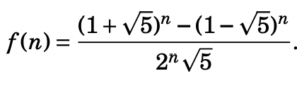
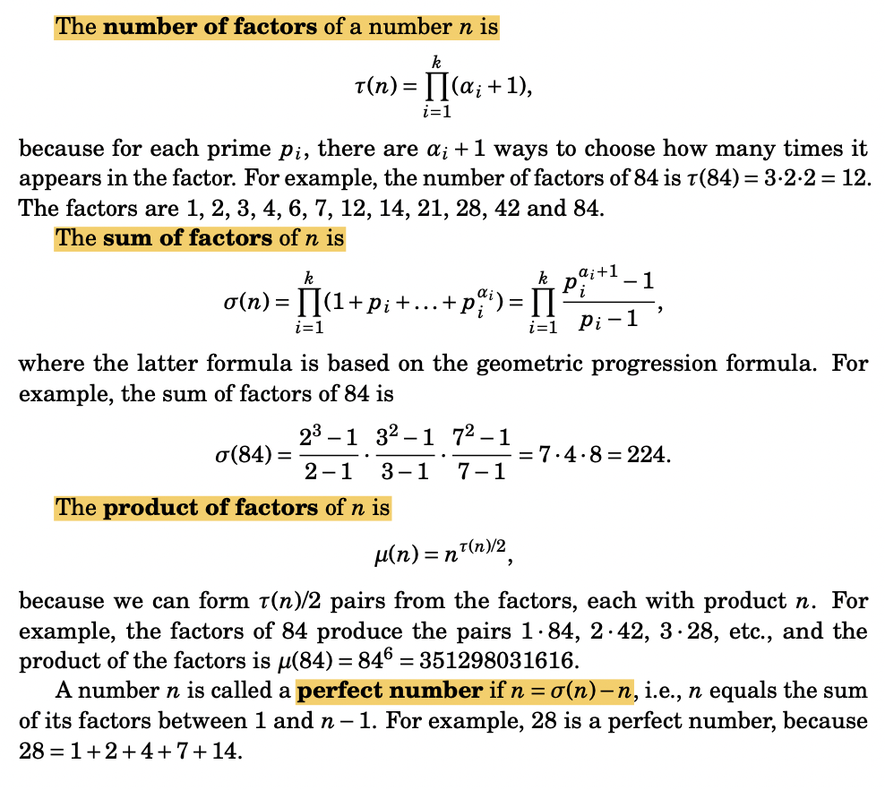
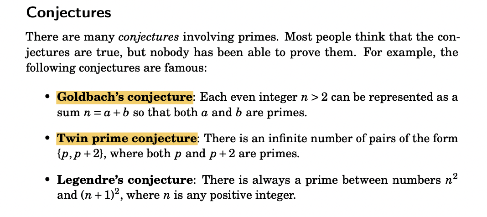
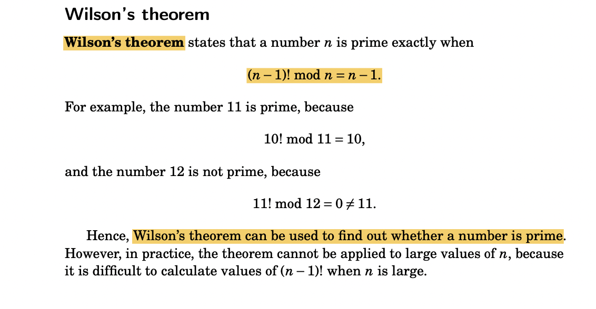
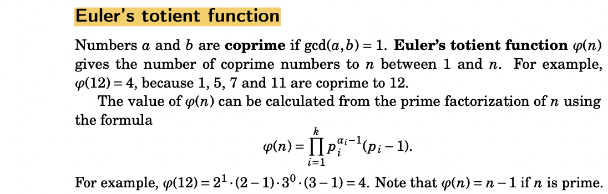
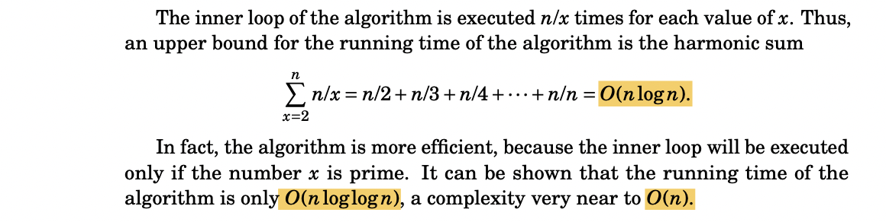
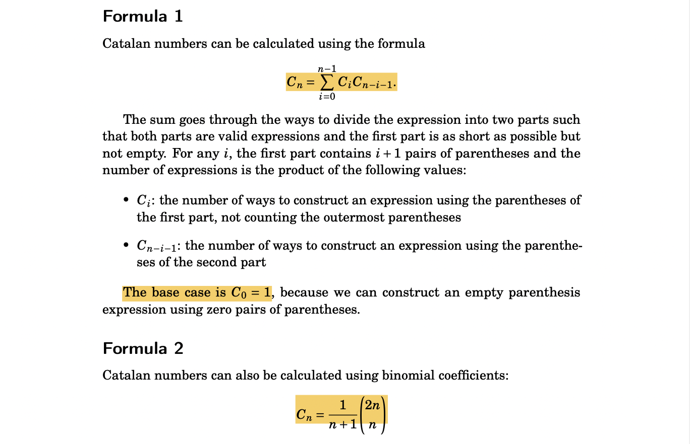
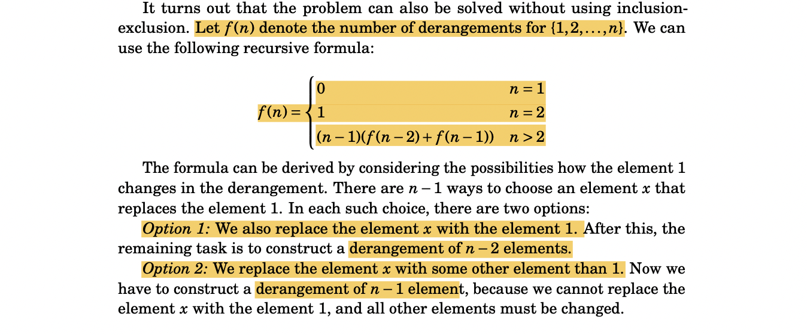

# --->Maths | Geometry

## 1. Geometry

### 1.1 Notes

* Heron's formula for area of triangle
* Set theory conventions **∀ (for all) **and** ∃ (there is).** 
  *   For example,     **`∀x(∃y(y<x))`**

      \===> means that **for each** element x in the set, **there is** an element y in the set **such that** y is smaller than x

```python
# Cross Product
'''
         i   j   k
AXB = |  x1  y1  z1 |
      |  x2  y2  z2 |
    = (y1z2 - y2z1) i - (x1z2 - x2z1) j + (x1y2 - x2y1) k
'''
```

### 1.2 Problems: Geometry

#### 1.2.1 Easy 🧠

* [x] [1266.Minimum Time Visiting All Points](https://leetcode.com/problems/minimum-time-visiting-all-points/) 
* [x] [883. Projection Area of 3D Shapes](https://leetcode.com/problems/projection-area-of-3d-shapes/)
* [x] [1030. Matrix Cells in Distance Order](https://leetcode.com/problems/matrix-cells-in-distance-order/) ✴️
* [x] [892. Surface Area of 3D Shapes](https://leetcode.com/problems/surface-area-of-3d-shapes/) ✴️


For problems like (**#892**) :in geometry of 3-D blocks: think in terms of subtracting the overlap, not adding each block one-by-one.


* [x] LC: [149.Max Points on a Line](https://leetcode.com/problems/max-points-on-a-line/) | just count all the slopes b/w all 2 pair points
* [x] Check collinearity : [1232. Check If It Is a Straight Line](https://leetcode.com/problems/check-if-it-is-a-straight-line/)
  * [x] Similar: [1037.Valid Boomerang](https://leetcode.com/problems/valid-boomerang/)
* [x] LC [218.The Skyline Problem](https://leetcode.com/problems/the-skyline-problem/) ✅🌇| uses **SortedList **



```python
#2. count slopes ==========================

INT_MAX = 10**5
res = 0

if n <= 2:
    return n

for i in range(n-1):
    samePoint = 1
    slopes = dict()
    for j in range(i+1,n):
        p1, p2 = points[i],points[j]
        
        if p1 == p2:
            samePoint += 1
        elif p2[0]-p1[0] == 0:
            if INT_MAX in slopes:
                slopes[INT_MAX] += 1
            else:
                slopes[INT_MAX] = 1
        else:
            x = (p2[1]-p1[1])/(p2[0]-p1[0])
            if x in slopes:
                slopes[x] += 1
            else:
                slopes[x] = 1
                
    localres = 0
    for k,v in slopes.items():
        localres = max(localres,v)
    localres += samePoint
    res =  max(res,localres)
        
return res
```



```python
(x0, y0), (x1, y1) = coordinates[: 2]
for x, y in coordinates:
    if (x1 - x0) * (y - y1) != (x - x1) * (y1 - y0):
        return False
return True
```



```python
'''
         i   j   k
AXB = |  x1  y1  z1 |
      |  x2  y2  z2 |
    = (y1z2 - y2z1)i - (x1z2 - x2z1)j + (x1y2 - x2y1)k
'''

def solve():
    I = lambda : map(int,input().split())
    t = int(input())

    for _ in range(t):
        x1,y1,x2,y2,x3,y3 = I()
        # shift origin to (x1,y1)
        x2,y2 = x2-x1, y2-y1
        x3,y3 = x3-x1, y3-y1

        cross = x3*y2 - x2*y3
        if cross > 0:
            print("RIGHT")
        elif cross < 0:
            print("LEFT")
        else:
            print("TOUCH")
```



```python
'''
#1. check if both lines are COLINEAR YET PARALLEL:

        -----------      -----------
        p1        p2     p3     p4
                    OR
            ----===============--------
            p1  p2            p3      p4 
#2.We need to check:   #hence for _ in range(2): which swaps points in end.easy implementation 😎
    1. line1's endponits signs w.r.t. line2
    2. line2's endponits signs w.r.t. line2
cuz if just 1 or 2 checked, we'll give wrong o/p for this case:
            |
--------    | opposite signs but still "NO" intersection 
            |
'''
x1,y1,x2,y2,x3,y3,x4,y4 = I()
#1.================================== colinear & parallel
if cross(x2,y2,x1,y2) * cross(x4,y4,x3,y3) == 0:
    # just exclude the case when the're not COLLINEAR
    # 1.    -----------
    #      ----------------     => NO
    #
    # 2. 
    #    --------   ---------     => NO
    # 3.
    #     -------==========-------  => YES
    #
    # 
    # check for case#1 : 
    if cross(x2-x1,y2-y1,x3-x1,y3-y1) != 0:
        print("NO")
        break

    # check for case#2 : collinear with Boundary-Box technique
    isSolved = False
    for _ in range(2):
        if max(x2,x1) < min(x3,x4) or max(y2,y1) < min(y3,y4):
            print("NO")
            isSolved = False
        x1,y1,x2,y2,x3,y3,x4,y4 = x3,y3,x4,y4,x1,y1,x2,y2
    
    if not isSolved:
        print("YES")    #case#3
    break
#2. ================================= skewed
for _ in range(2):
    # shift origin to (x1,y1)
    cross1 = cross(x2-x1,y2-y1,x3-x1,y3-y1)
    cross2 = cross(x2-x1,y2-y1,x4-x1,y4-y1)
    
    if cross1*cross2 > 0 :  #both #3 & #4 lie on same side from line 1-->2
        print("NO")
        return
    x1,y1,x2,y2,x3,y3,x4,y4 = x3,y3,x4,y4,x1,y1,x2,y2
if not isSolved:
    print("YES")
```



```python
'''
IDEA: 
    * take one edge of polygon & draw lines to all other edges => dividing the polygon into Triangles.
    * Calculate sum of areas of trianges : AreaTriangle =  cross_product//2
    * NOTE: the trick works for both: CONVEX & CONCAVE ploygon (CROSS Product takes care of + & -ve areas)
'''

class Point:
    def __init__(self, x,y):
        self.x = x
        self.y = y

def cross(p1,p2,p3): # (p2 - p1) X (p3 - p1)

    a = (p2.x-p1.x)*(p3.y-p1.y) # 3*2
    b = (p3.x-p1.x)*(p2.y-p1.y) # 2*
    return (p2.x-p1.x)*(p3.y-p1.y) - (p3.x-p1.x)*(p2.y-p1.y)

def solve():
        
    I = lambda : map(int, input().split()) 
    n = int(input())
    points = []
    for _ in range(n):
        x,y = I()
        p = Point(x,y)
        points.append(p)

    # fix P0
    res = 0
    for i in range(1,n-1):
        res += (cross(points[0],points[i],points[i+1]))

    print(abs(res)//2) 
    
```



```python
from sortedcontainers import SortedList
class Solution:
    def getSkyline(self, buildings: List[List[int]]) -> List[List[int]]:
        events = []
        
        for l,r,h in buildings:
            events.append((l,h,-1)) #starting event
            events.append((r,h,1))  #ending event
            
        events.sort()   #sort by X cordinate
        n = len(events)
        
        res = []
        active_heights = SortedList([0]) #min heap of curr all hights in current window
        
        i = 0
        while i<n:
            curr_x = events[i][0]
            
            #process all events with same X together
            while i<n and events[i][0] == curr_x:
                x,h,t = events[i]
                
                if t == -1:                      #starting event
                    active_heights.add(h)
                else:
                    active_heights.remove(h)    #ending event
                i += 1
                
            #check if biggest height has changed in window due to this event
            if len(res) == 0 or (len(res) > 0 and res[-1][1] != active_heights[-1]):
                res.append((curr_x, active_heights[-1]))
        return res
```



* [x] [836.Rectangle Overlap](https://leetcode.com/problems/rectangle-overlap/) 💡
* [x] CSES: [Point Location Test](https://cses.fi/problemset/task/2189) |  ✅✅**Cross Product**
* [x] CSES: [Line Segment Intersection](https://cses.fi/problemset/task/2190) ✅✅ | `Boundary Box Technique` |**COVERS SO MANY CONCEPTS!**
* [x] CSES: [Polygon Area](https://cses.fi/problemset/result/2677213/) ✅✅
* [ ] CSES: [Point in Polygon](https://www.youtube.com/watch?v=G9QTjWtK_TQ) 🐽🐽| [video](https://www.youtube.com/watch?v=G9QTjWtK_TQ\&t=5265s)
* [ ] CSES: [Convex Hull](https://cses.fi/problemset/task/2195) ✅✅ | [video](https://www.youtube.com/watch?v=G9QTjWtK_TQ\&t=7801s) | **Graham Scan+Jarvis Algo >> **shape of rubber band on nails boundary

### 2.3 Problemsets

* **`[E]`** Leetcode tag = **geometry:** [https://leetcode.com/problemset/all/?topicSlugs=geometry](https://leetcode.com/problemset/all/?topicSlugs=geometry)
* Codeforces Tag = **geometry** : [https://codeforces.com/problemset?tags=geometry](https://codeforces.com/problemset?tags=geometry)

### 1.3 Resources: Geometry

* [CSES Steam by Errichto](https://www.youtube.com/watch?v=G9QTjWtK_TQ) 🚀⭐️
* [Geometric Algorithms](https://www.cs.princeton.edu/\~rs/AlgsDS07/16Geometric.pdf)
* Topcoder:
  * [GEOMETRY CONCEPTS PART 1: BASIC CONCEPTS](https://www.topcoder.com/thrive/articles/Geometry%20Concepts%20part%201:%20Basic%20Concepts)
  * [GEOMETRY CONCEPTS PART 2: LINE INTERSECTION AND ITS APPLICATIONS](https://www.topcoder.com/thrive/articles/Geometry%20Concepts%20part%202:%20%20Line%20Intersection%20and%20its%20Applications)
  * [LINE SWEEP ALGORITHMS](https://www.topcoder.com/thrive/articles/Line%20Sweep%20Algorithms)
* [Al.Cash's blog](https://codeforces.com/blog/entry/48122)
* [Handbook of geometry for competitive programmers](https://vlecomte.github.io/cp-geo.pdf)


## 2. Maths

### 2.1 Notes :

### **Fibonacci:**

* **Zeckendorf’s theorem** states that every positive integer has a **unique representation as a sum of Fibonacci numbers** such that **no two numbers are equal or consecutive Fibonacci numbers**. 
  * For example, the number 74 can be represented as the sum 55+13+5+1.
* **Binet’s formula **for calculating **Fibonacci numbers:**



### **Primes & Factors**









* **Lagrange’s theorem **states that every positive integer can be represented as a sum of four squares, i.e.,  ** **$$N = a^2 + b^2 + c^2 + d^2$$** **
  * For example, the number 123 can be represented as the sum $$123 = 8^2 + 5^2 + 5^2 + 3^3$$ 8
* **Euclidean GCD**

```python
def gcd(a,b):
    if (b == 0):              # Everything divides 0
         return a
    return gcd(b, a%b)
```

*   **Sieve of Eratosthenes**

    * **COMPLEXITY**: 

     





```cpp
if n <= 1:
    return 0

primes = [True for _ in range(n+1)]
primes[0] = False

primes[1] = False
for i in range(2,int(sqrt(n+1))+1):
    if primes[i]:
        for j in range(i*i,n+1,i):
            primes[j] = False

return sum(x for x in primes if x)
```



### Combinatorics

* **Catalan numbers **
  * C(n) equals the number of** valid parenthesis expressions **that consist of n left parentheses and n right parentheses.
  * Catalan numbers are also related to** trees**: 
    * there are **C(n)** **binary trees** of **n nodes**
    * there are **C(n−1)** **rooted trees **of **n nodes**



* **Derangements**
  * \==> permutations where no element remains in its original place
    * number of derangements of elements {1, 2, . . . , n}, i.e., . 
    * For example, when n = 3, there are two derangements: (2, 3, 1) and (3, 1, 2)




### Other Imp things

* **Modular Exponentiation **:

```cpp
int my_pow(int x,int n,int M){    //get (x^n % M)
    if(n==0) return 1;
    else if(n%2 == 0) return my_pow((x*x)%M,n/2,M);
    else return (x*my_pow((x*x)%M,(n-1)/2,M))%M;
}
// or in python: 
math.pow(x,n,M)
```

###

### 2.2 Problems: Maths

* [x] LC [326.Power of Three](https://leetcode.com/problems/power-of-three/)
* [x] CSES: [Two Sets](https://cses.fi/problemset/task/1092) | four consecutive numbers can be divided into 2 sets of equal sums | [link to solution approach](https://www.reddit.com/r/learnprogramming/comments/n9ql5a/cses_problem_two_sets/) ⭐️
* [x] CSES: [Coin Piles](https://cses.fi/problemset/task/1754) | [Solution Approach](https://discuss.codechef.com/t/coin-piles-problem-from-cses/28647/3)
* [x] CSES: [Gray Code](https://cses.fi/problemset/task/2205) | [Solution](https://www.geeksforgeeks.org/generate-n-bit-gray-codes/)
* [x] CSES: [Missing Coin Sum](https://cses.fi/problemset/result/2583670/) | [Approach](https://discuss.codechef.com/t/cses-missing-coin-sum/84039/2) ✅
  * **KYA SEEKHA: **At any index **i** in a sorted array **a**, currSum represents `sum(a[ 0...i ])`.We can form every possible sum from `1...currSum`, when we are at index i
* [x] LC: [166.Fraction to Recurring Decimal](https://leetcode.com/problems/fraction-to-recurring-decimal/submissions/) ✅| recurring decimal => reminder will repeat | [Approach](https://leetcode.com/problems/fraction-to-recurring-decimal/discuss/180004/Python-4-lines-\(32ms-beats-100\)-with-explanation)
* [x] LC [1980.Find Unique Binary String](https://leetcode.com/problems/find-unique-binary-string/) | **Cantor's Diagonalization** | [Video@veritassium](https://www.youtube.com/watch?v=OxGsU8oIWjY) 
  * **Some infinities(Uncountable Infinity- **party bus people**) are BIGGER than other infinities(Countable Infinities- **hotel rooms 1...inf) 
  * Just watch the video; so fucking mind-blowing
* [x] LC [1363.Largest Multiple of Three](https://leetcode.com/problems/largest-multiple-of-three/) ✅| fucking amazing question & elegant solution 🍪🍪🍪
* [x] [**31. Next Permutation**](https://leetcode.com/problems/next-permutation/)** | ✅| A must | **interview mei aayega toh bina algo jaane, nhi kar paoge



```python
import math

def isPowerOfThree(self, n: int) -> bool:
    if n <= 0: return False
    return math.log10(n) / math.log10(3) % 1 == 0
```



```python
d1 = sorted([i for i in d if i%3 ==1])
d2 = sorted([i for i in d if i%3 ==2])
d3 = [i for i in d if i%3 ==0]
if sum(d) % 3 == 1:
    if len(d1) != 0:
        res = d1[1:] + d2 + d3
    else:
        res = d2[2:]+ d3
elif sum(d) % 3 == 2:
    if len(d2) != 0:
        res = d1 + d2[1:] + d3
    else:
        res = d1[2:] +d3
else:
    res = d
res.sort(reverse = True)
if not res: return ''
return str(int(''.join([str(i) for i in res])))
```



```python
def nextPermutation(self, nums: List[int]) -> None:
    # To find next permutations, we'll start from the end
    i = j = len(nums)-1
    # First we'll find the first non-increasing element starting from the end
    while i > 0 and nums[i-1] >= nums[i]:
        i -= 1
    # After completion of the first loop, there will be two cases
    # 1. Our i becomes zero (This will happen if the given array is sorted decreasingly). In this case, we'll simply reverse the sequence and will return 
    if i == 0:
        nums.reverse()
        return 
    # 2. If it's not zero then we'll find the first number grater then nums[i-1] starting from end
    while nums[j] <= nums[i-1]:
        j -= 1
    # Now out pointer is pointing at two different positions
    # i. first non-assending number from end
    # j. first number greater than nums[i-1]

    # We'll swap these two numbers
    nums[i-1], nums[j] = nums[j], nums[i-1]

    # We'll reverse a sequence strating from i to end
    nums[i:]= nums[len(nums)-1:i-1:-1]
    # We don't need to return anything as we've modified nums in-place
```



## 3. Combinatorics

* [ ] AtCoder: [Cumulative Sum](https://atcoder.jp/contests/abc208/tasks/abc208\_f) | [Editorial](https://atcoder.jp/contests/abc208/editorial/2219)

## 4 Chess Problems:

* [x] CSES: [Two Knights](https://cses.fi/problemset/task/1072) | approach: [here](https://discuss.codechef.com/t/cses-two-knights-problem-help-needed/69448/5) & [here](https://math.stackexchange.com/questions/3266257/number-of-ways-two-knights-can-be-placed-such-that-they-dont-attack)
* [ ] [https://codeforces.com/blog/entry/78943](https://codeforces.com/blog/entry/78943)


If two knight attack each other then they will be in 2\*_3 rectangle or 3\*_2 rectangle. 

* number of 2\*3 rects = #rows\*#cols = (n-1)\*(n-2)

So the number of ways of placing them is (n-1)_(n-2)+(n-2)_(n-1). Also in each rectangle no ways of placing the knight is 2. So total ways of placing knight so that they attack each other will be 2_2_(n-1)_(n-2). So the number of ways such that knight do not attack each other will be n_n_(n_n-1)/2 — 4_(n-1)_(n-2)



### 2.3 Problemsets

* Leetcode tag=**Maths :** [https://leetcode.com/problemset/all/?topicSlugs=math](https://leetcode.com/problemset/all/?topicSlugs=math)
* Hackerrank: [https://www.hackerrank.com/domains/mathematics?filters%5Bsubdomains%5D%5B%5D=geometry](https://www.hackerrank.com/domains/mathematics?filters%5Bsubdomains%5D%5B%5D=geometry)
* Codeforces Tag = **combinatorics/probability**: [https://codeforces.com/problemset?tags=probabilities](https://codeforces.com/problemset?tags=probabilities)
* Codeforces tag = **number-theory: ** [https://codeforces.com/problemset?tags=number+theory](https://codeforces.com/problemset?tags=number+theory)

### 2.4 Resources: Maths

* Kartik Arora's Playlist :[ Number Theory](https://www.youtube.com/watch?v=2NN5j1iF2ko\&list=PLb3g_Z8nEv1i6NHntG5l2fPKuVu853EYy\&ab_channel=KartikArora)
* **Topcoder **:
  * ****[**MATHEMATICS FOR TOPCODERS**](https://www.topcoder.com/thrive/articles/Mathematics%20for%20Topcoders)****
  * ****[**BASICS OF COMBINATORICS**](https://www.topcoder.com/thrive/articles/Basics%20of%20Combinatorics)****
