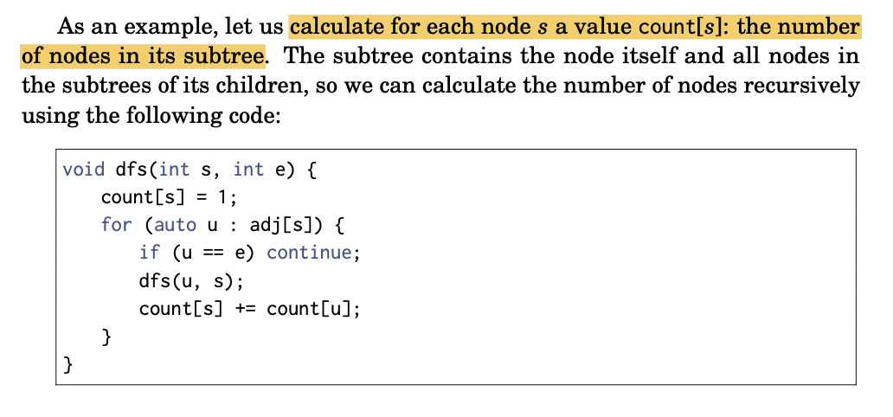
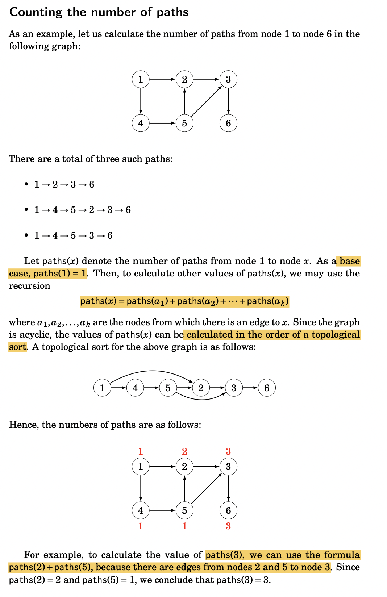
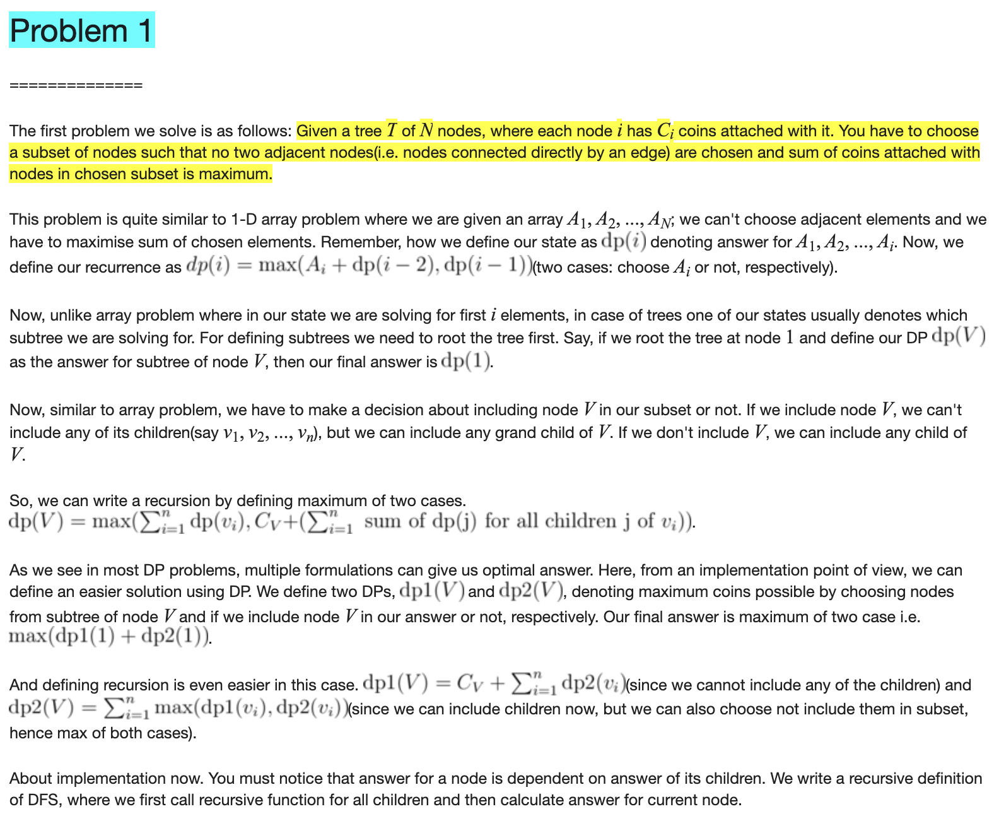

# Tree

## Notes:

* **DFS vs BFS:: How to Pick One?**
  1. Extra Space can be one factor \(Explained below\)
  2. **Depth First Traversals** are typically recursive and recursive code requires **function call overheads**.
  3. The most important points is, BFS starts visiting nodes from root while DFS starts visiting nodes from leaves. So if our problem is to search something that is more likely to **closer to root,** we would prefer **BFS**. And if the target node is **close to a leaf**, we would prefer **DFS**.
* **Rooting A tTee**: is like picking up the tree by a specific node and having all the edges point downwards
  * Res: [https://towardsdatascience.com/graph-theory-rooting-a-tree-fb2287b09779](https://towardsdatascience.com/graph-theory-rooting-a-tree-fb2287b09779)
* Node:

```python
class TreeNode:
    def __init__(self, x):
        self.val = x
        self.left = None
        self.right = None
...
root = TreeNode(x)
```

* ffs

## 1. Regular Tree Problems

* [x] \*\*\*\*[**Inorder Successor in Binary Search Tree**](https://www.geeksforgeeks.org/inorder-successor-in-binary-search-tree/) ✅💪
* [x] 501. [Find Mode in Binary Search Tree](https://leetcode.com/problems/find-mode-in-binary-search-tree/) \| MindTickle!
* [x] 236. [Find LCA in Binary Tree](https://leetcode.com/problems/lowest-common-ancestor-of-a-binary-tree/) \| **DnQ** \| Standard ✅✅
* [x] Distance b/w 2 nodes in Tree: **`dist(a,b) = depth(a) + depth(b) - 2*depth(c) ; where c = lca(a,b)`**
* [x] LCA of N-ary tree \([article](https://medium.com/@sahilawasthi9560460170/lowest-common-ancestor-of-n-ary-tree-107fa772a939)\)
* [x] 1367.[ Linked List in Binary Tree](https://leetcode.com/problems/linked-list-in-binary-tree/)



```python
# Method 1: (Uses Parent Pointer) 
'''
1. If right subtree of node is not NULL, then succ lies in right subtree. 
    => Go to right subtree and return the node with minimum key value in the right subtree.
2. If right sbtree of node is NULL, then succ is one of the ancestors. 
    => Travel up using the parent pointer until you see a node which is
       left child of its parent. The parent of such a node is the succ.
'''
class Node:
    def __init__(self, key):
        self.data = key
        self.left = None
        self.right = None

    def inOrderSuccessor(n):
     
        # Step 1 of the above algorithm
        if n.right is not None:
            return minValue(n.right)
     
        # Step 2 of the above algorithm
        p = n.parent
        while( p is not None):
            #if n != p.right :
            if n == p.left :
                break
            n = p
            p = p.parent
        return p
     
    def minValue(node):
        current = node
     
        # loop down to find the leftmost leaf
        while(current is not None):
            if current.left is None:
                break
            current = current.left
     
        return current


# Method 2: w/o parent pointer
'''
1. If right subtree of node is not NULL, then succ lies in right subtree. 
    => {same as above}
2. If right sbtree of node is NULL, then succ is one of the ancestors. 
    => Travel down the tree, if a node’s data is greater than root’s data
      then go right side, otherwise, go to left side.
'''
class Node:
    def __init__(self, key):
        self.data = key
        self.left = None
        self.right = None
 
def inOrderSuccessor(root, n):
     
    # Step 1 of the above algorithm
    if n.right is not None:
        return minValue(n.right)
 
    # Step 2 of the above algorithm
    succ=Node(None)
     
    while( root):
        if(root.data<n.data):
            root=root.right
        elif(root.data>n.data):
            succ=root
            root=root.left
        else:
            break
    return succ
 
def minValue(node):
    current = node
 
    # loop down to find the leftmost leaf
    while(current is not None):
        if current.left is None:
            break
        current = current.left
 
    return current
 
```



```python
#1. O(N) space ==================================================
    cnts = collections.Counter()
    self.maxx = 0
    
    def helper(node):
        # nonlocal maxx
        if not node:
            return
        cnts[node.val] += 1
        self.maxx = max(self.maxx, cnts[node.val])
        helper(node.left)
        helper(node.right)
        
    helper(root)
    return [k for k,v in cnts.items() if v == self.maxx]

    #2. O(1) Space ===================================================
    prev,count=0,0
    ans=[]
    c=0
    def inorder(root):
        nonlocal prev,count,c,ans
        if root:
            inorder(root.left)
            if prev==root.val:
                count+=1
            else:
                prev=root.val
                count=1
            if count>c:
                c=count
                ans=[root.val]
            elif count==c:
                ans.append(root.val)
            inorder(root.right)
    inorder(root)
    return(ans)
```



```python
def lca(root,p,q) -> 'TreeNode':
        # found p and q?
        if not root or root == p or root == q:
            return root
    
        left = lca(root.left,p,q)
        right = lca(root.right,p,q)
        
        # p and q appears in left and right respectively, then their ancestor is root
        if left is not None and right is not None:
            return root
        
        # p and q not in left, then it must be in right, otherwise left
        if left is None:
            return right
        
        if right is None:
            return left
```



```python
def isSubPath(self, head: Optional[ListNode], root: Optional[TreeNode]) -> bool:

    def dfs(head, root):
        if not head: return True
        if not root: return False
        return root.val == head.val and (dfs(head.next, root.left) or dfs(head.next, root.right))
    if not head: return True
    if not root: return False
    return dfs(head, root) or self.isSubPath(head, root.left) or self.isSubPath(head, root.right)

'''
Time O(N * min(L,H))
Space O(H)
where N = tree size, H = tree height, L = list length.
'''
```




##  2. DP on Trees  ✅                        :          // does the job in O\(N\) 

* [CF tutorial](https://codeforces.com/blog/entry/20935?locale=en)

### 2.1 Trivial Questions

* [x] **BOOK\#1: Number of nodes in subtree**



* [x] **BOOK\#2: Counting the number of paths till node X**



* [x] **CF\#1**: [Find max coins s.t. no two adjacent edges get collected](https://codeforces.com/blog/entry/20935?locale=en)

  * Do **`dfs()`** & build our dp1 & dp2



* [x] CSES:[ Tree Diameter](https://cses.fi/problemset/task/1131) ✅✅ \| Basic level Tree DP \| AdityaVerma \| [KartikArora- N-ary tree](https://www.youtube.com/watch?v=qNObsKl0GGY&list=PLb3g_Z8nEv1j_BC-fmZWHFe6jmU_zv-8s&index=3&ab_channel=KartikArora)
* [x] CSES: [Tree Distances I](https://cses.fi/problemset/task/1132) \| aka. **`All Longest Paths`** \| Same code as TreeDiameter=&gt; use 2 dfs to get endpoints of dia ==&gt; dfs b/w them \| [underrated amazing video by HiteshTripathi](https://www.youtube.com/watch?v=Rnv4qvoxsTo&ab_channel=HiteshTripathi) 🚀✅✅🚀 \| **must\_do**
* [x] LC: [Diameter of N-ary tree](http://leetcode.libaoj.in/diameter-of-n-ary-tree.html) \| `TreeDistances I 's` code works here too



```python
def f(node):
    #1. Base Condition
        if node is None: return 0
    #-----------------
    #2. HYPOTHESIS :: Recursive call on left & right 
        lr = f(node->left)
        rr = f(node-right)
    #------------------
    #3. INDUCTION :: Take decision & return it
         opt1 = g(lr,rr)    # case when 'node' cant be part of final ans
         opt2 = h()         # case when 'node cant be part of final ans
         
         return max(opt1, opt2)
```



```cpp
/ =====================================Complexity is O(N).

vector<int> adj[N];
int dp1[N],dp2[N];        //functions as defined above

//p is parent of node x
void dfs(int x, int p){

    //for storing sums of dp1 and max(dp1, dp2) for all children of V
    int sum1=0, sum2=0;

    //traverse over all children
    for(auto y: adj[x]){
        if(y == p) continue;
        dfs(y, x);        // ===> now we have calculated dp1[y] & dp2[y]
        sum1 += dp2[y];
        sum2 += max(dp1[y], dp2[y]);
    }

    dp1[x] = C[x] + sum1;
    dp2[x] = sum2;
}

int main(){
    int n;
    cin >> n;

    for(int i=1; i<n; i++){
    cin >> u >> v;
        adj[u].push_back(v);
        adj[v].push_back(u);
    }

    dfs(1, 0);
    int ans = max(dp1[1], dp2[1]);
    cout << ans << endl;
}

```



```python
---------------------- works only for binary tree

def recurse(x):
    if not x: 
        return 0
    ldia = recurse(x.left)
    rdia = recurse(x.right)

    self.result = max(self.result, ldia+rdia)  # this is the dia of node x
    return 1 + max(ldia,rdia)  # passes this to its parent

self.result = 0
recurse(root)
return self.result    
    
------------------------- for n-arry tree
int n, ans;
vector<int> adj[MAX];
int d[MAX];
 
 void dfs(int u = 1, int p = -1){
     for(auto v:adj[u]){
         if(v==p)continue;
         dfs(v,u);
         ans = max(ans, d[u]+d[v]+1); # max v1--u--v2 
         d[u] = max(d[u],1+d[v]) # max v---u ::max depth of node u(i.e. longest path in its subtree)
     }
 }
 
int main() {
    cin >> n;
    for(int i=1;i<n;i++)
    {
        int u,v;
        cin >> u >> v;
        adj[u].push_back(v);
        adj[v].push_back(u);
    }
    dfs(1,-1);
    cout<<ans;
}
```



```python
from collections import defaultdict

G = [[1,2],[2,3],[2,4],[3,5],[4,6]]
N = 6
adj = defaultdict(list)

for x,y in G:
    adj[x].append(y)
    adj[y].append(x)

def dfs(x,p,d):
    vis.add(x)
    par[x] = p
    dists[x] = d
    for y in adj[x]:
        if y not in vis and y != p:
            dfs(y,x,d+1)
            
#=================== DFS#1: getting one end of diameter: ndoe1
par = [-1]*(N+1)
dists = [0]*(N+1)
vis = set()

dfs(1,-1,0)     # start dfs from any arbitraily rooted node
node1 = -1
max_dist = float('-inf')

for i in range(1,N+1):
    if max_dist < dists[i]:
        node1 = i
        max_dist = dists[i]

print('node1 = ', node1)

#=================== DFS#1: getting the other end of diameter: ndoe2
par = [-1]*(N+1)
dists = [0]*(N+1)
vis = set()

dfs(node1,-1,0) # start dfs from tree rooted @node1
node2 = -1
max_dist = float('-inf')

for i in range(1,N+1):
    if max_dist < dists[i]:
        node2 = i
        max_dist = dists[i]

print('node2 = ', node2)

# node1 & node2 mil gye
# ab unse dfs call karo aur dists calculate karo

dists = [0]*(N+1)
vis = set()

dfs(node1,-1,0)
d1 = dists[::]

dists = [0]*(N+1)
vis = set()

dfs(node2,-1,0)
d2 = dists[::]

print(d1)
print(d2)
print(f'========> Tree Diameter = {d1[node2]}')

print('======== Now printing max longest paths for all nodes =========')
for i in range(1,N+1):
    print(f' Node: {i} => {max(d1[i],d2[i])}')

```



```python
# From any node to any node
def solve(node):
    if node is null: return 0
    
    lsum = solve(node.left)
    rsum = solve(node.right)
    
    opt1 = max(node.val,                    # path startes from node
                node.val + max(lsum,rsum))  # 'node' is in beech-mei of path
    opt2 = max(node.val , lsum+rsum+node.val)
    return max(opt1, opt2)            
```



```python
# From Leaf node to leaf node
def solve(node):
    if node is None: return 0
    
    lsum = solve(node.left)
    rsum = solve(node.right)
    
    opt1 = node.val + max(lsum,rsum)  # 'node' is in beech-mei of path
    # path can start from node only if its a leaf node
    if node.left is None and node.right is None:
        opt1 = max(node.val, opt1)
        
    opt2 = max(lsum+rsum+node.val)
    return max(opt1, opt2) 
```



```python
def solve(G,N):
    adj = defaultdict(list)
    inDeg = [0]*(N+1)

    for x,y in G:
        adj[x].append(y)
        inDeg[y] += 1
        
    topo = []
    Q = deque()
    for i in range(1,N+1):
        if inDeg[i] == 0:
            Q.append(i)
    while Q:
        x = Q.popleft()
        topo.append(x)
        
        for y in adj[x]:
            inDeg[y] -= 1 
            if inDeg[y] == 0:
                Q.append(y)
                
    if len(topo) != N:
        return -1
    # print(topo
    ways = [0]*(N+1)
    ways[topo[0]] = 1
    for i in range(N):
        curr = topo[i]
        for x in adj[curr]:
            ways[x] += ways[curr]
    return ways[1:]


N = 6
G = [[1,2],[1,4],[4,5],[5,2],[2,3],[5,3],[3,6]]
res = solve(G,N)
print(res)
```



### 

### 2.2 Not-so trivial Questions

* [x] CSES: [Subordinates](https://cses.fi/problemset/task/1674) ✅
* [x] CSES: [Tree Distances II](https://cses.fi/problemset/task/1133) \| **`Tree Rerooting` ✅✅✅💪💪💪❤️❤️❤️\|** [video](https://www.youtube.com/watch?v=lWCZOjUOjRc&t=42s)
  * **When is Rerooting DP applicable?**
  * **===&gt;** when **given** `dp(x)`; you can calculated **`dp(y)`** for y:children\[x\]
  * ========&gt; mane; parent ki value mei kuch adjust karke uske children ki value nikali jaa sakti ho.
  * ========&gt; e.g. **Tree Distance \|\|\(^\)** : get sum of all nodes from node X
  * **FINALLY SAMAJH AAYAAAAA!!!!!!!!!!!!!!!!!!!!!!!!!❤️**
* [x] CSES: [Tree Matching](https://cses.fi/problemset/task/1130) \| [kartikArora](https://www.youtube.com/watch?v=RuNAYVTn9qM&list=PLb3g_Z8nEv1j_BC-fmZWHFe6jmU_zv-8s&index=2&ab_channel=KartikArora) ✅
* [x] CF: [Distance in Tree](https://codeforces.com/contest/161/problem/D) \| \#nodes at dist K from each other 
* [x] 968.[Binary Tree Cameras](https://leetcode.com/problems/binary-tree-cameras/) \| @kartikArora 📷✅✅✅✅✅✅✅✅
* [x] 337. [House Robber III](https://leetcode.com/problems/house-robber-iii/) ✅
* [x] 95. [Unique Binary Search Trees II](https://leetcode.com/problems/unique-binary-search-trees-ii/) ✅\| @MindTickle
* [x] 1339. [Maximum Product of Splitted Binary Tree](https://leetcode.com/problems/maximum-product-of-splitted-binary-tree/)\| ❤️✅\| looks so complicated, yet so easy
* [ ] [https://leetcode.com/problems/longest-zigzag-path-in-a-binary-tree/](https://leetcode.com/problems/longest-zigzag-path-in-a-binary-tree/)
* [ ] [https://leetcode.com/problems/maximum-sum-bst-in-binary-tree/](https://leetcode.com/problems/maximum-sum-bst-in-binary-tree/)
* [ ] [https://leetcode.com/problems/number-of-ways-to-reorder-array-to-get-same-bst/](https://leetcode.com/problems/number-of-ways-to-reorder-array-to-get-same-bst/)




```python
'''
TC: O(N)
'''
from collections import defaultdict
I = lambda : map(int,input().split())

# ===============================================
def dfs(x,p):
    dp[x] = 0
    
    for y in adj[x]:
        if y == p: continue
        dfs(y,x)
        dp[x] += 1+dp[y]

# ==============================================
n = int(input())
l = list(I())
adj = defaultdict(list)
dp = [0]*(n+1)
for i in range(2,n+1):
    adj[l[i-2]].append(i)
    
dfs(1,1)
print(dp[1:])
```



```python
# STEP:1 ======================= preprocessing :: rooted@1
def preprocess_dfs(x, p):

    subtree_size[x] = 1

    for y in adj[x]:
        if y != p:
            preprocess_dfs(y, x)
            subtree_size[x] += subtree_size[y]
            subtree_dist[x] += subtree_dist[y] + subtree_size[y]

# STEP:2 ======================= use values w.r.t 1 to get values for other nodes
def dfs(x, p):
    dp[x] = dp[p] - subtree_size[x] - subtree_dist[x] # detatch x from p
    dp[x] += n - subtree_size[x] + subtree_dist[x]    # add all nodes to x
    
    for y in adj[x]:
        if y != p:
            dfs(y,x)
            
n = int(input())
adj = defaultdict(list)
subtree_size = [0] * (n + 1)
subtree_dist = [0] * (n + 1)
dp = [0] * (n + 1)

for _ in range(n - 1):
    x, y = I()
    adj[x].append(y)
    adj[y].append(x)

# root the tree at any(here 1) node & preprocess values w.r.t. it
preprocess_dfs(1, -1)

# now use those precomputed values w.r.t. 1 to get values for other nodes
dp[1] = subtree_dist[1]
for x in adj[1]:
    dfs(x,1)

print(subtree_size)
print(subtree_dist)

print(dp[1:])
```



```cpp
/*
STATES: 
    * u : root node
    * picked = 0/1 : whether any edge(u--v) was picked 
ANS: max(dp(1,0), dp(1,1))
RECUR: 
    * dp(u,0) = SUM{ max(y,0), max(y,1) } for y:children[x]
    * dp(u,1) = SUM{max(y,0),max(y,1)}     # for y: c1...c(i-1)
                + 1 + dp(ci, 1)            # select this edge (u---ci)
                + SUM{max(y,0), max(y,1)}  # for y: c(i+1)....cn 
*/
vector<int>adj[MAX];
ll dp[MAX][2];
 
void dfs (int src){
    int leaf=1;
    dp[src][1]=0;
    dp[src][0]=0;

    for(auto child:adj[src]){
        leaf = 0;
        dfs(child);
    }
    if(leaf==1)return;

    for(auto child:adj[src]){
        dp[src][0]+=max(dp[child][0],dp[child][1]);
    }

    for(auto child:adj[src]){
        dp[src][1]=max(
                dp[src][1],
                1+ dp[child][0]+( dp[src][0]-max(dp[child][0],dp[child][1]))
            );
    }
}
 
 int main(){
     int n;
     cin>>n;
     for(int i=0;i<n-1;i++){
        int ss,ee;
        cin>>ss>>ee;
        adj[ss].push_back(ee);
     }
     dfs(1);
     cout<<max(dp[1][0],dp[1][1])<<endl;
}
```



```python
@lru_cache(None)
def minCameras(node=root, parent_covered=True, parent_camera=False):
    if not node: return 0
    camera_here = 1 + minCameras(node.left, parent_camera=True) + minCameras(node.right, parent_camera=True)

    if parent_camera:
        no_camera_here = minCameras(node.left) + minCameras(node.right)
        return min(camera_here, no_camera_here)

    if parent_covered:
        mincams = camera_here
        if node.right:
            mincams = min(mincams, minCameras(node.right, False) + minCameras(node.left, True))
        if node.left:
            mincams = min(mincams, minCameras(node.left, False) + minCameras(node.right, True))
        return mincams

    return camera_here

return minCameras()
```



```python
MEMO = {}
def dp(x):
    if not x:
        return 0
    if not x.left and not x.right:
        return x.val
    if x in MEMO:
        return MEMO[x]
    opt1 = dp(x.left) + dp(x.right) # do not rob this node
    
    #rob this node
    opt2 = x.val 
    if x.left:
        opt2 += dp(x.left.left) + dp(x.left.right)
    if x.right:
        opt2 += dp(x.right.left) + dp(x.right.right) 
    MEMO[x] = max(opt1, opt2)
    return MEMO[x]
    

return dp(root)
```



```python
 def solve(arr):
		#Base conditions
    if len(arr) < 1:
        return [None]
    if len(arr) == 1:
        return [TreeNode(arr[0])]
    
    ret = []
    for i,item in enumerate(arr):
        leftTrees = f(arr[0:i])
        rightTrees = f(arr[i+1:])
        
        for lt in leftTrees:
            for rt in rightTrees:
                r = TreeNode(arr[i])
                r.left = lt
                r.right = rt
                ret.append(r)
    return ret

return solve(list(range(1,n+1)))
```



```python
def maxProduct(self, root: Optional[TreeNode]) -> int:
        
    # dfs to get sum of subtree rooted @node
    def dfs(node):
        if not node: return 0
        ans = dfs(node.left) + dfs(node.right) + node.val
        res.append(ans)
        return ans
    
    res = []
    dfs(root)
    sum_all = max(res)
    return max(i*(sum_all-i) for i in res) % (10**9 + 7)
```



```cpp
#include <bits/stdc++.h>
using namespace std;

const int MAXN = 2e5+5;
const int MAXD = 30; // ceil(log2(10^9))

// number of planets and queries
int n, q;
// parent matrix where [i][j] corresponds to i's (2^j)th parent
int parent[MAXN][MAXD];

int jump(int a, int d) {
	for(int i=0; i<MAXD; i++) if(d & (1<<i))
		a = parent[a][i];
	return a;
}

int main() {
	cin >> n >> q;
	for(int i=1; i<=n; i++) {
		cin >> parent[i][0];
	}
	// evaluate the parent matrix
	for(int d=1; d<MAXD; d++){
	    for(int i=1; i<=n; i++) {
		    parent[i][d] = parent[parent[i][d-1]][d-1];
        }
	}   
	// process queries
	while(q--) {
		int a, d;
		cin >> a >> d;
		cout << jump(a, d) << '\n';
	}
}
/*
Time Complexity :  O(NlogN)
*/
```



### Binary Lifting

* [x] CSES\#1: [Company Queries I](https://cses.fi/problemset/task/1687) \|  **`Binary Lifting` 💪✅✅❤️**
* [x] CSES\#2: [Company Queries II](https://cses.fi/problemset/task/1688) \| **`LCA + Binary Lifting` 🐽🐽**
* [ ] CSES: [Planets Queries I](https://cses.fi/problemset/task/1750) \| Binary Lifting 



```python
"""
# Binary Lifting

up(u,x) : parent of node 'u' which is 2^x level up
x = log2(N)

TC: O(NlogN)

RECURSION:

* up(u,x) = up(up(u,x-1),x-1)   # because 2^(x-1) + 2^(x-1) = 2^x

BC:
1. up(u,0) = par[u]
2. up(root,x) = -1

"""

from collections import defaultdict
I = lambda: map(int, input().split())

def dfs(u, p):
    up[(u, 0)] = p  # BC.1

    # setup values for node u
    for i in range(1, 20):
        if (u, i - 1) in up and up[(u, i - 1)] != -1:
            up[(u, i)] = up[(up[u, i - 1], i - 1)]
        else:
            up[(u, i)] = -1  # BC.2
    # recurs on u's children
    for v in adj[u]:
        if v != p:
            dfs(v, u)

def query(x, k):
    if x == -1 or k == 0:
        return x

    for i in range(19, -1, -1):  # jump the highest --> lowest set bit
        if k >= (1 << i):
            return query(up[(x,i)], k - (1 << i))


n, q = I()
l = list(I())
adj = defaultdict(list)
up = {}

for i in range(2, n + 1):
    adj[i].append(l[i - 2])
    adj[l[i - 2]].append(i)

dfs(1, -1)
# print(up)
for _ in range(q):
    x, k = I()
    print(query(x, k))
```



```cpp
#include<bits/stdc++.h>
using namespace std;
  
int n, q, a, b, p[200005][20], d[200005];
  
int dp(int x){
    if (d[x]) return d[x];
    if (x == 1) return d[x] = 1;
    return d[x] = dp(p[x][0])+1;
}
int solve(int a, int b){
    int x = dp(a), y = dp(b);
    if (x > y){
        swap(a, b);
        swap(x, y);
    }
    y -= x;
    for (int i = 0; i < 20; i++){
        if (y & (1<<i)) b = p[b][i];
    }
    if (a == b) return a;
    for (int i = 19; i >= 0; i--){
        if (p[a][i] != p[b][i]){
            a = p[a][i];
            b = p[b][i];
        }
    }
    return p[a][0];
}
  
int main() {
    cin >> n >> q;
    for (int i = 2; i <= n; i++){
        cin >> p[i][0];
    }
    for (int i = 1; i < 20; i++){
        for (int j = 1; j <= n; j++){
            p[j][i] = p[p[j][i-1]][i-1];
        }
    }
    while (q--){
        cin >> a >> b;
        cout << solve(a, b) << "\n";
    }
}
```



## 3. Adv Trees 

### 3.1 Trie



```python
from collections import defaultdict

class TrieNode(object):
    def __init__(self):
        self.nodes = defaultdict(TrieNode)  # Easy to insert new node.
        self.isword = False  # True for the end of the trie.


class Trie(object):
    def __init__(self):
        self.root = TrieNode()

    def insert(self, word):
        curr = self.root
        for char in word:
            curr = curr.nodes[char]
        curr.isword = True

    def search(self, word):
        curr = self.root
        for char in word:
            if char not in curr.nodes:
                return False
            curr = curr.nodes[char]
        return curr.isword

    def startsWith(self, prefix):
        curr = self.root
        for char in prefix:
            if char not in curr.nodes:
                return False
            curr = curr.nodes[char]
        return True
```



```python
class TrieNode():
    def __init__(self):
        self.children = collections.defaultdict(TrieNode)
        self.isWord = False
    
class Trie():
    def __init__(self):
        self.root = TrieNode()
    
    def insert(self, word):
        node = self.root
        for w in word:
            node = node.children[w]
        node.isWord = True
    
    def search(self, word):
        node = self.root
        for w in word:
            node = node.children.get(w)
            if not node:
                return False
        return node.isWord
    
class Solution(object):
    def findWords(self, board, words):
        res = []
        trie = Trie()
        node = trie.root
        for w in words:
            trie.insert(w)
        for i in range(len(board)):
            for j in range(len(board[0])):
                self.dfs(board, node, i, j, "", res)
        return res
    
    def dfs(self, board, node, i, j, path, res):
        if node.isWord:
            res.append(path)
            node.isWord = False
        if i < 0 or i >= len(board) or j < 0 or j >= len(board[0]):
            return 
        tmp = board[i][j]
        node = node.children.get(tmp)
        if not node:
            return 
        board[i][j] = "#"
        self.dfs(board, node, i+1, j, path+tmp, res)
        self.dfs(board, node, i-1, j, path+tmp, res)
        self.dfs(board, node, i, j-1, path+tmp, res)
        self.dfs(board, node, i, j+1, path+tmp, res)
        board[i][j] = tmp
```



```python
struct TrieNode{
    TrieNode* children[26];
    int freq;
};

void insert(TrieNode* root, string s){
    TrieNode* node = root;
    for(char c:s){
        if(!node->children[c-'a']){
            TrieNode* child = new TrieNode();
            child->freq=1;
            node->children[c-'a'] = child;
        }else{
            node->children[c-'a']->freq += 1;
        }
        node = node->children[c-'a'];
    }
}

void traverse(TrieNode* root, string& ans, int size){
    for(int i=0;i<26;i++){
        if(root->children[i] && root->children[i]->freq == size){
            ans += (i+'a');
            traverse(root->children[i],ans,size);
        }
    }
}

string longestCommonPrefix(vector<string>& strs) {
    TrieNode* root = new TrieNode();
    root->freq=0;
    for(string s:strs){
        root->freq += 1;
        insert(root,s);
    }
    
    string ans="";
    traverse(root,ans,strs.size());
    return ans;
}
```



* [x] LC [208.Implement Trie \(Prefix Tree\)](https://leetcode.com/problems/implement-trie-prefix-tree/) 🔴🔵
* [x] LC [214. Word Search II](https://leetcode.com/problems/word-search-ii/) ✅🚀
* [x] LC [14.Longest Common Prefix](https://leetcode.com/problems/longest-common-prefix/)✅

### 3.2 Segment Trees \( both: RSQ+RMQ implementations YAAAAAD honi chahiye\)

* **Complexity:** Tree Construction: `O( n )` 
* **Complexity:** Query in Range: `O( Log n )` 
* **Complexity:**Updating an element: `O( Log n )`



```cpp
const int N = 100000;
int tree[2 * N];
 
void build(int node, int start, int end)
{
    if(start == end)
    {
        // Leaf node will have a single element
        tree[node] = A[start];
    }
    else
    {
        int mid = (start + end) / 2;
        build(2*node, start, mid);
        build(2*node+1, mid+1, end);
        // Internal node will have the sum of both of its children
        tree[node] = tree[2*node] + tree[2*node+1];
    }
}

void update(int node, int start, int end, int idx, int val)
{
    if(start == end)
    {
        // Leaf node
        A[idx] += val;
        tree[node] += val;
    }
    else
    {
        int mid = (start + end) / 2;
        if(start <= idx and idx <= mid)
        {
            // If idx is in the left child, recurse on the left child
            update(2*node, start, mid, idx, val);
        }
        else
        {
            // if idx is in the right child, recurse on the right child
            update(2*node+1, mid+1, end, idx, val);
        }
        // Internal node will have the sum of both of its children
        tree[node] = tree[2*node] + tree[2*node+1];
    }
}

int query(int node, int start, int end, int l, int r)
{
    if(r < start or end < l)
    {
        // range represented by a node is completely outside the given range
        return 0;
    }
    if(l <= start and end <= r)
    {
        // range represented by a node is completely inside the given range
        return tree[node];
    }
    // range represented by a node is partially inside and partially outside the given range
    int mid = (start + end) / 2;
    int p1 = query(2*node, start, mid, l, r);
    int p2 = query(2*node+1, mid+1, end, l, r);
    return (p1 + p2);
}
```



```python
N = 100000  # Upper limit for array size
tree = [0] * (2 * N)
    
def buildTree(a):
    # insert leaf nodes in tree
    for i in range(n):
        tree[n + i] = a[i]
    # creating parent node by adding left and right child
    for i in range(n - 1, 0, -1):
        tree[i] = tree[2*i] + tree[2*i+1]

def updateTree(index, value):
    index+=n            # change the index to leaf node first
    tree[index] = value    # update the value at the leaf node at the exact index
    
    # after updating the child node,update parents
    i = index
    while i > 1: 
        tree[i//2] = tree[i] + tree[i+1]  #update parent by adding new left and right child
        i =i//2    # move up one level at a time in the tree

#RSQ for sum in range [l,r) ----> 0-based index
    # Basically the left and right indices will move
    # towards right and left respectively and with
    # every each next higher level and compute the
    # sum at each height. 
    
def queryTree(l, r):
    sum = 0
    l += n    #change the index to leaf node first
    r += n
    while l < r:
        if (l & 1):    #if left index in odd, make it even
            sum += tree[l]
            l += 1
        if (r & 1):
            r -= 1
            sum += tree[r]
        l =l// 2            # move to the next higher level
        r =r// 2
    return sum

                      
if __name__ == '__main__':
    A = [1, 2, 3, 4, 5, 6, 7,8]
    n = len(A)

    buildTree(A)
    print(queryTree(1, 4))  # 0-based index
    updateTree(2, 5)
    print(queryTree(1, 4))
```



```python
N = 200005  # Upper limit for array size
tree = [0] * (2 * N)
    
def buildTree(a):
    for i in range(n):
        tree[n + i] = a[i]
    for i in range(n - 1, 0, -1):
        tree[i] = min(tree[2*i],tree[2*i+1])    # diff

def updateTree(index, value):
    tree[index + n] = value
    index+=n
    i = index
    while i > 1: 
        tree[i//2] = min(tree[i],tree[i+1])    # diff
        i =i//2
        
    # Basically the left and right indices will move
    # towards right and left respectively and with
    # every each next higher level and compute the
    # min at each height. 
def RMQ(l, r):
    l += n
    r += n
    res = min(tree[l],tree[r])
    while l < r:
        if (l & 1):
            res = min(res,tree[l])
            l += 1
        if (r & 1):
            r -= 1
            res = min(res,tree[r])
        l =l// 2
        r =r// 2
    return res

                      
if __name__ == '__main__':
    I = lambda : map(int, input().split())
    n,q = I()
    A = list(I())
    buildTree(A)

    for _ in range(q):
        l,r = I()
        l,r = l-1, r-1
        print(RMQ(l,r))
```



```cpp
//1. with prefix arr =================================================
cin >> n >> q;
for (int i=1;i<=n;++i){
	cin >> a[i];
	a[i]^=a[i-1]; //Calculate the xor prefix sum
}
while (q--){
	cin >> u >> v;
	cout << (a[v] xor a[u-1]) << "\n";
}

//2. with Seg Tree ====================================================

const int mxN = 2e5 + 5;
ll t[4*mxN], a[mxN];

void build(int v, int tl, int tr){
    if (tl == tr){
        t[v] = a[tl];
        return;
    }
    int tm = (tl+tr)/2;
    build(2*v, tl, tm);
    build(2*v+1, tm+1, tr);
    t[v] = t[2*v] ^ t[2*v+1];
}
void update(int v, int tl, int tr, int l, int r, int val){
    if (tr < l || tl > r) return;
    if (l <= tl && tr <= r){
        t[v] += val;
        return;
    }
    int tm = (tl+tr)/2;
    upd(2*v, tl, tm, l, r, val);
    upd(2*v+1, tm+1, tr, l, r, val);
}
int query(int v, int tl, int tr, int l, int r){
    if (tr < l || r < tl) return 0;
    int tm = (tl+tr)/2;
    if (l <= tl && tr <= r){
        return t[v];
    }
    return get(2*v, tl, tm, l, r) ^ get(2*v+1, tm+1, tr, l, r);;
}
void solve(){
    int n, q; cin >> n >> q;
    for (int i = 1; i <= n; i++) cin >> a[i];
    build(1, 1, n);
    while (q--){
        int l, r; cin >> l >> r;
        int ans = query(1, 1, n, l, r);
        cout << ans << endl;
    }
}
 
```



```python
N = 100000  # Upper limit for array size
tree = [0] * (2 * N)
lazy = [0] * (2 * N)
    
def buildTree(a,n):
    # insert leaf nodes in tree
    for i in range(n):
        tree[n + i] = a[i]
    # creating parent node by adding left and right child
    for i in range(n - 1, 0, -1):
        tree[i] = tree[2*i] + tree[2*i+1]

# (ul,ur) : update ranges & (sl,sr) : Starting and ending indexes of elements for which current nodes stores sum
def updateRange(ul,ur,diff, sl,sr,index=0):    
    if lazy[index] != 0 :
        tree[index] += (sr - sl + 1) * lazy[index]    # Make pending updates using value  stored in lazy nodes 
  
        # checking if it is not leaf node because if it is leaf node then we cannot go further 
        if (sl != sr) :
            # Since we are not yet updating children of index, we need to set lazy flags for the children 
            lazy[index * 2 + 1] += lazy[index] 
            lazy[index * 2 + 2] += lazy[index] 
    
        lazy[index] = 0     # Set the lazy value for current node as 0 as it has been updated 
      
    # out of range :: what is valid :: ul----sl----sr-----ur || sl----ul----ur-----sr
    if (sl > sr or sl > ur or sr < ul) :
        return
  
    if (sl >= ul and sr <= ur) :    # Current segment is fully in range :: ul----sl----sr-----ur
        tree[index] += (sr - sl + 1) * diff    # Add the difference to current node 
  
        # same logic for checking leaf node or not 
        if (sl != sr) :
            lazy[index * 2 + 1] += diff 
            lazy[index * 2 + 2] += diff 
        return
  
    # If not completely in rang, but overlaps, recur for children, 
    mid = (sl + sr) // 2
    updateRange(ul, ur, diff, sl,mid,  index * 2 + 1)
    updateRange(ul, ur, diff,mid + 1,sr, index * 2 + 2)
  
    tree[index] = tree[index * 2 + 1] + tree[index * 2 + 2] # And use the result of children calls to update this node 
    
def queryTreeRSQ(ql, qr,sl,sr,index):
    # out of range 
    if (sl > sr or sl > qr or sr < ql) :
        return
    # do the pending updates first
    if (lazy[index] != 0) :
        # Make pending updates to this node.  
        # Note that this node represents sum of 
        # elements in arr[ss..se] and all these 
        # elements must be increased by lazy[index] 
        tree[index] += (sr - sl + 1) * lazy[index] 
  
        # checking if it is not leaf node because if t is leaf node then we cannot go further 
        if (sl != sr) :
            # Since we are not yet updating children os index, we need to set lazy values for the children 
            lazy[index * 2] += lazy[index] 
            lazy[index * 2 + 1] += lazy[index] 
  
        # unset the lazy value for current node as it has been updated 
        lazy[index] = 0 
  
    # At this point we are sure that  
    # pending lazy updates are done for  
    # current node. So we can return value
    # (same as it was for query in our previous post) 
  
    # If this segment lies in range 
    if (sl >= ql and sr <= qr)  :
        return tree[index] 
  
    # If a part of this segment overlaps with the given range 
    mid = (sl + sr) // 2
    return queryTreeRSQ(ql, qr,sl,mid ,2*index) + queryTreeRSQ(ql, qr,mid+1,sr, 2*index + 1); 

```



* [x] CSES: [Range Xor Queries](https://cses.fi/problemset/task/1650/) ✅✅ \| Doable with both: prefix array & seg Tree
* [x] CSES: [Range Update Queries](https://cses.fi/problemset/task/1651) 🚀✅ \| update on range & query on index =&gt; **hence use Lazy Propagation here**
  * **NOTE:** Lazy propagation isnt "just an alternative approach"
  * Normal Seg Tree implementation =&gt; update on **point** & query on **range**
  * Lazy Seg Tree implementation      =&gt; update on **range** & query on **point**
* [ ] CSES: [Josephus Problem II](https://cses.fi/problemset/result/2607517/) 🐽✅
* [ ] SPOJ: [MKTHNUM](https://www.spoj.com/problems/MKTHNUM/)

### 3.3 BIT 

* [ ] CSES: [Nested Range Check](https://cses.fi/problemset/task/2168) 🐽
* [ ] CSES: [Nested Range Count](https://cses.fi/problemset/task/2169) 🐽

 

## ProblemSet

* [https://leetcode.com/discuss/interview-question/1337373/Tree-question-pattern-oror2021-placement](https://leetcode.com/discuss/interview-question/1337373/Tree-question-pattern-oror2021-placement)
* [https://leetcode.com/problems/path-sum/discuss/548853/recursive-solution-with-takeaway-to-solve-any-binary-tree-problem](https://leetcode.com/problems/path-sum/discuss/548853/recursive-solution-with-takeaway-to-solve-any-binary-tree-problem)

## Resources:

* Youtube playlist by **WilliamFiset**  : [here](https://www.youtube.com/watch?v=0qgaIMqOEVs&list=PLDV1Zeh2NRsDGO4--qE8yH72HFL1Km93P&index=9&ab_channel=WilliamFiset)
* **Resources: Tree DP**
  * ✅Kartik Arora's Playlist: [Tree DP](https://www.youtube.com/watch?v=fGznXJ-LTbI&list=PLb3g_Z8nEv1j_BC-fmZWHFe6jmU_zv-8s&ab_channel=KartikArora)
  * Aditya Verma's Playlist: [TreeDP](https://www.youtube.com/watch?v=qZ5zayHSH2g&list=PL_z_8CaSLPWfxJPz2-YKqL9gXWdgrhvdn&ab_channel=AdityaVerma)


