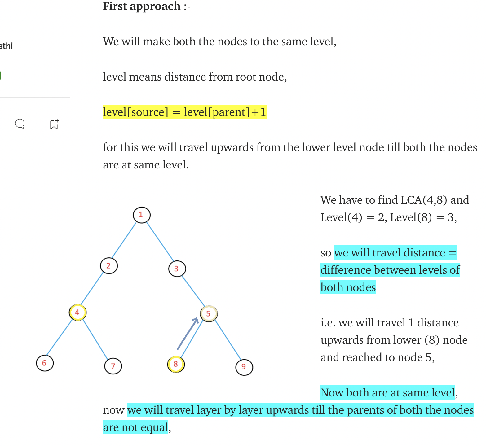

# Regular Tree Problems

##

## 1. Ancestor \[LCA]

* [x] [235. LCA of BST](https://leetcode.com/problems/lowest-common-ancestor-of-a-binary-search-tree/) 📌
* [x] [236. LCA of Binary Tree](https://leetcode.com/problems/lowest-common-ancestor-of-a-binary-tree/) 📌
  * [x] [1644. LCA of Binary Tree II](https://zhenchaogan.gitbook.io/leetcode-solution/leetcode-1644-lowest-common-ancestor-of-a-binary-tree-ii) - target node/s MAY NOT exist in tree | <mark style="color:yellow;">LCA + DFS</mark>
  * [x] [1650. LCA of Binary Tree III](https://zhenchaogan.gitbook.io/leetcode-solution/leetcode-1650-lowest-common-ancestor-of-a-binary-tree-iii) - parent to a node is given in Node definition | <mark style="color:yellow;">LCA + 2P</mark>
  * [x] [1483.Kth Ancestor of a Tree Node](https://leetcode.com/problems/kth-ancestor-of-a-tree-node/) 📌 | template for binary lifting
    * [x] \=> [Errichto Video](https://www.youtube.com/watch?v=oib-XsjFa-M\&ab\_channel=Errichto)
* [x] [1026.Maximum Difference Between Node and Ancestor](https://leetcode.com/problems/maximum-difference-between-node-and-ancestor/)



4 cases possible for rooted tree @x:

1. x is LCA
2. LCA lies on x.left
3. LCA lies on x.right
4. LCA doesnt exits in tree

```python
def lowestCommonAncestor(self, root: 'TreeNode', p: 'TreeNode', q: 'TreeNode') -> 'TreeNode':

    def lca_bst(x,a,b):
        if not x:
            return None
        #1. if LCA lies on left
        if x.val > a.val and x.val > b.val:
            return lca_bst(x.left,a,b)

        #3. if LCA lies on right
        if x.val < a.val and x.val < b.val:
            return lca_bst(x.right,a,b)
        #3. x is lca
        return x

    return lca_bst(root, p,q)
    
'''
TC: O(H}
SC: O(1) - w/o function stack
'''        
```



dda

```python
def lowestCommonAncestor(self, root: 'TreeNode', p: 'TreeNode', q: 'TreeNode') -> 'TreeNode':

    def lca(x,a,b):
        if not x:
            return None
        # 1. if x's immediate children are a & b
        if (x.left == a and x.right == b) or (x.right == a and x.left == b):
            return x

        # 2. if x is same as a or b
        if x == a or x == b:
            return x

        left_lca = lca(x.left, a,b)
        right_lca = lca(x.right, a,b)

        if left_lca and right_lca:
            return x
        if left_lca:
            return left_lca
        return right_lca

    return lca(root, p,q)

'''
TC: O(H)
SC: O(1), w/o function stack

'''      
```



```python
    def lowestCommonAncestor(self, root: 'TreeNode', p: 'TreeNode', q: 'TreeNode') -> 'TreeNode':
        if not q or not p:
            return None
        self.count = 0
        res = self.dfs(root, p, q)
        if self.count == 2:
            return res
        return None

    def dfs(self, root, p, q):
        if not root:
            return None

        left = self.dfs(root.left, p, q)
        right = self.dfs(root.right, p, q)
        if root == p or root == q:
            self.count += 1    # one of the target node exists in tree
            return root

        if left and right:
            return root
        else:
            return left or right
```



```python
    """
    # Definition for a Node.
    class Node:
        def __init__(self, val):
            self.val = val
            self.left = None
            self.right = None
            self.parent = None
    """
    def lowestCommonAncestor(self, p: 'Node', q: 'Node') -> 'Node':
        p1, p2 = p, q
        while p1 != p2:
            if p1.parent:
                p1 = p1.parent
            else:
                p1 = q
            if p2.parent:
                p2 = p2.parent
            else:
                p2 = p
        return p1
```





```python
def __init__(self, n: int, parent: List[int]):
    self.LOG = 20   # log(5*(10^4))
    self.up = [[-1]*self.LOG for _ in range(n)]  # matrix dim: N*LOG      

    for j in range(self.LOG):
        for v in range(n):
            if j == 0: self.up[v][j] = parent[v]
            elif self.up[v][j-1] != -1:     #dont mess up with uncalculated values yet. eg: [-1,2,3,0]
                self.up[v][j] = self.up[ self.up[v][j-1] ][j-1]


def getKthAncestor(self, node: int, k: int) -> int:

    for j in range(self.LOG):
        if k & (1<<j):
            node = self.up[node][j]
        if node == -1:
            return node
    return node

'''
Complexities: 
#1. Preprocessing => TC: O(N*logN), SC: O(N*logN)
#2. Query=> O(LogN)
'''
```



We pass the minimum and maximum values to the children,\
At the leaf node, we return `max - min` through the path from the root to the leaf.

```python
def maxAncestorDiff(self, root: Optional[TreeNode]) -> int:

    def solve(x, minn, maxx):
        if not x:
            return maxx - minn

        minn = min(minn, x.val)
        maxx = max(maxx, x.val)
        return max(solve(x.left,minn,maxx), solve(x.right,minn,maxx))
    return solve(root,root.val,root.val)
```



## 2. **Root to leaf path problems**

* [x] ****[**257.** Binary Tree Paths](https://leetcode.com/problems/binary-tree-paths/) - EASY



```python
def recur(x,all_paths,this_path):
    # only add when x is leaf
    if x and not x.left and not x.right:
        if this_path:
            all_paths.append(this_path[2:] +'->' + str(x.val))
        else:
            all_paths.append(str(x.val))
        return 
    elif x:
        recur(x.left, all_paths, this_path + '->' + str(x.val))
        recur(x.right, all_paths, this_path + '->' + str(x.val))

all_paths = []
recur(root, all_paths, '')
return all_paths
```







## \*. Regular Tree Problems

* [x] \*\*\*\*[**Inorder Successor in Binary Search Tree**](https://www.geeksforgeeks.org/inorder-successor-in-binary-search-tree/) ✅💪
* [x] 501\. [Find Mode in Binary Search Tree](https://leetcode.com/problems/find-mode-in-binary-search-tree/) | MindTickle!
* [x] 236\. [Find LCA in Binary Tree](https://leetcode.com/problems/lowest-common-ancestor-of-a-binary-tree/) | **DnQ** | Standard ✅✅
* [x] Distance b/w 2 nodes in Tree: **`dist(a,b) = depth(a) + depth(b) - 2*depth(c) ; where c = lca(a,b)`**
* [x] LCA of N-ary tree ([article](https://medium.com/@sahilawasthi9560460170/lowest-common-ancestor-of-n-ary-tree-107fa772a939))
* [x] 1367.[ Linked List in Binary Tree](https://leetcode.com/problems/linked-list-in-binary-tree/)



```python
# Method 1: (Uses Parent Pointer) 
'''
1. If right subtree of node is not NULL, then succ lies in right subtree. 
    => Go to right subtree and return the node with minimum key value in the right subtree.
2. If right sbtree of node is NULL, then succ is one of the ancestors. 
    => Travel up using the parent pointer until you see a node which is
       left child of its parent. The parent of such a node is the succ.
'''
class Node:
    def __init__(self, key):
        self.data = key
        self.left = None
        self.right = None
        self.parent = None

    def inOrderSuccessor(n):
     
        # Step 1 of the above algorithm
        if n.right is not None:
            return minValue(n.right)
     
        # Step 2 of the above algorithm
        p = n.parent
        while( p is not None):
            #if n != p.right :
            if n == p.left :
                break
            n = p
            p = p.parent
        return p
     
    def minValue(node):
        current = node
     
        # loop down to find the leftmost leaf
        while(current is not None):
            if current.left is None:
                break
            current = current.left
     
        return current


# Method 2: w/o parent pointer
'''
1. If right subtree of node is not NULL, then succ lies in right subtree. 
    => {same as above}
2. If right sbtree of node is NULL, then succ is one of the ancestors. 
    => Travel down the tree, if a node’s data is greater than root’s data
      then go right side, otherwise, go to left side.
'''
class Node:
    def __init__(self, key):
        self.data = key
        self.left = None
        self.right = None
 
def inOrderSuccessor(root, n):
     
    # Step 1 of the above algorithm
    if n.right is not None:
        return minValue(n.right)
 
    # Step 2 of the above algorithm
    succ=Node(None)
     
    while( root):
        if(root.data<n.data):
            root=root.right
        elif(root.data>n.data):
            succ=root
            root=root.left
        else:
            break
    return succ
 
def minValue(node):
    current = node
 
    # loop down to find the leftmost leaf
    while(current is not None):
        if current.left is None:
            break
        current = current.left
 
    return current
 
```



```python
#1. O(N) space ==================================================
    cnts = collections.Counter()
    self.maxx = 0
    
    def helper(node):
        # nonlocal maxx
        if not node:
            return
        cnts[node.val] += 1
        self.maxx = max(self.maxx, cnts[node.val])
        helper(node.left)
        helper(node.right)
        
    helper(root)
    return [k for k,v in cnts.items() if v == self.maxx]

    #2. O(1) Space ===================================================
    prev,count=0,0
    ans=[]
    c=0
    def inorder(root):
        nonlocal prev,count,c,ans
        if root:
            inorder(root.left)
            if prev==root.val:
                count+=1
            else:
                prev=root.val
                count=1
            if count>c:
                c=count
                ans=[root.val]
            elif count==c:
                ans.append(root.val)
            inorder(root.right)
    inorder(root)
    return(ans)
```



```python
def lca(root,p,q) -> 'TreeNode':
        # found p and q?
        if not root or root == p or root == q:
            return root
    
        left = lca(root.left,p,q)
        right = lca(root.right,p,q)
        
        # p and q appears in left and right respectively, then their ancestor is root
        if left is not None and right is not None:
            return root
        
        # p and q not in left, then it must be in right, otherwise left
        if left is None:
            return right
        
        if right is None:
            return left
```



```python
def isSubPath(self, head: Optional[ListNode], root: Optional[TreeNode]) -> bool:

    def dfs(head, root):
        if not head: return True
        if not root: return False
        return root.val == head.val and (dfs(head.next, root.left) or dfs(head.next, root.right))
    if not head: return True
    if not root: return False
    return dfs(head, root) or self.isSubPath(head, root.left) or self.isSubPath(head, root.right)

'''
Time O(N * min(L,H))
Space O(H)
where N = tree size, H = tree height, L = list length.
'''
```





##
