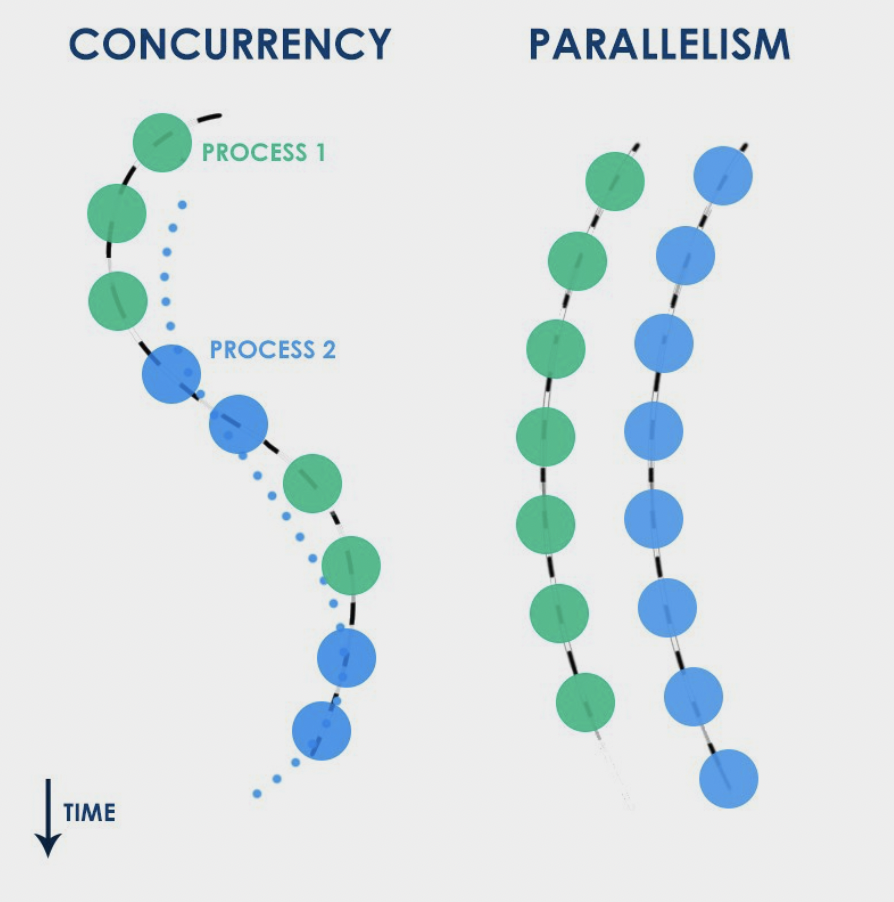
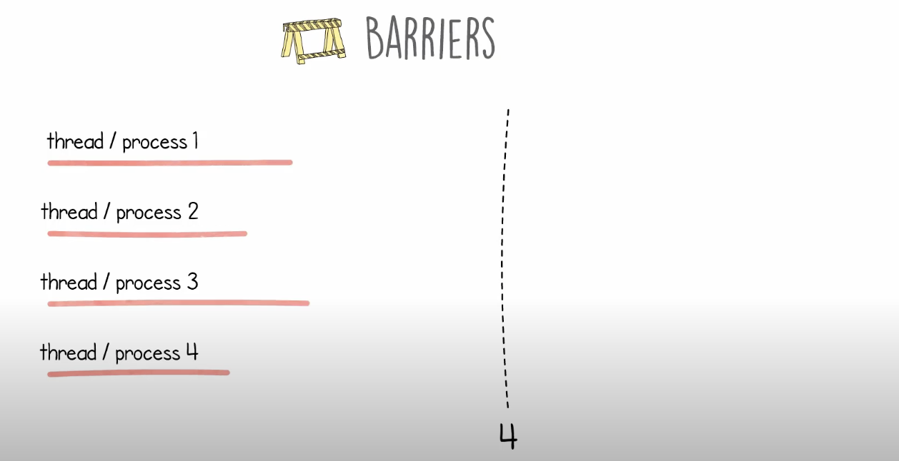
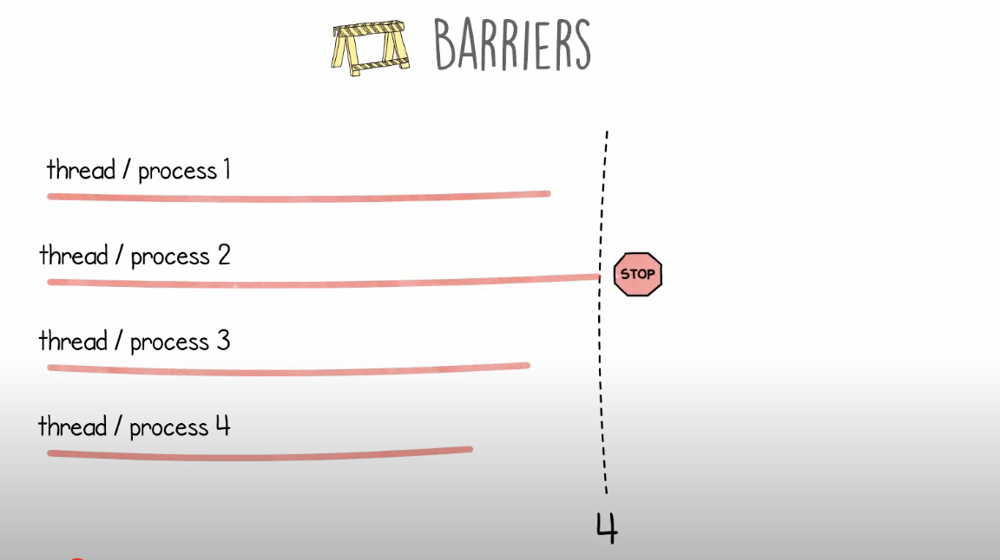
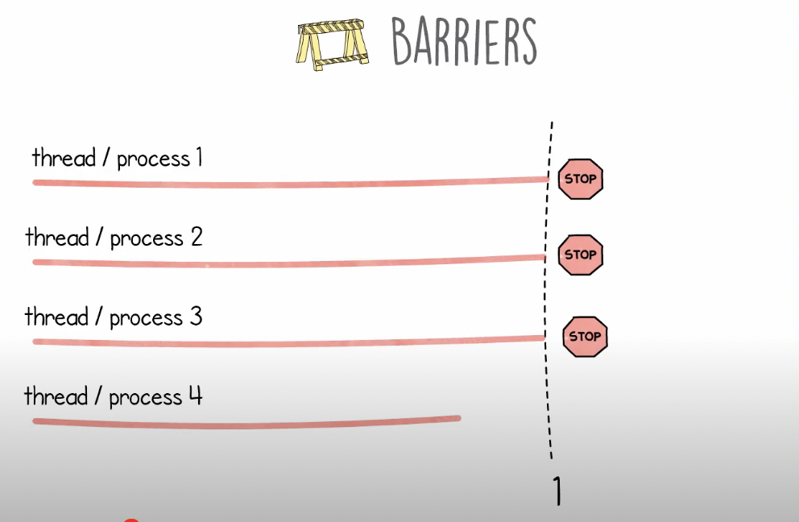
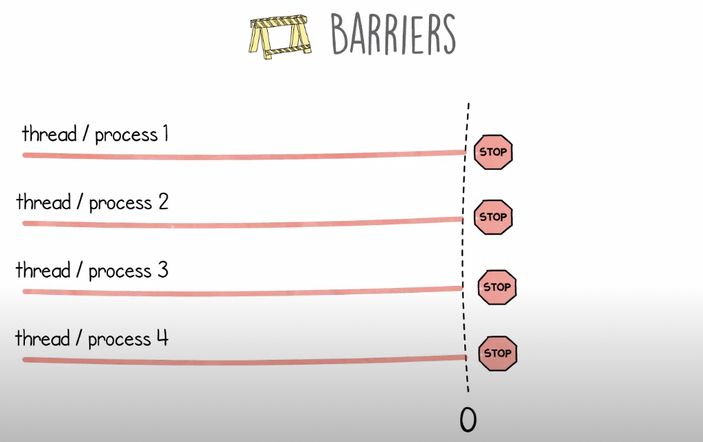
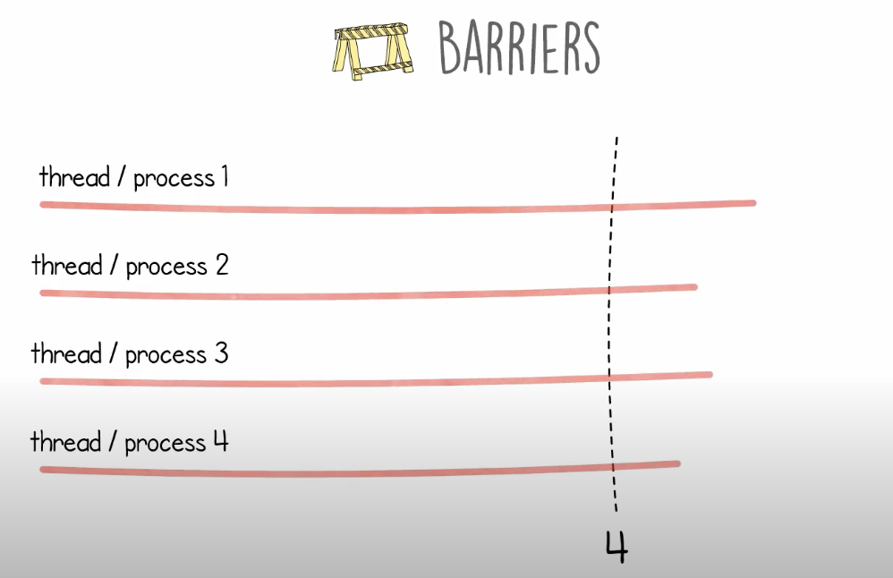

# Concurrency

## General

* **Mutex =** Mutual Exclusion
* **Find Cores:** Find out cput count\(how many cores\) of a machine

```python
import os
os.cpu_count() # -> 8 on mine
```

* **See All the Processes running on machine**

```python
$ htop
```

* **Time** a process:

```python
import time
start_time = time.time()

# do your thing............................
# time.sleep(1)    # for ref.
# do your thing............................

end_time = time.time()
print(f'total time = {end_time - start_time}')
```

## `Theory:`

### 1. What is Concurrency 

* When we talk about concurrent events, it is tempting to say that they happen at the same time, or simultaneously.
* **Two events are concurrent if we cannot tell by looking at the program which will happen first**.
* **Non-determinism:**
  * Concurrent programs are often **non-deterministic**, which means it is not possible to tell, by looking at the program, what will happen when it executes. 
  * E.g:            **Thread A                            Thread B**

                       a1 print "yes"                     b1 print "no"

  * Because the two threads run concurrently, ✅**order of execution depends on the scheduler.✅** During any given run of this program, the output might be **“yes no”** or **“no yes”.**

### 2. Threads vs Process:✅

* **Threads** run in the **same** memory heap. 
  * So multiple threads can write to the **same location** in the memory heap.
  * To prevent this=&gt; python has introduced **GIL as a mutex** to **prevent multithreading**.
* **Processes** run in  **separate** memory heaps.
  * This makes sharing information **harder** with processes and object instances.

### 3. GIL : Global Interpreter Lock

* **CPython**  is the most common\(standard\) implementation of python. 
  * its written in C & Python
*  It can be defined as both an **interpreter** and a **compiler** as:
  *  it compiles Python code into byte-code before interpreting it. 
* A particular feature of CPython is that **it makes use of a global interpreter lock** \(**GIL**\) on **each CPython interpreter process**:
  * which means that **within a single process only one thread may be processing Python byte-code at any one time**. 🌟

### 4. Concurrency vs Parallelism



### 5. Blocking \| NonBlocking \| Sync \| Async

* **Synchronous** means to start one after the other's result, _in a sequence._
  * _Synchrounous eg_: I will go out only if it rains. \( dependency exists \)
* **Asynchronous** means start together, _no sequence is guaranteed on the result_
  * _Asynchronous eg_: I will go out. It can rain. \( independent events, does't matter when they occur 
* **Blocking** means something that causes an _obstruction_ to perform the next step.
  * _Blocking eg_: I knock on the door and wait till they open it. \( I am idle here \)
* **Non-blocking** means something that keeps running without waiting for anything, _overcoming_ _the_ _obstruction_.
  * _Non-Blocking eg_: I knock on the door, if they open it instantly, I greet them, go inside, etc. If they do not open instantly, I go to the next house and knock on it. \( I am doing something or the other, not idle \)
* **===&gt; Synchronous or Asynchronous, both can be blocking or non-blocking and vice versa**

  \_\_

  \_\_

### 6. What is Semaphore

* A semaphore is **like an integer, with three differences**:

1. When you create the semaphore, you can initialize its value to any integer, but after that the only operations you are allowed to perform are increment \(+= 1\) and decrement \(-= 1\). You cannot read the current value of the semaphore \(_but, `threading.Semaphore` allows it -&gt; **`sem._value`**\)_
2. When a thread decrements the semaphore, if the result is **negative**, the **thread blocks itself** and cannot continue until another thread increments the semaphore.
3. If the value of the semaphore is negative and a thread increments it, one of the threads that is waiting gets **woken up**.

* Code:

  ```python
  from threading import Semaphore

  semaphore = Semaphore()  # default value is 1

  semaphore.acquire()    # i.e. semaphore.wait()
  # do something...
  semaphore.release()    # i.e. semaphore.signal()
  ```

## `multiprocessing` module \| [playlist](https://www.youtube.com/watch?v=RR4SoktDQAw&list=PL5tcWHG-UPH3SX16DI6EP1FlEibgxkg_6&index=1&ab_channel=LucidProgramming)

### 0. Theory 

* [`multiprocessing`](https://docs.python.org/3/library/multiprocessing.html#module-multiprocessing) is a package that supports spawning processes using an API similar to the [`threading`](https://docs.python.org/3/library/threading.html#module-threading) module. 
* The [`multiprocessing`](https://docs.python.org/3/library/multiprocessing.html#module-multiprocessing) package offers both local and remote concurrency, effectively **side-stepping the** [**Global Interpreter Lock**](https://docs.python.org/3/glossary.html#term-global-interpreter-lock) **by using subprocesses instead of threads**. 
* Due to this, the [`multiprocessing`](https://docs.python.org/3/library/multiprocessing.html#module-multiprocessing) module allows the programmer to fully leverage multiple processors on a given machine. It runs on both Unix and Windows.
* **Features of `multiprocessing` module:**
  * uses separate memory space, 
  * multiple CPU cores, 
  * bypasses GIL limitations in CPython, 
  * child processes are kill able\(ex. function calls in program\) 
  * and is much easier to use
* **It provides 2 ways to implement Process-based parallelism**:-
  1. **Process**
  2. **Pool**
* **Process vs Pool:**
  * **Process:** Its used when **function based parallelism** is required
    * i.e. where I could define different functionality with parameters that they receive and run those different functions in parallel which are doing totally various kind of computations.
    * **When you have a small data or functions and less repetitive tasks to do**.
    * It puts **all the process in the memor**y. Hence in the larger task, it **might cause to loss of memory. 🔴**
    * **I/O operation:** The process class suspends the process executing I/O operations and schedule another process parallel. 
    * Uses FIFO scheduler.
  * **Pool:** is used when **data based parallelism** is required.
    * **i.e.** parallelizing the execution of a function across **multiple input values, distributing the input data across processes**.
    * **When you have junk of data, you can use Pool class.** 
    * Only the process under execution are kept in the memory. 🟢
    * **I/O operation:** It waits till the I/O operation is completed & does not schedule another process. This might increase the execution time. 
    * Uses FIFO scheduler.
* Ways for **sharing data between multiple processed** functions:

  * **Queue**
    * A [`Queue()`](http://docs.python.org/library/multiprocessing.html#multiprocessing.Queue) can have multiple producers and consumers
    * **WHEN TO USE:** If you need more than two points to communicate, use a [`Queue()`](http://docs.python.org/library/multiprocessing.html#multiprocessing.Queue).
  * **Pipe**

    * A [`Pipe()`](http://docs.python.org/library/multiprocessing.html#multiprocessing.Pipe) can only have **two** endpoints.
    * **WHEN TO USE:** If you need absolute performance, a [`Pipe()`](http://docs.python.org/library/multiprocessing.html#multiprocessing.Pipe) is much faster because `Queue()` is built on top of `Pipe()`.

* **`multiprocessing` lib vs `threading` lib**

  **Multiprocessing**

  **&gt;&gt; Pros**

  * Separate memory space
  * Code is usually straightforward
  * Takes advantage of multiple CPUs & cores
  * **Avoids GIL limitations for cPython**
  * Eliminates most needs for synchronization primitives unless if you use shared memory \(instead, it's more of a communication model for IPC\)
  * **Child processes are interruptible/killable**
  * Python `multiprocessing` module includes useful abstractions with an interface much like `threading.Thread`
  * A must with cPython for CPU-bound processing

  **&gt;&gt; Cons**

  * IPC a little more complicated with more overhead \(communication model vs. shared memory/objects\)
  * Larger memory footprint

  **Threading**

  **&gt;&gt; Pros**

  * Lightweight - low memory footprint
  * Shared memory - makes access to state from another context easier
  * Allows you to easily make responsive UIs
  * cPython C extension modules that properly release the GIL will run in parallel
  * Great option for I/O-bound applications

  **&gt;&gt; Cons**

  * cPython - **subject to the GIL**
  * **Not interruptible/killable**
  * If not following a command queue/message pump model \(using the `Queue` module\), then manual use of synchronization primitives become a necessity \(decisions are needed for the granularity of locking\)
  * Code is usually harder to understand and to get right - the potential for race conditions increases dramatically

### 1. `Process`

* Without using `Process` Normal run-single process

```python
def square(x):
    print(f'square({x}) = {x*x}')
    
if __name__ == '__main__':
    nums = [1,2,3,4]
    
    for x in nums:
        square(x)
'''
square(1) = 1
square(2) = 4
square(3) = 9
square(4) = 16
'''
```

* With **`Process`**, **`current_process`**
  * **Style \(demo\) :** 
    * **run lots of long process\(with delay: `time.sleep(.5)`\)**
    * **terminal -&gt; "`htop`" -&gt; F4 -&gt; filter python & voila!**

```python
import os
import time
from multiprocessing import Process, current_process

def square(x):
    res = x*x
    time.sleep(2)
    # we can use 'os' module to print the ProcessID 
    # assigned to the call of this function by the OS
    process_id = os.getpid()
    
    # we can also use 'current_process' pkg to get the
    # name of the Process obj
    process_name = current_process().name
    print(f'Process ID = {process_id} , Process Name = {process_name}')
    
    print(f'square({x}) = {res}')
    
if __name__ == '__main__':
    nums = range(1000)
    processes = []
    
    for x in nums:
        process = Process(target=square, args=(x,)) # agar >1 arg hota toh comma nhi aata=> args=(x,y)
        processes.append(process)
        process.start()
    
    # to ensure that all processes have been completed        
    for process in processes:    
        process.join()        # see below Note
    print('============== Multiprocessing Complete ============')
'''
Process ID = 87375 , Process Name = Process-1
square(1) = 1
Process ID = 87376 , Process Name = Process-2
square(2) = 4
Process ID = 87377 , Process Name = Process-3
square(3) = 9
Process ID = 87378 , Process Name = Process-4
square(4) = 16
'''
```

* Here two functions to pay attention are **`.start()`**and **`.join()`**
  * **`.start()`** helps in starting a process and that too **asynchronously**.
  * **`.join()`** method on a `Process` does **block** until the process has finished, but because we called `.start()` on all processes before joining, then both processes will run asynchronously. The interpreter will, however, wait until p\[i\] finishes before attempting to wait for p\[i+1\] to finish.✅
* **Note**: A process cannot join itself because this would cause a **deadlock**. It is an error to attempt to join a process before it has been started.

### 

### 2. `Pool`

* One can create a pool of processes which will carry out tasks submitted to it with the Pool class.
* A process pool object which controls a pool of worker processes to which jobs can be submitted. It supports asynchronous results with timeouts and callbacks and has a parallel map implementation.


* It offers a convenient means of parallelizing the execution of a function across multiple input values, **distributing the input data across processes** i.e. **data based parallelism.** 
* Here `pool.map()` is a completely different kind of **animal**, because **it distributes a bunch of arguments to the same function \(asynchronously\), across the pool processes, and then waits until** all function calls have completed before returning the list of result**s**.

```python
# One can create a pool of processes which will carry out tasks submitted to
# it with the Pool class.

# A process pool object which controls a pool of worker processes to which
# jobs can be submitted. It supports asynchronous results with timeouts and
# callbacks and has a parallel map implementation.

import time
from multiprocessing import Pool

# just a random function to return sum of squares of all 0..n
def sum_square(n):    
    s = 0
    for i in range(n):
        s += i * i
    return s


def sum_square_with_multiprocessing(arr):

    start_time = time.time()
    p = Pool()        # NOTE: Pool(x) , where x = number of cores/cpus u wanna allocate
                      # default is: use all the cores in system
    result = p.map(sum_square, arr)

    p.close()
    p.join()

    end_time = time.time() - start_time

    print(f"Processing {len(numbers)} numbers took {end_time} time using multiprocessing.")


def sum_square_no_multiprocessing(arr):

    start_time = time.time()
    result = []

    for i in arr:
        result.append(sum_square(i))
    end_time = time.time() - start_time

    print(f"Processing {len(numbers)} numbers took {end_time} time using serial processing.")


if __name__ == '__main__':
    arr = range(10000)    # a list: [0,1,....,999]
    sum_square_with_multiprocessing(arr)
    sum_square_no_multiprocessing(arr)

'''
OP: as expected; 
    multiprocessing with Pool is WAYY FASTER than normal flow for bigger range:

Processing 10000 numbers took 0.5510308742523193 time using multiprocessing.
Processing 10000 numbers took 2.190778970718384 time using serial processing.
'''
```

### 3. Lock\(synonym = Mutex\)

* **WHAT is Lock/Mutex:** 
  * A lock or mutex is a **synchronisation mechanism** to **enforce limits** on **access to a resource** in an environment where there are **many threads of execution**.
* **Without Lock \(**on shared variable**\)**
  * output is random values every time; because `add` & `subtract` methods are accessing the shared variable randomly

```python
import time 
from multiprocessing import Process, Lock, Value

def add_500_no_lock(total):
    for _ in range(500):
        time.sleep(.01)
        total.value += 5
        
def sub_500_no_lock(total):
    for _ in range(500):
        time.sleep(.01)
        total.value -= 5

if __name__ == '__main__':
    
    total = Value('i', 500)
    #lock = Lock()    # lock not used
    
    add_process = Process(target=add_500_no_lock, args=(total,))
    sub_process = Process(target=sub_500_no_lock, args=(total,))
    
    add_process.start()
    sub_process.start()
    
    add_process.join()
    sub_process.join()
    
    print(total.value)
    
'''
Output: (outputs random values of target)
360
705
510
......
'''
```

* **WITH Lock**

```python
import time 
from multiprocessing import Process, Lock, Value

def add_500_lock(total,lock):
    for _ in range(500):
        time.sleep(.01)
        lock.acquire()    # locking the critical/shared section
        total.value += 5
        lock.release()
        
def sub_500_lock(total,lock):
    for _ in range(500):
        time.sleep(.01)
        lock.acquire()    # locking the critical/shared section
        total.value -= 5
        lock.release()

if __name__ == '__main__':
    
    total = Value('i', 500)
    lock = Lock()
    
    add_process = Process(target=add_500_lock, args=(total,lock))
    sub_process = Process(target=sub_500_lock, args=(total,lock))
    
    add_process.start()
    sub_process.start()
    
    add_process.join()
    sub_process.join()
    
    print(total.value)
    
'''
Output: prints 500(as expected) all the time => Atomic tranactions

500
'''
```


### 4. Queue \| `multiprocessing.Queue`

* One of the ways for **sharing data between multi-processed functions**
* Using the multiprocessing **`Queue`** class to communicate between different processes
  * **OP:**  elements get added in the queue in random order by both functions



```python
# We show how to make use of the multiprocessing Queue class to communicate
# between different processes.

from multiprocessing import Process, Queue

def square(numbers, queue):
    for i in numbers:
        queue.put(i*i)


def cube(numbers, queue):
    for i in numbers:
        queue.put(i*i*i)


if __name__ == '__main__':

    numbers = range(5)

    queue = Queue()
    square_process = Process(target=square, args=(numbers, queue))
    cube_process = Process(target=cube, args=(numbers, queue))

    square_process.start()
    cube_process.start()

    square_process.join()
    cube_process.join()

    while not queue.empty():
        print(queue.get())
'''
OP:    elements get added in the queue in random order by both functions

0
1
4
9
16
0
1
8
27
64
'''
```



```python
from collections import deque
from threading import Condition

class BoundedBlockingQueue(object):

    def __init__(self, capacity: int):
        self.capacity = capacity
        self.queue = deque()
        self.condition = Condition()
        
    def enqueue(self, element: int) -> None:
        with self.condition:     # acquire and release
            while len(self.queue) >= self.capacity:
                self.condition.wait()
            
            self.queue.append(element)
            self.condition.notify()

    def dequeue(self) -> int:
        with self.condition:     # acquire and release
            while len(self.queue) == 0:
                self.condition.wait()
            
            element = self.queue.popleft()
            self.condition.notify()
            return element
        
    def size(self) -> int:
        with self.condition:
            return len(self.queue)
            
# ============================================ [Running It] ===============
queue = BoundedBlockingQueue(2)
# norm_queue = deque()

def pop_from_queue():
    ans = queue.dequeue()
    print(f'Popped {ans} from queue: \t Q = {queue}')

def add_to_queue(x):
    queue.enqueue(x)
    print(f'Added {x} to queue: \t Q = {queue}')

def get_size():
    print(queue.size())

th = Thread(target=pop_from_queue)
th.start()
print(queue)
time.sleep(2)
th = Thread(target=get_size)
th.start()
th.join()
print(queue)
time.sleep(2)
th = Thread(target=pop_from_queue)
th.start()
th.join()
print(queue)
th = Thread(target=get_size)
th.start()
th.join()
time.sleep(2)
th = Thread(target=add_to_queue, args=[1])
th.start()
th.join()
print(queue)
th = Thread(target=get_size)
th.start()
th.join()
th = Thread(target=pop_from_queue)
th.start()
th.join()
th = Thread(target=get_size)
th.start()
th.join()
print(queue)
    
print('done............')
```



### 5. Pipe \| `multiprocessing.Pipe`

```python
from multiprocessing import Process, Pipe
import time

def reader_proc(pipe):
    ## Read from the pipe; this will be spawned as a separate Process
    p_output, p_input = pipe
    p_input.close()    # We are only reading
    while True:
        msg = p_output.recv()    # Read from the output pipe and do nothing
        if msg=='DONE':
            break

def writer(count, p_input):
    for ii in range(0, count):
        p_input.send(ii)             # Write 'count' numbers into the input pipe
    p_input.send('DONE')

if __name__=='__main__':
    for count in [10**4, 10**5, 10**6]:
        # Pipes are unidirectional with two endpoints:  p_input ------> p_output
        p_output, p_input = Pipe()  # writer() writes to p_input from _this_ process
        reader_p = Process(target=reader_proc, args=((p_output, p_input),))
        reader_p.daemon = True
        reader_p.start()     # Launch the reader process

        p_output.close()       # We no longer need this part of the Pipe()
        _start = time.time()
        writer(count, p_input) # Send a lot of stuff to reader_proc()
        p_input.close()
        reader_p.join()
        print("Sending {0} numbers to Pipe() took {1} seconds".format(count,(time.time() - _start)))
```


## `threading` module: Common Multithreading Techniques

### 🟢🔴Pros & Cons of all 5 below:

* **Lock** The underlying abstraction used to implement the later constructs. It controls access to one resource for one thread.
* **Semaphore** Can be used to share one resource among a limited number of threads. **Can be chained together** \(e.g. a task releases on semaphore1 every time it executes. Another thread acquires semaphore1 **10 times** and releases semaphore2 to indicate the task completion. **E.g: H2O wala Question**
* **Barrier** Once the barrier threshold is reached, every thread will be passed through - could be a good fit for **batched processes** where you want to wait on a certain percentage before starting a process, but accept the remainder. **Rendezvous!!**
* **Event** Contrary to the traditional 'event' concept in other forms \(one event results in one callback\) - once it is in a triggered state, **all threads will not block on the 'wait' call until the event is 'cleared'** - reset to the untriggered state. It could be thought of as a **Barrier\(1\)** that can be reset easily.
* **Condition** Another primitive used with Lock to implement the other structures. Gives you **finer control over what happens after you release a lock.**

### WTH is `with` \(for lock, semaphore, condition\)

* Using with

  ```text
  with some_lock:
      # do something...
  ```

* is equivalent to: \(**acquire** & **release**\)
* ```text
  some_lock.acquire()
  try:
      # do something...
  finally:
      some_lock.release()
  ```

## 1. Lock \| Mutex \(&lt;Signalling&gt;\)

* **WHAT is Lock/Mutex:** 
  * A lock or mutex is a **synchronisation mechanism** to **enforce limits** on **access to a resource** in an environment where there are **many threads of execution**.
* the most common way to  avoid race condition
  * **Race Condition:** The condition occurs when one thread tries to modify a shared resource _at the same time_ that another thread is modifying that resource – t​his leads to garbled output
* Once a thread has acquired the lock, all subsequent attempts to acquire the lock are blocked until it is released
* **Mutex vs Semaphore:**
  * **Mutex =** single key to single toilet
    * only 1 thread can access the critical section once
  * **Semaphore =** set of identical keys to multiple identical toilets
    * i.e. given number\(&gt;=1\)  threads can access the critical sections simultaneously 
* **Mutex vs Binary Semaphore:**
  * A **mutex** can be released only by **the thread that had acquired it**.
  * A **binary semaphore** can be signalled **by any thread** \(or process\).

### Code: Lock

```python
from threading import Thread, Lock

lock = Lock()   # Declraing a lock

deposit = 100
def add_profit(): 
    global deposit
    for i in range(100000):
        lock.acquire()
        deposit = deposit + 10
        lock.release()
def pay_bill(): 
    global deposit
    for i in range(100000):
        lock.acquire()
        deposit = deposit - 10
        lock.release()
        
thread1 = Thread(target = add_profit, args = [])
thread2 = Thread(target = pay_bill, args = [])

thread1.start()    
thread2.start() 

# Waiting for both the threads to finish executing 
thread1.join()
thread2.join()

print(deposit)
```


## 2. Semaphore  \(&lt;Multiplex&gt;\)

* This is one of the oldest synchronization primitives in the history of computer science,
  *  invented by the early Dutch computer scientist Edsger **W. Dijkstra** \(he used the names `P()` and `V()` instead of [`acquire()`](https://docs.python.org/3/library/threading.html#threading.Semaphore.acquire) and [`release()`](https://docs.python.org/3/library/threading.html#threading.Semaphore.release)\).
* A semaphore manages an internal counter which is decremented by each [`acquire()`](https://docs.python.org/3/library/threading.html#threading.Semaphore.acquire) call and incremented by each [`release()`](https://docs.python.org/3/library/threading.html#threading.Semaphore.release) call. The counter can never go below zero; when [`acquire()`](https://docs.python.org/3/library/threading.html#threading.Semaphore.acquire) finds that it is zero, it blocks, waiting until some other thread calls [`release()`](https://docs.python.org/3/library/threading.html#threading.Semaphore.release).
* The use of a **bounded semaphore** reduces the chance that a programming error which causes the semaphore to be released more than it’s acquired will go undetected
* **Mutex vs Semaphore:**
  * **Mutex =** single key to single toilet
    * only 1 thread can access the critical section once
  * **Semaphore =** set of identical keys to multiple identical toilets
    * i.e. given number\(&gt;=1\)  threads can access the critical sections simultaneously 
* **Mutex vs Binary Semaphore:**
  * A **mutex** can be released only by **the thread that had acquired it**.
  * A **binary semaphore** can be signalled **by any thread** \(or process\).

### Code: Semaphore

```python
from threading import Thread,Semaphore, current_thread

semaphore = Semaphore(2)

def my_fn():
    semaphore.acquire()
    print(semaphore)
    print(f'Thread : {current_thread().name} acquired the lock')
    print('>> semaphore._value',semaphore._value)
    semaphore.release()
    print(f'Thread : {current_thread().name} released the lock')
    print('>> semaphore._value',semaphore._value)
    
t1= Thread(target=my_fn)
t2= Thread(target=my_fn)
t1.start()
t2.start()

'''
<threading.Semaphore object at 0x104aa8fd0>
Thread : Thread-1 acquired the lock
>> semaphore._value 0
<threading.Semaphore object at 0x104aa8fd0>
Thread : Thread-2 acquired the lock
Thread : Thread-1 released the lock
>> semaphore._value 1
>> semaphore._value 1
Thread : Thread-2 released the lock
>> semaphore._value 2
'''
```

## 3. Barrier \(&lt;**Rendezvous&gt;**\)

* Once the barrier threshold is reached, every thread will be passed through
* **WHEN TO USE:**  could be a good fit for **batched processes** where you want to wait on a certain percentage before starting a process, but accept the remainder.











* This class provides a simple synchronization primitive for use by a fixed number of threads that need to wait for each other. 
* Each of the threads tries to pass the barrier by calling the [`wait()`](https://docs.python.org/3/library/threading.html#threading.Barrier.wait) method and will block until all of the threads have made their [`wait()`](https://docs.python.org/3/library/threading.html#threading.Barrier.wait) calls. 
* At this point, the threads are released simultaneously.
* **NOTE:** The barrier can be reused any number of times for the same number of threads.

### Code: Barrier



```python
import time
from threading import Barrier, Thread

barrier = Barrier(2)

def wait_on_barrier(name, time_to_sleep):
    for i in range(2):
        print(f'{name} is running for {i}-th time')
        time.sleep(time_to_sleep)
        print(f'{name} is waiting on barrier for {i}-th time')
        barrier.wait()
    print(f'{name} is finished')
    
p1 = Thread(target=wait_on_barrier, args=["P1",4])
p2 = Thread(target=wait_on_barrier, args=["P2",10])
p1.start()
p2.start()

'''
P1 is running for 0-th time
P2 is running for 0-th time
P1 is waiting on barrier for 0-th time
P2 is waiting on barrier for 0-th time
P2 is running for 1-th time
P1 is running for 1-th time
P1 is waiting on barrier for 1-th time
P2 is waiting on barrier for 1-th time
P2 is finished
P1 is finished
'''
```



```python
'''
You can simulate the barrier with 2 semaphores

ADDED FEATURE: REUSABILITY
Rewrite the barrier solution so that after all the threads have passed through, 
the barrier is locked again

This solution is sometimes called a **two-phase barrier**
because it forces all the threads to wait twice: 
  1. once for all the threads to arrive 
  2. and again for all the threads to execute the critical section.
'''

import time
from threading import Thread,Semaphore

class Barrier:
    def __init__(self, n):
        self.n = n
        self.count = 0
        self.mutex = Semaphore(1)
        self.barrier1 = Semaphore(0)
        self.barrier1 = Semaphore(0)
    
    def phase1(self):
        self.mutex.acquire()
        
        self.count = self.count + 1
        if self.count == self.n: self.barrier1.release()
        
        self.mutex.release()
        self.barrier1.acquire()
        
    def phase2(self):
        self.mutex.acquire()
        
        self.count = self.count - 1
        if self.count == 0: self.barrier2.release()
        
        self.mutex.release()
        self.barrier2.acquire()

    def wait(self):
        self.phase1()
        self.phase2()

b = Barrier(2)

def func1():
    time.sleep(3)
    #
    b.wait()
    #
    print('Working from func1')
    return 

def func2():
    time.sleep(5)
    #
    b.wait()
    #
    print('Working from func2')
    return    

if __name__ == '__main__':
    Thread(target = func1).start()
    Thread(target = func2).start()    
```



## 4. Event

* one of the simplest mechanisms for communication between threads: **one thread signals an event and other threads wait for it**
* once it is in a triggered state, **all threads will not block on the 'wait' call until the event is 'cleared'** - reset to the untriggered state. It could be thought of as a **Barrier\(1\)** that can be reset easily.
* **APIs:** 
  * `set()`
  * `wait()`
  * `reset() :` Reset the internal flag to false
  * `is_set()`

### Code: Event

```python
from threading import Thread,Event

event = Event()

def my_fn():
    print('waiting for event to trigger ..........')
    event.wait()
    print('Received event trigger. Performing action XYZ now')
    
t1 = Thread(target=my_fn)
t1.start()

x = input('Do you want to trigger an event? (y/n)')
if x == 'y':
    event.set() #trigger the event
    
'''
waiting for event to trigger ..........
Do you want to trigger an event? (y/n)
>> y
Received event trigger. Performing action XYZ now
'''
```

## 5. Condition

* similar to **Lock** only. **ADVANTAGE**: Gives **finer control over what happens after you release a lock.**
* A condition variable is **always associated with some kind of lock**; this can be passed in or one will be created by default. 
* The lock is part of the condition object: you don’t have to track it separately.
* A condition variable obeys the [context management protocol](https://docs.python.org/3/library/threading.html#with-locks): using the `with` statement acquires the associated lock for the duration of the enclosed block.
* APIs: [`acquire()`](https://docs.python.org/3/library/threading.html#threading.Condition.acquire) and [`release()`](https://docs.python.org/3/library/threading.html#threading.Condition.release) 
  * The [`notify()`](https://docs.python.org/3/library/threading.html#threading.Condition.notify) method wakes up one of the threads waiting for the condition variable, if any are waiting. 
  * The [`notify_all()`](https://docs.python.org/3/library/threading.html#threading.Condition.notify_all) method wakes up all threads waiting for the condition variable.
  * **Note**: the [`notify()`](https://docs.python.org/3/library/threading.html#threading.Condition.notify) and [`notify_all()`](https://docs.python.org/3/library/threading.html#threading.Condition.notify_all) methods **don’t release the loc**k; this means that the thread or threads awakened will not return from their [`wait()`](https://docs.python.org/3/library/threading.html#threading.Condition.wait) call immediately, but only when the thread that called [`notify()`](https://docs.python.org/3/library/threading.html#threading.Condition.notify) or [`notify_all()`](https://docs.python.org/3/library/threading.html#threading.Condition.notify_all) finally relinquishes **ownership of the lock**.

### Code: Condition

```python
import time
from threading import Thread,Condition

cv = Condition()
topics = []

def generator():  # creates topics
    cv.acquire()
    for i in range(6):
        topics.append(i)
        print(f'Topic: {i} generated')
        time.sleep(.1)
    cv.notify() # notify the producers to awaken | better use notifyAll() if multiple consumers
    cv.release()
    
def consumer():
    cv.acquire()
    cv.wait(timeout=0)  # optional param
    cv.release()
    print(f'Consumer got topics: {topics}')
    
gen_th = Thread(target=generator)
consu_th = Thread(target=consumer)

gen_th.start()
consu_th.start()
'''
Topic: 0 generated
Topic: 1 generated
Topic: 2 generated
Topic: 3 generated
Topic: 4 generated
Topic: 5 generated
Consumer got topics: [0, 1, 2, 3, 4, 5]
'''
```


## 


