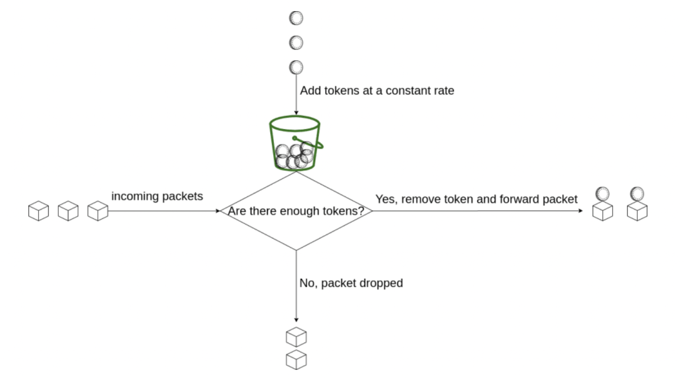
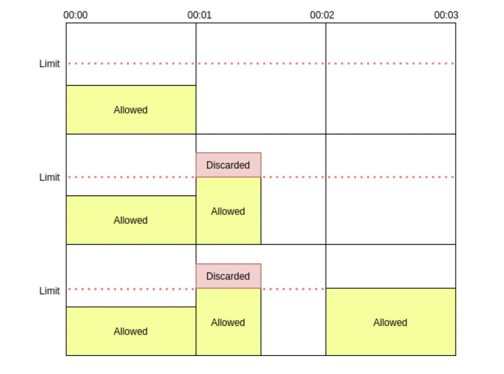
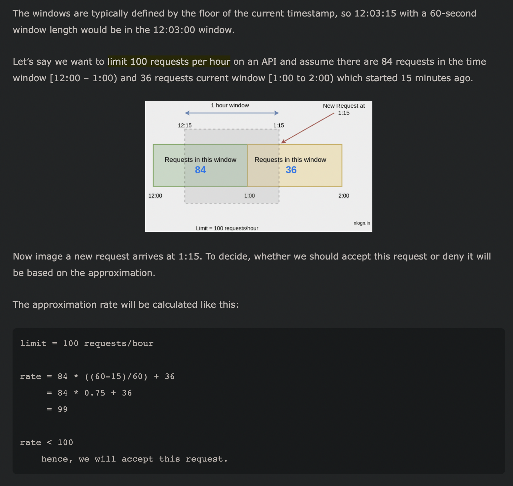
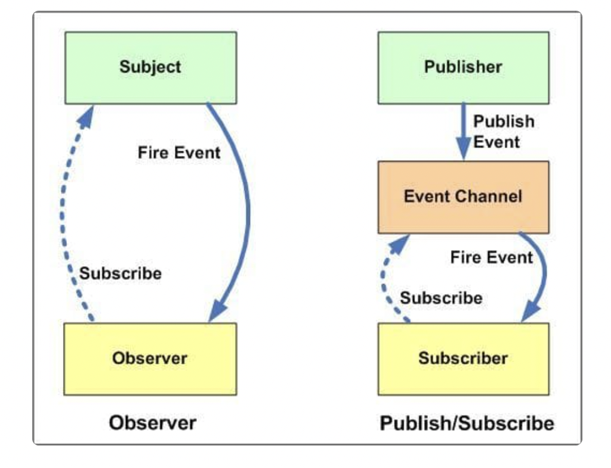

# concurrency: Questions

## Classical Questions

### ✅1. Producer-consumer problem \| Message Bus

* Whenever an event occurs, a **producer thread** creates an event object and adds it to the event buffer. Concurrently, **consumer threads** take events out of the buffer and process them. In this case, the consumers are called “event handlers.”
  * **e.g.:** event-driven programs
* **Constraints Requirements of System:**
  * While an item is being added to or removed from the buffer, the buffer is in an inconsistent state. Therefore, threads must have exclusive access to the buffer.
  * If a consumer thread arrives while the buffer is empty, it blocks until a producer adds a new item.



```python
'''
taken from educative
'''
from threading import Thread, Condition, current_thread
import time
import random


class BlockingQueue:

    def __init__(self, max_size):
        self.max_size = max_size
        self.curr_size = 0    # queue size
        self.cond = Condition()
        self.q = []

    def dequeue(self):

        self.cond.acquire()
        while self.curr_size == 0:    # there are no events to read from
            self.cond.wait()

        item = self.q.pop(0)
        self.curr_size -= 1

        self.cond.notifyAll()
        self.cond.release()

        return item

    def enqueue(self, item):

        self.cond.acquire()
        while self.curr_size == self.max_size:
            self.cond.wait()

        self.q.append(item)
        self.curr_size += 1

        self.cond.notifyAll()
        print("\ncurrent size of queue {0}".format(self.curr_size), flush=True)
        self.cond.release()


def consumer_thread(q):
    while 1:
        item = q.dequeue()
        print("\n{0} consumed item {1}".format(current_thread().getName(), item), flush=True)
        time.sleep(random.randint(1, 3))


def producer_thread(q, val):
    item = val
    while 1:
        q.enqueue(item)
        item += 1
        time.sleep(0.1)


if __name__ == "__main__":
    blocking_q = BlockingQueue(5)

    consumerThread1 = Thread(target=consumer_thread, name="consumer-1", args=(blocking_q,), daemon=True)
    consumerThread2 = Thread(target=consumer_thread, name="consumer-2", args=(blocking_q,), daemon=True)
    producerThread1 = Thread(target=producer_thread, name="producer-1", args=(blocking_q, 1), daemon=True)
    producerThread2 = Thread(target=producer_thread, name="producer-2", args=(blocking_q, 100), daemon=True)

    consumerThread1.start()
    consumerThread2.start()
    producerThread1.start()
    producerThread2.start()

    time.sleep(15)
    print("Main thread exiting")
```



```python
from threading import Thread, Semaphore
import time
import random       

queue = []         #queue from where producer will produce data and consumer will                   consume data
MAX_NUM = 10       #max limit of the queue
sem = Semaphore()  #intitializing semaphore

class ProducerThread(Thread):
    def run(self):
        nums = range(5)
        global queue
        
        while True:
            sem.acquire()  #wait operation to stop consuming 
            if len(queue) == MAX_NUM:
                print ("List is full, producer will wait")
                sem.release() #signal operation only when when queue is full and  allow consumer to consume data
                print ("Space in queue, Consumer notified the producer")

            num = random.choice(nums) 
            queue.append(num) #added any random number from 0 to 4 to the list
            print ("Produced", num) 
            sem.release() #signal operation to allow consumer to consume data
            time.sleep(random.random()) #to allow program to run a bit slower 

class ConsumerThread(Thread):
    def run(self):
        global queue
        
        while True:
            sem.acquire()   #wait operation to stop producing
            if not queue:
                print ("List is empty, consumer waiting")
                sem.release()  #signal operation only when when queue is empty and allow
                               producer to produce data
                print ("Producer added something to queue and notified the consumer")

            num = queue.pop(0)
            print ("Consumed", num)
            sem.release()  #signal operation to allow producer to produce
            time.sleep(random.random())

def main():
    ProducerThread().start()    #start producer thread
    ConsumerThread().start()    #start consumer thread

if __name__ == '__main__':
    main()

'''
Output:


Produced 2
Produced 4
Produced 4
Produced 2
Produced 1
Produced 1
Produced 1
Produced 0
Produced 1
Produced 2
List is full, producer will wait
Space 
Space in queue, Consumer notified the producer
Produced 
Produced 2
Produced 0
Produced 0
.....
#this will continue untill keyboard interrupt
'''
```



```python
from threading import Thread, Condition
import time
import random

queue = []
MAX_NUM = 10
condition = Condition()

class ProducerThread(Thread):
    def run(self):
        nums = range(5)
        global queue
        while True:
            condition.acquire()
            if len(queue) == MAX_NUM:
                print("Queue full, producer is waiting")
                condition.wait()
                print("Space made in queue, Consumer notified the producer")
            num = random.choice(nums)
            queue.append(num)
            print("Produced", num)
            condition.notify()
            condition.release()
            time.sleep(random.random())


class ConsumerThread(Thread):
    def run(self):
        global queue
        while True:
            condition.acquire()
            if not queue:
                print("Nothing in queue, consumer is waiting")
                condition.wait()
                print("Producer added something to queue and notified the consumer")
            num = queue.pop(0)
            print("Consumed", num)
            condition.notify()
            condition.release()
            time.sleep(random.random())


ProducerThread().start()
ConsumerThread().start()
'''
Producer produced :  1
Consumer consumed item :  1
Producer produced :  2
Producer produced :  3
Consumer consumed item :  2
Producer produced :  4
Producer produced :  5
Consumer consumed item :  3
Producer produced :  6
Producer produced :  7
Producer produced :  8
Consumer consumed item :  4
Producer produced :  9
Producer produced :  10
Consumer consumed item :  5
Producer produced :  11
Producer produced :  12
Producer produced :  13
Consumer consumed item :  6
Producer produced :  14
Producer produced :  15
Consumer consumed item :  7
Producer produced :  16
Producer produced :  17
Consumer consumed item :  8
Producer produced :  18
Consumer consumed item :  9
Producer produced :  19
Consumer consumed item :  10
Producer produced :  20
Consumer consumed item :  11
Consumer consumed item :  12
Consumer consumed item :  13
Consumer consumed item :  14
Consumer consumed item :  15
Consumer consumed item :  16
Consumer consumed item :  17
Consumer consumed item :  18
Consumer consumed item :  19
Consumer consumed item :  20
'''
```



### ✅2. Readers-Writers Problem

* There is a shared data which can be accessed by multiple processes. 
* There are two types of processes in the system i.e a **reader** and a **writer**. 
* **Any number of readers can read** from the shared resource simultaneously, but **only one writer can write** to the shared resource. 
* When a **writer is writing** data to the resource, **no other process can access** the resource. 
* A **writer cannot write** to the resource if there are **non zero number of readers** accessing the resource at that time.



```python
import threading
import time

class ReaderWriter():
    def __init__(self):
        self.rd = threading.Semaphore()
        self.wrt = threading.Semaphore()  
        self.readCount = 0   #initializing number of reader present

    def reader(self):
        while True:
            self.rd.acquire()      #wait on read semaphore 
            self.readCount+=1       #increase count for reader by 1

            if self.readCount == 1: #since reader is present, prevent writing on data
                self.wrt.acquire()  #wait on write semaphore
            self.rd.release()     #sinal on read semaphore

            print(f"Reader {self.readCount} is reading")
            
            #reading is done by reader
            self.rd.acquire()   #wait on read semaphore 
            self.readCount-=1   

            if self.readCount == 0: #if no reader is present allow writer to write the data
                self.wrt.release()  # signal on write semphore, now writer can write
            self.rd.release()      #sinal on read semaphore

            time.sleep(3)          

    def writer(self):
        while True:
            self.wrt.acquire()     #wait on write semaphore

            print("Wrting data.....")  # write the data
            print("-"*20)

            self.wrt.release()      #sinal on write semaphore

            time.sleep(3)    

    def main(self):
        # calling mutliple readers and writers
        t1 = threading.Thread(target = self.reader) 
        t1.start()
        t2 = threading.Thread(target = self.writer) 
        t2.start()
        t3 = threading.Thread(target = self.reader) 
        t3.start()
        t4 = threading.Thread(target = self.reader) 
        t4.start()
        t6 = threading.Thread(target = self.writer) 
        t6.start()
        t5 = threading.Thread(target = self.reader) 
        t5.start()
        

if __name__=="__main__":
    c = ReaderWriter()
    c.main()


'''
Output:
Reader 1 is reading
Reader 
Reader 1 is reading
Writing data.....
--------------------
Reader 
Writing data.....
--------------------
Reader 1 is reading
Reader 
Reader 1 is reading
Reader 
Reader 1 is reading
Reader 
Reader 2 is reading
Reader 
Reader 3 is reading
Writing data.....
--------------------
Writing data.....
--------------------
Writing data.....
--------------------
Writing data.....
--------------------
'''
```



### ✅3. LightSwitch

* **first person** into a room **turns on** the light \(locks the mutex\) and the **last one out** turns it **off** \(unlocks the mutex\).

```python
class LightSwitch:
	"""An auxiliary "light switch"-like object. The first thread turns on the 
	"switch", the last one turns it off """
	def __init__(self):
		self.counter = 0
		self.mutex = threading.Lock()
	
	def acquire(self, lock):
		self.mutex.acquire()
		self.counter += 1
		if self.counter == 1:
			lock.acquire()
		self.mutex.release()

	def release(self, lock):
		self.mutex.acquire()
		self.counter -= 1
		if self.counter == 0:
			lock.release()
		self.mutex.release()
```

### 

### ✅4. Dining Philosophers

* [Leetcode problem](https://leetcode.com/problems/the-dining-philosophers/)
* **PROBLEM**: A philosopher can take the fork on their right or the one on their left as they become available, but cannot start eating before getting both forks.
* **SOLUTION**:
* If a philosopher picks up 2 forks, then they will set them down after. So a philosopher could only really get stuck on 0 or 1 forks.
* **WHEN CAN DEADLOCK HAPPEN:** Its easy to see that this means a deadlock only occurs if 5 forks are picked up \(1 for each philosopher\).
  * **WHAT ENSURES DEADLOCK WONT HAPPEN**: if max number of forks lifts are allowed = 5 -1 = **4**



```python
'''
SOLUITON 1: 
Enforce that at most 4 philosophers can approach the table with sizelock.
Then at most 4 forks are picked up, so there can't be a deadlock.
'''

from threading import Semaphore

class DiningPhilosophers:
    def __init__(self):
        self.sizelock = Semaphore(4)
        self.locks = [Semaphore(1) for _ in range(5)]

    def wantsToEat(self, index, *actions):
        left, right = index, (index - 1) % 5
        with self.sizelock:
            with self.locks[left], self.locks[right]:
                for action in actions:
                    action()
                    #actions = [     pickLeftFork()
                    #                pickRightFork()
                    #                eat()
                    #                putLeftFork()
                    #                putRightFork()
                    #            ]

'''
SOLUTION 2: (try left->right OR right->left)
Enforce that some philosophers pick up forks left then right, 
    and others pick them up right then left. 
Then a fork is preferred by two neighboring philosophers, 
    guaranteeing that if one of them has 1 fork, the other has 0, 
    and thus at most 4 forks are picked up.
'''
                    
                                                            
from threading import Semaphore

class DiningPhilosophers:
    def __init__(self):
        self.locks = [Semaphore(1) for _ in range(5)]

    def wantsToEat(self, index, *actions):
        left, right = index, (index - 1) % 5
        
        if index:
            with self.locks[left], self.locks[right]:
                for action in actions:
                    action()
        else:
            with self.locks[right], self.locks[left]:
                for action in actions:
                    action()
```



```python
# The Dining Philosophers Problem solved using alternating lefties and righties
#
# This solution make odd positioned philosophers righties and even positioned lefties
# This guarantees no deadlock and make the solution as fair as possible with maximum philosophers even
# The Solution is completely fair with even number of philosophers but is slightly unfair when the number is odd where 2 righties sit next to each other (1st and last)
# This code is deadlock free.


n = 5 # for standard Dining Philosophers problem
forks = [Semaphore(1) for i in range(n)]


def dining_philosphers():
	while True:
		think()
		get_forks()
		eat()
		put_forks()

# do something useful in the following two functions
def think():
	pass
def eat(): 
	pass		
		
def left(i): 
	return i
	
def right(i):
 return (i + 1) % n


def get_forks(i):
	if i%2==0:
		fork[right(i)].wait()
		fork[left(i)].wait()
	else:
		fork[left(i)].wait()
		fork[right(i)].wait()
	

def put_forks(i):
	if i%2==0:
		fork[right(i)].signal()
		fork[left(i)].signal()
	else:
		fork[left(i)].signal()
		fork[right(i)].signal()
```



### 5. Cigaretter Smoker Problem

* We assume that the agent has an infinite supply of all three ingredients, and each smoker has an infinite supply of one of the ingredients; that is, one smoker has **matches**, another has **paper**, and the third has **tobacco**.
* The agent repeatedly chooses two different ingredients at random and makes them available to the smokers. Depending on which ingredients are chosen, the smoker with the complementary ingredient should pick up both resources and proceed.
* For example, if the agent puts out tobacco and paper, the smoker with the matches should pick up both ingredients, make a cigarette, and then signal the agent.
* To explain the premise, the agent represents an operating system that allocates resources, and the smokers represent applications that need resources.
* **SOLN:**
*  ****Vendor routine: 1. Generate two items randomly and put them on table. 2. Broadcast the information to all the smokers. 3. Go to sleep till the particular smoker, creates cigarette and is done with smoking.
* Smokers routine: 1. Wait for the two ingredients to be made available on table. 2. create the cigarette and smoke. 3. Wakeup the sleeping vendor.

```python
# Cigarette Smokers Problem Solution
#
# Three Smokers and one Agent, the Agent pulls out one of the three ingredients of a cigarette (Tobacco, Paper or Match)
# while each of the smokers hold only one ingredient different than each other
# 1st Smoker has Tobacco
# 2nd Smoker has Papers
# 3rd Smoker has Matches
# It resembles an Operating System (Agent) and User processes (smokers) where the compete on system resources (cigarette ingredients).
# This code is deadlock free.

from threading import Semaphore

mutex = Semaphore(1)	# to ensure that only 1 smoker can try making cigaretter at a time
tobaccoSmoker = Semaphore(1)
paperSmoker = Semaphore(1)
matchSmoker = Semaphore(1)
tobaccoOnTable = 0
paperOnTable = 0
matchOnTable = 0


# Agent has three different pushers he uses to assign smokers

# Pusher A pushes tobacco onto the Table
def PusherA(tobaccoOnTable,paperOnTable,matchOnTable):
	mutex.wait()
	if paperOnTable:
		paperOnTable -= 1
		matchSmoker.signal()
	elif matchOnTable:
		matchOnTable -= 1
		paperSmoker.signal()
	else:
		tobaccoOnTable += 1
	mutex.signal()
	

# Pusher B pushes paper onto the Table
def PusherB(tobaccoOnTable,paperOnTable,matchOnTable):
	mutex.wait()
	if tobaccoOnTable:
		tobaccoOnTable -= 1
		matchSmoker.signal()
	elif matchOnTable:
		matchOnTable -= 1
		tobaccoSmoker.signal()
	else:
		paperOnTable += 1
	mutex.signal()
	

# Pusher C pushes matches onto the Table
def PusherC(tobaccoOnTable,paperOnTable,matchOnTable):
	mutex.wait()
	if tobaccoOnTable:
		tobaccoOnTable -= 1
		paperSmoker.signal()
	elif paperOnTable:
		paperOnTable -= 1
		tobaccoSmoker.signal()
	else:
		matchOnTable += 1
	mutex.signal()

# Smoker with Tobacco
def TobaccoHoldingSmoker():
	tobaccoSmoker.wait()
	makeCigarettes()
	smoke()
# Smoker with paper
def PaperHoldingSmoker():
	paperSmoker.wait()
	makeCigarettes()
	smoke()
# Smoker with match
def MatchHoldingSmoker():
	matchSmoker.wait()
	makeCigarettes()
	smoke()
	
	
def makeCigarettes():
	pass

def smoke():
	pass
```

## Less Classical Problems

### 1. The dining savages problem

* A tribe of savages eats communal dinners from a large pot that can hold M servings of stewed missionary. When a savage wants to eat, he helps himself from the pot, unless it is empty. If the pot is empty, the savage wakes up the cook and then waits until the cook has refilled the pot.

```python
import threading
import time


class ReaderWriter:
    def __init__(self):
        self.servings = 0
        self.mutex = threading.Semaphore(1)
        self.emptyPot = threading.Semaphore(0)
        self.fullPot = threading.Semaphore(0)
        self.M = 5

    def cook(self):
        while True:
            self.emptyPot.acquire()
            self.put_serving_in_pot(self.M)
            self.fullPot.release()

            time.sleep(3)

    def savage(self):
        while True:
            self.mutex.acquire() 
            
            if self.servings == 0:
                self.emptyPot.release()
                self.fullPot.acquire()
                self.servings = self.M
            self.servings -= 1
            self.get_servings_from_pot()

            self.mutex.release() 

            time.sleep(3)
            
    def put_serving_in_pot(self,M):
        pass
    def get_servings_from_pot(self):
        pass

    def main(self):
        # calling mutliple readers and writers
        t1 = threading.Thread(target=self.savage)
        t1.start()
        t2 = threading.Thread(target=self.savage)
        t2.start()
        t3 = threading.Thread(target=self.cook)
        t3.start()
        t4 = threading.Thread(target=self.savage)
        t4.start()

if __name__ == "__main__":
    c = ReaderWriter()
    c.main()

```

### ✅2. The Barbershop/Sleeping Barber Problem

* A barbershop consists of a waiting room with n chairs, and the barber room containing the barber chair. If there are no customers to be served, the barber goes to sleep. If a customer enters the barbershop and all chairs are occupied, then the customer leaves the shop. If the barber is busy, but chairs are available, then the customer sits in one of the free chairs. If the barber is asleep, the customer wakes up the barber. Write a program to coordinate the barber and the customers.
* **SOLVE:** The barber waits on customer until a customer enters the shop, then the customer waits on barber until the barber signals him to take a seat.

```python
from threading import Thread
import threading 
import time 
import random  

barber_wakeup = 1 #1 means customer can wakeup barber , 0 means customers cannot wakeup barber  
customers_sem = threading.Semaphore(0) 
barber_sem = threading.Semaphore(0) 
mutex = threading.Semaphore(1) #for Mutual Exclusion

class BarberShop:     
    waiting_customers = []      
    def __init__(self,barber,total_chairs):         
        self.barber = barber         
        self.total_chairs = total_chairs         
        print("Total seats: ", total_chairs)
    
    def startBarberThread(self):
        t_barber = Thread(target = self.barber_working_in_barber_room)         
    	  t_barber.start()

	def barber_shop_entry(self,customer): 
    	print("\nCustomer {} is entering in the shop and looking for empty seats".format(customer))         
    	mutex.acquire() #Try to get access to the waiting room chairs or Enter in CS          
     	
        #if waiting room is not fulled then customer can sit on chair         
        if len(self.waiting_customers) < self.total_chairs:             
            print("\nCustomer {} founds an empty chair".format(customer))             
            self.waiting_customers.append(customer)              
            global barber_wakeup 
            while barber_wakeup:
                #barber gets a wakeup call by customer                 
                customers_sem.release() #1st customer will come                 
                print("\nCustomer {} wakesup the barber".format(customer))                 
                barber_wakeup = 0 #now no customer can wakeup the baber before barber goes to sleep
                
            print("Customer {} sits on waiting chair".format(customer))             
            mutex.release() #customer after sitting on waiting seat is releasing the lock              
            print("\nCustomer {} is waiting to be called by barber".format(customer))             
            barber_sem.acquire()              
            Customer.get_hair_cut(self,customer) #customer is having haircut
        else: #if waiting room is full             
            #As no seat is empty so leaving the CS             
            mutex.release()             
            Customer.balk(self,customer)       
        
    def barber_working_in_barber_room(self):         
        while True:             
            #if there are no customer to be served in waiting room-> goto sleep           
            if len(self.waiting_customers) == 0:                 
                global barber_wakeup                 
                print("Barber is sleeping and waiting for customer to wake up")                 
                barber_wakeup = 1 #now customer can wakeup barber                 
                customers_sem.acquire() #barber sleep if there is no customer                 
            
            #if customers are waiting in the room             
            if len(self.waiting_customers) > 0:                 
                mutex.acquire() #Barber saw the customer so he locked the barber's chair (CS)                 
                #Barber calls the customer                 
                cust = self.waiting_customers[0]                 
                print("\nBarber calls {} for haircut".format(cust))
                del self.waiting_customers[0]                 
                barber_sem.release() #barber is now ready to work                 
                mutex.release() #Barber unlock the barber's chair so customer can sit on the chair                 
                self.barber.cut_hair(cust) #(Cut hair here.)

class Barber:     
    def cut_hair(self,customer):         
        for i in range(0,3):             
            print("\nBarber is cutting hair of {}.".format(customer))             
            time.sleep(2)         
            print("\n{} is done so leaving barber shop".format(customer))  

class Customer:     
    def __init__(self,name):         
        self.name = name        
    
    def get_hair_cut(self,customer):         
		    for i in range(0,3):             
		        print("\nCutomer {} is having haircut".format(customer))             
  		      time.sleep(2)      
    
    def balk(self,customer):         
        print("\nWaiting Room is full. Customer {} leaves shop without hair cutting".format(customer))
        
if __name__ == '__main__':         
    customers_list = []            
    barber = Barber()          
    barberShop = BarberShop(barber, 1) # 1 Seat         
    barberShop.startBarberThread()         
    # 1 customers are entering         
    customers_list.append(Customer('Areeba Seher'))         
    customers_list.append(Customer('Kinza Hameed'))         
    #customers_list.append(Customer('Mehar Fatima'))            
    while len(customers_list) > 0:             
        c = customers_list.pop()
        #running customer threads here             
        t = threading.Thread(target = barberShop.barber_shop_entry, args = (c.name,))             
        time.sleep(random.randint(1,5)) #customers are entering in shop after random seconds from 1 to 5             
        t.start()
```

### 3. Santa Claus Problem

* Stand Claus sleeps in his shop at the North Pole and can only be awakened by either \(1\) all nine reindeer being back from their vaca- tion in the South Pacific, or \(2\) some of the elves having difficulty making toys; to allow Santa to get some sleep, the elves can only wake him when three of them have problems. When three elves are having their problems solved, any other elves wishing to visit Santa must wait for those elves to return. If Santa wakes up to find three elves waiting at his shop’s door, along with the last reindeer having come back from the tropics, Santa has decided that the elves can wait until after Christmas, because it is more important to get his sleigh ready. \(It is assumed that the reindeer do not want to leave the tropics, and therefore they stay there until the last possible mo- ment.\) The last reindeer to arrive must get Santa while the others wait in a warming hut before being harnessed to the sleigh.
* Here are some addition specifications:
  * After the ninth reindeer arrives, Santa must invoke prepareSleigh, and

    then all nine reindeer must invoke getHitched.

  * After the third elf arrives, Santa must invoke helpElves. Concurrently,

    all three elves should invoke getHelp.

  * All three elves must invoke getHelp before any additional elves enter

    \(increment the elf counter\).

```python
import random
from threading import Semaphore
from threading import Thread
import time

elves_c = 0
reindeer_c = 0
santaSem = Semaphore()
reindeerSem = Semaphore()
elfTex = Semaphore()
mutex = Semaphore(1)


def prepareSleigh():
    global reindeer_c
    print("Santa Claus: preparing sleigh")


def helpElves():
    print("Santa Claus: helping elves")


def getHitched():
    print("This is reindeer ", reindeer_c)


def getHelp():
    print("This is elve", elves_c)


def santa():
    global elves_c, reindeer_c
    print("Santa Claus: Hoho, here I am")
    while True:
        santaSem.acquire()
        mutex.acquire()
        if reindeer_c >= 9:
            prepareSleigh()
            for i in range(9):
                reindeerSem.release()
            print("Santa Claus: make all kids in the world happy")
            reindeer_c -= 9
            time.sleep(4)
        elif elves_c == 3:
            helpElves()
        mutex.release()


def reindeer():
    global reindeer_c
    while True:
        mutex.acquire()
        reindeer_c += 1
        if reindeer_c == 9:
            santaSem.release()
        mutex.release()
        getHitched()
        print("Reindeer", reindeer_c, "getting hitched")
        reindeerSem.acquire()
        time.sleep(random.randint(2, 3))


def elves():
    global elves_c
    while True:
        elfTex.acquire()
        mutex.acquire()
        elves_c += 1
        if elves_c == 3:
            santaSem.release()
        else:
            elfTex.release()
        mutex.release()
        getHelp()
        time.sleep(random.randint(2, 5))
        mutex.acquire()
        elves_c -= 1
        if elves_c == 0:
            elfTex.release()
        mutex.release()
        print("Elve", elves_c, "at work")


elfThread = []  # threads for elves
reindThread = []  # threads from reindeers


def main():
    thread = Thread(target=santa)  # main thread for SantaClaus
    thread.start()  # starting the thread
    for i in range(9):
        reindThread.append(Thread(target=reindeer))
    for j in range(9):
        elfThread.append(Thread(target=elves))
    for t in elfThread:
        t.start()
    for t in reindThread:
        t.start()
    for t in elfThread:
        t.join()
    for t in reindThread:
        t.join()
    thread.join()


main()
```

### 4. River Crossing Problem

* Somewhere near Redmond, Washington there is a rowboat that is used by both Linux hackers and Microsoft employees \(serfs\) to cross a river. The ferry can hold exactly four people; it won’t leave the shore with more or fewer. To guarantee the safety of the passengers, it is not permissible to put one hacker in the boat with three serfs, or to put one serf with three hackers. Any other combination is safe.

  As each thread boards the boat it should invoke a function called board. You must guarantee that all four threads from each boatload invoke board before any of the threads from the next boatload do.

  After all four threads have invoked board, exactly one of them should call a function named rowBoat, indicating that that thread will take the oars. It doesn’t matter which thread calls the function, as long as one does.

  Don’t worry about the direction of travel. Assume we are only interested in traffic going in one of the directions.

* **SOLUTION:**
  * The basic idea of this solution is that each arrival updates one of the counters and then checks whether it makes a full complement, either by being the fourth of its kind or by completing a mixed pair of pairs.

```java
barrier = Barrier(4) 
mutex = Semaphore(1) 
hackers = 0
serfs = 0
hackerQueue = Semaphore(0) 
serfQueue = Semaphore(0)
local isCaptain = False    


mutex.wait()
    hackers += 1
    if hackers == 4:
       hackerQueue.signal(4)
       hackers = 0
       isCaptain = True
    elseif hackers == 2 and serfs >= 2:
       hackerQueue.signal(2)
       serfQueue.signal(2)
       serfs -= 2
          hackers = 0
       isCaptain = True
    else:
       mutex.signal()
hackerQueue.wait()
board()
barrier.wait()
if isCaptain:
    rowBoat()
    mutex.signal() # captain keeps the mutex
```

## Not-so-classical problems

### 1. LinkedList search-insert-delete problem

* **Descript**io**n:** Three kinds of threads share access to a singly-linked list: searchers, inserters and deleters. Searchers merely examine the list; hence they can execute concurrently with each other. Inserters add new items to the end of the list; insertions must be mutually exclusive to preclude two inserters from inserting new items at about the same time. However, one insert can proceed in parallel with any number of searches. Finally, deleters remove items from anywhere in the list. At most one deleter process can access the list at a time, and deletion must also be mutually exclusive with searches and insertions.
* **TODO:** write code for searchers, inserters and deleters that enforces this kind of threeway categorical mutual exclusion.
* **Solution:** 

```python
insertMutex = Semaphore(1)	# insertMutex ensures that only one inserter is in its critical section at a time.
# noSearcher and noInserter indicate that there are no searchers and no inserters in their critical sections; 
# a deleter needs to hold both of these to enter
noSearcher = Semaphore(1)
noInserter = Semaphore(1)
# searchSwitch and insertSwitch are used by searchers and inserters to exclude deleters.
searchSwitch = Lightswitch() 
insertSwitch = Lightswitch()

def searcher():
				  searchSwitch.acquire(noSearcher)
					# critical section
					searchSwitch.release(noSearcher)
				        
def inserter():
		  insertSwitch.wait(noInserter) 
		  insertMutex.wait()
			# critical section
			insertMutex.release()
			insertSwitch.signal(noInserter)

def deleter():
    noSearcher.acquire()
	  noInserter.acquire()
	  # critical section 4 noInserter.signal() 
	  noSearcher.signal()
```

### ✅2. The unisex bathroom problem

* There **cannot** be **men** and **women** in the bathroom at the same time.
* There should never be more than **three** employees squandering company time in the bathroom.



```python
import logging, threading, random, time

# Lame enum in case you aren't on Python 3.4.
# FEMALE = 0; MALE = 1
names = ["Female", "Male"]

class User(object):
    def __init__(self, sex):
        self.sex = sex
        self.name = names[sex]

    def go(self, bathroom):
        logging.debug("%s queueing up" % self.name)

        with bathroom.condition:
            while not bathroom.is_open(self):
                bathroom.condition.wait()

        logging.debug("%s entering the bathroom" % self.name)
        bathroom.enter(self)
        time.sleep(1)

        logging.debug("%s leaving the bathroom" % self.name)
        bathroom.leave(self)

class Bathroom(object):
    def __init__(self):
        self.condition = threading.Condition()
        self.current_sex = None
        self.count = 0

    def is_open(self, user):
        return self.current_sex is None or self.current_sex == user.sex

    def enter(self, user):
        assert(self.is_open(user))
        self.current_sex = user.sex
        self.count += 1

    def leave(self, user):
        assert(user.sex == self.current_sex)
        self.count -= 1
        assert(self.count >= 0)

        if self.count == 0:
            logging.debug("Bathroom is empty. Opening for anyone")
            self.current_sex = None
            with self.condition:
                self.condition.notifyAll()

def Main():
    logging.basicConfig(format='%(threadName)s, %(asctime)s, %(message)s', datefmt='%M:%S', level=logging.DEBUG)

    b = Bathroom()

    logging.debug("we're off to the races!")
    for i in range(10):
        user = User(random.randint(0, 1))
        t = threading.Thread(target=user.go, args=(b,))
        logging.debug("Starting a thread")
        t.start()

if __name__ == '__main__':
    Main()
    
'''
Thread-1, 19:27, Male queueing up
Thread-1, 19:27, Male entering the bathroom
MainThread, 19:27, Starting a thread
Thread-2, 19:27, Female queueing up
MainThread, 19:27, Starting a thread
Thread-3, 19:27, Male queueing up
MainThread, 19:27, Starting a thread
Thread-3, 19:27, Male entering the bathroom
Thread-4, 19:27, Female queueing up
MainThread, 19:27, Starting a thread
Thread-5, 19:27, Female queueing up
MainThread, 19:27, Starting a thread
Thread-6, 19:27, Female queueing up
MainThread, 19:27, Starting a thread
Thread-7, 19:27, Male queueing up
MainThread, 19:27, Starting a thread
Thread-7, 19:27, Male entering the bathroom
Thread-8, 19:27, Female queueing up
MainThread, 19:27, Starting a thread
Thread-9, 19:27, Male queueing up
MainThread, 19:27, Starting a thread
Thread-9, 19:27, Male entering the bathroom
Thread-10, 19:27, Male queueing up
Thread-10, 19:27, Male entering the bathroom
Thread-3, 19:28, Male leaving the bathroom
Thread-1, 19:28, Male leaving the bathroom
Thread-7, 19:28, Male leaving the bathroom
Thread-10, 19:28, Male leaving the bathroom
Thread-9, 19:28, Male leaving the bathroom
Thread-9, 19:28, Bathroom is empty. Opening for anyone
'''
```



### 3. Baboon crossing problem

### 4. The Modus Hall Problem


## Not remotely classical problems

### 1. The sushi bar problem

* Imagine a sushi bar with 5 seats. If you arrive while there is an empty seat, you can take a seat immediately. But if you arrive when all 5 seats are full, that means that all of them are dining together, and you will have to wait for the entire party to leave before you sit down.
* **Puzzle**: write code for customers entering and leaving the sushi bar that enforces these requirements.

```python
eating = waiting = 0  # eating and waiting keep track of the number of threads sitting at the bar and waiting
mutex = Semaphore(1)  # mutex protects both counters
block = Semaphore(0)  # If customers have to wait, they block on block.

mutex.wait()
if eating == 5:
    waiting += 1
    mutex.signal()
    block.wait()
    waiting -= 1
# when we resume, we have the mutex
       eating += 1
if eating < 5 and waiting:
    block.signal()
else:
    mutex.signal()
# eat sushi
mutex.wait()
eating -= 1
if eating == 0 and waiting:
    block.signal()
else:
    mutex.signal()
```

#### 2. The child care problem

#### 3. The room party problem

#### 4. The Senate Bus problem

#### 5. The Faneuil Hall problem

#### 6. Dining Hall problem


## SysD Heavy Questions

### ✅1.1. Rate Limiting Algo\#1: Token Bucket \| [link](https://dev.to/satrobit/rate-limiting-using-the-token-bucket-algorithm-3cjh)

* How does it work
  1. Picture a bucket in your mind.
  2. Fill the buckets with tokens at a constant rate.
  3. When a packet arrives, check if there is any token in the bucket.
  4. If there was any token left, remove one from the bucket and forward the packet. If the bucket was empty, simply drop the packet.



```python
import time

class TokenBucket:

    def __init__(self, tokens, time_unit, forward_callback, drop_callback):
        self.tokens = tokens    # number of tokens added to the bucket in each time unit
        self.time_unit = time_unit    # the tokens are added in this time frame.
        self.forward_callback = forward_callback    # this function is called when the packet is being forwarded.
        self.drop_callback = drop_callback    # this function is called when the packet should be dropped
        self.bucket = tokens             # initial burst
        self.last_check = time.time()    # last_check is the timestamp that we previously handled a packet

    def handle(self, packet):
        current = time.time()
        time_passed = current - self.last_check
        self.last_check = current
        
        # we find out how many token needs to be added to the bucket.
        self.bucket = self.bucket+time_passed * (self.tokens / self.time_unit)

        # Reset the bucket if it has more tokens than the default value.
        if (self.bucket > self.tokens):
            self.bucket = self.tokens

        # If the bucket doesn't have enough token, drop the packet
        if (self.bucket < 1):
            self.drop_callback(packet)
        else:
            # Otherwise, remove one token and forward the packet.
            self.bucket = self.bucket - 1
            self.forward_callback(packet)


def forward(packet):
    print("Packet Forwarded: " + str(packet))


def drop(packet):
    print("Packet Dropped: " + str(packet))


throttle = TokenBucket(1, 1, forward, drop)

packet = 0

while True:
    time.sleep(0.2)    # We send a packet every 0.2 seconds.
    throttle.handle(packet)
    packet += 1
'''
Packet Forwarded: 0
Packet Dropped: 1
Packet Dropped: 2
Packet Dropped: 3
Packet Dropped: 4
Packet Forwarded: 5
Packet Dropped: 6
Packet Dropped: 7
Packet Dropped: 8
Packet Dropped: 9
Packet Forwarded: 10
Packet Dropped: 11
Packet Dropped: 12
Packet Dropped: 13
Packet Dropped: 14
Packet Forwarded: 15
'''
```

### ✅1.2. Rate Limiting Algo\#2: Leaky Bucket  \| @rubrik 😖

```python
import time

class LeakyBucket:
    def __init__(self, capacity, number_of_leaks_per_unit_time, leaks_time_unit,curr_level=0):
        self.capacity = capacity
        self.curr_level = curr_level
        self.number_of_leaks_per_unit_time = number_of_leaks_per_unit_time
        self.leaks_time_unit = leaks_time_unit
        self.last_leak_time = int(time.time()) - 1

    def print_bucket(self):
        print(f"@time  : {int(time.time())}")
        print(f"Current level  : {self.curr_level}")
        print(f"last_leak_time : {self.last_leak_time}")

    def allowed_to_proceed(self) -> bool:
        # drop curr_level due to leaks
        level_dropped_due_to_leakage = (
            (int(time.time()) - self.last_leak_time) // self.leaks_time_unit
        ) * self.number_of_leaks_per_unit_time
        
        if level_dropped_due_to_leakage > 0:
            self.curr_level = max(0, self.curr_level - level_dropped_due_to_leakage)
            self.last_leak_time = int(time.time())

        if self.curr_level + 1 <= self.capacity:
            self.curr_level += 1
            print("Request Processed")
            return True

        print("Request Rejected")
        return False


if __name__ == "__main__":
    b = LeakyBucket(10, 2, 1,6)
    b.print_bucket()
    b.print_bucket()
    print('======================== @t =======================')
    for _ in range(8):
        b.allowed_to_proceed()
    print('======================== @t+10 =======================')
    b.print_bucket()
    time.sleep(1)
    b.print_bucket()
    time.sleep(1)
    print('======================== @t+20 =======================')
    for _ in range(5):
        b.allowed_to_proceed()
    b.print_bucket()

'''
@time  : 1633569135
Current level  : 6
last_leak_time : 1633569134
@time  : 1633569135
Current level  : 6
last_leak_time : 1633569134
======================== @t =======================
Request Processed
Request Processed
Request Processed
Request Processed
Request Processed
Request Processed
Request Rejected
Request Rejected
======================== @t+10 =======================
@time  : 1633569135
Current level  : 10
last_leak_time : 1633569135
@time  : 1633569136
Current level  : 10
last_leak_time : 1633569135
======================== @t+20 =======================
Request Processed
Request Processed
Request Processed
Request Processed
Request Rejected
@time  : 1633569137
Current level  : 10
last_leak_time : 1633569137
'''
```

### 

### ✅1.3. Rate Limiting Algo\#3: Fixed Window \| [link](https://dev.to/satrobit/rate-limiting-using-the-fixed-window-algorithm-2hgm)

* Every time-window has fixed capacity



```python
from time import time, sleep

class FixedWindow:

    def __init__(self, capacity, forward_callback, drop_callback):
        self.current_time = int(time())
        self.allowance = capacity    # We prefill a property named allowance to allow the packet to pass through in the first second
        self.capacity = capacity
        self.forward_callback = forward_callback
        self.drop_callback = drop_callback

    def handle(self, packet):
        if (int(time()) != self.current_time):
            self.current_time = int(time())
            self.allowance = self.capacity

        if (self.allowance < 1):
            return self.drop_callback(packet)

        self.allowance -= 1
        return self.forward_callback(packet)


def forward(packet):
    print("Packet Forwarded: " + str(packet))


def drop(packet):
    print("Packet Dropped: " + str(packet))


throttle = FixedWindow(1, forward, drop)

packet = 0

while True:
    sleep(0.2)
    throttle.handle(packet)
    packet += 1
```

### ✅1.4. Rate Limiting Algo\#2: Sliding Window Bucket \| [link](https://dev.to/satrobit/rate-limiting-using-the-sliding-window-algorithm-5fjn) \| [logic](https://nlogn.in/design-a-scalable-rate-limiting-algorithm-system-design/)

* A problem with Fixed Window was that It **allowed a huge burst at the edge of windows** because you can combine the capacity of the current and the next window to send a burst of requests.
* Sliding Window tries to fix that by taking the previous counter into account, causing the flow to be more smooth.



```python
from time import time, sleep


class SlidingWindow:

    def __init__(self, capacity, time_unit, forward_callback, drop_callback):
        self.capacity = capacity
        self.time_unit = time_unit
        self.forward_callback = forward_callback
        self.drop_callback = drop_callback

        self.cur_time = time()
        self.pre_count = capacity    # no_of_req in previous bucket
        self.cur_count = 0           # no_of_req in curr bucket

    def handle(self, packet):

        if (time() - self.cur_time) > self.time_unit:
            self.cur_time = time()
            self.pre_count = self.cur_count
            self.cur_count = 0
            
        # calculate estimated_count
        ec = (self.pre_count * (self.time_unit - (time() - self.cur_time)) / self.time_unit) + self.cur_count

        if (ec > self.capacity):
            return self.drop_callback(packet)

        self.cur_count += 1
        return self.forward_callback(packet)


def forward(packet):
    print("Packet Forwarded: " + str(packet))


def drop(packet):
    print("Packet Dropped: " + str(packet))


throttle = SlidingWindow(5, 1, forward, drop)

packet = 0

while True:
    sleep(0.1)
    throttle.handle(packet)
    packet += 1
```

### ✅2. Scheduler Library \| using`threading.Timer` 

* Syntax: **`t = threading.Timer(n,func_name)`** 
  * will run the **`func_name`** function **`after n`** milli-seconds

```text
#Question
Implement following method of ScheduledExecutorService interface in Java

* schedule(Runnable command, long delay, TimeUnit unit)
Creates and executes a one-shot action that becomes enabled after the given delay.

* scheduleAtFixedRate(Runnable command, long initialDelay, long period, TimeUnit unit)
Creates and executes a periodic action that becomes enabled first after the given initial delay, 
and subsequently with the given period; that is executions will 
    commence after initialDelay then initialDelay+period, then initialDelay + 2 * period, and so on.

* scheduleWithFixedDelay(Runnable command, long initialDelay, long delay, TimeUnit unit)
Creates and executes a periodic action that becomes enabled first after the given initial delay, and subsequently with the given delay between the termination of one execution and the commencement of the next.
```



```python
import time
from threading import Timer

def repeat_every(n, func, *args, **kwargs):
    def and_again():
        func(*args, **kwargs)
        t = Timer(n, and_again)      #trick to make it repetitive
        t.daemon = True
        t.start()
        
    t = Timer(n, and_again)   
    t.daemon = True
    t.start()


def scheduled_task(msg='hello, world', **kwargs):
    print (time.time(), "scheduled_task:", msg, kwargs)

repeat_every(.5, scheduled_task )
repeat_every(1, scheduled_task, "Slow", name="Hand luke")

for x in range(5):    # will run all possible jobs in 0-5 seconds
    print(time.time(), "Main: busy as a bee.")
    time.sleep(3)
```



```python
import time
from threading import Timer, Lock

class RepeatedTimer(object):
    """
    A periodic task running in threading.Timers
    """

    def __init__(self, interval, function, *args, **kwargs):
        self._lock = Lock()
        self._timer = None
        self.function = function
        self.interval = interval
        self.args = args
        self.kwargs = kwargs
        self._stopped = True
        if kwargs.pop('autostart', True):
            self.start()

    def start(self):
        self._lock.acquire()
        if self._stopped:
            self._stopped = False
            self._timer = Timer(self.interval, self._run)
            self._timer.start()
            self._lock.release()

    def _run(self):
        self.start()
        self.function(*self.args, **self.kwargs)

    def stop(self):
        self._lock.acquire()
        self._stopped = True
        self._timer.cancel()
        self._lock.release()

def print_bio(name, age):
    print(f'Your name is {name} & age is {age}')

print("starting...")
rt = RepeatedTimer(1, print_bio, "Sam", age=20,autostart=True) # it auto-starts, no need of rt.start()
try:
    time.sleep(5) # your long-running job goes here...
finally:
    rt.stop() # better in a try/finally block to make sure the program ends!
```




### ✅3. Logger Library

* There can be multiple appenders – like file, network, db etc. 
* Should be easy to add appenders. 
* Library should be easily configurable. 
* Message format should be configurable. 
* Logger should not add additional overhead. 
* Must log to all appenders simultaneously.
* [https://stackoverflow.com/questions/62178545/python-logging-thread-safety](https://stackoverflow.com/questions/62178545/python-logging-thread-safety)


#### \#\#\# &gt;&gt; Used pattern: [Chain of responsibility](https://www.tutorialspoint.com/design_pattern/chain_of_responsibility_pattern.htm)

* **Chain of responsibility** pattern creates a **chain of receiver objects for a request**. This pattern decouples sender and receiver of a request based on type of request
* In this pattern, normally each receiver contains reference to another receiver. 
* If one object cannot handle the request then it passes the same to the next receiver and so on.


#### Solution



```text
Enum Level:
------Info
------Warn
------Error
------Fatal

Logger
------level
------writemessage(Level, namespace, message)

FileLogger : Logger
------------File
------------FileSink(path)
------------------openfile()
-----------writemessage(Level , Namespace , message)
------------------writetofile()

ConsoleLogger : Logger
------------Console
------------ConsoleSink(addr)
------------------openconsole()
------------writemessage(Level , Namespace , message)
------------------writetoconsole()

DatabaseLogger : Logger
------------DB
------------DatabaseSink(session)
------------------opendatabase()
------------writemessage(Level , Namespace , message)
------------------writetodb()

LoggerConfig
------------Hash<Level,Logger> mapping
------------LogLevel 
------------------getter()
------------------setter()
#------------mapLevelToSink(Level ,ISink)
#------------------mapping(level,sink)
------------getLogger(Level)
------------------mapping[lebel]

LoggerLib
------LoggerConfig config
------Level[] levels
------Logger(LoggerConfig)
------------config
------Log(level, namespace, msg)
------------if(level > config.loglevel
------------while(level < Level.iterate)
------------------config.get(level).writemessage(level,namespace,msg)
------------level++
```



```python
from enum import Enum
import sqlite3
from abc import ABC, abstractmethod
from threading import Thread, Lock

class Level(Enum):
    INFO, WARN, ERROR, FATAL = 1,2,3,4
    

class Logger(ABC):
    def __init__(self, level):
        self.__level = level
        self.lock = Lock()	# separate lock for each type of logger

    @abstractmethod
    def write_msg(self, level, namespace, msg):
        pass


class ConsoleLogger(Logger):
    def __init__(self, level, console):
        super().__init__(level)
        self.__console = console  # console path

    def write_msg(self, namespace, msg):
        with self.lock:
        	self.write_to_console(namespace, msg)

    def write_to_console(self, namespace, msg):
        pass


class FileLogger(Logger):
    def __init__(self, level, file):
        super().__init__(level)
        self._file = file

    def write_msg(self, namespace, msg):
        with self.lock:
        	self.write_to_file(namespace, msg)

    def write_to_file(self, namespace, msg):
        f = open(self.__file, "a")
        f.write(msg)
        f.close()


class DBLogger(Logger):
    def __init__(self, level, db):
        super().__init__(level)
        self._db = db

    def write_msg(self, namespace, msg):
        with self.lock:
        	self.write_to_db(namespace, msg)

    def write_to_db(self, namespace, msg):
        conn = sqlite3.connect(self.__db)
        conn.execute(self.form_db_query(namespace, msg))
        conn.close()

    def form_db_query(self, namespace, msg):
        pass    

class LoggerConfig:
    def __init__(self, mapping, loglevel= Level.INFO):
        self.__mapping = mapping
        # mappings = set(lovlevel: logger)
        self.__loglevel = loglevel
        
    @property
    def loglevel(self):
        return self.__loglevel
    
    @loglevel.setter
    def loglevel(self, loglevel):
        self.__loglevel = loglevel    
        
    def getLogger(self, level):
        return self.__mappings[level]
        
class LoggerLib:
    def __init__(self, config, levels = [1,2,3,4]):
        self.__config = config
        self.__levels = levels
        
    @property
    def config(self):
        return self.__config
    
    @property
    def levels(self):
        return self.__levels
        
    def log(self,level, namespace, msg):
        if level >= self.config.loglevel:
            while level < self.levels:
                self.config.getLogger(level).write_msg(namespace,msg)
                level += 1        

# ----------------- RUN ----------------------


def emit_log(log_level, log_namespace, log_msg):
	th = Thread(target= myloggerlib.log , args=[log_level, log_namespace, log_msg])
	th.start()
	th.join()


myconfig = LoggerConfig(Level.INFO)
myloggerlib = LoggerLib(myconfig)
emit_log(Level.INFO, 'local','some info err')

```




### ✅4. Pub/Sub \| Event Bus

* Here: [https://dev.to/mandrewcito/lazy-pub-sub-python-implementation-3fi8](https://dev.to/mandrewcito/lazy-pub-sub-python-implementation-3fi8)





```python
class EventChannel(object):
    def __init__(self):
        self.subscribers = {}
    
    def publish(self, event, args):
        if event in self.subscribers.keys():
            for callback in self.subscribers[event]:
                callback(args)
    
    def subscribe(self, event, callback):
        if not callable(callback):
            raise ValueError("callback must be callable")

        if event is None or event == "":
            raise ValueError("Event cant be empty")

        if event not in self.subscribers.keys():
            self.subscribers[event] = [callback]
        else:
            self.subscribers[event].append(callback)

    def unsubscribe(self, event, callback):
        if event is not None or event != "" and event in self.subscribers.keys():
            self.subscribers[event] = list(
                filter(
                    lambda x: x is not callback,
                    self.subscribers[event]
                )
            )
                
event_channel = EventChannel()
callback = lambda x: print(x)

event_channel.subscribe("myevent", callback)
event_channel.publish("myevent", "Hello, world!")
# out: "Hello, world!"

event_channel.unsubscribe("myevent", callback)
event_channel.publish("myevent", "Hello, world!")
# No output                
```



```python
from threading import Thread
import time

class EventChannel(object):
    def __init__(self):
        self.subscribers = {}

    def unsubscribe(self, event, callback):
        if event is not None or event != "" and event in self.subscribers.keys():
            self.subscribers[event] = list(
                filter(
                    lambda x: x is not callback,
                    self.subscribers[event]
                )
            )

    def subscribe(self, event, callback):
        if not callable(callback):
            raise ValueError("callback must be callable")

        if event is None or event == "":
            raise ValueError("Event cant be empty")

        if event not in self.subscribers.keys():
            self.subscribers[event] = [callback]
        else:
            self.subscribers[event].append(callback)

    def publish(self, event, args):
        if event in self.subscribers.keys():
            for callback in self.subscribers[event]:
                callback(args)
                
                
class ThreadedEventChannel(EventChannel):
    def __init__(self, blocking=True):
        self.blocking = blocking    # blocking = true -> synchronous execution
        super(ThreadedEventChannel, self).__init__()

    def publish(self, event, *args, **kwargs):
        threads = []
        if event in self.subscribers.keys():
            for callback in self.subscribers[event]:
                threads.append(Thread(
                  target=callback,
                  args=args,
                  kwargs=kwargs
                ))
            for th in threads:
                th.start()

            if self.blocking:
                for th in threads:
                    th.join()

non_thread = EventChannel()
threaded = ThreadedEventChannel()
non_blocking_threaded = ThreadedEventChannel(blocking=False)

non_thread.subscribe("myevent", time.sleep)
non_thread.subscribe("myevent", time.sleep)
start = time.time()
non_thread.publish("myevent", 3)
end = time.time()
print("non threaded function elapsed time {0}".format(end - start))
#non threaded function elapsed time 6.0080871582

threaded.subscribe("myevent", time.sleep)
threaded.subscribe("myevent", time.sleep)
start = time.time()
threaded.publish("myevent", 3)
end = time.time()
print("threaded function elapsed time {0}".format(end - start))
# threaded function elapsed time 3.00581121445

non_blocking_threaded.subscribe("myevent", time.sleep)
non_blocking_threaded.subscribe("myevent", time.sleep)
start = time.time()
non_blocking_threaded.publish("myevent", 3)
end = time.time()
print("threaded function non blocking elapsed time {0}".format(end - start))
# threaded function non blocking elapsed time 0.00333380699158
```



### 5. Implement Atomic Integer

```python
class AtomicInteger():
    def __init__(self, value=0):
        self._value = int(value)
        self._lock = threading.Lock()
        
    def inc(self, d=1):
        with self._lock:
            self._value += int(d)
            return self._value

    def dec(self, d=1):
        return self.inc(-d)    

    @property
    def value(self):
        with self._lock:
            return self._value

    @value.setter
    def value(self, v):
        with self._lock:
            self._value = int(v)
            return self._value
```

### 

### ✅6. Multithreaded Merge Sort

```python

"""
This code exemplifies the Process/Pipe paradigm of parallel design.  

Mergesort says simply:
-sort the left side of the list.
-sort the right side of the list.
-merge the results.

IDEA: 
So a parallel version comes from the realization that
the two sorts are independent of one another.
-sort the left and right sides in parallel
-merge the results.

Process objects are instantiated to perform the
sorting on the left and right sublists. 

Pipes are used to transmit the sorted sublists back up the
execution tree.

This mergesort is NlogN in memory
"""
 
from multiprocessing import Process, Pipe
import time, random, sys


def merge(left, right):
    """returns a merged and sorted version of the two already-sorted lists."""
    ret = []
    li = ri = 0
    while li < len(left) and ri < len(right):
        if left[li] <= right[ri]:
            ret.append(left[li])
            li += 1
        else:
            ret.append(right[ri])
            ri += 1
    if li == len(left):
        ret.extend(right[ri:])
    else:
        ret.extend(left[li:])
    return ret

def mergesort(lyst):
    if len(lyst) <= 1:
        return lyst
    ind = len(lyst)//2
    return merge(mergesort(lyst[:ind]), mergesort(lyst[ind:]))

def mergeSortParallel(lyst, conn, procNum):
    
    """
    mergSortParallel receives 
    	* a list
     	* a Pipe connection to the parent,
    	* a procNum. 
    Mergesort the left and right sides in parallel, then 
    merge the results and send over the Pipe to the parent.
    """

    #Base case, this process is a leaf or the problem isvery small.
    if procNum <= 0 or len(lyst) <= 1:
        conn.send(mergesort(lyst))
        conn.close()
        return

    ind = len(lyst)//2

    #Create processes to sort the left and right halves of lyst.

    #In creating a child process, we also create a pipe for that
    #child to communicate the sorted list back to us.
    pconnLeft, cconnLeft = Pipe()
    leftProc = Process(target=mergeSortParallel, args=(lyst[:ind], cconnLeft, procNum - 1))

    #Creat a process for sorting the right side.
    pconnRight, cconnRight = Pipe()
    rightProc = Process(target=mergeSortParallel, args=(lyst[ind:], cconnRight, procNum - 1))

    #Start the two subprocesses.
    leftProc.start()
    rightProc.start()

    #receive the left and right sorted sublists (each receive blocks, waiting to finish),
    #then merge the two sorted sublists, then send the result
    #to our parent via the conn argument we received.
    conn.send(merge(pconnLeft.recv(), pconnRight.recv()))
    conn.close()

    #Join the left and right processes - await response
    leftProc.join()
    rightProc.join()

def main():
    """
    This is the main method, where we:
    -generate a random list.
    -time a sequential mergesort on the list.
    -time a parallel mergesort on the list.
    -time Python's built-in sorted on the list.
    """
    N = 500000
    
    #the user input a list size.
    # if len(sys.argv) > 1:  
    #     N = int(sys.argv[1])

    #We want to sort the same list, so make a backup.
    lystbck = [random.random() for x in range(N)]

    #Sequential mergesort ==============================================
    lyst = list(lystbck)
    start = time.time()             #start time
    lyst = mergesort(lyst)
    elapsed = time.time() - start   #stop time

    if not isSorted(lyst):
        print('Sequential mergesort did not sort. oops.')
    
    print('Sequential mergesort: %f sec' % (elapsed))

    #So that cpu usage shows a lull.
    time.sleep(3)

    #Now, parallel mergesort ==============================================
    lyst = list(lystbck)
    start = time.time()
    n = 3  #2**(n+1) - 1 processes will be instantiated.

    #Instantiate a Process and send it the entire list,
    #along with a Pipe so that we can receive its response.
    pconn, cconn = Pipe()
    p = Process(target=mergeSortParallel, args=(lyst, cconn, n))
    p.start()
    lyst = pconn.recv()
    #Blocks until there is something (the sorted list) to receive.
    
    p.join()
    elapsed = time.time() - start

    if not isSorted(lyst):
        print('mergeSortParallel did not sort. oops.')

    print('Parallel mergesort: %f sec' % (elapsed))


    time.sleep(3)
    
    #Built-in sort =============================================================
    #The underlying c code is obviously the fastest, but then
    #using a calculator is usually faster too.  That isn't the
    #point here obviously.
    lyst = list(lystbck)
    start = time.time()
    lyst = sorted(lyst)
    elapsed = time.time() - start
    print('Built-in sorted: %f sec' % (elapsed))


def isSorted(lyst):
    """
    Return whether the argument lyst is in non-decreasing order.
    """
    for i in range(1, len(lyst)):
        if lyst[i] < lyst[i-1]:
            return False
    return True

if __name__ == '__main__':
    main()
    
'''
Sequential mergesort: 1.520188 sec   (SLOW) 
Parallel mergesort: 0.756785 sec     (FASTER)
Built-in sorted: 0.106752 sec        (FASTEST)
'''
```

### 7. Uber Ride Problem

* Imagine at the end of a political conference, republicans and democrats are trying to leave the venue and ordering Uber rides at the same time. However, to make sure no fight breaks out in an Uber ride, the software developers at Uber come up with an algorithm whereby either an Uber ride can have all democrats or republicans or two Democrats and two Republicans. All other combinations can result in a fist-fight

```python
public void seatDemocrat() throws InterruptedException, BrokenBarrierException {
        boolean riderLeader = false;
        lock.lock();

        democrats++;
        if (democrats == 4) {
            demsWaiting.release(3);
            democrats -= 4;
            riderLeader = true;
        } else if (democrats == 2 && republicans >= 2) {
            demsWaiting.release(1);
            repubsWaiting.release(2);
            riderLeader = true;
            democrats -= 2;
            republicans -= 2;
        } else {
            lock.unlock();
            demsWaiting.acquire();
        }
        seated();
        barrier.await();

        if (riderLeader == true) {
            drive();
            lock.unlock();
        }
    }
```


### 7: Multithreaded Pub-Sub Queue Like Kafka \| no need; as already done ABOVE\(\#4\)



```python
"""

We have to design a message queue supporting publisher-subscriber model.
It should support following operations:

1. It should support multiple topics where messages can be published.
2. Publisher should be able to publish a message to a particular topic.
3. Subscribers should be able to subscribe to a topic.
4. Whenever a message is published to a topic, all the subscribers, who are
   subscribed to that topic, should receive the message.
5. Subscribers should be able to run in parallel


createTopic(topicName) -> topicId
subscribe(topicId, subscriber) -> boolean
publish(topicId, message) -> boolean
resetOffset(topidId, subscriber, offset) -> boolean


publisher        MessagingService        subscriber-1       subscriber-2
    |  create -> t1,t2   |                     |   t1 <-- subscribe  |
    |------------------->|<--------------------|---------------------|
    |                    |<--------------------|                     |
    |                    | t2,t1 <-- subscribe |                     |
    |                    |                     |                     |
    |  msg -> (t1, hi)   |                     |                     |
    |------------------->|         hi          |                     |
    |                    |-------------------->|      hi             |
    |                    |---------------------|-------------------->|
    |                    |         hi          |                     |
    |  msg -> (t2, hello)|                     |                     |
    |------------------->|         hello       |                     |
    |                    |-------------------->|                     |


Threads: 
    1. Thread/Subscriber to manage sending of the message to subscriber
    2. Thread/Published_Message to accept message from publisher and
       to send to all subscribed users.
    3. Thread/OffsetReset to push messages from the offset till current to
       subscribed user of that offset change. 

Classes:
    1. Message
    2. ISubscriber
    3. SleepingSubscriber (:: ISubscriber)
    4. TopicSubscriber
    5. Topic - Needs Lock to allow writting messages in order
    6. TopicHandler
    7. SubscriberWorker - Condition(wait, notify) with Lock to consume till 
            current offset and wait until new message is published.
    8. MessagingService

"""
import time
import abc
import threading
import concurrent.futures

class Message:
    """
    Represents message.
    """
    def __init__(self, data:str) -> None:
        self.data = data

class ISubscriber(abc.ABC):
    """
    Abstract subscriber class
    """
    @abc.abstractmethod
    def consume(self, message: Message, offset: int) -> None:
        """
        Consume published messages with concrete implementation.
        """
        raise NotImplementedError()

class SleepingSubscriber(ISubscriber):
    """
    Concrete implementation of the subscriber class.
    """

    def __init__(self, name: str, sleep_time: float) -> None:
        self.name = name
        self.sleep_time = sleep_time

    def consume(self, message: Message, offset: int) -> None:
        """
        Consume message with delay.
        """
        # print(f'Subscriber name={self.name}, started consuming msg={message.data} at {offset=}')
        time.sleep(self.sleep_time)
        print(f'Subscriber name={self.name}, consumed msg={message.data} at {offset=}')


class TopicSubscriber:
    """Represents a subscriber of a given topic"""
    def __init__(self, subscriber: ISubscriber) -> None:
        self.subscriber = subscriber
        self.offset = 0

    def reset_offset(self) -> None:
        """Reset the offset"""
        self.offset = 0

    def increment_offset(self, prev_offset: int) -> None:
        """Increment offset if prev offset value matches the current offset"""
        if prev_offset == self.offset:
            self.offset += 1

class Topic:
    """Topic to store messages in order of their publish time"""
    def __init__(self, name:str) -> None:
        self.name = name
        self.messages = []
        self.subscribers = []
        self.lock = threading.Lock()

    def add_message(self, message: str) -> None:
        """Add message to the topic"""
        # Acquire lock before updating the message queue.
        with self.lock:
            self.messages.append(Message(message))

    def add_subscriber(self, subscriber: TopicSubscriber) -> None:
        self.subscribers.append(subscriber)


class TopicHandler:
    """Handler responsible for pushing messages to subscribers"""
    def __init__(self, topic: Topic, workers: int=10) -> None:
        self.topic = topic
        # create thread pool to for concurrent message handling
        self.thread_pool = concurrent.futures.ThreadPoolExecutor(workers)
        self.t_subscribers = {}

    def shutdown(self) -> None:
        # terminate running thread
        for t_sub in self.t_subscribers.keys():
            self.t_subscribers[t_sub].terminate()

        # shutdown thread pool executor
        self.thread_pool.shutdown(wait=True)

    def publish(self) -> None:
        # publish message to all subscriber of this topic
        for t_sub in self.topic.subscribers:
            self.start_subscriber_worker(t_sub)

    def start_subscriber_worker(self, t_sub:TopicSubscriber) -> None:
        print(t_sub)
        # submit notify job to subscriber worker if topic subscriber was
        # consuming messages before.
        if t_sub not in self.t_subscribers:
            self.t_subscribers[t_sub] = SubscriberWorker(self.topic, t_sub)
            self.thread_pool.submit(
                self.t_subscribers[t_sub].notify)
        else:
            # just poke the subscriber to indicate that new message has
            # be pushed.
            self.t_subscribers[t_sub].poke()

class SubscriberWorker:
    """Worker that is responsible of pushing messages to subscriber"""
    def __init__(self, topic: Topic, topic_sub: TopicSubscriber):
        self.topic = topic
        self.topic_sub = topic_sub
        self.condition = threading.Condition()
        self.exit = False
    
    def terminate(self) -> None:
        self.exit = True
        with self.condition:
            self.condition.notify()

    def notify(self) -> None:
        while True:
            with self.condition:
                curr_offset = self.topic_sub.offset
                while curr_offset >= len(self.topic.messages):
                    if self.exit:
                        return
                    self.condition.wait()
                    # read current offset when poked to read the up-to date
                    # offset value
                    curr_offset = self.topic_sub.offset
                message = self.topic.messages[curr_offset]
                self.topic_sub.subscriber.consume(message, curr_offset)
                self.topic_sub.increment_offset(curr_offset)

    def poke(self) -> None:
        """Wakes up the worker to notify subscriber for new message"""
        with self.condition:
            self.condition.notify()


class MessagingService:
    """Messaging queue service implementation"""
    def __init__(self) -> None:
        # stores all topic handlers
        self.topic_handlers = {}
        self.threads = []

    def __enter__(self):
        return self

    def __exit__(self, exc_type, exc_value, exc_traceback):
        # join all threads
        for t in self.threads:
            t.join()
        # shutdown threadpool executor running per handler
        for t_h in self.topic_handlers.keys():
            self.topic_handlers[t_h].shutdown()

    def create_topic(self, name: str) -> None:
        """
        Create a new topic and add it to handler.
        """
        topic = Topic(name)
        self.topic_handlers[name] = TopicHandler(topic)
        return topic

    def subscribe(self, sub_name: str, topic: Topic) -> None:
        """
        Subscribe to a topic.
        """
        topic.add_subscriber(TopicSubscriber(sub_name))

    def publish(self, topic: Topic, msg: str) -> None:
        """
        Publish message to a topic"""
        topic.add_message(msg)
        # spawn a new thread to notify handler about the new message.
        t = threading.Thread(target=self.topic_handlers[topic.name].publish)
        t.start()

    def reset_offset(self, topic: Topic, subscriber: ISubscriber, offset: int) -> bool:
        for t_sub in topic.subscribers:
            if t_sub.subscriber == subscriber:
                t_sub.offset = offset
                t = threading.Thread(
                    target=self.topic_handlers[
                        topic.name].start_subscriber_worker, args=(t_sub,))
                t.start()
                return True
        return False


with MessagingService() as ms:
    subscriber = SleepingSubscriber('sub1', 0.1)
    subscriber2 = SleepingSubscriber('sub2', 0.1)
    # subscriber3 = SleepingSubscriber('sub3', 0.1)
    # subscriber4 = SleepingSubscriber('sub4', 0.1)
    # subscriber5 = SleepingSubscriber('sub5', 0.1)
    # subscriber6 = SleepingSubscriber('sub6', 0.1)
    # subscriber7 = SleepingSubscriber('sub7', 0.1)
    topic = ms.create_topic('product')
    ms.subscribe(subscriber, topic)
    # ms.subscribe(subscriber2, topic)
    # ms.subscribe(subscriber3, topic)
    # ms.subscribe(subscriber4, topic)
    # ms.subscribe(subscriber5, topic)
    # ms.subscribe(subscriber6, topic)
    # ms.subscribe(subscriber7, topic)
    i = 0
    while i < 10:
        ms.publish(topic, 'Car')
        # ms.publish(topic, 'Truck')
        # ms.publish(topic, 'Bus')
        # ms.publish(topic, 'Cycle')
        # ms.publish(topic, 'Tri-Cycle')
        # ms.publish(topic, 'Van')
        # ms.publish(topic, 'Mini')
        print('-----------')
        i += 1
    time.sleep(5)
    ms.reset_offset(topic, subscriber, 5)
```



## LC:

### ✅1.LC [1114. Print in Order](https://leetcode.com/problems/print-in-order/) 



```python
'''
Start with two closed gates represented by 0-value semaphores. Second and third thread are waiting behind these gates. When the first thread prints, it opens the gate for the second thread. When the second thread prints, it opens the gate for the third thread.
'''
from threading import Semaphore

class Foo:
    def __init__(self):
        self.gates = (Semaphore(0),Semaphore(0))
        
    def first(self, printFirst):
        printFirst()
        self.gates[0].release()
        
    def second(self, printSecond):
        with self.gates[0]:
            printSecond()
            self.gates[1].release()
            
    def third(self, printThird):
        with self.gates[1]:
            printThird()
```



```python
'''
Start with two locked locks. 
First thread unlocks the first lock that the second thread is waiting on. 
Second thread unlocks the second lock that the third thread is waiting on.
'''
from threading import Lock

class Foo:
    def __init__(self):
        self.locks = (Lock(), Lock())
        self.locks[0].acquire()
        self.locks[1].acquire()


    def first(self, printFirst: 'Callable[[], None]') -> None: 
        printFirst()
        self.locks[0].release()


    def second(self, printSecond: 'Callable[[], None]') -> None:
        self.locks[0].acquire()
        try:
            printSecond()
        finally:
            self.locks[1].release()


    def third(self, printThird: 'Callable[[], None]') -> None:
        self.locks[1].acquire()
        try:
            printThird()
        finally:
            self.locks[1].release()
```



```python
'''
Raise two barriers. Both wait for two threads to reach them.

First thread can print before reaching the first barrier. Second thread can print before reaching the second barrier. Third thread can print after the second barrier.
            |                 |
first()     |  seocond()      |     third() 
            |                 |
'''
from threading import Barrier

class Foo:
    def __init__(self):
        self.first_barrier = Barrier(2)
        self.second_barrier = Barrier(2)
            
    def first(self, printFirst):
        printFirst()
        self.first_barrier.wait()
        
    def second(self, printSecond):
        self.first_barrier.wait()
        printSecond()
        self.second_barrier.wait()
            
    def third(self, printThird):
        self.second_barrier.wait()
        printThird()
```



```python
'''
Set events from first and second threads when they are done. Have the second thread wait for first one to set its event. Have the third thread wait on the second thread to raise its event.
'''
from threading import Event

class Foo:
    def __init__(self):
        self.done = (Event(),Event())
        
    def first(self, printFirst):
        printFirst()
        self.done[0].set()
        
    def second(self, printSecond):
        self.done[0].wait()
        printSecond()
        self.done[1].set()
            
    def third(self, printThird):
        self.done[1].wait()
        printThird()
```



```python
'''
Have all three threads attempt to acquire an RLock via Condition. 
The first thread can always acquire a lock, while the other two have to wait for the order to be set to the right value. 
First thread sets the order after printing which signals for the second thread to run. 
Second thread does the same for the third.
'''
from threading import Condition

class Foo:
    def __init__(self):
        self.exec_condition = Condition()
        self.order = 0
        self.first_finish = lambda: self.order == 1
        self.second_finish = lambda: self.order == 2

    def first(self, printFirst):
        with self.exec_condition:
            printFirst()
            self.order = 1
            self.exec_condition.notify(2)

    def second(self, printSecond):
        with self.exec_condition:
            self.exec_condition.wait_for(self.first_finish)
            printSecond()
            self.order = 2
            self.exec_condition.notify()

    def third(self, printThird):
        with self.exec_condition:
            self.exec_condition.wait_for(self.second_finish)
            printThird()
```




### ✅2. LC [1115. Print FooBar Alternately](https://leetcode.com/problems/print-foobar-alternately/) 



```python
'''
Use two Semaphores just as we used two locks. 
The foo_gate semaphore starts with a value of 1 because we want foo to print first.
'''
from threading import Semaphore

class FooBar:
    def __init__(self, n):
        self.n = n
        self.foo_gate = Semaphore(1)
        self.bar_gate = Semaphore(0)

    def foo(self, printFoo):
        for i in range(self.n):
            self.foo_gate.acquire()
            printFoo()
            self.bar_gate.release()

    def bar(self, printBar):
        for i in range(self.n):
            self.bar_gate.acquire()
            printBar()
            self.foo_gate.release()
```



```python
'''
Use two locks for the threads to signal to each other when the other should run. 
bar_lock starts in a locked state because we always want foo to print first.
'''
from threading import Lock

class FooBar:
    def __init__(self, n):
        self.n = n
        self.foo_lock = Lock()
        self.bar_lock = Lock()
        self.bar_lock.acquire()

    def foo(self, printFoo):
        for i in range(self.n):
            self.foo_lock.acquire()
            printFoo()
            self.bar_lock.release()

	def bar(self, printBar):
        for i in range(self.n):
            self.bar_lock.acquire()
            printBar()
            self.bar_lock.release()
```



```python
'''
Raise a barrier which makes both threads wait for each other before they are allowed to continue. 
foo prints before reaching the barrier. 
bar prints after reaching the barrier.

            |             
foo()       |  bar()     
            |                 

'''
from threading import Barrier

class FooBar:
    def __init__(self, n):
        self.n = n
        self.barrier = Barrier(2)

    def foo(self, printFoo):
        for i in range(self.n):
            printFoo()
            self.barrier.wait()

    def bar(self, printBar):
        for i in range(self.n):
            self.barrier.wait()
            printBar()
```



```python
'''
Each thread can wait on each other to set their corresponding foo_printed and bar_printed events. Each thread also resets the corresponding printed events with .clear() for the next loop iteration.
'''

from threading import Event

class FooBar:
    def __init__(self, n):
        self.n = n
        self.foo_printed = Event()
        self.bar_printed = Event()
        self.bar_printed.set()

    def foo(self, printFoo):
        for i in range(self.n):
            self.bar_printed.wait()
            self.bar_printed.clear()
            printFoo()
            self.foo_printed.set()            

    def bar(self, printBar):
        for i in range(self.n):
            self.foo_printed.wait()
            self.foo_printed.clear()
            printBar()
            self.bar_printed.set()         
```



```python
'''
Count the number of times foo and bar was printed and only print foo if the number of times is equal. bar prints if foo was printed fewer times. Use Condition and wait_for to syncrhonize the threads.
'''
from threading import Condition
class FooBar:
    def __init__(self, n):
        self.n = n
        self.foo_counter = 0
        self.bar_counter = 0
        self.condition = Condition()

    def foo(self, printFoo):
        for i in range(self.n):
            with self.condition:
                self.condition.wait_for(lambda: self.foo_counter == self.bar_counter)
                printFoo()
                self.foo_counter += 1
                self.condition.notify(1)

    def bar(self, printBar):
        for i in range(self.n):
            with self.condition:
                self.condition.wait_for(lambda: self.foo_counter > self.bar_counter)
                printBar()
                self.bar_counter += 1
                self.condition.notify(1)

```



### ✅3. \[Queue\] LC [1188.Design Bounded Blocking Queue](https://leetcode.libaoj.in/design-bounded-blocking-queue.html) \| @rubrik

* Follow up: **Does it matter if we use `notify()` or `notifyAll()` method in our implementation?**
* In both the `enqueue()` and `dequeue()` methods we use the `notifyAll()` method instead of the `notify()` method. The reason behind the choice is very crucial to understand. Consider a situation with **two producer threads and one consumer thread** all working with a queue of size one. It's possible that when an item is added to the queue by one of the producer threads, the other two threads are blocked waiting on the condition variable. If the producer thread after adding an item invokes `notify()` it is possible that the other producer thread is chosen by the system to resume execution. The woken-up producer thread would find the queue full and go back to waiting on the condition variable, causing a deadlock. Invoking `notifyAll()` assures that the consumer thread also gets a chance to wake up and resume execution.



```python
'''
taken from educative
'''
from threading import Thread
from threading import Condition
from threading import current_thread
import time
import random


class BlockingQueue:

    def __init__(self, max_size):
        self.max_size = max_size
        self.curr_size = 0
        self.cond = Condition()
        self.q = []

    def dequeue(self):

        self.cond.acquire()
        while self.curr_size == 0:
            self.cond.wait()

        item = self.q.pop(0)
        self.curr_size -= 1

        self.cond.notifyAll()
        self.cond.release()

        return item

    def enqueue(self, item):

        self.cond.acquire()
        while self.curr_size == self.max_size:
            self.cond.wait()

        self.q.append(item)
        self.curr_size += 1

        self.cond.notifyAll()
        print("\ncurrent size of queue {0}".format(self.curr_size), flush=True)
        self.cond.release()


def consumer_thread(q):
    while 1:
        item = q.dequeue()
        print("\n{0} consumed item {1}".format(current_thread().getName(), item), flush=True)
        time.sleep(random.randint(1, 3))


def producer_thread(q, val):
    item = val
    while 1:
        q.enqueue(item)
        item += 1
        time.sleep(0.1)


if __name__ == "__main__":
    blocking_q = BlockingQueue(5)

    consumerThread1 = Thread(target=consumer_thread, name="consumer-1", args=(blocking_q,), daemon=True)
    consumerThread2 = Thread(target=consumer_thread, name="consumer-2", args=(blocking_q,), daemon=True)
    producerThread1 = Thread(target=producer_thread, name="producer-1", args=(blocking_q, 1), daemon=True)
    producerThread2 = Thread(target=producer_thread, name="producer-2", args=(blocking_q, 100), daemon=True)

    consumerThread1.start()
    consumerThread2.start()
    producerThread1.start()
    producerThread2.start()

    time.sleep(15)
    print("Main thread exiting")
```



```python
from collections import deque
from threading import Condition

class BoundedBlockingQueue(object):

    def __init__(self, capacity: int):
        self.capacity = capacity
        self.queue = deque()
        self.condition = Condition()
        
    def enqueue(self, element: int) -> None:
        with self.condition:     # acquire and release
            while len(self.queue) >= self.capacity:
                self.condition.wait()
            
            self.queue.append(element)
            self.condition.notify()

    def dequeue(self) -> int:
        with self.condition:     # acquire and release
            while len(self.queue) == 0:
                self.condition.wait()
            
            element = self.queue.popleft()
            self.condition.notify()
            return element
        
    def size(self) -> int:
        with self.condition:
            return len(self.queue)
            
# ============================================ [Running It] ===============
queue = BoundedBlockingQueue(2)
# norm_queue = deque()

def pop_from_queue():
    ans = queue.dequeue()
    print(f'Popped {ans} from queue: \t Q = {queue}')

def add_to_queue(x):
    queue.enqueue(x)
    print(f'Added {x} to queue: \t Q = {queue}')

def get_size():
    print(queue.size())

th = Thread(target=pop_from_queue)
th.start()
print(queue)
time.sleep(2)
th = Thread(target=get_size)
th.start()
th.join()
print(queue)
time.sleep(2)
th = Thread(target=pop_from_queue)
th.start()
th.join()
print(queue)
th = Thread(target=get_size)
th.start()
th.join()
time.sleep(2)
th = Thread(target=add_to_queue, args=[1])
th.start()
th.join()
print(queue)
th = Thread(target=get_size)
th.start()
th.join()
th = Thread(target=pop_from_queue)
th.start()
th.join()
th = Thread(target=get_size)
th.start()
th.join()
print(queue)
    
print('done............')
```



### ✅4. \[Stack\] Design Threadsafe stack using LinkedList \| @Rubrik



```python
import time
from threading import Thread,Condition

class Node:
    # Class to create nodes of linked list
    def __init__(self,data):
        self.data = data
        self.next = None
     
class SafeStack:
     
    # head is default NULL
    def __init__(self,capacity: int):
        self.capacity = capacity
        self.head = None
        self.condition = Condition()
     
    # O(1)
    def push(self,data):
        with self.condition:    # acquire & release
            while self.get_length() >= self.capacity:
                self.condition.wait()
                
            if self.head == None:
                self.head=Node(data)
            else:
                newnode = Node(data)
                newnode.next = self.head
                self.head = newnode
            
            self.condition.notifyAll()
            self.condition.release()
     
    # : O(1)
    def pop(self):
        with self.condition:    # acquire & release
            while self.get_length() == 0:
                self.condition.wait()
                
            # Removes the head node and makes
            #the preceeding one the new head
            popeed = self.head
            self.head = self.head.next
            popeed.next = None
            self.condition.notifyAll()
            self.condition.release()
            return popeed.data
     
    # Returns the head node data
    # O(1)
    def peek(self):
        with self.condition:    # acquire & release
            return self.head.data
        
    # Checks if stack is empty
    def isempty(self):
        if self.head == None:
            return True
        else:
            return False
    
    def get_length(self):
        l = 0
        curr = self.head
        while curr:
            l += 1
            curr = curr.next
        return l
     
    # Prints out the stack    
    def display(self):
        iternode = self.head
        if self.isempty():
            print("Stack Underflow")
        else:
            while(iternode != None):
                print(iternode.data,"->",end = " ")
                iternode = iternode.next
            print('\n')
            return

# =================================================== [Run]

def push_to_stk(stk,x):
    stk.push(x)
    print(f'>> Pushed {x} to stk')
    time.sleep(1)
    
def pop_from_stk(stk):
    x = stk.pop()
    print(f'>> Popped {x} from stk')
    time.sleep(1) 
       
def peek_from_stk(stk):
    x = stk.peek()
    print(f'>> Peeking : got {x}')
    time.sleep(1) 
    
def display_stk(stk):
    stk.display()
    time.sleep(1) 
    
# ********************* [Running Without Thread] **********************************
    
# stk = Stack(2)
# pop_from_stk(stk)
# display_stk(stk)
# push_to_stk(stk,1)
# display_stk(stk)
# push_to_stk(stk,2)
# display_stk(stk)
# pop_from_stk(stk)
# display_stk(stk)
# print('================ FINISHED ======================')

# ********************* [Running Without Thread] **********************************
# safestk = SafeStack(2)

# # NORMAL (working) order :: works w/o fail for non-thread too------------------
# th = Thread(target=push_to_stk, args = [safestk,1])
# th.start()
# th.join()
# time.sleep(1)

# th = Thread(target=display_stk, args = [safestk])
# th.start()
# th.join()
# time.sleep(1)

# th = Thread(target=push_to_stk, args = [safestk,2])
# th.start()
# th.join()
# time.sleep(1)

# th = Thread(target=display_stk, args = [safestk])
# th.start()
# th.join()
# time.sleep(1)

# th = Thread(target=pop_from_stk, args = [safestk])
# th.start()
# th.join()
# time.sleep(1)

# th = Thread(target=display_stk, args = [safestk])
# th.start()
# th.join()
# time.sleep(1)

# print('================ FINISHED ======================')

# THREADED (working) order :: works w/o fail ONLY for threaded------------------
safestk = SafeStack(2)

th = Thread(target=push_to_stk, args = [safestk,1])
th.start()
th.join()
time.sleep(1)

th = Thread(target=pop_from_stk, args = [safestk])
th.start()
th.join()
time.sleep(1)

th = Thread(target=display_stk, args = [safestk])
th.start()
th.join()
time.sleep(1)

th = Thread(target=pop_from_stk, args = [safestk])
th.start()
th.join()
time.sleep(1)

th = Thread(target=display_stk, args = [safestk])
th.start()
th.join()
time.sleep(1)

th = Thread(target=display_stk, args = [safestk])
th.start()
th.join()
time.sleep(1)

th = Thread(target=push_to_stk, args = [safestk,2])
th.start()
th.join()
time.sleep(1)

th = Thread(target=display_stk, args = [safestk])
th.start()
th.join()
time.sleep(1)

th = Thread(target=pop_from_stk, args = [safestk])
th.start()
th.join()
time.sleep(1)

th = Thread(target=display_stk, args = [safestk])
th.start()
th.join()
time.sleep(1)

print('================ FINISHED ======================')
```



```python
class Node:
    # Class to create nodes of linked list
    def __init__(self,data):
        self.data = data
        self.next = None
     
class Stack:
     
    # head is default NULL
    def __init__(self,capacity: int):
        self.capacity = capacity
        self.head = None
        #self.condition = Condition() ## Not used in 'without_threading'
     
    # Method to add data to the stack
    # adds to the start of the stack
    # O(1)
    def push(self,data):
        if self.head == None:
            self.head=Node(data)
        else:
            newnode = Node(data)
            newnode.next = self.head
            self.head = newnode
     
    # Remove element that is the current head (start of the stack)
    # : O(1)
    def pop(self):
        if self.isempty():
            return None
        else:
            # Removes the head node and makes
            #the preceeding one the new head
            poppednode = self.head
            self.head = self.head.next
            poppednode.next = None
            return poppednode.data
     
    # Returns the head node data
    # O(1)
    def peek(self):
        if self.isempty():
            return None
        else:
            return self.head.data
    
    # Checks if stack is empty
    def isempty(self):
        if self.head == None:
            return True
        else:
            return False
     
    # Prints out the stack    
    def display(self):
        iternode = self.head
        if self.isempty():
            print("Stack Underflow")
        else:
            while(iternode != None):
                print(iternode.data,"->",end = " ")
                iternode = iternode.next
            print('\n')
            return

# =================================================== [Run]
      

def push_to_stk(stk,x):
    stk.push(x)
    print(f'>> Pushed {x} to stk')
    time.sleep(1)
    
def pop_from_stk(stk):
    x = stk.pop()
    print(f'>> Popped {x} from stk')
    time.sleep(1) 
       
def peek_from_stk(stk):
    x = stk.peek()
    print(f'>> Peeking : got {x}')
    time.sleep(1) 
    
def display_stk(stk):
    stk.display()
    time.sleep(1) 
    
# ********************* [Running Without Thread] **********************************
    
stk = Stack(2)
pop_from_stk(stk)
display_stk(stk)
push_to_stk(stk,1)
display_stk(stk)
push_to_stk(stk,2)
display_stk(stk)
pop_from_stk(stk)
display_stk(stk)

print('================ FINISHED ======================')
```



### ✅5. LC [1117. Building H2O](https://leetcode.com/problems/building-h2o/) \| barrier+semaphore



```python
'''
Here's how I picture this mentally:

* You have a waiting area.
* No more than two hydrogens are allowed into the waiting area at a time.
* No more than one oxygen is allowed into the waiting area at a time.
* Once the waiting area is full (and before admitting any additional atoms), the three waiting atoms leave together to form a molecule.
'''
from threading import Barrier, Semaphore
class H2O:
    def __init__(self):
        self.b = Barrier(3)    # for all 3 atoms leaving together
        self.h = Semaphore(2)
        self.o = Semaphore(1)

    def hydrogen(self, releaseHydrogen: 'Callable[[], None]') -> None:
        self.h.acquire()
		    self.b.wait()
        releaseHydrogen()
        self.h.release()

    def oxygen(self, releaseOxygen: 'Callable[[], None]') -> None:
        self.o.acquire()
		    self.b.wait()
        releaseOxygen()
        self.o.release()
```




### ✅6. LC  [1195. Fizz Buzz Multithreaded](https://leetcode.com/problems/fizz-buzz-multithreaded/)

* Modify the given class to output the series `[1, 2, "Fizz", 4, "Buzz", ...]` where the `ith` token \(**1-indexed**\) of the series is:
  * `"FizzBuzz"` if `i` is divisible by `3` and `5`,
  * `"Fizz"` if `i` is divisible by `3` and not `5`,
  * `"Buzz"` if `i` is divisible by `5` and not `3`, or
  * `i` if `i` is not divisible by `3` or `5`.



```python
# IDEA: use four semaphores with only number one starting unlocked, number-thread will loop numbers and distribute work
# to other threads with releases, number-thread will set done flag when its loop finishes and other threads will break on this flag

class FizzBuzz:
    def __init__(self, n: int):
        self.done = False        
        self.n = n
        self.fSem = threading.Semaphore(0)
        self.bSem = threading.Semaphore(0)
        self.fbSem = threading.Semaphore(0)
        self.nSem = threading.Semaphore(1)

    # printFizz() outputs "fizz"
    def fizz(self, printFizz: 'Callable[[], None]') -> None:
        while True:
            self.fSem.acquire()
            if self.done: break
            printFizz()
            self.nSem.release()

    # printBuzz() outputs "buzz"
    def buzz(self, printBuzz: 'Callable[[], None]') -> None:
        while True:
            self.bSem.acquire()
            if self.done: break
            printBuzz()
            self.nSem.release()

    # printFizzBuzz() outputs "fizzbuzz"
    def fizzbuzz(self, printFizzBuzz: 'Callable[[], None]') -> None:
        while True:
            self.fbSem.acquire()
            if self.done: break
            printFizzBuzz()
            self.nSem.release()

    # printNumber(x) outputs "x", where x is an integer.
    def number(self, printNumber: 'Callable[[int], None]') -> None:
        for i in range(1, self.n+1):
            self.nSem.acquire()
            if i % 15 == 0:
                self.fbSem.release()
            elif i % 3 == 0:
                self.fSem.release()
            elif i % 5 == 0:
                self.bSem.release()
            else:
                printNumber(i)
                self.nSem.release()
        self.nSem.acquire() # needed so this thread waits to set done flag only when other threads are done with printing
        self.done = True
        self.fSem.release()  # let all other threads to break and finish
        self.bSem.release()  #
        self.fbSem.release() #
```



## 

