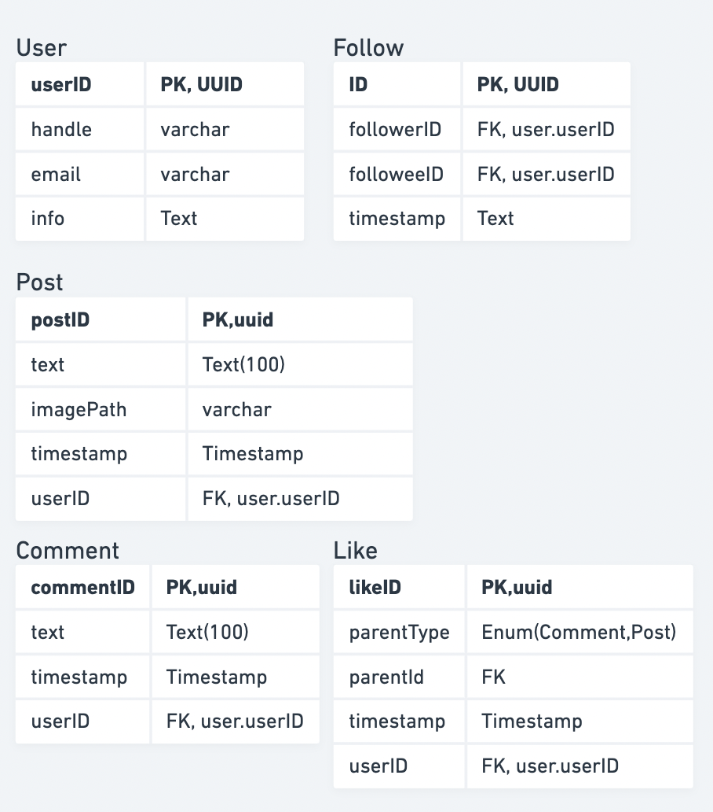
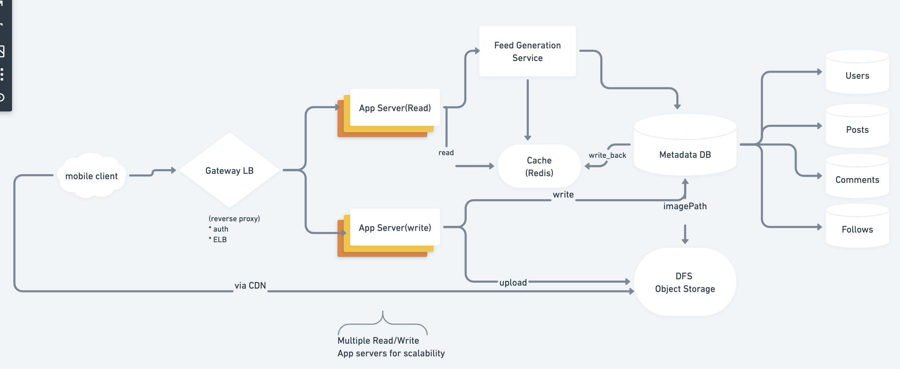
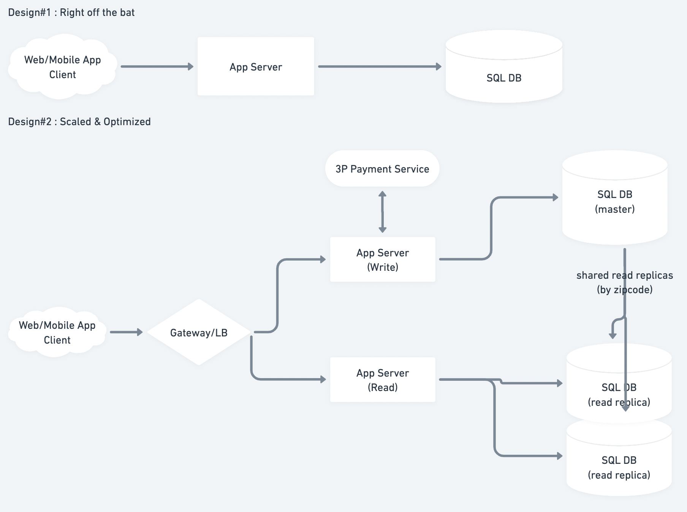
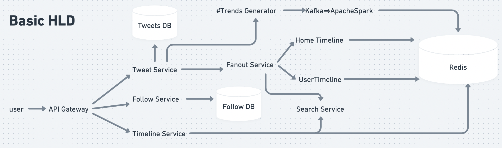
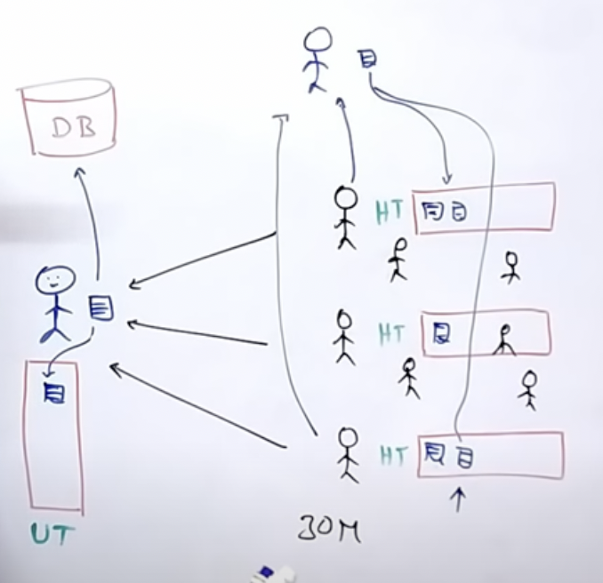
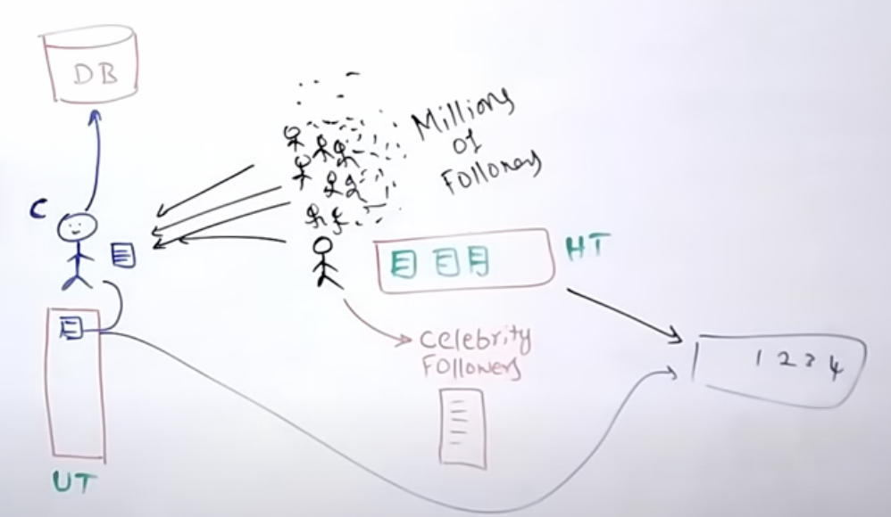

# HLD:Questions

## 0.Template

```text
#1. Requirement Gathering ======================================
        1.1 Functional Requirements
        1.2 NonFunctional Requirements - Usage Patterns(read heavy/CAP tradeoffs)
        1.3 Out of Scope
#2. Back-of-the-envelope estimation ============================
        2.1 Scale of System
        2.2 Storage size estimation
        2.3 Bandwidth esitmation(read+write)
#3. APIs =======================================================
        GET  /name/:id      Req:{}, Res:{}
        POST /name/:id      Req:{} 
#4. Models:Classes, DB Schema & ER diagrams=====================
        * Tables
        
        * DBs & choice(NoSQL/SQL)
#5. Draw 'Basic HLD'=============================================
#6. EVOLVE & 'Draw Detailed HLD' with the discussion on each comp =====
#7. Walk down flow of every action =============================
#7. Identifying and resolving bottlenecks ======================

```

#### \#1. Requirement Gathering ======================================

#### 1.1 Functional Requirements

* 
#### 1.2 NonFunctional Requirements - Usage Patterns\(read heavy/CAP tradeoffs\)

* 
#### 1.3 Out of Scope

* 
#### \#2. Back-of-the-envelope estimation ============================

#### 2.1 Scale of System

* 
#### 2.2 Storage size estimation

* 
#### 2.3 Bandwidth estimation\(read+write\)

* 
#### \#3. APIs =======================================================

* 
#### \#4. Models:Classes, DB Schema & ER diagrams=====================

#### 4.1 Tables Schemas 

* 
#### 4.2 DBs choices\(NoSQL/SQL\)

* 
#### \#5. Draw 'Basic HLD'=============================================

#### \#6. Detailed HLD ================================================

## 1.Instagram

* Whimiscal [Board Link](https://whimsical.com/instagram-TofiB1JrEPSiGg9tHkXTgN)



```text
#1. Requirement Gathering ======================================
        
        * Functional Requirements:
                1. Users can create account
                2. Users can make posts(photos/text)
                3. Users can follow other users
                4. Users can like+comment on others/self' posts
                        *[?] Comment on a comment? => how many recursion levels(1?)
                        *[?] like a comment?  
                5. Timeline of all those whom user follow
        
        * Non-functional Requirements:
                1. Service is hightly available
                2. The acceptable latency of the system is 200ms for News Feed generation.
                3. Consistency can take a hit (in the interest of availability), 
                        if a user doesn’t see a photo for a while; it should be fine.
                4. The system should be highly reliable; any uploaded photo or video should never be lost.
        
        * Out of Scope:
                * Notifications?
                        * Push notifications => normal user
                        * Celebrity ===> PULL Notifications  
                * Adding tags to photos
                * searching photos on tags
                * commenting on photos
                * tagging users to photos
                * follow recommendation
        
        
#2. Back-of-the-envelope estimation ============================
        2.1 Scale of System
                * Total Userbase    : 500M
                * Daily Active Users: 1M
                * 2 new photos per user day => 2M new photos per day
        
        2.2 Storage size estimation
                * size of 1 photo = 5MB
                 => Space required per day : 2M*5MB  = 10 TB
                 => Total space required for 10 years = (10 TB )(365)(10) = 36.5 PB
                                                                          ~ 40 PB (accounting dec in camera price)
                
        2.3 CAP Tradeoffs
                * System is read heavy
                * Users can upload as many photos as they want 
                        => Storage management is crucial
                * Low latency is expected while viewing photos
                * Data should be 100% reliable. 
                        If a user uploads a photo, the system will guarantee that it will never be lost.


#3. APIs =======================================================
        1. POST /user/:id :: {userData}      
        2. GET /user/:id 
        3. POST /follow/:followeeID
        4. POST /like/:postID
        5. POST /comment/:parentID
        6. GET  /getFeed
                * Feed Generation Service PRECOMPUTES user's feed "hourly" & stores in cache
                        * Based On:
                        * GET /getUsersFollowedBuy/:userID    => set<userID> 
                        * then-> GET /getPostsByUser/:userID  => set<postID> # N-latest posts by each
        
        
#4. Models : Defining Classes & ER Diagrams======================
        1. User
        2. Post
                * postID(PK,UUID)
                * text
                * imangeUrl
                * timestamp
                * userId
        3. Like
                * likeId(PK, UUID)
                * parentId (could be postId or commentId)
                * parentType (comment/post)
                * userId
                * timestamp
        4. Comment
                * commentID(PK, uuid)
                * text
                * timestamp
                * userId
        5. Follow
                * followerID
                * followeeID
                * timestamp
#5. Draw Basic HLD =============================================
#6. EVOLVE HLD to scale & indepth discussion of components =====
#7. Identifying and resolving bottlenecks ======================
```



## 2. Parking Lot

* Whimsical Board: [link](https://whimsical.com/parking-lot-9Jq2YZsmfcmUpRbkSgFSr7)
* Code: `/Users/aayush/Sandbox/llds/ParkingLot`

```text
#1. Requirement Gathering ======================================
        1.1 Functional Requirements
                * Reserve a parking spot
                * Receive a ticket/receipt
                * Make payment
                * 3 Types of parking spots: Compact, Regular, large
                * Flat pricing for each spot, per hour 
        1.2 NonFunctional Requirements 
                * High consistency (no 2 people should reserve same spot)
                        * Go for Strong Consistency (rather than Eventual Consitency)
                        * Hence RDBMS (ACID transactions)
                * Reads >>> Writes
        1.3 Out of Scope
                * In-house payment system
#2. Back-of-the-envelope estimation ============================
        2.1 Scale of System
                * 10 floors per garage, 200 spots per floors => 2000 spots
                        * => Not applicable for big data
        2.2 Storage size estimation
#3. APIs =======================================================
        3.1 External Endpoints:
                * POST /create_account
                        * Params: email, pwd(hashed), name, (3rd party login)
                * POST /reserve
                        * Params: garage_id, start_time, end_time
                        * Returns: reservation_id, spot_id
                * /payment => 3-rd party
                        * Params: reservation_id
                        * [?] to be called internally by /reserve
                * POST /cancel
                        * Params: reservation_id
        3.2 Internal Endpoints:
                * /calculate_payment/:reservation_id
                * /check_free_spots
                        * Has logic if smaller vehicles can fit into one large spot
                * /allocate_spot
                        * Params: garage_id, vehicle_type, time

#4. Models : Classes, DB Schema & ER diagrams=====================
        * Reservations
                * id : PK, serial
                * garage_id: FK, int
                * spot_id: FK, int
                * start: int
                * end: int
                * paid: boolean
        * Garage
                * id: PK, serial
                * zipcode: varchar
                * rate_compact: decimal
                * rate_regular: decimal
                * rate_large: decimal
        * Spots
                * id: PK, serial
                * garage_id: FK, int
                * vehicle_type: ENUM
                * status: ENUM
        * Users
                * id: PK, serial
                * email: varchar
                * password: varchar(NOTE: this is probably SHA-256 hashed)
                * name: varchar
        * Vehicles
                * id: PK, serial
                * user_id: FK, int
                * license: varchar
                * vehicle_type: ENUM

#5. Draw Basic HLD =============================================
#6. EVOLVE HLD to scale & indepth discussion of components =====
#7. Walk down flow of every action =============================
#7. Identifying and resolving bottlenecks ======================
```



## 3. TinyURL

* Whimsical board: [link](https://whimsical.com/tinyurl-XRrbRGZFccA2bhgqDBsRGp)
* Amazing similar read: HN: [How does Google Authenticator work?](https://prezu.ca/post/2021-07-30-totp-1/) 🤯

```text
#1. Requirement Gathering ======================================
        1.1 Functional Requirements
                * customer Login
                * Given a URL; generte a shorter & unique alias of it: www.short.ly/abc123
                        * [?] length of short url
                * getLongUrl(short_url)
                * Expiry/TTL for each short URL
        1.2 NonFunctional Requirements - Usage Patterns(read heavy/CAP tradeoffs)
                * High Availability (for reads to work)
                * High consistency (to avoid duplicate writes)
                * Short ULR should be unique
        1.3 Out of Scope
                * customized short url
                * analytics
                * API support

#2. Back-of-the-envelope estimation ============================

        2.1 Scale of System
                * New URLs per month(write) = 500 M
                * QPS = 500M/(30*24*60*60) = 200 URLS write per second
                * Read:Write = 100:1
                        => #urls read per month = 500M*100 = 50B
        2.2 Storage size estimation
                * store all ursl for 5 years
                        * => Total urls stored in 5 year = 500M*5*12 = 30B
                * size of single stored obj = 500bit
                        * => total storage reqd = 30B * 500 bit = 15 TB
                * CACHING:
                        * assume 80-20 rule:
                                * i.e. 20% of URLs generate 80% of traffic
                                * cache these 20% hot URLs
                                * cache size per second = 20K*(500bit) = 10MB
                                * => cache size per day = 10MB*24*3600 = 100GB
        2.3 Bandwidht Estimate
                * Incoming(write) req = 200 * 500 bytes = 100 KB/s
                * Outgoing(read) req  = 20K * 500 bytes = 10 MB/s 
                
#3. APIs =======================================================
        * createURL(api_dev_key, original_url, custom_alias=None, user_id=None, expire_date=None)
                * returns short URL string
        * getLongURL(api_dev_key, short_url,user_id) 
                * returns original LONG url string
        * deleteURL(api_dev_key, short_url)
        
        * NOTE: how to prevent abuse: 
                To prevent abuse, we can limit users via their api_dev_key
                
#4. Models:Classes, DB Schema & ER diagrams=====================
        * URL
                * short_url : PK, varchar
                * original_url : varchar
                * createdOn : datetime
                * expiresOn : datetime
                * createdBy : user_id, FK
        * User
                * user_id : PK, varchar
                * name: varchar
                * email: varchar
                * password: varchar (hashed)
                * createdOn : datetime
                * last_login: datetime
                
#5. Draw Basic HLD =============================================

* Encoding Algos
        1. base36 ([a-z ,0-9]) 
        2. base62 ([A-Z, a-z, 0-9]) 
        3. Base64 (if we add ‘+’ and ‘/’)
        4. MD5/ SHA256
* [? ]what should be the length of the short key? 6, 8, or 10 characters?
        * Using base64 encoding, a 6 letters long key would result in 64^6 = ~68.7 billion possible strings
        * Using base64 encoding, an 8 letters long key would result in 64^8 = ~281 trillion possible strings
        * ASSUME(len = 6) With 68.7B unique strings, let’s assume six letter keys would suffice for our system.

* MD5 algorithm as our hash function, it’ll produce a 128-bit hash value.
* After base64 encoding, we’ll get a string having more than 21 characters 
        *(since each base64 character encodes 6 bits of the hash value). 
* Now we only have space for 8 characters per short key, how will we choose our key then? 
        * We can take the first 6 (or 8) letters for the key. This could result in key duplication, to resolve that, we can choose some other characters out of the encoding string or swap some characters.


# How to avoid duplicate entries(by multiple server instances)
        1. Keep generating urls until its unique
        2. Append a unique key to url before encoding it
                * Unique key could be:
                        1. UserID (if exists)
                        2. increasing Counter per machine
        2.1 ISSUE: how do you manage counters on individual machine: overflow/machine failure/addition
                * => Use zookeeper
                        * a centralized service for providing configuration information, naming, synchronization and group services over large clusters in distributed systems. 
                        * The goal is to make these systems easier to manage with improved, more reliable propagation of changes
                        
# Cleaup Util        
```


## 4. BookMyShow

* Whimisical Board [link](https://whimsical.com/bookmyshow-SiSmppUMB3mrGzyr8YFyY5)



```python
# 1. Requirement Gathering ======================================
        1.1 Functional Requirements
            
            * Other sevices(like Paytm) can also book seats in same hall
            * Show multiple cities
            * Each theater can have multiple halls
            * Each hall can run 1 movie at 1 time
            * Movies will have multiple shows
            * Customers can search movie by title, language, genre, release date, city.
                => Redirect search reqs to Elastic Search
                * It also works as Analytics Engine
            * Customers can see the theaters as per their filtered search
            * Customers can see seating arrangement of halls & select any city they want
            * Customers can see booked/free tickets
            * Payments - 3P
            * Show movie info
            * Payments - 3P
            * Ensure No two customers can reserve the same seat.

        1.2 NonFunctional Requirements - Usage Patterns(read heavy/CAP tradeoffs)
            
            * Highly Concurrent
            
        1.3 Out of Scope

            * Moive suggestions
            * Give Reviews, Ratings
            * Send ticket my sms/whatsapp/mail
            * Add discount coupon during payment
# 2. Back-of-the-envelope estimation ============================
        2.1 Scale of System
        2.2 Storage size estimation
# 3. APIs =======================================================
# 4. Models:Classes, DB Schema & ER diagrams=====================

# Notes: ==================================================== 

* Lock mechanism on seat booking:
    * If he doesn’t book within 10 min, release the seat.

* For Search Queries:
    => Redirect search reqs to Elastic Search
    * It also works as Analytics Engine

* For caching use: Redis or memcached
    * Redis is better choice as its distributed & persistent

* Choice of DB: 
    => use both RDBMS + NoSQL
    * RDMBS: store ACID/static data:
        * movie halls
        * seats
        * cities
        * userInfo
        * => Sharding
        * => Master/Slave for Read/Writes
    * NoSQL : 
        below data is Big data i.e. too much for RDBMS to digest
        so use NoSQL for it
        * movie related info-cast/story/reviews etc
        * => Geo-distributed backups

* Use Kafka queues to send tickets on mail/sms/generate pdfs in ASYNC

* For Recommendation system:
    * Dump all data on HDFS
    * Process with Apache Spark
    * Run Hive queries
    * Build ML models & recommend

* For concurrency:

```s
SET TRANSACTION ISOLATION LEVEL SERIALIZABLE;
 
BEGIN TRANSACTION;
 
    -- Suppose we intend to reserve three seats (IDs: 54, 55, 56) for ShowID=99 
    Select * From ShowSeat where ShowID=99 && ShowSeatID in (54, 55, 56) && isReserved=0 
 
    -- if the number of rows returned by the above statement is NOT three, we can return failure to the user.
    update ShowSeat table...
    update Booking table ...
 
COMMIT TRANSACTION;
```
```



```python
from enum import Enum


class BookingStatus(Enum):
    REQUESTED, PENDING, CONFIRMED, CHECKED_IN, CANCELED, ABANDONED = 1, 2, 3, 4, 5, 6


class SeatType(Enum):
    REGULAR, PREMIUM, ACCESSIBLE, SHIPPED, EMERGENCY_EXIT, OTHER = 1, 2, 3, 4, 5, 6


class AccountStatus(Enum):
    ACTIVE, BLOCKED, BANNED, COMPROMISED, ARCHIVED, UNKNOWN = 1, 2, 3, 4, 5, 6


class PaymentStatus(Enum):
    UNPAID, PENDING, COMPLETED, FILLED, DECLINED, CANCELLED, ABANDONED, SETTLING, SETTLED, REFUNDED = 1, 2, 3, 4, 5, 6, 7, 8, 9, 10

#------------------------------------

from abc import ABC

# For simplicity, we are not defining getter and setter functions. The reader can
# assume that all class attributes are private and accessed through their respective
# public getter methods and modified only through their public methods function.


class Account:
    def __init__(self, id, password, status=AccountStatus.Active):
        self.__id = id
        self.__password = password
        self.__status = status

    def reset_password(self):
        None


# from abc import ABC, abstractmethod
class Person(ABC):
    def __init__(self, name, address, email, phone, account):
        self.__name = name
        self.__address = address
        self.__email = email
        self.__phone = phone
        self.__account = account


class Customer(Person):
    def make_booking(self, booking):
        None

    def get_bookings(self):
        None


class Admin(Person):
    def add_movie(self, movie):
        None

    def add_show(self, show):
        None

    def block_user(self, customer):
        None


class FrontDeskOfficer(Person):
    def create_booking(self, booking):
        None


class Guest:
    def register_account(self):
        None

#------------------------------------

from datetime import datetime


class Show:
    def __init__(self, id, played_at, movie, start_time, end_time):
        self.__show_id = id
        self.__created_on = datetime.date.today()
        self.__start_time = start_time
        self.__end_time = end_time
        self.__played_at = played_at
        self.__movie = movie


class Movie:
    def __init__(self, title, description, duration_in_mins, language, release_date, country, genre, added_by):
        self.__title = title
        self.__description = description
        self.__duration_in_mins = duration_in_mins
        self.__language = language
        self.__release_date = release_date
        self.__country = country
        self.__genre = genre
        self.__movie_added_by = added_by

        self.__shows = []

    def get_shows(self):
        None
#----------------------------

class Address:
    def __init__(self, street, city, state, zip_code, country):
        self.__street_address = street
        self.__city = city
        self.__state = state
        self.__zip_code = zip_code
        self.__country = country
        

class City:
    def __init__(self, name, state, zip_code):
        self.__name = name
        self.__state = state
        self.__zip_code = zip_code


class Cinema:
    def __init__(self, name, total_cinema_halls, address, halls):
        self.__name = name
        self.__total_cinema_halls = total_cinema_halls
        self.__location = address

        self.__halls = halls


class CinemaHall:
    def __init__(self, name, total_seats, seats, shows):
        self.__name = name
        self.__total_seats = total_seats

        self.__seats = seats
        self.__shows = shows


class CinemaHallSeat:
    def __init__(self, id, seat_type):
        self.__hall_seat_id = id
        self.__seat_type = seat_type

#------------------------------------

class Booking:
    def __init__(self, booking_number, number_of_seats, status, show, show_seats, payment):
        self.__booking_number = booking_number
        self.__number_of_seats = number_of_seats
        self.__created_on = datetime.date.today()
        self.__status = status
        self.__show = show
        self.__seats = show_seats
        self.__payment = payment

    def make_payment(self, payment):
        None

    def cancel(self):
        None

    def assign_seats(self, seats):
        None


class ShowSeat(CinemaHallSeat):
    def __init__(self, id, is_reserved, price):
        self.__show_seat_id = id
        self.__is_reserved = is_reserved
        self.__price = price


class Payment:
    def __init__(self, amount, transaction_id, payment_status):
        self.__amount = amount
        self.__created_on = datetime.date.today()
        self.__transaction_id = transaction_id
        self.__status = payment_status
#--------------------------------------
from abc import ABC

class Search(ABC):
    def search_by_title(self, title):
        None

    def search_by_language(self, language):
        None

    def search_by_genre(self, genre):
        None

    def search_by_release_date(self, rel_date):
        None

    def search_by_city(self, city_name):
        None


class Catalog(Search):
    def __init__(self):
        self.__movie_titles = {}
        self.__movie_languages = {}
        self.__movie_genres = {}
        self.__movie_release_dates = {}
        self.__movie_cities = {}

        def search_by_title(self, title):
            return self.__movie_titles.get(title)

        def search_by_language(self, language):
            return self.__movie_languages.get(language)

        # ...

        def search_by_city(self, city_name):
            return self.__movie_cities.get(city_name)
```



```python
global f
f = 0
 
#this t_movie function is used to select movie name
def t_movie():
    global f
    f = f+1
    print("which movie do you want to watch?")
    print("1,movie 1 ")
    print("2,movie 2 ")
    print("3,movie 3")
    print("4,back")
    movie = int(input("choose your movie: "))
    if movie == 4:
      # in this it goes to center function and from center it goes to movie function and it comes back here and then go to theater
      center()
      theater()
      return 0
    if f == 1:
      theater()
 
# this theater function used to select screen
def theater():
    print("which screen do you want to watch movie: ")
    print("1,SCREEN 1")
    print("2,SCREEN 2")
    print("3,SCREEN 3")
    a = int(input("choose your screen: "))
    ticket = int(input("number of ticket do you want?: "))
    timing(a)
 
# this timing function used to select timing for movie
def timing(a):
    time1 = {
        "1": "10.00-1.00",
        "2": "1.10-4.10",
        "3": "4.20-7.20",
        "4": "7.30-10.30"
    }
    time2 = {
        "1": "10.15-1.15",
        "2": "1.25-4.25",
        "3": "4.35-7.35",
        "4": "7.45-10.45"
    }
    time3 = {
        "1": "10.30-1.30",
        "2": "1.40-4.40",
        "3": "4.50-7.50",
        "4": "8.00-10.45"
    }
    if a == 1:
        print("choose your time:")
        print(time1)
        t = input("select your time:")
        x = time1[t]
        print("successfull!, enjoy movie at "+x)
    elif a == 2:
        print("choose your time:")
        print(time2)
        t = input("select your time:")
        x = time2[t]
        print("successfull!, enjoy movie at "+x)
    elif a == 3:
        print("choose your time:")
        print(time3)
        t = input("select your time:")
        x = time3[t]
        print("successfull!, enjoy movie at "+x)
    return 0
 
 
def movie(theater):
    if theater == 1:
        t_movie()
    elif theater == 2:
        t_movie()
    elif theater == 3:
        t_movie()
    elif theater == 4:
        city()
    else:
        print("wrong choice")
 
 
def center():
    print("which theater do you wish to see movie? ")
    print("1,Inox")
    print("2,Icon")
    print("3,pvp")
    print("4,back")
    a = int(input("choose your option: "))
    movie(a)
    return 0
 
# this function is used to select city
def city():
    print("Hi welcome to movie ticket booking: ")
    print("where you want to watch movie?:")
    print("1,city 1")
    print("2,city 2 ")
    print("3,city 3 ")
    place = int(input("choose your option: "))
    if place == 1:
      center()
    elif place == 2:
      center()
    elif place == 3:
      center()
    else:
      print("wrong choice")
 
 
city() # it calls the function city
```




## 4. Netflix/Youtube

* Whimsical Board [link](https://whimsical.com/netflix-FeHCqLHW73v8wVuAD5r8T4)
* Source: [article+video](https://www.youtube.com/watch?v=psQzyFfsUGU&ab_channel=TechDummiesNarendraL)

```text
#1. Requirement Gathering ======================================

        1.1 Functional Requirements
                * upload videos.
                * iew videos.
                * perform searches based on video titles.
                * record stats of videos, e.g., likes/dislikes, total number of views, etc.
                * add and view comments on videos.
                
        1.2 NonFunctional Requirements 
                * Highly reliable, no uploaded video should be lost
                * Service should be highly available
                * Consistency can take a hit
                * Real time UX; no lag 
                
        1.3 Out of Scope
                * Video recommendation
                * most popular videos
                * channels
                * subscriptions
                * watch later
                * favorites
                
#2. Back-of-the-envelope estimation ============================
        2.1 Scale of System
                * Total users: 5B
                * Daily active users: 1 B
                * 1 User views 5 videos per day
                        => total_views_per_second = 1M*5/(24*2600) = 60K videos/sec
                * Ratio upload:view = 500:1
                        => total_uploads_per_second = 120 videos/sec 
        
        2.2 Storage size estimation
                * size of 1 minute video(including all formats) = 50MB
                        => upload_size_per_day = 50MB*120*3600*24 = 500TB
                
#3. APIs =======================================================
        * uploadVideo(api_dev_key, video_title, vide_description, tags[], category_id, default_language, recording_details, video_contents)
                => Returns HTTP 202(request accepted)
                        -> from Kafka/queue
                * Once video is uploaded; user will get an email
        * searchVideo(api_dev_key, search_query, user_location, maximum_videos_to_return, page_token)
                => Returns JSON of videos_list:
                         * video title
                         * a thumbnail
                         * video creation date
                         * view count
                         
        * streamVideo(api_dev_key, video_id, offset, codec, resolution)
                => Returns A media stream (a video chunk) from the given offset
#4. Models:Classes, DB Schema & ER diagrams=====================
#5. Draw Basic HLD =============================================


#6. EVOLVE HLD to scale & indepth discussion of components =====

```

#### Notes on some components:

* **Netflix's Cloud:**
  * Netflix operates in two clouds: **AWS and Open Connect.**
  * Both clouds must work together seamlessly to deliver endless hours of customer-pleasing video.
  * All video related things are handled by **Open Connect.**
  * Anything that doesn’t involve serving video is handled in **AWS**
    * login/billing/search/recommendation

1. **Client**
   * lots of platforms
   * mobile
   * webapp
   * tv
   * xbox
   * =&gt; built using **ReactJS** - fast as **virtual DOM**
2. **CDN** =&gt; **OpenConnect:**
   * Netflix's own CDN
   * they've placed lots of servers in every part of world- to play videos better
   * Region-wise movie collection: 
     * Bollywood vs South indian movies
3. ELB : **Amazon's ELB**
   * has 2 tier LB:
   * ELB’s are setup such that load is balanced across **zones** first, then **instances**
4. **New Movie/Video Onboarding Service**\(microservice\)
   * Before this movie is made available to users, Netflix must convert the video into a format that works best for your device. This process is called **transcoding or encoding.**
   * **Transcoding/Encoding**
     * **=&gt;** process that converts a video file from one format to another, to make videos viewable across different platforms and devices.
     * **Why do we need it?** why not just play the original video
       * device compatability resolution
       * internet speed
       * Pricing plan
   * NOTE: Netflix supports 2200 different devices
   * Netflix has 100-1000 versions of each movie
   * After transcoding, each format is **pushed** to all of the **OpenConnect CDNs**\(for users to **start streaming**\)
5. **ZUUL** 
   * intermediary network of servers to filter incoming/outgoing req & responses
   * i.e. req/response sanitation
   * Also used for beta testing / canary testing
6. **Hystrix:**
   * =&gt; Hystrix is a **latency and fault tolerance library** designed to isolate points of access to remote systems, services and 3rd party libraries
   * Advantages:
     * Stop cascading failures i.e. reject the request if it cant be handled
     * Realtime **monitoring** of configurations changes
     * Concurrency aware request caching
     * Automated batching through request collapsing
   * IE. If a micro service is failing then return the default response and wait until it recovers.
7. **Microservices:**
   * How to scale:
     * **Isolation of critical endpoints:** decouple critical microservicess to make them independent
     * **Stateless:** These services are designed such that any service instance can serve any request in a timely fashion and so if a server fails it’s not a big deal. 
     * **In the failure case** requests can be routed to another service instance and we can automatically spin up a new node to replace it.
8. **SSDs for Caching**
   * Storing large amounts of data in volatile memory **\(RAM\) is expensive**. 
   * Modern disk technologies based on [SSD](https://en.wikipedia.org/wiki/Solid-state_drive) are providing **fast access** to data but at a **much lower cost when compared to RAM**. 
   * Hence, we wanted to move part of the data out of memory without sacrificing availability or performance.
   * The cost to store 1 TB of data on SSD is much lower than storing the same amount in RAM.
9. **Databases:**
   1. **SQL \(EC2\)**
      * used for all **ACID** transactions: like Billing
   2. **NoSQL \(Cassandra\) : distributed**
      * user viewing history
      * read &gt;&gt; write =&gt; so Netflix had modified Cassandra
10. **Kafka Analytics**
    * Viewing History
    * UI Activity
    * Analytics
    * Recommendation, ML Models 


## 5. Ketto/Go Fund Me

* Whimsical: [link](https://whimsical.com/ketto-2S14YgGQ5Er7SLUPxdep5g)
* Source: [LC](https://leetcode.com/discuss/interview-question/system-design/1397022/Go-Fund-me-System-design)

```text
#1. Requirement Gathering ======================================
        1.1 Functional Requirements

            * Registered users can create campaigns to fund their cause.
            * Registered users can view a campaign by campaign ID
            * Registered users can collect money against a campaign
            * Registered users could contribute to a campaign based on campaign ID
            * Once a day we flush the collected money into the creator’s account

        1.2 NonFunctional Requirements - Usage Patterns/Tradeoffs

            * Low latency
            * Durability changes made to the campaigns or newly created campaign should not be lost
            * Eventual consistency
            * It is a growing system

        1.3 Out of Scope
            * User registration
            * Analytics
            * Recommendation
            * Search
            * Guest flow

#2. Back-of-the-envelope estimation ============================
        2.1 Scale of System
            * Total Active users: 50M
            * New users added daily: 50K (as 'growing system')
            * CAMPAIGN CREATION:
                1 user creates 5 campaigns => 5*50 => 250M campaigns
            * CAMPAIGN VIEWING:
                5M view capaigns daily => 5M/(24*3600) => 60 cmps/sec
            * => Hence, Load on the system isnt much

        2.2 Storage size estimation
            * SKIPPED (nothing much of storage here)

#3. APIs =======================================================
        * createCampaign(userId, String campaignName, CampaignDetails campaignDetails) 
            → returns campaignId of the created campaign

        * getCampaignDetails(userId, campaignId) 
            → Returns CamapignDetails of the given camapignId

        * pay(userId, CampaignId, PaymentDetails paymentDetails) 
            → return a boolean if the payment was successful or not also updates the total collected amount against the campaign

#4. Models:Classes, DB Schema & ER diagrams=====================
    * SKIPPED

#5. Draw Basic HLD =============================================
    * Campaign Creator Service
    * Campaign Viewer Service

#6. EVOLVE HLD to scale & indepth discussion of components =====
    Add/disucss on these optimisations:
    * Load balancer - which is entry point to our website
    * Gateway -- which would be responsible for filtering requests and authentication and authorization
    * Service discovery --- Would be responsible for providing service end points to internal services and also load balancing internally
    * Caching
    
```


## 6. Twitter

* Whimsical Board [link](https://whimsical.com/twitter-63T4oateDAL6ZdsaJ5LdHT)
* Video [link](https://www.youtube.com/watch?v=wYk0xPP_P_8&ab_channel=TechDummiesNarendraL)

#### \#1. Requirement Gathering =============================================

* **1.1 Functional Requirements**
  * tweet
    * text
    * photo
    * video
  * trends 
    * see all the tending topics/hastags
  * follow others
  * timeline
    * home timeline\(whom user follows\)
    * user timeline\(user history\)
    * search timeline\(all tweets as per searched keyword\)
* **1.2 NonFunctional Requirements** - Usage Patterns\(read heavy/CAP tradeoffs\)
  * Highly available
  * Acceptable latency for timeline generation
  * Consistency can take a hit:
    * if a user doesn’t see a tweet for a while, it should be fine.
    * **Eventual Consistency** 
  * User traffic will be distributed unevenly throughout the day
* **1.3 Out of Scope**
  * replying on tweets
  * tweet notification
  * suggestion - whom to follow
  * user tagging

#### \#2. Back-of-the-envelope estimation =========================================

* **2.1 Scale of System**
  * Daily Active Users\(DAU\) : 200M
  * write: 2 tweets per user per day
    * =&gt; daily writes = 2\*200M = 400M/day
  * read:write = 1000:1
    * =&gt; daily reads = 400B/day
    * system is read-heavy
* **2.2 Storage size estimation**
  * **Text**: 140 chars a tweet
    * 2 bytes to store 1 char \(w/o any compression\)
    * +30 bytes for tweet metadata\(timestamp, location, userID\)
    * =&gt; 400M\*\(280b+30b\) = 120GB/day
  * **photo**: 1 in 5 tweets has a photo
    * size of 1 photo = 200KB
    * =&gt; 400M\*200KB/5 = 400M\*40KB = 16MB\*M = 16TB
  * **video**: 1 in 10 tweets has a video
    * size of 1 video = 2MB
    * =&gt; 400M\*2MB/10 = 80TB
  * **=&gt; Total daily storage reqd** = 120GB + 16TB + 80TB
    * = 96.12 TB/day
    * =&gt; 1.11 GB/sec
* **2.3 Bandwidth estimation**
  * view tweets:
    * **text**:
      * =&gt; text: 28B\*280b = 7840GB/day = **90MB/sec**
    * user see all the **photos** of every tweet
      * =&gt; 28B/5\*200KB = 13GB/s
    * user plays 1 in every 3 **videos** of tweet
      * =&gt; \(28B/10/3\)\*2MB = 22GB/s
    * **=&gt; total** = 35Gb/s

#### \#3. APIs =======================================================

* **tweet**\(api\_dev\_key, tweet\_data, tweet\_location, user\_location, media\_ids\)
  * =&gt; returns tweet url to view
* **search**\(api\_dev\_key, search\_terms, maximum\_results\_to\_return, sort, page\_token\)
  * =&gt; JSON containing information about a list of tweets

#### \#4. Table Schemas & DB Choices=====================

* **Tables:**
  * **User**
    * userID : PK, int
    * name
    * email
    * pwd\(hashed\)
    * 3rd party login OAuth
    * last login
  * **Tweet**
    * tweetID: PK,int
    * userID
    * text
    * createdAt\(ts\)
    * locationCordinates
    * mediaAddress
  * **Follower**
    * followerID : FK
    * followeeID : FK
    * timestamp
* **Relations:**
  * 1-Many in User ---- Tweet
  * 1-Many in User ---- Follower
*  \[?\] Retweets:
  * are to be considered a unique tweet & store in 'Tweet' table itself
* **DB choice:**
  * photos+vidoes =&gt; DFS
    * HDFS/S3
    * can be queued
  * User, Tweet, Follower tables =&gt; NoSQL
    * Distributed NoSQL
    * =&gt; RDBMS, though good for relations here wont be scalable enough
  * Relationship b/w tables: use **key-value DB** i.e. **Redis✅**
    * `<userID> -> [tweetIDs]`
    * `<userID> -> [followerIDs]`

#### \#5. Draw 'Basic HLD'=============================================



#### \#6. EVOLVE & 'Draw Detailed HLD' with the discussion on each comp =====

1.    **How User Timeline is generated?**
   * Go to Redis table\#1 : &lt;userID&gt; -&gt; \[tweetIDs\]
   * SCALING UP: **cache** 
2. **How to generate Home Timeline**
   * **Steps using Join**
     * get all followers of the user
     * get their latest tweets
     * merge, sort & display
   * **SCALING UP:**

   1. ❌Shard/NoSQL/multiple nodes =&gt; wont be as fast as twitter
   2. ✅ use "**Fanout**"

   * **Fanout**
     * Fanout =&gt; when a new tweet is generated; process it & DISTRIBUTE it to user timelines
     * **WORKING**:
       1.  user makes a new tweet
       2. Store it in Tweets table
       3. Push this tweet into his 'User Timeline'
       4. Fan-out this tweet into 'Home Timeline' of ALL his followers
     * Hence; no DB query is required!!!
     * **NOTE**: Do not do this precomputation for **'Passive users'**



    3. **How to handle celebrity tweets?**

* celebrity has MILLIONS of followers
* **WORKING:**

  * **Celebrity side:**
    1. celebrity makes a tweet
    2. Store it in his Tweets table
    3. Push it to his 'User Timeline'
    4. **DO NOT FAN OUT**
  * **Fan Side:**

  1. Every fan has a list of celebirties he follows
  2. When the fan opens his 'Home Timeline':
     * Go to all the celebrities he follows & check their latet tweets
     * =&gt; All these operations are Redis operations =&gt; wont take much time
  3. Store these latest celebrity tweets in a separate sorted list
  4. Show these tweets along with users timeline tweets in his 'Home Timeline'

  * **NOTE**: Do not do this precomputation for **'Passive users'**

  \*\*\*\*



#### 4. **Generate \#Trends**

* How to see if a topic is trending?
  * It has more \#tweets in short span
  * i.e. topic with 1000 tweets in 5 min is a \#TredningTopic
  * But a topic with 10,000 tweets in 1 month is \#NotATrendingTopic
  * Eg.: election result, movie, cricket store, oplymics/game
* **HOW TO GENERATE:**
  * Collect & Realtime process all tweets 
    * Filter out redundant Hashtags \(\#Enjoy, \#Life, \#YOLO, \#FOOD etc\)
    * Policy violation
    * Copy-write violation
  * using **Kafka+Spark** 
  * Store it in Trending Db\(Redis\)

####     5. **Twitter Search Timeline \| Indexing🚀🚀**

* Twitter uses **EarlyBird**
  * =&gt; inverted full text indexing
* **HOW:**
  1. Breakdown/stemming every tweet into **keywords**
  2. Store all these keywords in a DISTRIBUTED BIG TABLE \(mapped with their resp. tweetIDs\)
  3. **Map/Reduce** works here
* **Scaling:**
  * **Sharding** based on keyword / Location
  * **Caching**
  * **Ranking** by popularity

## 7. Whatsapp/FB Messenger

* Whimsical [link](https://whimsical.com/whatsapp-PTxBKeAFpZyHk3WNT2kzpi)
* Video: [link](https://www.youtube.com/watch?v=L7LtmfFYjc4&ab_channel=TechDummiesNarendraL)

#### \#1. Requirement Gathering ======================================

#### 1.1 Functional Requirements

* one-to-one chat
* Send media
* keep track of the online/offline statuses of its users
* support the persistent storage of chat history
* Group Chats
* Push Notifications : to offline users
* End-to-end Encryption

#### 1.2 NonFunctional Requirements - Usage Patterns\(read heavy/CAP tradeoffs\)

* Real time exp with minimum latency
* Highly consistent: same chat history on all their devices
* Target high availability; but can be traded off for consistency

#### 1.3 Out of Scope

* Voice call/video call

#### \#2. Back-of-the-envelope estimation ============================

#### 2.1 Scale of System

* DAU = 500M
* 1 user sends 40 msgs daily
* ==&gt; 20B msgs per day 

#### 2.2 Storage size estimation

* size of 1 msg = 100bytes
  * =&gt; total size  = 20B\*100 byte = 2TB/day
    * =&gt; 5PB for 5 years

#### 2.3 Bandwidth estimation\(read+write\)

* incoming & outgoing data = 2TB/\(24\*3600\) = 25MB/s 

#### \#3. APIs =======================================================

* 
#### \#4. Models:Classes, DB Schema & ER diagrams=====================

#### 4.1 Tables Schemas 

* Users
* Key value: u\_id -&gt; processing\_msgs
* Key value: u\_id -&gt; pending\_msgs
* key value: msgID -&gt; mediaID

#### 4.2 DBs choices\(NoSQL/SQL\)

* RDBMS or NoSQL wont scale this much 
  * we cannot afford to **read/write a row** from the database **every time a user receives/sends** a message
* Instead use: **BigTable/HBase**

#### \#5. Draw 'Basic HLD'=============================================

#### \#6. Detailed HLD ================================================

* Whatsapp is e.g. of **Duplex Connection \(**implemented with **HTTP long polling\)**
  * i.e. connection can start from any client end
  * i.i.e chatting can be initiated from anyone to the other person
  * Other type of connections: **TCP, UDP, Websocket**
* **How sending & receiving of msg takes place:**
  * A wants to send msg to B
  * **WHAT DOESNT WORK:**
    * **Poll Model:** Users can periodically ask the server if there are any new messages for them
      * **issue:** latency
      * **issue:** wastage of resources\(when there's no message\)
  * **WHAT DOES WORK:** 
    * **Push Model**: Users can keep a connection open with the server and can depend upon the server to notify them whenever there are new messages.
  * **@A's end**
    1. clientA sends a msg to clientB
    2. this msg gets stored in phone's local db - **sqlite**
    3. android app sends this msg from db to **App server**
  * **@B's end**
    * **if B is online\(**i.e. is connected to App server**\)**
      * App Server sends this msg to B
    * **elif B is offline\(**i.e. not connected to App server**\)**
      * App server stores this msg in DB
      * As soon as B is online next time; server sends the msg to B
* **How does Messaging Server work:**
  * It makes a **Queue** for all the msgs sent by users
  * It also has a **table** mapping pid to msgs\_lists
  * if B is online; it sends the msg directly
  * if B is offline: it keeps the msg in B's queue -&gt; sends when B's up
  * if B is doesnt have a whatsapp acc: server dumps A's msg in a **separate DB**
* **How does Acknowledgement work? ✔️☑️\| tick, double tick, blue tick**
  * **Single Tick**
    * is sent to clientA when server receives its msg
  * **Double Tick**
    * when server has found a connection to clientB\(see **Duplex above**\); it sends msg to clientB
    * clientB sends ack that it has received the msg
    * server sends ack to A that B has received the msg
  * **Blue Tick**
    * when B reads msg; it sends ack to server
    * server sends ack to A; that ur msg has been read
* **Last Seen**
  * Server keeps on sending **heartbeats** every 5 sec or so
  * and updates last seen value in the table
* **Sending Media**
  * A sends media to server
  * server uploads this media on a CDN
  * and returns the link to A
  * then server shares this link to B; so that it can access that media
* **End to end encryption**
  * A and B exchange their **public keys**
  * every msg sent from A is first encrypted using A's public key
  * upon receiving this msg; B decrypts it with its private key
* **Group chat\(for small group &lt;200\):**
  * the message from User A is copied to each group member’s message sync queue: one for User B and the second for User C. You can think of the message sync queue as an inbox for a recipient. 
  * This design choice is good for small group chat because:
    * it simplifies message sync flow as each client only needs to check its own inbox to get new messages.
    * when the group number is small, storing a copy in each recipient’s inbox is not too expensive.


## 8. Dropbox/Drive \| @CoinBase

* Whimsical: [link](https://whimsical.com/dropbox-Pxo3WmfgEvHq4MXhYeme84)

#### \#1. Requirement Gathering ======================================

#### 1.1 Functional Requirements

* upload/download
* automatic synchronization between devices
* history of updates\(versioning\)
* should support offline editing

#### 1.2 NonFunctional Requirements - Usage Patterns\(read heavy/CAP tradeoffs\)

* Cross device consistency: all the data should be in sync
* ACID-ity is required
* Read == Write

#### 1.3 Out of Scope

* 
#### \#2. Back-of-the-envelope estimation ============================

#### 2.1 Scale of System

* Total users = 500M
* DAU = 100M
* each user connects from 3 different devices
* 1 user has 200 files/photos
  * =&gt; Total files = 100B 
* 10 requests per user per day 
  * =&gt; 100M requests/day
* High write & read

#### 2.2 Storage size estimation

* avg file size = 1MB
  * =&gt; total space reqd = 1MB\*100B = **100 PB**

#### 4.2 DBs choices\(NoSQL/SQL\)

* **Metadata DB:**
  * has to be **ACID** \(for conflict resolve\)
  * =&gt; SQL  

#### \#5. Draw 'Basic HLD'=============================================

#### \#6. Detailed HLD ================================================

* **How versioning works?✅**
  * **OPTION\#1**: keep a separate copy in cloud after every change.
    * **Issue with this approach:** in a 2GB file, even for a single char change; we'll have to keep a full 2GB file in cloud. =&gt; Huge wastage of resources
  * **OPTION\#2:** break down the file into **1000 chunks** \(2MB each\)
    * On first upload: all **1000 chunks** & **1 metadata file** are uploaded to cloud
    * On subsequent changes; lets say only **chunk\#1 & chunk\#10**1 were change; so **only these 2 chunks** & **metadata file** gets uploaded in **version2.0**
    * **Another adv:** the upload script can work in **parallel to upload** each chunk individually.
* **Client:**
  * is configured to keep track of files inside the folder
  * Client Application monitors the workspace folder on the user’s machine and syncs all files/folders in it with the remote Cloud Storage
  * operations for the client:
    1. Upload and download files.
    2. Detect file changes in the workspace folder.
    3. Handle conflict due to offline or concurrent updates.
  * Based on the above considerations, we can divide our client into following **four parts**:
  * **Watcher:**
    * gets **notified** when a **new file is added** to folder
    * Watcher passes this info \(alog with the meta-data of changes\) to **chunker & indexer**
  * **Chunker**
    * breaks down the new file into chunks 
    * calculate **hash of each chunk**
    * uploads all the chunks to **Cloud\(S3\)**
    * **passes** this info to **indexer**:
      * **Url** it got after uploading to S3
      * **hash** of each chunk
  * **Indexer**
    * **receives** this info from **chunker:**
      * **Url** it got after uploading to S3
      * **hash** of each chunk
    * **updates** this info in **internal DB** against that file for which those **hash** belong to
    * **indexer** also passes this info to **sync service** via **messaging queue** for:
      * **conflict resolution\(** updates could happen from multiple **Clients**, no?**\)**
      * store metadata if device is **offline**
* **Sync Service:**
  * sends back the updated info of this file to all the **clients**
  * **Indexer** receives this info & updates corresponding files in the **folder**
  * **=&gt; this is how files remain in sync across all devices ✅** 


## 9. Google Docs 🐽

* Video: [here](https://www.youtube.com/watch?v=2auwirNBvGg&ab_channel=TechDummiesNarendraL)
* Part 2: [here](https://www.youtube.com/watch?v=U2lVmSlDJhg&ab_channel=TechDummiesNarendraL)
  * this video's text in [this article](https://www.linkedin.com/pulse/system-design-google-docs-rahul-arram/)

#### \#6. Detailed HLD ================================================

* **Will Locking work?**
  * **=&gt; NO,** as 100s of people use the doc at the same time
  * =&gt; We've to use a **lock-free design**
* **Optimistic Concurrency Control:**
  * using 
    1. Versioning
    2. Conflict Resolution
* **Sync Strategies**
  1. **Event Passing**
     * character-by-character sync
     * keep track of full file for each user & sync it
     * every change made by user: \(CRUD, font change etc\) has to be sent as **an event** to all the other people who are editing the doc
     * **==&gt; Google doc uses this✅**
  2. **Differential Sync**
     * similar to `git diff`
     * Just keep the diff's of users & keep sending it to all of them to maintain the sync 
     * might be tedious if many people update the same file section
* **Operational Transformation**

## 10. Pastebin/gist

* Code/file snipped sharing service
* whimsical [link](https://whimsical.com/pastebin-4xky1h5bhCG2S9YL7VEB7k)

#### \#1. Requirement Gathering ======================================

#### 1.1 Functional Requirements

* paste \(max file size allowed = 10MB\)
* generate custom URL path for sharing
* snippets expiry \(after 6 months/ customisable?\)
* user login / Anonymous ; to see all his previous snippets

#### 1.2 NonFunctional Requirements - Usage Patterns\(read heavy/CAP tradeoffs\)

* Durability
  * Once you write data; it will always be there
  * irrespective of:
    * High load
    * server crashes
    * DB full
    * DB down
* High availability 
* Low latency
  * user should be able to access the gist from url, as fast as possible

#### 1.3 Out of Scope

* Analytics
* API Support

#### \#2. Back-of-the-envelope estimation ============================

#### 2.1 Scale of System

* **100K** users **create** new snippets daily
  * =&gt; 100K/\(24\*3600\) = **150 writes/sec**
  * **=&gt; 30% buffer ===&gt; 200 reads/sec**
* read:write = 10:1 =&gt; **100K reads**
  * **=&gt;** reads = **1500 reads/sec** 
  * **=&gt; 30%Buffer  ===&gt; 2K reads/sec**

#### 2.2 Storage size estimation

* **worst\_case:** max size of a snippet = 10MB
  * =&gt; 10MB\*100K = **1000GB/day \(worst\_case\)**
  * **=&gt;** 1000GB\*365 = **365 TB/year**
* **avg\_case:** avg. size of snippet = 100KB
  * =&gt; 100KB\*100K = **10 GB/day \(avg\_case\)**

#### \#3. APIs =======================================================

* `addPaste(api_dev_key, paste_data, custom_url=None user_name=None, paste_name=None, expire_date=None)`
  * **Returns:** \(string\)
* `getPaste(api_dev_key, api_paste_key)`
  * Returns JSON blob
* `deletePaste(api_dev_key, api_paste_key)`

#### \#4. Models:Classes, DB Schema & ER diagrams=====================

#### 4.1 Tables Schemas 

* **User**
  * id
  * name
  * createdAt
  * metaData
* **Snippet**
  * id
  * content\(10KB\)
  * s3\_link
  * createdAt
  * expiresAt

#### 4.2 DBs choices\(NoSQL/SQL\)

* **Metadata DB**: SQL or NoSQL \( both are fine\)
  * this has just the reference of snippet
* **Blob/Object DB** : For storing the actual snippets
  * **S3**
* **\[Hybrid Approach\]For better UX:**
  * store small chunk \(10KB\) of snippet in **Metadata DB** as well; 
  * so that user doesnt have to wait for async req of Blob pull

#### \#5. Draw 'Basic HLD'=============================================

#### \#6. Detailed HLD ================================================

* Go **severless/lamda** for APIs!!!
* **Url creator :: Distributed Key Generation Service \(DKGS\)**

  * have a separate Service for this
  * This service has precomputed keys\(stored in **redis\)**; which we can fetch to generate unique url with **minimum SLA**
    * Another approach was; to get row\_id from metadataDB itself & use it in url=&gt; but this will increase SLA
  * Similar technique\(**DKGS\)** is used by **twitter as well!!**
  * **ADDED\_BONUS: sprinkle** some **salt** of userID/fileName etc to make it uniquely hashed 


## 11. Typeahead Suggestion

&gt;&gt;&gt; Use **Trie**

* Whimsical [link](https://whimsical.com/typeahead-Rf18XgXGQ5bFU7wEgEGJds)
* Video [link](https://www.youtube.com/watch?v=xrYTjaK5QVM&t=1s&ab_channel=TechDummiesNarendraL)

#### \#1. Requirement Gathering ======================================

#### 1.1 Functional Requirements

* Response Time \(&lt;100ms\) =&gt; looks like real-time
* Relevance & context of predictions
* Sorted results
* Top **K** results

#### \#2. Back-of-the-envelope estimation ============================

#### 2.1 Scale of System

* Google gets **5B searches** every day:
* **20%** of these searches are **unique**\(yes, there are lots of duplications\)
* we want to index only **top 50% words** \(we can get rid of a lot of less frequently searched queries\)
  * =&gt; will have **100 million unique terms** for which we want to build an **index**

#### 2.2 Storage size estimation

* query consists of **3 words**
* average length of a word is **5 characters**
  * =&gt; this will give us 
* we need 2 bytes to store a character
* total storage we will need = 100M \*\(15\*2byte\) =&gt; **3GB**

#### 2.3 Bandwidth estimation\(read+write\)

* 
#### \#3. APIs =======================================================

* 
#### \#4. Models:Classes, DB Schema & ER diagrams=====================

#### 4.1 Tables Schemas 

* User
* Trending Keywords
* Prefix hash table:
  * prefix
  * `top_k_suggestions`

#### 4.2 DBs choices\(NoSQL/SQL\)

* 
#### \#5. Draw 'Basic HLD'=============================================

#### \#6. Detailed HLD ================================================

* **Relevance/Context:**
  * give rank to each word; based on 
    * how many times user has searched
    * trending keywords
    * NLP based
  * **Precompute** this rank to all the words
* **Search Algo:**
  * Normal Trie implementation:
    * **Complexity: `O(L) + O(N)  + O(klogk)`**
      *  L : length of the prefix typed 
      * N: total number of childnodes under prefix node
      * k: number of **sorted predictions** required by the system
  * **How to make the algo Faster?**
    * **=&gt; Precompute** top K words for each node😎
      * ===&gt; no traversal required
    * **Complexity Now**: **`O(L)`**


* **How to store Trie in DB?**
  * **=&gt;** use **prefix hash table**
* **How to update the Trie?**
  * Updating trie is extremely **resource intensive**
  * Do it **offline**, after certain interval, periodically
  * Employ **Map/Reduce** here


## 12. Elastic Search \| Search Engine Indexing

## 13. OTP Generation

## 14. API Rate Limiter

## 15. Uber Backend

## \#More From Leetcode

