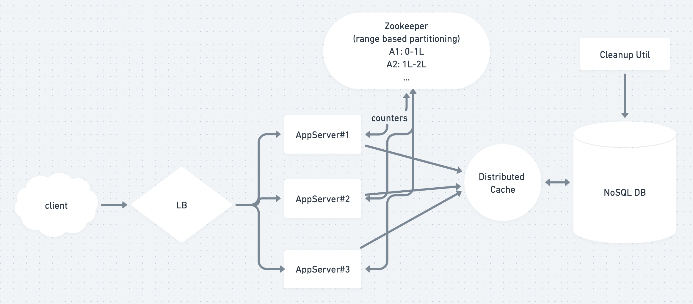

# TinyURL : HLD+LLD

### Resources

* Whimsical board: [link](https://whimsical.com/tinyurl-XRrbRGZFccA2bhgqDBsRGp)
* Amazing similar read: HN: [How does Google Authenticator work?](https://prezu.ca/post/2021-07-30-totp-1/) 🤯

## 1. Requirement Gathering

### 1.1 FRs

* customer Login
* Given a URL; generate a shorter & unique alias of it: `www.short.ly/abc123`&#x20;
  * Short ULR should be unique
* getLongUrl(short\_url)&#x20;
* <mark style="color:yellow;">\[?]</mark> length of short url
  * \=> 6
  * \=> (62^6) = \~ 60\*(10^9) entries => **60B** => <mark style="color:yellow;">good enough as per BOTEC below</mark>
* <mark style="color:yellow;">\[?]</mark> Expiry/TTL for each short URL&#x20;

### 1.2 NFRs

* High Availability (for reads to work)
* High consistency (to avoid duplicate writes)
* Shortened links should not be guessable (not predictable).

### 1.3 Out of Scope

* customised short url
* analytics
* API support

## 2. BOTEC

### 2.1 Scale of System

* New URLs created per month(write) = 500 M
* QPS = 500M/(30\*24\*60\*60) = 200 URLS write per second
* Read:Write = 100:1&#x20;
  * \=> #urls read per month = 500M\*100 = 50B

### 2.2 Storage size estimation

* store all urls for 5 years (then auto cleanup)
  * \=> Total urls stored in 5 year = 500M\*5\*12 = 30B
  * <mark style="color:yellow;">==> Hence short-url len == 6 was good enough (as above)</mark>
* size of single stored obj = 500bit
  * \=> total storage reqd = 30B \* 500 bit = 15 TB
* CACHING:
  * assume 80-20 rule:
    * i.e. 20% of URLs generate 80% of traffic
    * cache these 20% hot URLs
    * cache size per second = 20K\*(500bit) = 10MB
      * \=> cache size per day = 10MB\_24\_3600 = 100GB

### 2.3 Bandwidth Estimate

* Incoming(write) req = 200 \* 500 bytes = 100 KB/s
* Outgoing(read) req = 20K \* 500 bytes = 10 MB/s

## 3. APIs

* `createURL(api_dev_key, original_url, custom_alias=None, user_id=None, expire_date=None)`
  * returns short URL string
* `getLongURL(api_dev_key, short_url,user_id)`
  * returns original LONG url string
* `deleteURL(api_dev_key, short_url)`
* NOTE: how to prevent abuse: 48 To prevent abuse, we can limit users via their `api_dev_key`
  * <mark style="color:yellow;">**`=>`**</mark><mark style="color:yellow;">** **</mark><mark style="color:yellow;">**SCOPE : Discuss Rate Limiting Algos here**</mark>
    * **Token Bucket | Leaky Bucket | Fixed/Sliding Window link:** [**intra\_link**](../concurrency-questions.md#sysd-heavy-questions)****

## 4. Tables

* URL\_Mapping
  * short\_url : PK, varchar
  * original\_url : varchar
  * createdOn : datetime
  * expiresOn : datetime
  * createdBy : user\_id, FK
* User
  * user\_id : PK, varchar
  * name: varchar
  * email: varchar
  * password: varchar (hashed)
  * createdOn : datetime
  * last\_login: datetime


## 5. DB Choice: SQL(❌)  vs NoSQL (✅)

### 5.1 DB Discussion

#### <mark style="color:yellow;">**-> Discuss Pros & Cons of both: SQL & NoSQL**</mark>

* Our non-functional requirements dictate that the datastore needs to be **highly available, scalable, performant, and durable.** <mark style="color:orange;">=></mark> <mark style="color:orange;"></mark><mark style="color:orange;">**NoSQL**</mark> <mark style="color:orange;"></mark><mark style="color:orange;">DBs are good at this( SQL dbs are bad)</mark>
* Also, the database schema required for our service **does not have any relations** requiring relational databases. <mark style="color:orange;">=> No special benefit with picking SQL</mark>
* Also,(discussed below): we are not relying on URLCount (as salt param while encoding) to be calculated from DB; so <mark style="color:orange;">**no Transactions**</mark> are needed here. We will do it by other logic (zookeeper/etc) <mark style="color:orange;">=> No special benefit with picking SQL</mark>
* \==> ✅ Thus, a **NoSQL database seems to be the best choice for the datastore**.&#x20;

#### <mark style="color:yellow;">**-> Discuss NoSQL Choices: K-V or Document Datastore**</mark>

* Since we are now using a NoSQL database, we have two choices. Either we use a simple [key-value datastore ](https://db-engines.com/en/article/Key-value+Stores)or use an advanced key-value datastore like [document datastore ](https://db-engines.com/en/article/Document+Stores)

### 5.2 Caching Discussion

#### <mark style="color:yellow;">-> Discuss Global Cache ✅ vs. Local Cache ❌</mark> <a href="#31eb" id="31eb"></a>

## 6. Detailed Discussion: Encoding Approaches

* Encoding Algos
  * 1\. base36 (\[a-z ,0-9])
  * 2\. base62 (\[A-Z, a-z, 0-9])
  * 3\. Base64 (if we add ‘+’ and ‘/’)
  * 4\. MD5/ SHA256
* \[?]what should be the length of the short key? 6, 8, or 10 characters?
  * Using base64 encoding, a 6 letters long key would result in 64^6 = \~68.7 billion possible strings
  * Using base64 encoding, an 8 letters long key would result in 64^8 = \~281 trillion possible strings
  * ASSUME(len = 6) With 68.7B unique strings, let’s assume six letter keys would suffice for our system.
* MD5 algorithm as our hash function, it’ll produce a 128-bit hash value.
* After base64 encoding, we’ll get a string having more than 21 characters
  * (since each base64 character encodes 6 bits of the hash value).
* Now we only have space for 8 characters per short key, how will we choose our key then?
* We can take the first 6 (or 8) letters for the key. This could result in key duplication, to resolve that, we can choose some other characters out of the encoding string or swap some characters.

### How to avoid duplicate entries(by multiple server instances)

* **WHAT's the issue?**&#x20;
  *   **=> Our encoding solution fails for these 2 cases:**&#x20;

      1. **If multiple users enter the same URL**, they can get the same shortened URL, which is not acceptable.
      2. What if parts of the URL are URL-encoded? e.g., [http://www.educative.io/distributed.php?id=design](http://www.educative.io/distributed.php?id=design), and [http://www.educative.io/distributed.php%3Fid%3Ddesign](http://www.educative.io/distributed.php%3Fid%3Ddesign) are **identical except for the URL encoding**.

      ****
* **Workaround for the issues:** <mark style="color:yellow;">Discuss the following Approaches</mark>&#x20;

1. **Keep generating new urls** until its unique (too much CPU computation)
2. **Append a unique key to url** before encoding it. This unique key could be:
   1. UserID (if exists)
   2. increasing Counter per machine 90

* <mark style="color:yellow;">**ISSUE with Approach#2.2**</mark> ( adding increasing counter as salt) : how do you manage counters on individual machine: overflow/machine failure/addition
* \=> Use zookeeper
  * a centralized service for providing configuration information, naming, synchronization and group services over large clusters in distributed systems.
  * The goal is to make these systems easier to manage with improved, more reliable propagation of changes

## 7. HLD




## 8. LLD: CODE

* [x] LC: [Encode and Decode TinyURL](https://leetcode.com/problems/encode-and-decode-tinyurl/)



My first solution produces short URLs like `http://tinyurl.com/0`, `http://tinyurl.com/1`, etc, in that order.

```python
class Codec:

    def __init__(self):
        self.urls = []

    def encode(self, longUrl):
        self.urls.append(longUrl)
        return 'http://tinyurl.com/' + str(len(self.urls) - 1)

    def decode(self, shortUrl):
        return self.urls[int(shortUrl.split('/')[-1])]
```

**Disadvantages:**

* If I'm asked to **encode the same long URL several times**, it will get several entries. That wastes codes and memory.
* People can find out how many URLs have already been encoded. Not sure I want them to know.
* People might try to get special numbers by spamming me with repeated requests shortly before their desired number comes up.
* Only using digits means the codes can grow unnecessarily large. Only offers a million codes with length 6 (or smaller). Using six digits or lower or upper case letters would offer (10+26\*2)^6 = 56,800,235,584 codes with length 6.



The following solution doesn't have these problems. It produces short URLs like `http://tinyurl.com/`**`KtLa2U`**, using a **random code of six digits or letters**.

If a long URL is already known, the existing short URL is used and no new entry is generated.

```python
'''
http://tinyurl.com/abcd123 -> “http://www.google.com”
'''
import string,random

class Codec:
    
    alphabet = string.ascii_letters + '0123456789'
    tiny_url_prefix = 'http://tinyurl.com/'
    MAX_LEN = 6

    def __init__(self):
        self.long2short = {}    # 'http://www.google.com' -> 'abc123'
        self.short2long = {}    # 'abc123' -> 'http://www.google.com'

    def encode(self, longUrl):
        
        # so that duplicate longUrls give same hash every time
        while longUrl not in self.long2short.keys():
            hash_val = ''.join(random.choice(Codec.alphabet) for _ in range(Codec.MAX_LEN))
            if hash_val not in self.short2long.keys():  
                self.short2long[hash_val] = longUrl
                self.long2short[longUrl] = hash_val
        
        return Codec.tiny_url_prefix + self.long2short[longUrl]
        
    def decode(self, shortUrl):
        # No key exception : handled
        prefix = shortUrl.split('/')[-1]
        return self.short2long.get(prefix)
    

codec = Codec()
print(codec.encode('http://www.google.com'))

short = codec.encode('http://www.google.com')
print(codec.decode(short))  # http://www.google.com
```

**Guarantees Unique ShortURL:**

* It's possible that a randomly generated code has already been generated before.
* In that case, another random code is generated instead.
* Repeat until we have a code that's not already in use.
* **How long can this take?**
  * Well, even if we get up to using half of the code space, which is a whopping (62^6)/2 = 28,400,117,792 entries, then each code has a 50% chance of not having appeared yet.
  * So the expected/**average number of attempts is 2**, and for example only one in a billion URLs takes more than 30 attempts.
  * And if we ever get to an even larger number of entries and this does become a problem, then we **can just use length 7.** We'd need to anyway, as we'd be running out of available codes.




## 9. Other Key Learnings

### 1. base64 Encoding & Decoding in Python

* Resource#1: [Encoding and Decoding Base64 Strings in Python](https://stackabuse.com/encoding-and-decoding-base64-strings-in-python/)


```python
import base64

# 1. base64 Encoding ==================================
message = "Python is fun"
message_bytes = message.encode('ascii')
base64_bytes = base64.b64encode(message_bytes)
base64_message = base64_bytes.decode('ascii')

print(base64_message)   # 'UHl0aG9uIGlzIGZ1bg=='

# 1. base64 Decoding ==================================

base64_message = 'UHl0aG9uIGlzIGZ1bg=='
base64_bytes = base64_message.encode('ascii')
message_bytes = base64.b64decode(base64_bytes)
message = message_bytes.decode('ascii')

print(message)  # "Python is fun"
```


###
