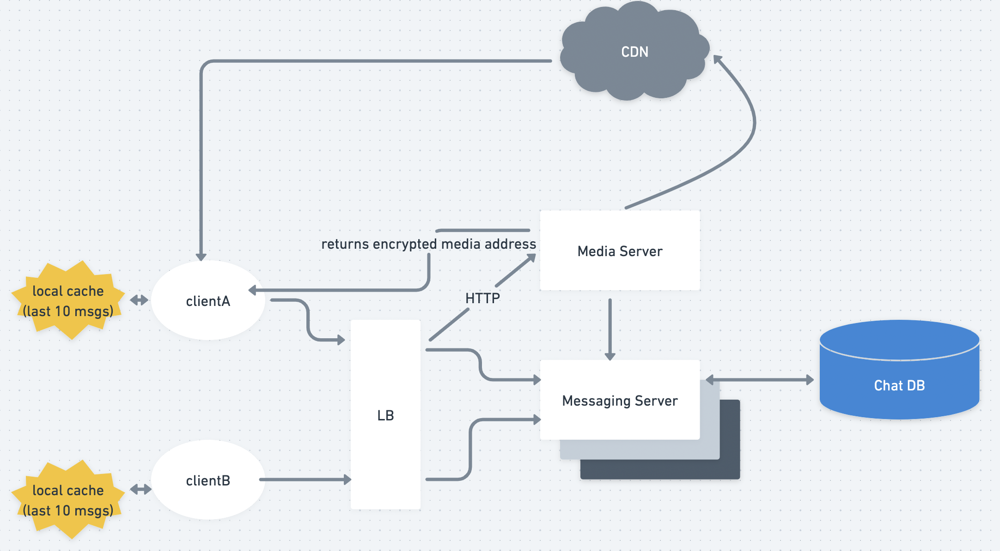

# WhatsApp/FB Messenger

* Whimsical [link](https://whimsical.com/whatsapp-PTxBKeAFpZyHk3WNT2kzpi)
* Video: [link](https://www.youtube.com/watch?v=L7LtmfFYjc4\&ab\_channel=TechDummiesNarendraL)

#### #1. Requirement Gathering ======================================

#### 1.1 Functional Requirements

* one-to-one chat
* Send media
* keep track of the online/**last\_seen** statuses of its users
* support the persistent storage of chat history
* Group Chats
* Push Notifications : to offline users
* End-to-end Encryption

#### 1.2 NonFunctional Requirements - Usage Patterns(read heavy/CAP tradeoffs)

* Real time exp with minimum latency
* Highly consistent: same chat history on all their devices
* Target high availability; but can be traded off for consistency

#### 1.3 Out of Scope

* Voice call/video call

#### #2. Back-of-the-envelope estimation ============================

#### 2.1 Scale of System

* DAU = 500M
* 1 user sends 40 msgs daily
* \==> 20B msgs per day

#### 2.2 Storage size estimation

* size of 1 msg = 100bytes
  * \=> total size = 20B\*100 byte = 2TB/day
    * \=> 5PB for 5 years

#### 2.3 Bandwidth estimation(read+write)

* incoming & outgoing data = 2TB/(24\*3600) = 25MB/s

#### #3. APIs =======================================================

*

#### #4. Models:Classes, DB Schema & ER diagrams=====================

#### 4.1 Tables Schemas

* Users
* Key value: u\_id -> processing\_msgs
* Key value: u\_id -> pending\_msgs
* key value: msgID -> mediaID

#### 4.2 DBs choices(NoSQL/SQL)

* RDBMS or NoSQL wont scale this much
  * we cannot afford to\*\* read/write a row\*\* from the database **every time a user receives/sends** a message
* Instead use: **BigTable/HBase**

#### #5. Draw 'Basic HLD'=============================================

#### #6. Detailed HLD ================================================

* Whatsapp is e.g. of \*\*Duplex Connection (\*\*implemented with **HTTP long polling❌)WebSocket✅**
  * i.e. connection can start from any client end
  * i.i.e chatting can be initiated from anyone to the other person
  * Other type of connections: **TCP, UDP, WebSocket✅**
* **How sending & receiving of msg takes place:**
  * A wants to send msg to B
  * **WHAT DOESNT WORK:**
    * \*\*Poll Model: \*\*Users can periodically ask the server if there are any new messages for them
      * \*\*issue: \*\*latency
      * \*\*issue: \*\*wastage of resources(when there's no message)
  * \*\*WHAT DOES WORK: \*\*
    * **Push Model**: Users can keep a connection open with the server and can depend upon the server to notify them whenever there are new messages.
  * **@A's end**
    1. clientA sends a msg to clientB
    2. this msg gets stored in phone's local db - **sqlite**
    3. android app sends this msg from db to **App server**
  * **@B's end**
    * **if B is online(i.e. is connected to App server)**
      * App Server sends this msg to B
    * **elif B is offline(i.e. not connected to App server)**
      * App server stores this msg in DB
      * As soon as B is online next time; server sends the msg to B
* **How does Messaging Server work:**
  * It makes a \*\*Queue \*\*for all the msgs sent by users
  * It also has a \*\*table \*\*mapping pid to msgs\_lists
  * if B is online; it sends the msg directly
  * if B is offline: it keeps the msg in B's queue -> sends when B's up
  * if B is doesnt have a whatsapp acc: server dumps A's msg in a **separate DB**
* **How does Acknowledgement work? ✔️☑️| tick, double tick, blue tick**
  * **Single Tick**
    * is sent to clientA when server receives its msg
  * **Double Tick**
    * when server has found a connection to clientB(see **Duplex above**); it sends msg to clientB
    * clientB sends ack that it has received the msg
    * server sends ack to A that B has received the msg
  * **Blue Tick**
    * when B reads msg; it sends ack to server
    * server sends ack to A; that ur msg has been read
* **Last Seen**
  * Server keeps on sending \*\*heartbeats \*\*every 5 sec or so
  * and updates last seen value in the table
* **Sending Media**
  * A sends media to server
  * server uploads this media on a CDN
  * and returns the link to A
  * then server shares this link to B; so that it can access that media
* **End to end encryption**
  * A and B exchange their **public keys**
  * every msg sent from A is first encrypted using A's public key
  * upon receiving this msg; B decrypts it with its private key
* **Group chat(for small group <200):**
  * the message from User A is copied to each group member’s message sync queue: one for User B and the second for User C. You can think of the message sync queue as an inbox for a recipient.
  * This design choice is good for small group chat because:
    * it simplifies message sync flow as each client only needs to check its own inbox to get new messages.
    * when the group number is small, storing a copy in each recipient’s inbox is not too expensive.

