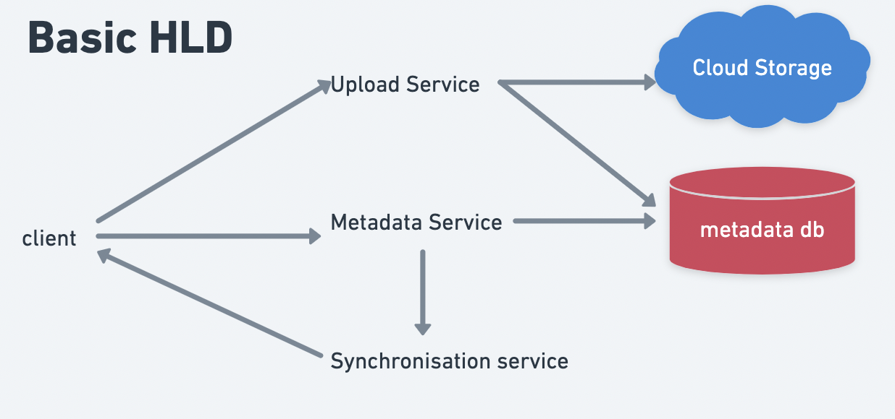
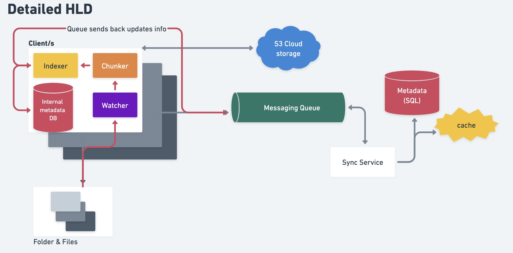

# HLD:Questions

## 0.Template

```
* Multiple Instance of each service
* API Gateway(LB+Proxy)
* Zookeeper
* CDN
* Varnish
* Cache(write back)-Redis
* SQL
    * Read replicas
    * sharding(user_id/location)
* NoSQL
    * Replicas/Distributed
* Kafka/worker
* Stateless Microservices
* Hystrix
* HDFS/S3
* local cache : last 50 msgs
```

```
#1. Requirement Gathering ======================================
        1.1 Functional Requirements
        1.2 NonFunctional Requirements - Usage Patterns(read heavy/CAP tradeoffs)
        1.3 Out of Scope
#2. Back-of-the-envelope estimation ============================
        2.1 Scale of System
        2.2 Storage size estimation
        2.3 Bandwidth esitmation(read+write)
#3. APIs =======================================================
        GET  /name/:id      Req:{}, Res:{}
        POST /name/:id      Req:{} 
#4. Models:Classes, DB Schema & ER diagrams=====================
        * Tables
        
        * DBs & choice(NoSQL/SQL)
#5. Draw 'Basic HLD'=============================================
#6. EVOLVE & 'Draw Detailed HLD' with the discussion on each comp =====
#7. Walk down flow of every action =============================
#7. Identifying and resolving bottlenecks ======================
```

#### #1. Requirement Gathering ======================================

#### 1.1 Functional Requirements

*

#### 1.2 NonFunctional Requirements - Usage Patterns(read heavy/CAP tradeoffs)

*

#### 1.3 Out of Scope

*

#### #2. Back-of-the-envelope estimation ============================

#### 2.1 Scale of System

*

#### 2.2 Storage size estimation

*

#### 2.3 Bandwidth estimation(read+write)

*

#### #3. APIs =======================================================

*

#### #4. Models:Classes, DB Schema & ER diagrams=====================

#### 4.1 Tables Schemas

*

#### 4.2 DBs choices(NoSQL/SQL)

*

#### #5. Draw 'Basic HLD'=============================================

#### #6. Detailed HLD ================================================


## 8. \~Dropbox/Drive | @CoinBase

* Whimsical: [link](https://whimsical.com/dropbox-Pxo3WmfgEvHq4MXhYeme84)

#### #1. Requirement Gathering ======================================

#### 1.1 Functional Requirements

* upload/download
* automatic synchronization between devices
* history of updates(versioning)
* should support offline editing

#### 1.2 NonFunctional Requirements - Usage Patterns(read heavy/CAP tradeoffs)

* Cross device consistency: all the data should be in sync
* ACID-ity is required
* Read == Write

#### 1.3 Out of Scope

*

#### #2. Back-of-the-envelope estimation ============================

#### 2.1 Scale of System

* Total users = 500M
* DAU = 100M
* each user connects from 3 different devices
* 1 user has 200 files/photos
  * \=> Total files = 100B
* 10 requests per user per day
  * \=> 100M requests/day
* High write & read

#### 2.2 Storage size estimation

* avg file size = 1MB
  * \=> total space reqd = 1MB\*100B = **100 PB**

#### 4.2 DBs choices(NoSQL/SQL)

* **Metadata DB:**
  * has to be \*\*ACID \*\*(for conflict resolve)
  * \=> SQL

#### #5. Draw 'Basic HLD'=============================================

#### #6. Detailed HLD ================================================

* **How versioning works?✅**
  * **OPTION#1**: keep a separate copy in cloud after every change.
    * \*\*Issue with this approach: \*\*in a 2GB file, even for a single char change; we'll have to keep a full 2GB file in cloud. => Huge wastage of resources
  * \*\*OPTION#2: \*\*break down the file into **1000 chunks** (2MB each)
    * On first upload: all \*\*1000 chunks \*\*& **1 metadata file** are uploaded to cloud
    * On subsequent changes; lets say only\*\* chunk#1 & chunk#10\*\*1 were change; so **only these 2 chunks** & **metadata file** gets uploaded in **version2.0**
    * \*\*Another adv: \*\*the upload script can work in \*\*parallel to upload \*\*each chunk individually.
* **Client:**
  * is configured to keep track of files inside the folder
  * Client Application monitors the workspace folder on the user’s machine and syncs all files/folders in it with the remote Cloud Storage
  * operations for the client:
    1. Upload and download files.
    2. Detect file changes in the workspace folder.
    3. Handle conflict due to offline or concurrent updates.
  * Based on the above considerations, we can divide our client into following **four parts**:
  * **Watcher:**
    * gets **notified** when a **new file is added** to folder
    * Watcher passes this info (alog with the meta-data of changes) to **chunker & indexer**
  * **Chunker**
    * breaks down the new file into chunks
    * calculate **hash of each chunk**
    * uploads all the chunks to **Cloud(S3)**
    * **passes** this info to **indexer**:
      * **Url** it got after uploading to S3
      * **hash** of each chunk
  * **Indexer**
    * \*\*receives \*\*this info from **chunker:**
      * **Url** it got after uploading to S3
      * **hash** of each chunk
    * \*\*updates \*\*this info in \*\*internal DB \*\*against that file for which those **hash** belong to
    * \*\*indexer \*\*also passes this info to \*\*sync service \*\*via \*\*messaging queue \*\*for:
      * **conflict resolution(** updates could happen from multiple **Clients**, no?**)**
      * store metadata if device is **offline**
* **Sync Service:**
  * sends back the updated info of this file to all the **clients**
  * \*\*Indexer \*\*receives this info & updates corresponding files in the **folder**
  * \*\*=> this is how files remain in sync across all devices ✅ \*\*





## 9. Google Docs 🐽

* Video: [here](https://www.youtube.com/watch?v=2auwirNBvGg\&ab\_channel=TechDummiesNarendraL)
* Part 2: [here](https://www.youtube.com/watch?v=U2lVmSlDJhg\&ab\_channel=TechDummiesNarendraL)
  * this video's text in [this article](https://www.linkedin.com/pulse/system-design-google-docs-rahul-arram/)

#### #6. Detailed HLD ================================================

* **Will Locking work?**
  * \*\*=> NO, \*\*as 100s of people use the doc at the same time
  * \=> We've to use a **lock-free design**
* **Optimistic Concurrency Control:**
  * using
    1. Versioning
    2. Conflict Resolution
* **Sync Strategies**
  1. **Event Passing**
     * character-by-character sync
     * keep track of full file for each user & sync it
     * every change made by user: (CRUD, font change etc) has to be sent as \*\*an event \*\*to all the other people who are editing the doc
     * **==> Google doc uses this✅**
  2. **Differential Sync**
     * similar to `git diff`
     * Just keep the diff's of users & keep sending it to all of them to maintain the sync
     * might be tedious if many people update the same file section
* **Operational Transformation**

## 10. Pastebin/gist

* Code/file snipped sharing service
* whimsical [link](https://whimsical.com/pastebin-4xky1h5bhCG2S9YL7VEB7k)

#### #1. Requirement Gathering ======================================

#### 1.1 Functional Requirements

* paste (max file size allowed = 10MB)
* generate custom URL path for sharing
* snippets expiry (after 6 months/ customisable?)
* user login / Anonymous ; to see all his previous snippets

#### 1.2 NonFunctional Requirements - Usage Patterns(read heavy/CAP tradeoffs)

* Durability
  * Once you write data; it will always be there
  * irrespective of:
    * High load
    * server crashes
    * DB full
    * DB down
* High availability
* Low latency
  * user should be able to access the gist from url, as fast as possible

#### 1.3 Out of Scope

* Analytics
* API Support

#### #2. Back-of-the-envelope estimation ============================

#### 2.1 Scale of System

* **100K** users **create** new snippets daily
  * \=> 100K/(24\*3600) = **150 writes/sec**
  * **=> 30% buffer ===> 200 reads/sec**
* read:write = 10:1 => **100K reads**
  * \*\*=> **reads =** 1500 reads/sec \*\*
  * **=> 30%Buffer ===> 2K reads/sec**

#### 2.2 Storage size estimation

* \*\*worst\_case: \*\*max size of a snippet = 10MB
  * \=> 10MB\*100K = **1000GB/day (worst\_case)**
  * \*\*=> \*\*1000GB\*365 = **365 TB/year**
* **avg\_case:** avg. size of snippet = 100KB
  * \=> 100KB\*100K = **10 GB/day (avg\_case)**

#### #3. APIs =======================================================

* `addPaste(api_dev_key, paste_data, custom_url=None user_name=None, paste_name=None, expire_date=None)`
  * **Returns:** (string)
* `getPaste(api_dev_key, api_paste_key)`
  * Returns JSON blob
* `deletePaste(api_dev_key, api_paste_key)`

#### #4. Models:Classes, DB Schema & ER diagrams=====================

#### 4.1 Tables Schemas

* **User**
  * id
  * name
  * createdAt
  * metaData
* **Snippet**
  * id
  * content(10KB)
  * s3\_link
  * createdAt
  * expiresAt
  * userID

#### 4.2 DBs choices(NoSQL/SQL)

* **Metadata DB**: SQL or NoSQL ( both are fine)
  * this has just the reference of snippet
* \*\*Blob/Object DB \*\*: For storing the actual snippets
  * **S3**
* **\[Hybrid Approach]For better UX:**
  * store small chunk (10KB) of snippet in \*\*Metadata DB \*\*as well;
  * so that user doesnt have to wait for async req of Blob pull

#### #5. Draw 'Basic HLD'=============================================

#### #6. Detailed HLD ================================================

* Go **severless/lamda** for APIs!!!
* **Url creator :: Distributed Key Generation Service (DKGS)**
  * have a separate Service for this
  * This service has precomputed keys(stored in **redis)**; which we can fetch to generate unique url with **minimum SLA**
    * Another approach was; to get row\_id from metadataDB itself & use it in url=> but this will increase SLA
  * Similar technique(\*\*DKGS) \*\*is used by **twitter as well!!**
  * \*\*ADDED\_BONUS: sprinkle \*\*some \*\*salt \*\*of userID/fileName etc to make it uniquely hashed


## 11. Typeahead Suggestion

\>>> Use **Trie**

* Whimsical [link](https://whimsical.com/typeahead-Rf18XgXGQ5bFU7wEgEGJds)
* Video [link](https://www.youtube.com/watch?v=xrYTjaK5QVM\&t=1s\&ab\_channel=TechDummiesNarendraL)

#### #1. Requirement Gathering ======================================

#### 1.1 Functional Requirements

* Response Time (<100ms) => looks like real-time
* Relevance & context of predictions
* Sorted results
* Top **K** results

#### #2. Back-of-the-envelope estimation ============================

#### 2.1 Scale of System

* Google gets **5B searches** every day:
* \*\*20% \*\*of these searches are **unique**(yes, there are lots of duplications)
* we want to index only \*\*top 50% words \*\*(we can get rid of a lot of less frequently searched queries)
  * \=> will have **100 million unique terms** for which we want to build an **index**

#### 2.2 Storage size estimation

* query consists of\*\* 3 words\*\*
* average length of a word is **5 characters**
  * \=> this will give us
* we need 2 bytes to store a character
* total storage we will need = 100M \*(15\*2byte) => **3GB**

#### 2.3 Bandwidth estimation(read+write)

*

#### #3. APIs =======================================================

*

#### #4. Models:Classes, DB Schema & ER diagrams=====================

#### 4.1 Tables Schemas

* User
* Trending Keywords
* Prefix hash table:
  * prefix
  * `top_k_suggestions`

#### 4.2 DBs choices(NoSQL/SQL)

*

#### #5. Draw 'Basic HLD'=============================================

#### #6. Detailed HLD ================================================

* **Relevance/Context:**
  * give rank to each word; based on
    * how many times user has searched
    * trending keywords
    * NLP based
  * \*\*Precompute \*\*this rank to all the words
* **Search Algo:**
  * Normal Trie implementation:
    * **Complexity: `O(L) + O(N) + O(klogk)`**
      * L : length of the prefix typed
      * N: total number of childnodes under prefix node
      * k: number of\*\* sorted predictions\*\* required by the system
  * **How to make the algo Faster?**
    * \*\*=> Precompute \*\*top K words for each node😎
      * \===> no traversal required
    * **Complexity Now**: **`O(L)`**


* **How to store Trie in DB?**
  * **=> use prefix hash table**
* **How to update the Trie?**
  * Updating trie is extremely **resource intensive**
  * Do it **offline**, after certain interval, periodically
  * Employ **Map/Reduce** here


## 12. API Rate Limiter

* \*\*Video: \*\*[link](https://www.youtube.com/watch?v=mhUQe4BKZXs\&ab\_channel=TechDummiesNarendraL)
* **Use Cases:**
  * Security: prevent DDoS attacks
  * Freemium model(e.g. ML APIs)
* **Type of Rate limiting:**
  * number of request allowed per user per hour/day
  * Concurrent(system wide): prevent DDoS attacks
  * location/IP based
* **Algorithms available to do Rate Limiting:**
  1. **Token Bucket**
     * For every user; store his last API hit time & number of tokens left
     * **e.g: ProductHunt API**
     * `user_id -> {last_hit_time, tokens_left}`
     * store this in **key-val DB (Redis)**
     * for each new request; update the values in DB
     * Deny request when tokens\_left = 0
  2. **Leaky Bucket**
     * maintain a **fixed-size-queue**
     * All the incoming req(from all users) are processed via this queue(in \*\*FIFO \*\*order)
     * when the queue size is full; deny the incoming requests
  3. **Fixed Window Counter**
     * only **N** requests can be processed in a time \*\*T \*\*
     * so for every window of **`|t .... t+T| `**; count the incoming reqs;
       * when the **counter reached N**; deny the further reqs in this **time duration**
* **Issues in Distributed API Rate limiter**
  1. **Global Inconsistency : Race condition**
     * if every node of the distributed system has its own LB & count-keeper DB;
     * \=> user can hit multiple LBs(situated in diff regions) & bypass the **global-counter check**
     * **How to solve it?**
     * **#1.**=> use **Sticky sessions**
       * i.e. always redirect User1 to Node1
       * **Still issues:**
         * this approach can increase load on certain LBs(while other LBs are free)
     * \*\*#2: \*\*=> use **Locking**
       * \=> Put a lock on user1 key in central DB, each time its updated
       * So that no 2 simultaneous requests can update the **req\_count for the same user**
       * **Its better than Sticky sessions:**
         * as now we can hit all LBs equally
       * **The Bad:**
         * it increases overall response time of the API
     * **Other solutions:**
       * add some buffer to \*\*rate limit \*\*(allow +5%)
         * **The Bad:** defeats the purpose of keeping rate limit
       * keep syncing data b/w nodes
         * \*\*The BAD: \*\*increases latency


## 13. Search Engine | Indexing | Elastic Search

* 3 Steps of A Search Engine:


**1. Crawling:**

* Google servers keep crawling chunks of internet
* while crawing, it keeps \*\*rank \*\*of each page(using **page\_rank**)
  * if more & reputed sites are directing to a site, it has high rank
  * **Damping factor**(e.g. dp = 0.85) for **random access**
    * i.e. 85% of the time crawler will get move to the directed site
    * 15% of the time crawler will jump to **any random page on** **whole internet**

**2. Inverted Indexing**

* Working(below pic)
* puts all this \*\*metadata \*\*in **metadata\_db**
* **Implemented using B-Trees - `O(logN)`**


**3. Querying/Searching**

* Sanitize, filter, stemm, lemmatize the search query to get **query\_keywords**
* **e.g.: Keyword targeting @flipkart 😎**
* **Approaches:**
  1. **Conjunctive Querying -> AND**
     * Performs\*\* AND operation\*\* on all the\*\* `words in query_keywords` \*\*
     * returns only those docs which have all the keywords present in them
  2. \*\*Disjunctive Querying -> UNION \*\*
     * Takes all the document which have **ANY of the keyword present**
     * then performs **UNION** on these docs
     * Then removes **duplicates** from the result
  3. **Conjunctive with Positioning**
     * The order of words in query is also imp!!!
       * E.g: if query is `men in black`
       * And if you dont consider the order of words; you'll also return results for `black in men`😂
     * HOW does it work?
       1. get results of normal **Conjunctive Querying**
       2. filter only those results which have **relative ordering** in place
          * E.g.
            * QUERY: men-0, in-1, black-2
            * Valid results: men-12, in-100, black-150✅
            * Invalid results: men-100, in-20, black-5❌

## 14. Uber

*   **Location DBs**

    * \*\*\*\*[GauravSen](https://www.youtube.com/watch?v=OcUKFIjhKu0\&ab\_channel=GauravSen)
    * zip codes aren't practical
    * \*\*Fractals: \*\*divide the space into smaller spaces:
      * Store as **B-Tree**

    ***


## 15. OTP Generation

* See\*\* #TinyUrl\*\*

## 16. Distributed Locks

* [Video](https://www.youtube.com/watch?v=v7x75aN9liM\&ab\_channel=TechDummiesNarendraL)
* See \*\*#GoogleDoc \*\*& **#APIRateLimiter**
* Use\*\* LockManager\*\*

## 17. Yelp | TripAdvisor | find Nearest Friend

* **Location DBs**
  * See #**Uber**

## 18. Distributed Logger

#### System Requirements

* High availability
* High consistency: no conflict
* Minimum data loss
* Low latency
* Minimum operation overhead

#### 1.Approach#1 : Log Consolidation

* \*\*How does it work? \*\*
  * In each of the distributed server we, install an agent which will monitor any logs that are written on this server
  * The App writes logs to the defined destination(e.g. logs to console)
  * Then the agent in background picks it and sends it to **centralize server(eg. `splunk`, `logstash`)**


#### 2.Approach#2: Log Streaming

* **How does it work?**
  * All the servers push their logs in Kafka queue
  * Kafka sends these logs to multiple subscribers
  * These subscribers process these logs & write them on a centrailzed place/run analytics
  * \*\*used@Pinterest \*\*(below pic from **Pinterest's** conference)


* **Issues with This Approach (**#2: Log Streaming\*\*)\*\*
  * \*\*DATA LOSS: \*\*when an **Kafka broker fails**; it result in **Data Loss**.
    * \*\*FIX: \*\*
      * pick a kafka leader;
      * this leader keeps track of health of its children brokers
      * leader decides which kafka broker have to choose/remove/rep
  * \*\*OPERATION OVERHEAD: \*\*Have to **reconfigure all the dependent services; when we add/replace a new kafka broker**
    * **FIX**:
      * leader decides which kafka broker have to choose/remove/replace
  * \*\*DaTA DUPLICATION: \*\*multiple copies of message among brokers
    * \*\*FIX: \*\*
      * Use a sanitisation service before writing logs to S3/HDFS


#### #ISSUE with these approaches: `Correlation ID`

* service A runs in server1, it calls service B that runs in server 2 and then another service C that runs in server 3. **How to correlate all the 3 logs for 1 single workflow?**
* **How to fix this?**
  * \=> attach a unique ID(`request_id`or `context_id` ) at **API gateway level** with this request
  * Now this ID will remain same for this log across microservices. Bazinga!


## 19. Slack @coinbase

* [Whimsical](https://whimsical.com/slack-NTe7cDhHvX3AWfF7k9quyw)

#### #1. Requirement Gathering ======================================

#### 1.1 Functional Requirements

* Use should be able to send & receive chat messages from his/her contacts who are also on slack
* Group chat (upto 250 members) ??
* Track messages status: sent/delivered/read ??
  * \=> Slack shows notification if msg was unable to send
* Account registration using mail/phone
* Push Notifications: when the user is offline- send notifications for new msgs
* When the use comes online; he should be able to see all new msgs
* Adding support for media files(img.video.audio)
* E2E encryption

#### 1.2 NonFunctional Requirements - Usage Patterns(read heavy/CAP tradeoffs)

* High availability
* Fault Tolerant
* Consistency
* Scalable
* Minimum latency (real-time chat experience)
* Durability(keep chat history)

#### 1.3 Out of Scope

* Suppor for Slack-web ?
* Analytics/Monitoring

#### #2. Back-of-the-envelope estimation ============================

#### 2.1 Scale of System

* DAU = 500M
* 1 user sends 100 msgs daily
* \==> 50B msgs per day

#### 2.2 Storage size estimation

* size of 1 msg = 100bytes
  * \=> total size = 20B\*100 byte = 2TB/day
    * \=> 5PB for 5 years

#### 2.3 Bandwidth estimation(read+write)

* incoming & outgoing data = 2TB/(24\*3600) = 25MB/s

#### #3. APIs =======================================================

* **1-to-1 Chat**
  * `createAccount(API_key, use_id, name, email...)`
  * `validateAccount(API_key, user_id, validation_code)`
  * `initiateDirectChatSession(API_key, sender_id, receiver_id, handshake_info)`
    * \=> for initial handshake
  * `sendMessage(API_key, session_id, msg_type, msg)`
    * `Returns msg_id`
  * `getMessageStatus(API_key, message_id)`
  * `readNewMessage(API_key,session_id, last_msg_id)`
    * `last_msg_id`to be used as **pointer** to separate b/w read & not-read msgs
* **Group chats**
*
  * `createGrop(API_key, group_id, group_name, `**`admin, [members]`**`)`
  * `addUserToGroup(API_Key, group_id, user_id,admin_id)`
  * `removeUserFromGroup(API_Key, group_id, user_id,admin_id)`
  * `promoteMemberToGroup(API_key,group_id,user_id)`

#### #4. Models:Classes, DB Schema & ER diagrams=====================

#### 4.1 Tables Schemas

* **User**
  * user\_id: PK
  * name
  * email
  * ...
* **Group**
  * groupID: PK
  * name
  * created\_time
  * member\_count
* **GroupMembership**
  * groupID: **PK**
  * userID: **SK(Secondary Key)**
  * creation\_time : datetime
  * user\_type: ADMIN,MEMBER
* **Sessions**
  * session\_id : PK
  * user\_id
  * appserver\_id
  * last\_activity
  * timestamp

#### 4.2 DBs choices(NoSQL/SQL)

* **How to shard GroupMembership table**
  * \*\*Option#1: \*\*Shard by groupID => Called **Local Index**
    * \=> then membership info will be spread across all the shards to which user belongs
  * \*\*Option#2: \*\*Shard by userID(**SK**)=> Called **Global Index**
    * \=> group info will be spread
  * **WHich one to choose:**
    * it seems to me that **creating groups and updating their membership is potentially less frequent** than the ongoing msgs posted into the group chats by users.
    * So the Session and Fanout service benefits **more from a global index on userID**.
    * Users who create/update a group will necessarily have to wait for scatter/gather across partitions but this is less frequent than the msg posts occurring within the group chats.

#### #5. Draw 'Basic HLD'=============================================

### #WebSockets

* **USE CASE: chatting @whatsapp**
* In the beginning; a **Handshake** connection(usually **HTTP**) is established b/w client & server
* After this; the client & server communicate through a **bi-directional long-lived TCP connection**
* **PROS:**
  * bidirecional low latency communication
  * Reduced overhead of HTTP requests
* **CONS:**
  * Clients are responsible for connections
  * Scalability challanges

**Hystrix:**

* \=> Hystrix is a\*\* latency and fault tolerance library\*\* designed to isolate points of access to remote systems, services and 3rd party libraries
* Advantages:
  * Stop cascading failures i.e. reject the request if it cant be handled
  * Realtime **monitoring** of configurations changes
  * Concurrency aware request caching
  * Automated batching through request collapsing
* IE. If a micro service is failing then return the default response and wait until it recovers.

#### 1. Gateway Service

* Responsible for creating \*\*websocket connection \*\*b/w app server & user
* Makes all the API calls to other services as per the user's request

#### 2. Sessions Service

* stores info: which client is connected to which server
* When clientA sends a msg to clientB:
  * clientA sends msg to geteway\_service
  * gateway\_service is pretty dumb(doesnt have inofo on usr's session)
  * gateway\_service passes this req to sessionService
  * session services returns with the details of clientB
  * then gateway service sends that msg to client B
* **+--> Enters WebSockets**

#### 3. UserActivity Service

* takes care of last seen/typing....
* polling/webSockets

#### 4. Group Service

* How does group msging work?
* Fanout sevies asks group srervice for all group data
* then it fans out msgs to all the members
* **DO: batch\_processing /limit the number of users**

#### **5. Someone's typing...**

* typing indicator was triggered on the first keystroke and repeated as more keystrokes occurred.
* If no keystrokes were registered after 10 seconds, the indicator would no longer be displayed. Either you were typing, or you weren’t.
* **If a user stops typing for five seconds, Slack removes the “person is typing” indicator.**
* So when user starts typing update your database and set isTyping true.
* Dont forget to check if isTyping set to true so it will not update every time user presses the key
*   \*\*EVENT is \*\*Implement using a \*\*pub/sub \*\*trigger

    ```
    {
      "isTyping":true,
      "fromDeviceToken": "xxxx",
      "timestamp": 12345
    }
    ```
* \*\*ISSUE: \*\*If user A **connection is lost during typin**g then the status will be always remain true until he resumes the connection. To solve this problem you can have one DateTime field in your firebase object

#### #6. Detailed HLD ================================================


## 20. Stocks Exchange


## 21. Flash Sale/Vaccination Drive/Cowin

#### Src: [amazing Shopify Video](https://www.youtube.com/watch?v=-I4tIudkArY\&ab\_channel=ShopifyEngineering)

#### 1.1 What is the system?

* **Limited availability system:** both in terms of
  1. **quantity**: Number of ordering request is much larger than inventory size. (1 million users competing for 10,000 items/slots)
  2. \*\*time: \*\*Large number of users come to the system at the same time, causing a spike in traffic. (sales starts at 6am and finishs at 6:30am)
* System is checkout-driven; ==> so its \*\*write-heavy \*\*
  * so we **cant** simply just push a **Cache** in front of everything & call it a day
* social-media bashing when/if you fail => **Reputation**

#### 1.2 What are the challenges we're dealing with?

1. **Handle load on read**. Users will constantly **refresh** the page\*\* to check available inventory\*\*. It’s also likely that all users will **request for other similar resource at the same time**, such as account, item description, etc.
2. **Provide high throughput**. There will be many **concurrent read and write** to the limited inventory records, so the **database lock** may result in timeout for some of the requests.
3. **Avoid** inventory from being **oversold or undersold.** how to handle the available inventory number?
   * An item may be oversold if multiple requests reserved the same inventory. A
   * n item may be undersold if the inventory is hold but the process failed and inventory is not released.
   * This happened to some e-commerce website, and usually they will call the customers to **refund**.
4. **Prevent cheating with script**. user could write a script to fire request in a **loop**. so this user may generate many repeated requests

#### #2. Back-of-the-envelope estimation ============================

#### 2.1 Scale of System

*

#### #3. APIs =======================================================

* /catalogue/:item\_id
* /checkout

#### #5. Draw 'Basic HLD'=============================================


### How to scale-up for FlashSales

* \*\*@client side: \*\*
  * **@UI:** Disable submit button once clicked
  * **@server side**: dont allow mulitple reqs with same `item_id `& `user_id`
* \*\*@DB(sql): \*\*
  * have a `serialisable` \*\*isolation level \*\*for the transaction which affects performance.
    * If we do not apply this isolation level, we may end up with phantom read and thought that we still have enough inventory this request, and then we sell more than what we have.
    * To handle this, we can use a **counter with atomicity**. **Redis** will be a good choice for atomic decrement when a request need to be processed.
  * read replicas
  * sharding
* Use Application LB (such as **NGNIX)**, it can be used for:
  * Reverse Proxy
  * Edge LB
  * Request throttling
  * SSL
* **Back Pressure/ Leaky Bucket: ---> to improve UX**
  * Even if you've optimized every query; you cant server all the requests
  * Make the platform handle back-pressure: "Hey wait, I'm at full capacity. Come back later"
  * This\*\* Back Pressure\*\* can be implemented using **Leaky Bucket**.
  * **LOGIC:================================**
    * \*\*Algorithms to Rate Limit the reqs (\*\*taken from #12. API **)**
    *   **Token Bucket❌**

        * For every user; store his last API hit time & number of tokens left
        * **e.g: ProductHunt API**
        * `user_id -> {last_hit_time, tokens_left}`
        * store this in **key-val DB (Redis)**
        * for each new request; update the values in DB
        * Deny request when tokens\_left = 0
        * \*\*Con: \*\*not useful here, as every req is from a new user

        **2. Leaky Bucket ✅**

        * maintain a **fixed-size-queue**
        * All the incoming req(from all users) are processed via this queue(in \*\*FIFO \*\*order)
        * when the queue size is full; deny the incoming requests

        **3. Fixed Window Counter❌**
    * only **N** requests can be processed in a time \*\*T \*\*
    * so for every window of **`|t .... t+T| `**; count the incoming reqs;
      * when the **counter reached N**; deny the further reqs in this **time duration**
      * **Con:** bad UX & data loss
  * **HOW TO IMPLEMENT =============================================**
    * when you cant handle new checkout requests, serve a **Throttle page**, saying-"Hey, we got your checkout; we'll process it soon.Pleas be patient"
    * **STEPS**:
    * user sends a` /checkout` req to LB
    * LB is out of capacity; so it asks for a **throttle page** from server
    * LB caches this throttle page for future requests & serve it to the user
    * this Throttle page has **Javascript** & some sort of **refresh tags**; that constantly **polls the LB in background**-"hey, do you have capacity now?"
    * when the LB has capacity; it would pass the req to App server
    * And the LB places a **cookie** on **user session**, that "hey, dont throttle this req anymore"
    * So to user; it looks like there wasn't any throttle at all.
  * **CON:**
    * if a user comes at min=0; he has to wait for 30 mins
    * if a user comes at min=29; he might get lucky & have to wait just 1 min
    * So overall; it wouldn't improve the user-chaos
    * **How to solve:**
      * add the timestamp(of when user entered into queue) with the cookie
      * each LB will process these reqs in FIFO
      * but since there are multiple LB's; the system won't be fully stateless; but decent enough


## #More From Leetcode
