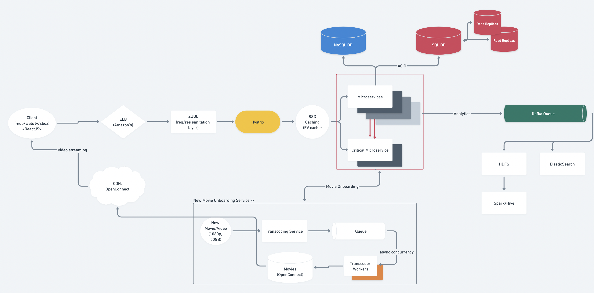

# Netflix | Youtube

### Resources

* Whimsical Board [link](https://whimsical.com/netflix-FeHCqLHW73v8wVuAD5r8T4)
* Source: [article+video](https://www.youtube.com/watch?v=psQzyFfsUGU\&ab\_channel=TechDummiesNarendraL)

## 1. Requirement Gathering

### 1.1 FRs

* upload videos.
* view videos.
* perform searches based on video titles.
* record stats of videos, e.g., likes/dislikes, total number of views, etc.
* add and view comments on videos.

### 1.2 Out of Scope

* Video recommendation
* most popular videos
* channels
* subscriptions
* watch later
* favorites

### 1.3 NFRs

* Highly reliable, no uploaded video should be lost
* Service should be highly available
* Consistency can take a hit
* Real time UX; no lag

## 2. BOTEC

### 2.1 Scale of System

* Total users: 5B
* Daily active users: 1 B
* 1 User views 5 videos per day => total\_views\_per\_second = 1M_5/(24_2600) = 60K videos/sec
* Ratio upload:view = 500:1 => total\_uploads\_per\_second = 120 videos/sec

### 2.2 Storage size estimation

* size of 1 minute video(including all formats) = 50MB => upload\_size\_per\_day = 50MB_120_3600\*24 = 500TB

## 3. APIs

* `uploadVideo(api_dev_key, video_title, vide_description, tags[], category_id, default_language, recording_details, video_contents)`&#x20;
  * \=> Returns HTTP 202(request accepted) -> from Kafka/queue
  * Once video is uploaded; user will get an email
* `searchVideo(api_dev_key, search_query, user_location, maximum_videos_to_return, page_token)`&#x20;
  * \=> Returns JSON of videos\_list:&#x20;
    * video title&#x20;
    * a thumbnail&#x20;
    * video creation date&#x20;
    * view count
* `streamVideo(api_dev_key, video_id, offset, codec, resolution)`&#x20;
  * \=> Returns A media stream (a video chunk) from the given offset

## 4. Tables

* **Video metadata storage - MySql**\
  Videos metadata can be stored in a SQL database. The following information should be stored with each video:
  * VideoID
  * Title
  * Description
  * Size
  * Thumbnail
  * Uploader/User
  * Total number of likes
  * Total number of dislikes
  * Total number of views
* **Comment**<mark style="color:orange;">**( only for Youtube)**</mark>**:** For each video comment, we need to store following information:
  * CommentID
  * VideoID
  * UserID
  * Comment
  * TimeOfCreation
* **User data storage - MySql**
  * UserID, Name, email, address, age, registration details etc.

## 5. DB Choices

### **Hybrid Approach for DB**

1. **SQL (EC2)✅**
   * used for all ACID transactions: like <mark style="color:orange;">**Billing**</mark>
2. **NoSQL (Cassandra) : distributed**
   * user <mark style="color:orange;">**viewing history**</mark>
   * read >> write => so Netflix had modified Cassandra

### **SSDs for Caching**

* Storing large amounts of data in volatile memory **RAM) is expensive**
* Modern disk technologies based on [SSD](https://en.wikipedia.org/wiki/Solid-state\_drive) are providing **fast access** to data but at a **much lower cost when compared to RAM**.
* Hence, we wanted to move part of the data out of memory without sacrificing availability or performance.
* The cost to store 1 TB of data on SSD is much lower than storing the same amount in RAM.

## 6. HLD

####

## 7. Components Details

* **Netflix's Cloud:**
  * Netflix operates in two clouds: **AWS and Open Connect.**
  * Both clouds must work together seamlessly to deliver endless hours of customer-pleasing video.
  * All video related things are handled by **Open Connect.**
  * Anything that doesn’t involve serving video is handled in **AWS**
    * login/billing/search/recommendation

1. **Client**
   * lots of platforms
   * mobile
   * webapp
   * tv
   * xbox
   * \=> built using **ReactJS** - fast as **virtual DOM**
2. **CDN** => **OpenConnect:**
   * Netflix's own CDN
   * they've placed lots of servers in every part of world- to play videos better
   * Region-wise movie collection:
     * Bollywood vs South indian movies
3. ELB : **Amazon's ELB**
   * has 2 tier LB:
   * ELB’s are setup such that load is balanced across **zones** first, then **instances**
4. **New Movie/Video Onboarding Service**(microservice)
   * Before this movie is made available to users, Netflix must convert the video into a format that works best for your device. This process is called\*\* transcoding or encoding.\*\*
   * **Transcoding/Encoding**
     * \*\*=> \*\*process that converts a video file from one format to another, to make videos viewable across different platforms and devices.
     * \*\*Why do we need it? \*\*why not just play the original video
       * device compatability resolution
       * internet speed
       * Pricing plan
   * NOTE: Netflix supports 2200 different devices
   * Netflix has 100-1000 versions of each movie
   * After transcoding, each format is \*\*pushed \*\*to all of the **OpenConnect CDNs**(for users to **start streaming**)
5. **ZUUL**
   * intermediary network of servers to filter incoming/outgoing req & responses
   * i.e. req/response sanitation
   * Also used for beta testing / canary testing
6. **Hystrix:**
   * \=> Hystrix is a\*\* latency and fault tolerance library\*\* designed to isolate points of access to remote systems, services and 3rd party libraries
   * Advantages:
     * Stop cascading failures i.e. reject the request if it cant be handled
     * Realtime **monitoring** of configurations changes
     * Concurrency aware request caching
     * Automated batching through request collapsing
   * IE. If a micro service is failing then return the default response and wait until it recovers.
7. **Microservices:**
   * How to scale:
     * \*\*Isolation of critical endpoints: \*\*decouple critical microservicess to make them independent
     * \*\*Stateless: \*\*These services are designed such that any service instance can serve any request in a timely fashion and so if a server fails it’s not a big deal.
     * \*\*In the failure case \*\*requests can be routed to another service instance and we can automatically spin up a new node to replace it.
8. **Kafka Analytics**
   * Viewing History
   * UI Activity
   * Analytics
   * Recommendation, ML Models

