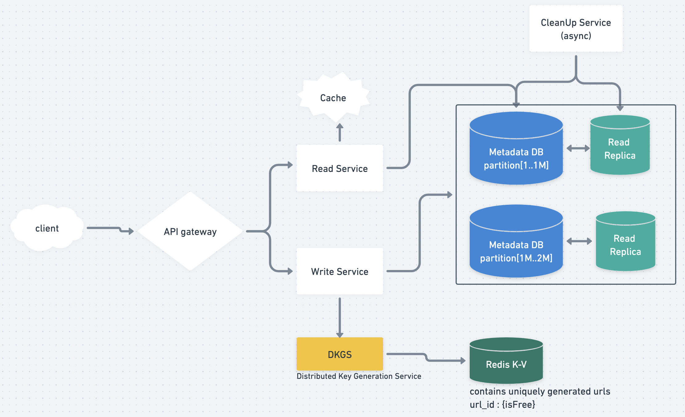

# Pastebin/Gist

* Code/file snipped sharing service
* whimsical [link](https://whimsical.com/pastebin-4xky1h5bhCG2S9YL7VEB7k)

## 1. Requirement Gathering&#x20;

### 1.1 FRs

* paste (max file size allowed = 10MB)
* generate custom URL path for sharing
* snippets expiry (after 6 months/ customisable?)
* user login / Anonymous ; to see all his previous snippets

### 1.2 NFRs

* Durability
  * Once you write data; it will always be there
  * irrespective of:
    * High load
    * server crashes
    * DB full
    * DB down
* High availability
* Low latency
  * user should be able to access the gist from url, as fast as possible

### 1.3 Out of Scope

* Analytics
* API Support

## 2. BOTEC

### 2.1 Scale of System

* **100K** users **create** new snippets daily
  * \=> 100K/(24\*3600) = **150 writes/sec**
  * **=> 30% buffer ===> 200 reads/sec**
* read:write = 10:1 => **100K reads**
  * \*\*=> **reads =** 1500 reads/sec \*\*
  * **=> 30%Buffer ===> 2K reads/sec**

### 2.2 Storage size estimation

* **worst\_case**: max size of a snippet = 10MB
  * \=> 10MB\*100K = **1000GB/day (worst\_case)**
  * \*\*=> \*\*1000GB\*365 = **365 TB/year**
* **avg\_case:** avg. size of snippet = 100KB
  * \=> 100KB\*100K = **10 GB/day (avg\_case)**

## 3. APIs

* `addPaste(api_dev_key, paste_data, custom_url=None user_name=None, paste_name=None, expire_date=None)`
  * **Returns:** (string)
* `getPaste(api_dev_key, api_paste_key)`
  * Returns JSON blob
* `deletePaste(api_dev_key, api_paste_key)`

## 4. Tables

#### 4.1 Tables Schemas

* **User**
  * id
  * name
  * createdAt
  * metaData
* **Snippet**
  * id
  * content(10KB)
  * s3\_link
  * createdAt
  * expiresAt
  * userID

#### 4.2 DBs choices(NoSQL/SQL)

* **Metadata DB**: SQL or NoSQL ( both are fine)
  * this has just the reference of snippet
* **Blob/Object DB**: For storing the actual snippets
  * **=> S3**
* <mark style="color:yellow;">**-> \[Hybrid Approach]For better UX:**</mark>
  * store small chunk (10KB) - to serve as preview/header of snippet in **Metadata DB** as well;
  * so that user doesnt have to wait for async req of Blob pull

## 5. HLD&#x20;

## 6. Further Discussions in Design

* Go **severless/lamda** for APIs!!!
* **Url creator :: Distributed Key Generation Service (DKGS)**
  * have a separate Service for this
  * This service has precomputed keys(stored in **redis)**; which we can fetch to generate unique url with **minimum SLA**
    * Another approach was; to get row\_id from metadataDB itself & use it in url=> but this will increase SLA
  * Similar technique(\*\*DKGS) \*\*is used by **twitter as well!!**
  * <mark style="color:yellow;">ADDED\_BONUS</mark>: sprinkle some salt of userID/fileName etc to make it uniquely hashed
* <mark style="color:yellow;">-> Discuss on Pruning/Cleanup</mark>
* <mark style="color:yellow;">-> Discuss on Data Partitioning and Replication</mark>
* <mark style="color:yellow;">-> Discuss on Distributed Cache</mark>
