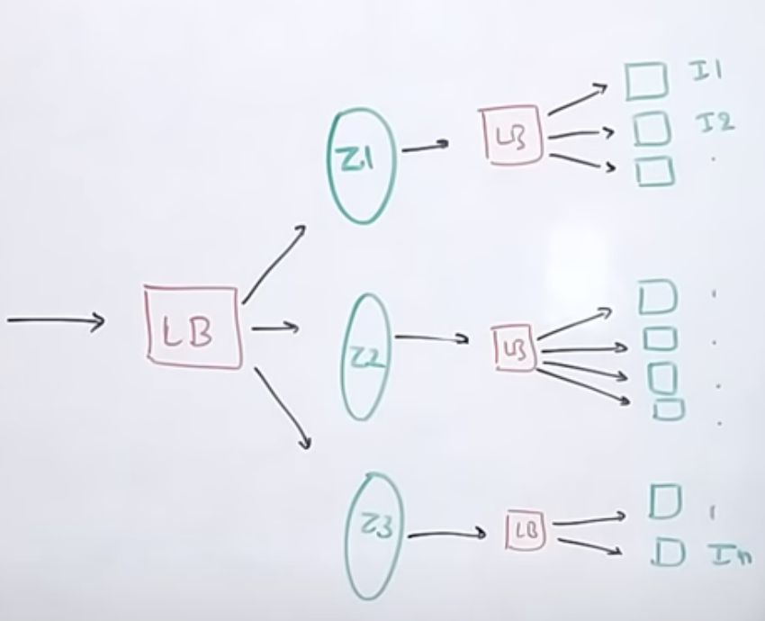
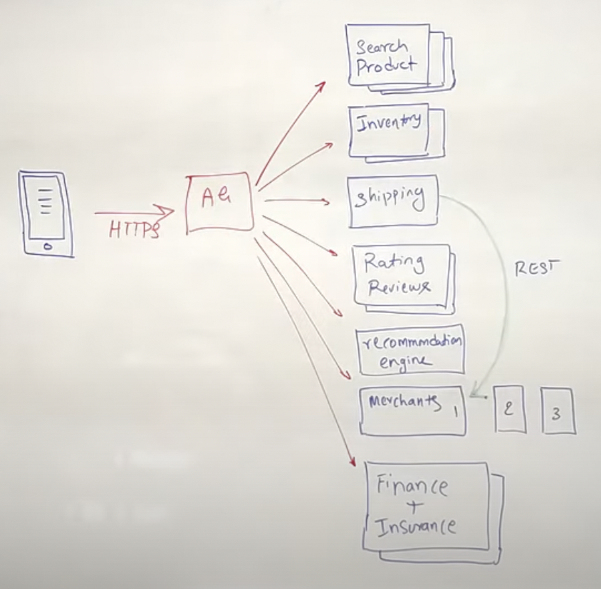

# HLD

* **Encrypt** with **public** key
* **Decrypt** with **private** key

## 1. **Scalability Trade-offs**

* There’s no free lunch i.e. everything is a trade-off:
  1. Performance vs scalability
  2. Latency vs Throughput
  3. Availability vs Consistency

### 1.1 **Performance vs scalability :Tradeoff**

* How do I know if I have a **performance** problem?
  * If your system is slow for a single user
* How do I know if I have a **scalability** problem?
  * If your system is fast for a single user but slow under heavy load

### 1.2 Latency vs Throughput :Tradeoff

* **Latency** is the time to perform some action or to produce some result.
* **Throughput** is the number of such actions or results per unit of time.
* Generally, you should aim for **maximal throughput** with **acceptable latency**.

### 1.3 Availability vs Consistency : Tradeoff

* Brewer’s **CAP theorem**: For a system, At a given point in time you can only pick 2 out of these 3:
  * **Consistency** - Every read receives the most recent write or an error
  * **Availability** - Every request receives a response, without guarantee that it contains the most recent version of the information
  * **Partition Tolerance** - The system continues to operate despite arbitrary partitioning due to network failures
* In a **centralized system \(RDBMS etc.\)** we **don’t have** network partitions, e.g. **P in CAP**:
  * So you get both: 
    * Availability 
    * Consistency
  * Hence they are **ACID:**
    * Atomic 
    * Consistent 
    * Isolated 
    * Durable
* In a distributed system we **\(will\) have** network partitions, e.g. **P in CAP**
  * So you get to only pick one: 
    * Availability 
    * Consistency
* **CAP in practice:**
  * Networks aren't reliable, so you'll **need to support partition tolerance\(P\)**. You'll need to make a software tradeoff between consistency and availability.
  * So, there are only two types of systems: 
    * 1. **CP** 
      * Waiting for a response from the partitioned node might result in a timeout error. 
      * **CP** is a good choice **if your business needs require atomic reads and writes**.
    * 2. **AP**
      * Responses return the most readily available version of the data available on any node, which might not be the latest.
      * Writes might take some time to propagate when the partition is resolved.
      * **AP** is a good choice **if the business needs allow for** [**eventual consistency**](https://github.com/donnemartin/system-design-primer#eventual-consistency) ****or when the system needs to continue working despite external errors.
* ...there is only one choice to make. In case of a network partition, what do you sacrifice? 
  * 1. C: Consistency 
  * 2. A: Availability
* Hence these systems\(**CP & AP**\) are **BASE**:
  * **Basically Available** 
  * **Soft state** 
  * **Eventual consistency** 

\*\*\*\*

## **2. Consistency Patterns**

### **2.1 Weak consistency**

* After a write, reads may or may not see it. A best effort approach is taken.
* This approach is seen in systems such as **memcached**. 
* Weak consistency works well in real time use cases such as **video calls**, and realtime multiplayer games.

### **2.2 Eventual consistency**

* After a write, reads will eventually see it \(typically within milliseconds\).
* Data is **replicated asynchronously**.
* This approach is seen in systems such as DNS and email. 
* **Eventual consistency works well in highly available systems**.

### **2.3 Strong consistency**

* After a write, reads will see it. Data is replicated synchronously.
* This approach is seen in file systems and **RDBMSes**. 
* Strong consistency works well in **systems that need transactions**.

## 3. **Availability Patterns**

###     3.1 What \| How of Availability

* Availability is often quantified by uptime \(or downtime\) as a percentage of time the service is available.
* Availability is generally measured in number of 9s--a service with 99.99% availability is described as having **four 9s.**
* **99.9% availability - three 9s**

  | **Duration** | **Acceptable downtime** |
  | :--- | :--- |
  | **Downtime per year** | **8h 45min 57s** |
  | **Downtime per month** | **43m 49.7s** |
  | **Downtime per week** | **10m 4.8s** |
  | **Downtime per day** | **1m 26.4s** |

  * **99.99% availability - four 9s**

  | **Duration** | **Acceptable downtime** |
  | :--- | :--- |
  | **Downtime per year** | **52min 35.7s** |
  | **Downtime per month** | **4m 23s** |
  | **Downtime per week** | **1m 5s** |
  | **Downtime per day** | **8.6s** |

  * **Availability in Sequence: Decreases**
    * `Availability (Total) = Availability (Foo) * Availability (Bar)`
  * **Availability in Parallel: Increases**
    * `Availability (Total) = 1 - (1 - Availability (Foo)) * (1 - Availability (Bar))`

###   3.2 Availability Patterns&gt;&gt;

* There are two complementary patterns to support high availability: 
  1. **fail-over** 
  2. **replication.**

### **3.2.1. \#1.Fail-over \(with Fail-back\)**

* **Fail Over** =&gt; Putting the failed node out of service
* **Fail Back** =&gt; Restoring the failed node back
* fail-over is not always this simple
* **1. Active-passive Fail-over**
  * With active-passive fail-over, **heartbeats** are sent **between the active and the passive server** on standby. If the heartbeat is interrupted, the passive server takes over the active's IP address and resumes service.
  * The length of downtime is determined by whether the passive server is already running in 'hot' standby or whether it needs to start up from 'cold' standby. Only the active server handles traffic.
  * Active-passive failover can also be referred to as **master-slave** failover.
* **2.Active-active Fail-over**
  * In active-active, both servers are managing traffic, **spreading the load** between them.
  * If the servers are public-facing, the DNS would need to know about the public IPs of both servers. If the servers are internal-facing, application logic would need to know about both servers.
  * Active-active failover can also be referred to as **master-master** failover.
* **Disadvantage\(s\): failover**
  * Fail-over adds more hardware and additional **complexity**.
  * There is a **potential for loss of data** if the active system fails before any newly written data can be replicated to the passive.

### **3.2.2. \#2.Replication**

* Active replication - **Push** 
* Passive replication - **Pull** 
  * Data not available, read from peer, then store it locally 
  * Works well with timeout-based caches
* **Types of Replication architecture:**
  * **1.Master-Slave replication** 


* **2.Master-Master replication** 


* **3.Tree Replication**


* **4.Buddy replication**


## **4.DNS**

* Top DNS service providers:
  * **Akamai**
  * CloudFlare
  * OpenDNS
  * Oracle
  * **Google Open Domains**
  * Microsoft Azure
* Some DNS services can route traffic through various methods:
  * \*\*\*\*[**Weighted round robin**](https://www.g33kinfo.com/info/round-robin-vs-weighted-round-robin-lb)\*\*\*\*
    * Weighted round-robin provides a clean and effective way of focusing on fairly distributing the load amongst available resources, verses attempting to equally distribute the requests. 
    * In a weighted round-robin algorithm, each destination \(in this case, server\) is assigned a value that signifies, relative to the other servers in the pool, how that server performs. 
    * This “weight” determines how many more \(or fewer\) requests are sent that server’s way; compared to the other servers on the pool.
    * Prevent traffic from going to servers under maintenance
    * Balance between varying cluster sizes
    * A/B testing
  * [Latency-based](https://docs.aws.amazon.com/Route53/latest/DeveloperGuide/routing-policy.html#routing-policy-latency)
  * [Geolocation-based](https://docs.aws.amazon.com/Route53/latest/DeveloperGuide/routing-policy.html#routing-policy-geo)
* **Disadvantage\(s\): DNS**
  * Accessing a DNS server introduces a slight delay, although mitigated by caching described above.
  * DNS server management could be complex and is generally managed by [governments, ISPs, and large companies](http://superuser.com/questions/472695/who-controls-the-dns-servers/472729).
  * DNS services have recently come under [DDoS attack](http://dyn.com/blog/dyn-analysis-summary-of-friday-october-21-attack/), preventing users from accessing websites such as Twitter without knowing Twitter's IP address\(es\).


## **5.CDN**

* =&gt; is a globally distributed network of proxy servers, **serving content from locations closer to the user.** 
* Generally, static files such as HTML/CSS/JS, photos, and videos are served from CDN, although some CDNs such as Amazon's CloudFront support dynamic content. 
* **The site's DNS resolution will tell clients which server to contact**.
* **Types of CDN:**
  * **Pull CDNs**
    * Pull CDNs grab new content from your server when the first user requests the content. This results in a slower request until the content is cached on the CDN.
    * A [time-to-live \(TTL\)](https://en.wikipedia.org/wiki/Time_to_live) determines how long content is cached. Pull CDNs minimize storage space on the CDN, but can create redundant traffic if files expire and are pulled before they have actually changed.
    * **Sites with heavy traffic work well with pull CDNs**, as traffic is spread out more evenly with only recently-requested content remaining on the CDN.
  * **Push CDNs**
    * Push CDNs receive new content whenever changes occur on your server. 
    * You take full responsibility for providing content, uploading directly to the CDN and rewriting URLs to point to the CDN. 
    * **Sites with a small amount of traffic or sites with content that isn't often updated work well with push CDNs.**
    *  Content is placed on the CDNs once, instead of being re-pulled at regular intervals.
* **Top CDNs:**
  * CloudFlare
    * Cloudflare’s CDN has a network capacity **15 times bigger than the largest DDoS attack ever** recorded and handles modern DDoS to ensure your website stays online.
  * Google Cloud CDN
  * Amazon CloudFront
    * Popular with S3 caching
    * Can be used for EC2 Load Balancing
    * Protection against DDoS
    * SSL/TLS encryption of HTTPS

## 6.**Load Balancer**

* Load balancers can be **implemented** with **hardware** \(expensive\) **or** with software such as **HAProxy**.
* **Advantages of LB:** 
  * Preventing requests from going to unhealthy servers
  * Preventing overloading resources
  * Helping to eliminate a single point of failure
  * **SSL termination** - **Decrypt incoming requests** and **encrypt server responses** so backend servers do not have to perform these potentially expensive operations
    * Removes the need to install [X.509 certificates](https://en.wikipedia.org/wiki/X.509) on each server
  * **Session persistence** - Issue cookies and route a specific client's requests to same instance if the web apps do not keep track of sessions
* Techniques of Failure Protection: it's common to set up multiple load balancers, either in [active-passive](https://github.com/donnemartin/system-design-primer#active-passive) or [active-active](https://github.com/donnemartin/system-design-primer#active-active) mode.
* Amazon's **ELB:**
  * 2 level LB: 
    * 1.zone wise\(**z1,z2,...**\)
    * 2.secondary array of  LBs\(**LB1,LB2,...**\)
  * hence more optimization



### Routing Techniques

* Load balancers can route traffic based on various metrics, including:
  * Random
  * Least busy
  * Sticky session/Cookies
  * Round Robin OR **Weighted Round Robin**
  * **Layer 4 load balancing**
    * Layer 4 load balancers look at info at the [transport layer](https://github.com/donnemartin/system-design-primer#communication) to decide how to distribute requests. Generally, this **involves the source, destination IP addresses, and ports in the header, but not the contents of the packet**.
    * Layer 4 load balancers forward network packets to and from the upstream server, performing [Network Address Translation \(NAT\)](https://www.nginx.com/resources/glossary/layer-4-load-balancing/).
  * **Layer 7 load balancing\( SMARTER 🧠\)**
    * Layer 7 load balancers look at the [application layer](https://github.com/donnemartin/system-design-primer#communication) to decide how to distribute requests. This can involve contents of the header, message, and cookies. **Layer 7 load balancers terminate network traffic, reads the message, makes a load-balancing decision, then opens a connection to the selected server.** 
    * For example, a layer 7 load balancer can **direct video traffic to servers that host videos** while directing more sensitive **user billing traffic to security-hardened servers**.
  * At the cost of flexibility, **layer 4 load balancing requires less time and computing resources than Layer 7**, although the performance impact can be minimal on modern commodity hardware.

### Horizontal Scaling of LBs

* Scaling horizontally introduces complexity and involves cloning servers
  * **Servers should be stateless**: they should not contain any user-related data like sessions or profile pictures
  * Sessions can be stored in a **centralized data store** such as a [database](https://github.com/donnemartin/system-design-primer#database) \(SQL, NoSQL\) or a persistent [cache](https://github.com/donnemartin/system-design-primer#cache) \(Redis, Memcached\)
    * **Redis is better:**
      * its distributed & more persistent
* Downstream servers such as **caches and databases** need to handle more simultaneous connections as upstream servers scale out

### Disadvantage\(s\): load balancer

* The load balancer can become a **performance bottleneck** if it does not have enough resources or if it is not configured properly.
* Introducing a load balancer to help eliminate a **single point of failure** results in increased **complexity**.
* A single load balancer is a single point of failure, configuring multiple load balancers further increases complexity.
* **On Amazon’s ELB:**
  * Elastic Load Balancing supports the following protocols:
    * HTTP
    * HTTPS \(secure HTTP\)
    * TCP
    * SSL \(secure TCP\)


## **7. Proxy \| Reverse Proxy**

* **Proxy**: -&gt; Server doesnt know the client
* FORCED me to buy a new laptop!!!
* **Proxy Use Cases:**
  * Caching
  * Anonymity
  * Site Blocking
  * Logging
  * Microservices


* **Reversed Proxy:**-&gt; Client doesnt know the final destination
* **Use Cases:**
  * Caching
  * Load Balancing
  * **Ingress**
    * Ingress Rules are a set of rules for processing inbound HTTP traffic
    * An ingress is really just a set of rules to pass to a controller that is listening for them.
    * i.e. based on certain filters; it can guide you to diff routs/services
  * Microservices
  * **Canary Deployment**: New feature testing by any app
* **Benefits of Reversed Proxy**:
  * Increased security - Hide information about backend servers, blacklist IPs, limit number of connections per client
  * Increased scalability and flexibility - Clients only see the reverse proxy's IP, allowing you to scale servers or change their configuration
  * **SSL termination** - Decrypt incoming requests and encrypt server responses so backend servers do not have to perform these potentially expensive operations
    * Removes the need to install [X.509 certificates](https://en.wikipedia.org/wiki/X.509) on each server
  * Compression - Compress server responses
  * **Caching** - Return the response for cached requests
  * **Static content** - Serve static content directly
    * HTML/CSS/JS
    * Photos
    * Videos
    * Etc
* **Disadvantages of Reverse Proxy:**
  * Introducing a reverse proxy results in increased **complexity**.
  * A single reverse proxy is a **single point of failure**, configuring multiple reverse proxies \(ie a [failover](https://en.wikipedia.org/wiki/Failover)\) further increases complexity.

### **Load balancer vs reverse proxy 🟢🔵🔴**

* Load balancer is **just an instance of reverse proxy**
* **Deploying a load balancer is useful when you have multiple servers**. Often, load balancers route traffic to a set of servers serving the same function.
* **Reverse proxies can be useful even with just one web server or application server**, opening up the benefits described in the previous section.
* Solutions such as NGINX and HAProxy can support both layer 7 reverse proxying and load balancing.

## 8.**Scalability Patterns - DB**

Below steps to be taken\(as \#users increase\)

* **Partitioning** 
* **HTTP Caching** 
* **RDBMS Sharding** 
  * Scaling **reads** to a RDBMS is **hard**
  * Scaling **writes** to a RDBMS is **impossible**
  * How to scale out RDBMS? =&gt; Sharding 
    * **Partitioning** 
    * **Replication**
* **NOSQL** 
  * Types
    * Key-Value databases \(Voldemort, Dynomite\) 
    * Column databases \(Cassandra, Vertica, Sybase IQ\) 
    * Document databases \(MongoDB, CouchDB\) 
    * Graph databases \(Neo4J, AllegroGraph\) 
    * Datastructure databases \(Redis, Hazelcast\)
  * NOSQL in the world:
    * Google: Bigtable 
    * Amazon: Dynamo 
    * Amazon: SimpleDB 
    * Yahoo: HBase 
    * Facebook: Cassandra 
    * LinkedIn: Voldemort
* **Distributed Caching** 
* Data Grids 

## **8.1 RDBMS**

* **ACID** is a set of properties of relational database [transactions](https://en.wikipedia.org/wiki/Database_transaction).
  * **Atomicity** - Each transaction is all or nothing
  * **Consistency** - Any transaction will bring the database from one valid state to another
  * **Isolation** - Executing transactions concurrently has the same results as if the transactions were executed serially
  * **Durability** - Once a transaction has been committed, it will remain so

### **Scaling Up a RDBMS**

* Techniques:
  * master-slave replication \|\| master-master replication
  * federation
  * sharding
  * denormalization
  * SQL tuning

### **1.Master-Master \|\| Master-Slave** :

* already covered up

### **2.Federation**


* **Federation \(or functional partitioning\) splits up databases by function.**
* For example, instead of a single, monolithic database, you could have three databases: forums, users, and products, resulting in less read and write traffic to each database and therefore less replication lag
* ​​With no single central master serializing writes you can write in parallel, increasing throughput.
* **Disadvantage\(s\): federation**
  * Federation is **not effective if your schema requires huge functions or tables**.
  * You'll need to update your application logic to determine which database to read and write.
  * **Joining data** from two databases is more complex with a [server link](http://stackoverflow.com/questions/5145637/querying-data-by-joining-two-tables-in-two-database-on-different-servers).
  * Federation adds **more hardware** and additional **complexity**.

### **3.Sharding**


* Sharding **distributes data across different databases** such that each database can only manage a **subset of the data.**
* Taking a users database as an example, as the number of users increases, more shards are added to the cluster
* **@fk: partitioned on date ranges**
* **Disadvantage\(s\): sharding**
  * You'll need to update your application logic to work with shards, which could result in complex SQL queries.
  * **Data distribution can become lopsided** in a shard. For example, a set of power users on a shard could result in increased load to that shard compared to others.
    * Rebalancing adds additional complexity. A sharding function based on [consistent hashing](http://www.paperplanes.de/2011/12/9/the-magic-of-consistent-hashing.html) can reduce the amount of transferred data.
  * **Joining data from multiple shards is more complex.**
  * Sharding adds more hardware and additional complexity.

### 4. Denormalization:

* Denormalization attempts to **improve read performance at the expense of some write performance**.
* **Redundant copies** of the data are written in multiple tables to avoid expensive joins. 
* Some RDBMS such as [PostgreSQL](https://en.wikipedia.org/wiki/PostgreSQL) and Oracle support [materialized views](https://en.wikipedia.org/wiki/Materialized_view) which handle the work of storing redundant information and keeping redundant copies consistent.
* Once data becomes distributed with techniques such as [federation](https://github.com/donnemartin/system-design-primer#federation) and [sharding](https://github.com/donnemartin/system-design-primer#sharding), managing joins across data centers further increases complexity. Denormalization might circumvent the need for such complex joins.
* **Where to use**: In most systems, **reads can heavily outnumber writes 100:1 or even 1000:1**. A read resulting in a complex database join can be very expensive, spending a significant amount of time on disk operations.
* **Disadvantages:**
  * Data is duplicated.
  * Constraints can help redundant copies of information stay in sync, which increases complexity of the database design.
  * A denormalized database under heavy write load might perform worse than its normalized counterpart.

### 5. SQL Tuning

* It's important to benchmark and profile to simulate and uncover bottlenecks.
* **Benchmark** - Simulate high-load situations with tools such as [ab](http://httpd.apache.org/docs/2.2/programs/ab.html).
* **Profile** - Enable tools such as the [slow query log](http://dev.mysql.com/doc/refman/5.7/en/slow-query-log.html) to help track performance issues.

## **8.2 NoSQL**

* Data is **denormalized**, and joins are generally done in the application code.
* **Lack true ACID** transactions and have **BASE**:
  * **Basically available** - the system guarantees availability.
  * **Soft state** - the state of the system may change over time, even without input.
  * **Eventual consistency** - the system will become consistent over a period of time, given that the system doesn't receive input during that period.
* **Why Use NoSQ**L:
  * WE ARE STORING MORE DATA NOW THAN WE EVER HAVE BEFORE
  * CONNECTIONS BETWEEN OUR DATA ARE GROWING ALL THE TIME
  * WE DON’T MAKE THINGS KNOWING THE STRUCTURE FROM DAY 1
  * SERVER ARCHITECTURE IS NOW AT A STAGE WHERE WE CAN TAKE ADVANTAGE OF IT


* **NoSQL Use Cases:**
  * LARGE DATA VOLUMES:
    *  MASSIVELY DISTRIBUTED ARCHITECTURE REQUIRED TO STORE THE DATA GOOGLE, AMAZON, FACEBOOK, 100K SERVERS 
  * EXTREME QUERY WORKLOAD:
    *  IMPOSSIBLE TO EFFICIENTLY DO JOINS AT THAT SCALE WITH AN RDBMS 
  * SCHEMA EVOLUTION:
    *  SCHEMA FLEXIBILITY IS NOT TRIVIAL AT A LARGE SCALE BUT IT CAN BE WITH NO SQL
* **NoSQL PROS :**
  * **MASSIVE SCALABILITY** 
  * **HIGH AVAILABILITY** 
  * **LOWER COST** 
  * SCHEMA FLEXIBILITY SPARCE AND SEMI STRUCTURED DATA 
* **NoSQL CONS:**
  * **LIMITED QUERY CAPABILITIES** 
  * NOT STANDARDISED \(PORTABILITY MAY BE AN ISSUE\) 
  * STILL A DEVELOPING TECHNOLOGY

### Types of NoSQL

* Determine which type of NoSQL database best fits your use case out of these:

  * 


### 1.Key-value store 

* **\(Abstraction: hash table\)**
* generally allows for O\(1\) reads and writes; hence provide high performance
* **used@systems**: for simple data models or for rapidly-changing data, such as an in-memory cache layer.
* **Used@dbs:**
  * [Redis](http://qnimate.com/overview-of-redis-architecture/)
  * Memcached
  * [DynamoDB](http://www.read.seas.harvard.edu/~kohler/class/cs239-w08/decandia07dynamo.pdf) supports both key-values and documents

### 2.Document store 

* **\(Abstraction: key-value store with documents stored as values\)**
* A document store is centered around documents \(XML, JSON, binary, etc\), where a document stores all information for a given object. 
* Document stores provide APIs or a query language to query based on the internal structure of the document itself
* Although documents can be organized or grouped together, documents may have fields that are completely different from each other.
* Some document stores like [MongoDB](https://www.mongodb.com/mongodb-architecture) and [CouchDB](https://blog.couchdb.org/2016/08/01/couchdb-2-0-architecture/) also provide a SQL-like language to perform complex queries.
* **used@systems:** Document stores provide high flexibility and are often used for working with **occasionally changing data**.
* **used@dbs:**
  * **mongoDb**
  * CouchDB
  * DynamoDb

### 3.Wide column store 

*  **\(Abstraction: nested map ColumnFamily&lt;RowKey, Columns&lt;ColKey, Value, Timestamp&gt;&gt;\)**
* A column can be grouped in column families \(analogous to a SQL table\).
* You can access each column independently with a row key, and columns with the same row key form a row.
* Each value contains a timestamp for versioning and for conflict resolution.
* maintain keys in lexicographic order, allowing efficient retrieval of selective key ranges.
* **used@dbs:**
  * [Cassandra](http://docs.datastax.com/en/cassandra/3.0/cassandra/architecture/archIntro.html) from Facebook
  * **HBase:** open-source [**HBase**](https://www.edureka.co/blog/hbase-architecture/) ****often-used in the **Hadoop ecosystem**
    * Data is stored in **Big table.** 
    * Table consist rows and **each rows has arbitrary number of columns**. 
    * Every cell value gets assigned by **timestamp** and it plays an important role during operations. 
    * **Row keys are lexicographically sorted** and stored in **Bytes** \[\]. 
    * Column name and values are also stored in **Bytes** \[\]. 
    * Columns are **grouped on the basis of properties as a column family**


### 4.GraphDB \(Abstraction: graph\)

* **Note**: its **not** related to graphQL at all.**GraphQL is an advancement on REST; not a DB**
* each node is a record and each arc is a **relationship** between two nodes.
* Graph databases are optimized to represent complex relationships with many foreign keys or many-to-many relationships
* used@systems: Graphs databases offer high performance for data models with complex relationships, such as a social network.
* used@dbs:
  * [Neo4j](https://neo4j.com/)
  * [FlockDB](https://blog.twitter.com/2010/introducing-flockdb)
* 


## 8.3 SQL vs NoSQL

* **SQL: the GOOD:**
  * High performance for transactions. Think ACID 
  * Highly structured, very portable 
  * **Small amounts of data \(SMALL IS LESS THAN 500GB\)** 
  * Supports many tables with different types of data 
  * Can fetch ordered data 
  * Compatible with lots of tools
* **SQL : the BAD:**
  * **Complex queries** take a long time 
  * The relational model takes a long time to learn
  * **Not really scalable** 
  * **Not suited for rapid development**
* **NoSQL: the GOOD:**
  * Fits well for volatile data 
  * High read and write throughput 
  * In general it’s faster than SQL
  * Scales really well 
  * Rapid development is possible 
  * Store many TB \(or PB\) of data
* **NoSQL: the BAD:**
  * **Key/Value pairs need to be packed/unpacked all the time** 
  * **Still working on getting security** for these working as well as SQL 
* **Sample data well-suited for NoSQL:**
  * Rapid ingest of clickstream and log data
  * Leaderboard or scoring data
  * Temporary data, such as a shopping cart
  * Frequently accessed \('hot'\) tables
  * Metadata/lookup tables


## **9. Consistent Hashing**

* **IDEA:Keys & nodes map to the same space**
* [**link**](https://www.paperplanes.de/2011/12/9/the-magic-of-consistent-hashing.html)


## **10. Message Queues:Asynchronism**


* Message queues receive, hold, and deliver messages. If an operation is too slow to perform inline, you can use a message queue with the following workflow:
* An application publishes a job to the queue, then notifies the user of job status
* A **worker** picks up the job from the queue, processes it, then signals the job is complete
* The user is not blocked and the job is processed in the background. During this time, the client might optionally do a small amount of processing to make it seem like the task has completed.
* For example, if posting a tweet, the tweet could be instantly posted to your timeline, but it could take some time before your tweet is actually delivered to all of your followers.
* E.g.s:
  * [Redis](https://redis.io/) is useful as a simple message broker but messages can be lost.
    * **I've implemented RedisStore for client @Supp 💪**
  * [RabbitMQ](https://www.rabbitmq.com/) is popular but requires you to adapt to the 'AMQP' protocol and manage your own nodes.
  * [Amazon SQS](https://aws.amazon.com/sqs/) is hosted but can have high latency and has the possibility of messages being delivered twice.
  * Kafka

## 11. Encryption

### 1. MD5

* Faster than SHA256
* Produces **128 bit**
* **More Secure**

### 2. SHA-256

* SHA256 is difficult to handle than MD5 because of its size.
* SHA256 is **less secure than MD5**
* SHA256 takes somewhat more time to calculate than MD5
* Produces **256 bits**
* **Usage:**
  * **encode\(\) :** Converts the string into bytes to be acceptable by hash function.
  * **hexdigest\(\) :** Returns the encoded data in hexadecimal format.
  * 

```python
import hashlib
  
str = "GeeksforGeeks"
  
result = hashlib.sha256(str.encode())  # need to encode before encrypiton
  
# printing the equivalent hexadecimal value.
print(result.hexdigest())
```

### 3. Base 64

* It takes any form of data and transforms it into a long string of plain text. 
* Earlier we can not transfer a large amount of data like files because it is made up of 2⁸ bit bytes but our actual network uses 2⁷ bit bytes
* **base64** uses only **6**-**bits**\(2⁶ = 64 characters\) to ensure the printable _data_ is _human readable_
* base64 contains:
  * 10 numeric value i.e., 0,1,2,3,…..9.
  * 26 Uppercase alphabets i.e., A,B,C,D,…….Z.
  * 26 Lowercase alphabets i.e., a,b,c,d,……..z.
  * two special characters i.e., +,/. Depends upon your OS.
* Resource: [What Is Base64 Encoding?](https://levelup.gitconnected.com/what-is-base64-encoding-4b5ed1eb58a4)
* **Usage**

```python
from base64 import b64encode
  
s = b'GeeksForGeeks'
gfg = b64encode(s)    #  b’R2Vla3NGb3JHZWVrcw==’
```

## 12. Microservices: Application layer scaling

### 12.0 Microservices

* Architecture build with group of **loosely coupled** individual services.
* Usually communicate with each other with **REST/RPC** protocol
* all services have their **own database =&gt; POLYGLOT ARCHITECTURE\(SQL+NoSQL\)**
  * **Disadv.** =&gt; lots of joins on DB queries
  * **Adv.** =&gt; service based horizontal scaling

### 12.1 API Gateway

* **WHY USE?** =&gt; N separate calls to N microservices to get result of 1 query ❌
  * So, use this & make a single call to it
  * API gateway has logic to call which N calls to make.
* **Advantages:**
  * It can make **parallel calls** too, if reqd
  * takes case of auth & filtering etc
  * **SSL termination**
    * verify HTTPS only on call from client to API gateway
    * all internal calls are HTTP/RPC etc
  * **Load Balancing**
  * **Insulation** \(sanitation of 3P requests\)



### 12.2 Service Discovery

* **WHAT?** =&gt; its a pattern to **identify** the **network addresses** of all of the microservices' instances
* It has a **Service Register.**
  * Give me the list of all network addresses of **Inventory** service's instances\(see above ss\)
* **Service Discovery =&gt;**  simply the service which **reads** the **Service Register**
  * **TYPE1 : Client Side Service Discovery:**
    * client talks to **Service Discovery** -&gt; asks the latest addresses of microservices -&gt; use this address to redirected there
  * **TYPE2: Server Side Service Discovery:**
    * client talks to **API Gateway** -&gt; API Gateway asks Service Discovery about the  latest addresses of microservices -&gt; use this address to redirected there
* **used@ServiceDiscoveryTool =&gt;** Zookeeper

## 13.Other Terms

* **Varnish**
  * **@ distributed\_cache**
  * Front-end Caching system
  * batching together similar requests from cache to DB
* **Hysterix**
  * **@ api\_management**
  * =&gt; **usedTo:** avoid **Cascading Failures**
    * graceful degradation
  * circuit breaking 
  * health check
  * redirect

## Resources:

* Whimsical board: [HLDs](https://whimsical.com/hlds-n52ahnNWNwnC99fzGKJQ4)
* **NOTE:** [**SYSTEM DESIGN TEMPLATE ON LEETCODE**](https://leetcode.com/discuss/career/229177/My-System-Design-Template)\*\*\*\*


## TODOs:

* [x] Learn concepts from Grokking the SysD interview\(Part-2\)
* [x] Finish System Design Primer in-depth
* [ ] Start doing questions: 
  * [ ] Grokking SysD Part I 
  * [ ] Youtube
  * [ ] Leetcode
* [x] Revise all the things learnt during React & NextJS
* [ ] Learn all about Big Data Techs using currently @fk
* [ ] For all the concepts of HLD; see the actual code\(hands on\) & have an implement ready for each.
* [ ] Scan through all the major blogs of tech-companies'
* [x] Concurrency - with code\(py/java\) : https://tutorialedge.net/course/python/
* [x] Consistent Hashing
* [ ] OSI Model
* [ ] HTTPS
* [x] SSL + encryption\(pub key vs priv key\)
* [x] Hash algos: SHA-256, RSA 
* [ ] cryptography **@CoinBase** 💲

