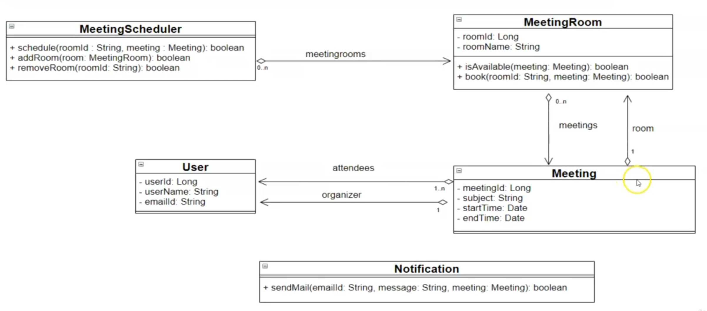
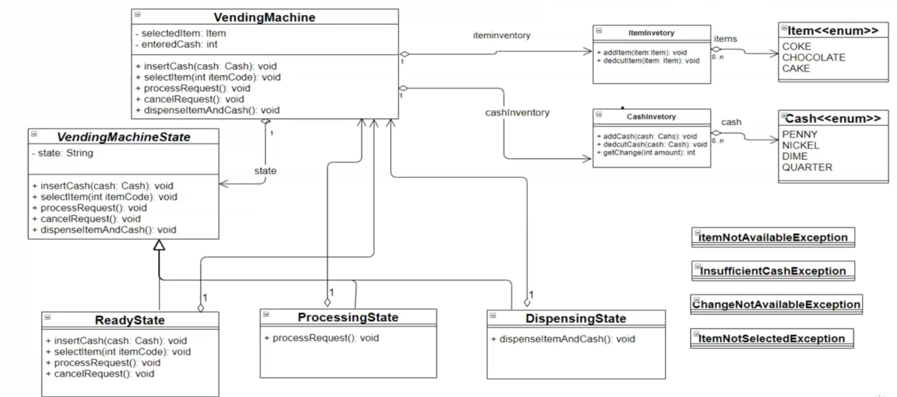
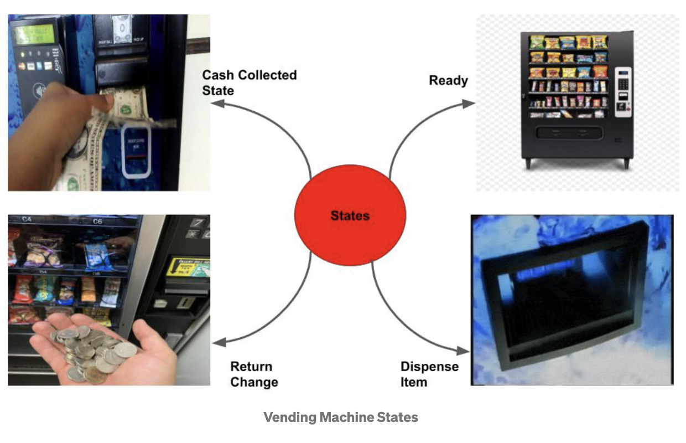
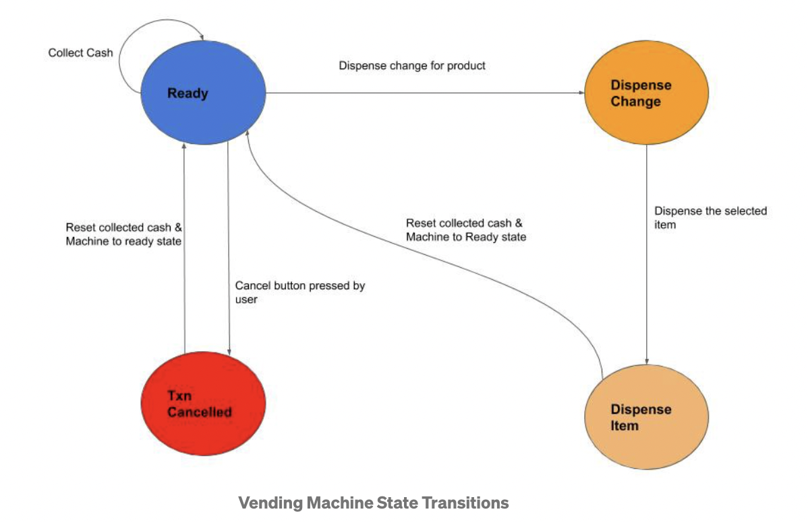
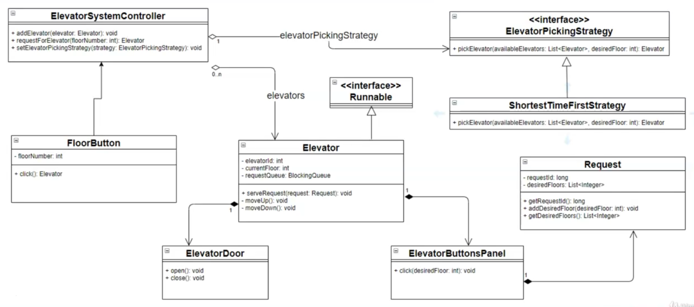
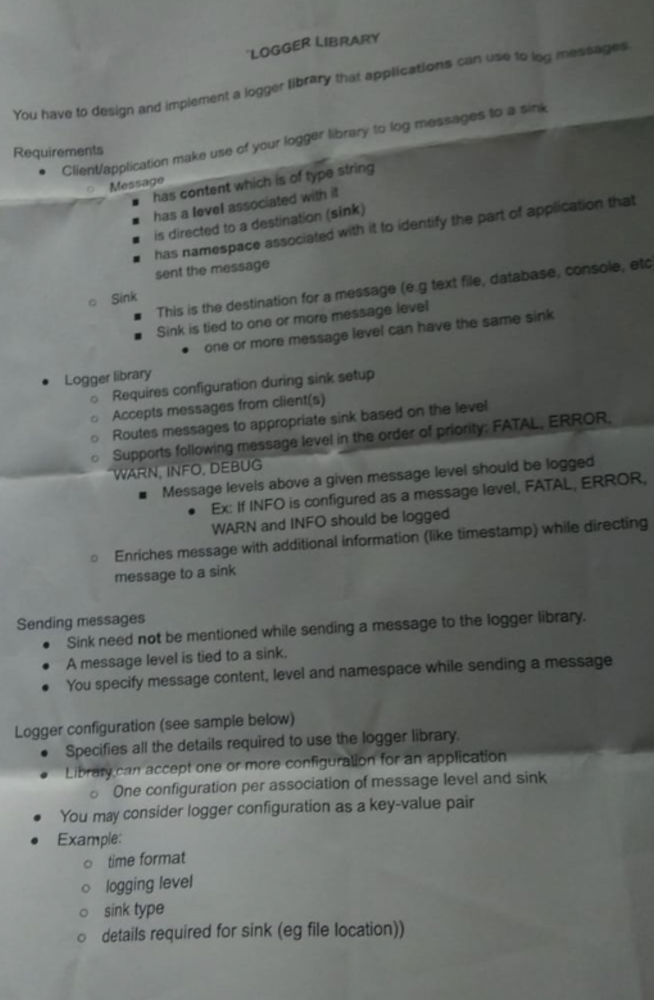
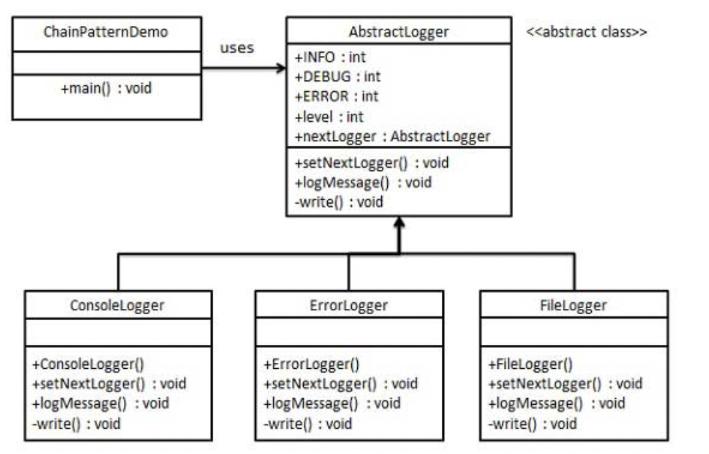

# LLD:Questions

## # Resources:

* Grokking OO Interview: [Git repo + solutions (in python)](https://github.com/tssovi/grokking-the-object-oriented-design-interview/tree/master/object-oriented-design-case-studies)

## 0. Template 🔖

```
# Name: <app_name>

# Objective:

# Features:
* 

# ====================================================

# Classes: (nouns)

* class1
    * attr1
    * attr2
    * method1(attr1, attr2)
    * method2(attr1)

# ==================================================== [forSelf]

## Steps for LLD:

1. create Project in VSCode
2. `Req Gathering` create `design.md` file as ^
3. `Creating Frames` create all the empty classes & their attrs, methods; (some things might change during as interview discussion moves).
    * NOTE: add basic `doc_string` descripiton as many places as you can - leaves good impression
4. `Implementation + UnitTesting` : do your thing. Also introduce abstraction/inheritance etc as per the need.
    * NOTE: Splint the screen & keep `main.py` open on right(along with what you're coding on left) => to continueously checking for bugs & correctness(hence avoinding the rabbit-hole-debugging in the end)
5. `Run + Integration Tests + Edge Cases + Bonus Features`
6. `Writing UTs` : if time permits
```

## 20. Meeting Scheduler

* [Code(JAVA)](https://github.com/prabhakerau/lowlevelsystemdesgin/tree/main/MeetingScheduler/src/com/company)
* this **diag is not exactly correct**. See **ClassDiag** below for accurate





```
# Meeting Room Scheduler

# Statement
Design Meeting Scheduler. Here there are n given meeting rooms. Book a meeting in any meeting room at given interval(starting time, end time). Also send notifications to all person who are invited for meeting.
You should use calender for tracking date and time. And also history of all the meetings which are booked and meeting room.
write an API for client who will give date and time and API should return meeting room with booked scheduled time. client should also query for history of last 20 booked meetings.
Is meeting room available? etc


# ========================================

Meeting
-------------meeting_id: PK,int    
-------------agenda: str
-------------start_time : datetime
-------------end_time   : datetime
-------------admin_id
-------------email_list: []

MeetingRoom
-------------room_id : PK,int
-------------room_name : int
-------------meetings [] : Meetings[]
-------------is_available(start_time,end_time) : bool
-------------book_meeting(Meeting)
-------------[?]cancel_meeting(meeting_id)
-------------[?]capacity  : int


MeetingScheduler    #books meetings & calls emailservice when done
-------------meeting_rooms[MeetingRoom]
-------------history[Meetings]
-------------MAX_HISTORY_COUNT
-------------emailServiceClient : setup client here
-------------book_meeting(start_time,end_time,emailList, admin_id) #iterate on all rooms, NOTE: meeting is created in Meeting room
-------------add_room(Room)
-------------remove_room(Room)
-------------get_history(number_of_days)

EmailService
-------------send_email(email: str,meeting: Meeting)
-------------send_bullk_email(emailList: List[str], meeting: Meeting)

User
-------------uid
-------------name
-------------emp_id 
-------------email_id   #for sending notif

# Admin : User
# -------------book_meeting(room_id, meeting_id)
# -------------cancel_meeting(Meeting)

# Attendee
# -------------mark_attendance(uid,meeting_id)

# Response : Enum
# ACCEPT, DECLINE, MAYBE

```



```python
import uuid
from datetime import datetime

class Meeting:
    def __init__(
        self, agenda: str, start_time: str, end_time: str, email_list: list[str]
    ):
        self.id = self.generateMeetingID()
        self.agenda = agenda
        self.start_time = datetime.strptime(start_time, '%b %d %Y %I:%M%p')
        self.end_time = datetime.strptime(end_time, '%b %d %Y %I:%M%p')
        self.email_list = email_list

    def generateMeetingID(self) -> uuid.UUID:
        return uuid.uuid4()


class MeetingRoom:
    def __init__(self, room_name: str):
        self.id = self.generateRoomID()
        self.room_name = room_name
        self.meetings = []

    def generateRoomID(self) -> uuid.UUID:
        return uuid.uuid4()

    def is_available(self,start_time: str, end_time: str) -> bool:
        for m in self.meetings:
            if (m.start_time <= start_time and m.end_time <= end_time) or (m.start_time <= end_time and m.end_time >= end_time) or (m.start_time >= start_time and m.end_time <= end_time):
               return False
        return True 
    
    def add_meeting(self, meeting: Meeting) -> None:
        if self.is_available(meeting.start_time, meeting.end_time):
            self.meetings.append(meeting)


class MeetingScheduler:
    MAX_HISTORY_LIMIT = 10
    
    def __init__(self,meeting_rooms: list[MeetingRoom] ):
        self.meeting_rooms = meeting_rooms
        self.history = []
        self.email_service = self.init_email_client()
        
    def init_email_client(self):
        print('\n=============== Email Client Initiated for the app ==================\n')
        pass
    
    def book_meeting(self,meeting: Meeting)-> bool:
        for room in self.meeting_rooms:
            if room.is_available(meeting.start_time, meeting.end_time):
                room.add_meeting(meeting)
                self.update_history(room, meeting)
                print('============ Meeting Booked =================')
                return True
        return False
            
    
    def add_room(self, room: MeetingRoom):
        self.meeting_rooms.append(room)
    
    def remove_room(self,room: MeetingRoom):
         self.meeting_rooms.remove(room)
    
    def update_history(self,room: MeetingRoom, meeting: Meeting):
        self.history.append({'meeting':meeting , 'room': room})
        if len(self.history) > MeetingScheduler.MAX_HISTORY_LIMIT:
            self.history.pop(0)
    
    def get_history(self, number_of_days: int=5):
        for entry in self.history[-number_of_days:]:
            print(f'Entry: meeting : {entry["meeting"].id} [Agenda = {entry["meeting"].agenda}] booked in room {entry["room"].room_name} for {entry["meeting"].start_time} to {entry["meeting"].end_time}')


class EmailService:
    pass


class User:
    pass


meet = Meeting('onboarding', 'Aug 1 2021  1:00PM','Aug 1 2021  2:00PM',['user1@gmail.com','user2@gmail.com'])
room1 = MeetingRoom('105')
room2 = MeetingRoom('105')

controller = MeetingScheduler([])
controller.add_room(room1)
controller.add_room(room2)

controller.get_history()
controller.book_meeting(meet)
controller.get_history()
```



## 21. Vending Machine | 🟢STATE pattern

* [Code(JAVA)](https://github.com/prabhakerau/lowlevelsystemdesgin/tree/main/VendingMachine/src/com/lld/questions/vendingmachine)







\*\* Advantages of using State Pattern:\*\*

* The design pattern moves all state-related logic to a separate class thus reducing the coupling with the main context class & is following the Single Responsibility Principle
* State-related behaviour is declared in an interface. New states can be easily introduced without the need to modify & add conditional blocks of code. Code becomes open for extension & closed for modification

\*\* Disadvantages of using State Pattern:\*\*

* Individual states must be aware of the next states and those states need to be hardcoded
* The pattern becomes an overkill if the design only has one or two states or the state behaviour rarely changes



```
# Requirements =======================================

* INVENTORY: Vending Machine must keep track of the inventory
* INSERT CASH & SELECT: A person should be able to insert cash(1,5,10,25 Cents i.e. penny, nickel, dime, and quarter.) into the machine & choose an item(Coke(25), Pepsi(35), Soda(45))
* The Machine should confirm the inserted cash with the price of the selected item
* The machine must display an error in case of insufficient cash or unavailable item
* DISPATCH: Finally, if all the above steps succeed then the user gets the selected item and remaining change if any
* RESET     : Allow reset operation for vending machine supplier.
* [@] REFUND    : Allow user to take refund by canceling the request.

# IMPLEMENTATION ====================================== 
* STATE PATTERN :
    * Transactions are atomic
    * If the machine is in the process of dispensing an item, then the user can’t insert cash and try to buy another item.
    * i.e. a user can buy a new item by either aborting or completing the existing transaction
* STATES:
1. Ready — Machine ready to accept cash
2. CashCollected — Machine has collected cash & user can now select the product or cancel the transaction
3. DispenseChange — Give back the change to the user
4. DispenseItem — Dispense the item upon successful validation of entered cash & the price of the selected item in inventory
5. TransactionCancelled — If the user cancels the transaction, return the cash given by the user

# Classes:


ITEM: Enum
------------PEPSI
------------COKE
------------SODA

COIN: Enum
------------PENNY:1
------------NICKEL:5
------------DIME:10
------------QUARTER:25

Item 
------------name
------------price
------------get_price()
------------get_name()

Cash
------------name
------------denominaiton
------------get_denominaiton()

ItemInventory
------------items: {} #item->quantity
------------add_item()
------------deduct_item()
------------is_item_available()
------------display_inventory()
------------reset()

CahsInventory
------------cash: {} #coin->quantity
------------add_cash()
------------deduct_cash()
------------has_chash()
------------get_change()
------------show_cash_inventory()

Exceptions
------------ItemNotAvailableException
------------InsufficientCashExcepiton
------------ChangeNotAvailableException
------------ItemNotSelectedExcepiton


VendingMachineState
------------insert_cash()
------------select_item()
------------proecss_request()
------------cancel_request()
------------dispatch_item_and_cash()


--> ReadyState(VendingMachineState)

--> CancelingState(VendingMachineState)

--> ProcessingState(VendingMachineState)

--> DispatchingState(VendingMachineState)


VendingMachineFactory
------------create_vending_machine()    
# Factory Method to create a VM.THis can be extended to create diff types of VMs

VendingMachine
------------selected_item = None   # Item
------------entered_cash = 0
------------vending_machine_state = VendingMachineState
------------item_inventory = ItemInventory()
------------cash_inventory = CahsInventory()
------------add_item()
------------deduct_item()
------------add_cash()
------------deduct_cash()
------------get_entered_cash_value()
------------reset_entered_cash_value()
------------get_selected_item()
------------set_selected_item()
------------reset_selected_item()
------------is_selected_item_available()
------------is_change_available_for_entered_cash()
```



```python
from enum import Enum

# coin.py


class CASH(Enum):
    PENNY, NICKEL, DIME, QUARTER = 1, 2, 3, 4


class Cash:
    def __init__(self, name, denominaiton):
        self.name = name
        self.denominaiton = denominaiton

    def get_denomination(self)->int:
        return self.denominaiton


class Penny(Cash):
    def __init__(self):
        Cash.__init__(self, CASH.PENNY, 1)


class Nickel(Cash):
    def __init__(self):
        Cash.__init__(self, CASH.NICKEL, 5)


class Dime(Cash):
    def __init__(self):
        Cash.__init__(self, CASH.DIME, 10)


class Quarter(Cash):
    def __init__(self):
        Cash.__init__(self, CASH.QUARTER, 25)


# items.py


class ITEMS(Enum):
    COKE, PEPSI, SODA = 25, 20, 10


class Item:
    def __init__(self, name, price):
        self.name = name
        self.price = price

    def get_price(self):
        return self.price

    def get_name(self):
        return self.name


class Coke(Item):
    def __init__(self):
        Item.__init__(self, ITEMS.COKE, 25)


class Pepsi(Item):
    def __init__(self):
        Item.__init__(self, ITEMS.PEPSI, 35)


class Soda(Item):
    def __init__(self):
        Item.__init__(self, ITEMS.SODA, 45)


# exceptions.py


class ItemNotAvailableException(Exception):
    pass
class InsufficientCashExcepiton(Exception):
    pass
class ChangeNotAvailableException(Exception):
    pass
class ItemNotSelectedExcepiton(Exception):
    pass


# item_inventory.py
class ItemInventory:
    def __init__(self):
        self.items = dict()  # item->quantity

    def add_item(self, item: Item):
        if item in self.items:
            self.items[item] += 1
        else:
            self.items[item] = 1

    def deduct_item(self, item: Item) -> bool:
        if self.is_item_available(item):
            self.items[item] -= 1
        else:
            raise ItemNotAvailableException(
                "Item Not Available at the moment. Come back later"
            )
    def is_item_available(self, item: Item):
        return (item in self.items) and (self.items[item] > 0)
    
    def display_inventory(self):
        print("\n===============[Inventory Content]=================")
        for k, v in self.items.items():
            print(f"{k.get_name()} ---> {v}")
        print("\n===================================================")

    def reset(self):
        self.inventory = dict()
        return


# inv = ItemInventory()
# inv.display_inventory()
# coke = Coke()
# pepsi = Pepsi()
# soda = Soda()
# inv.add_item(coke)
# inv.add_item(coke)
# inv.add_item(coke)
# inv.add_item(coke)
# inv.add_item(pepsi)
# inv.add_item(pepsi)
# inv.add_item(pepsi)
# inv.add_item(soda)
# inv.display_inventory()

# cash_inventory.py
class CahsInventory:
    def __init__(self):
        self.cash = dict()  # item.denomination->quantity

    def add_cash(self, cash: Cash):
        if cash.get_denomination() in self.cash:
            self.cash[cash.get_denomination()] += 1
        else:
            self.cash[cash.get_denomination()] = 1

    def deduct_cash(self, cash: Cash):
        if self.has_chash(cash):
            self.items[cash.get_denomination()] -= 1
        else:
            raise InsufficientCashExcepiton(
                "Cash Not Available. Thank you for the money :)"
            )
            
    def has_chash(self, cash):
        a =  (cash.get_denomination() in self.cash) 
        b = (self.cash[cash.get_denomination()] > 0)
        return a and b

    def get_change(self, balance: int):
        change = []
        while balance and len(self.cash) > 0:
            start_bal = balance
            if balance >= Quarter().get_denomination() and self.has_chash(Quarter()):
                change.append(Quarter())
                balance -= Quarter().get_denomination()
            elif balance >= Dime().get_denomination() and self.has_chash(Dime()):
                change.append(Dime())
                balance -= Dime().get_denomination()
            elif balance >= Nickel().get_denomination() and self.has_chash(Nickel()):
                change.append(Nickel())
                balance -= Nickel().get_denomination()
            elif balance >= Penny().get_denomination() and self.has_chash(Penny()):
                change.append(Penny())
                balance -= Penny().get_denomination()
            if start_bal == balance:
                break
        if balance != 0:
            raise InsufficientCashExcepiton(f'We dont have sufficient change right now. Please collect : {change}')
        return change
    
    def show_cash_inventory(self):
        print("\n===============[Cash Inventory]=================")
        for cash, val in self.cash.items():
            print(f' ${cash} --> {val}')
        print("\n===================================================")
        
                

# ci = CahsInventory()

# ci.add_cash(Penny())
# ci.add_cash(Penny())
# ci.add_cash(Penny())
# ci.add_cash(Penny())
# ci.add_cash(Nickel())
# ci.add_cash(Nickel())
# ci.add_cash(Nickel())
# ci.add_cash(Dime())
# ci.add_cash(Dime())
# ci.add_cash(Dime())
# ci.add_cash(Dime())
# ci.add_cash(Quarter())
# ci.add_cash(Quarter())
# ci.add_cash(Quarter())
# ci.show_cash_inventory()
# change = [x.get_denomination() for x in ci.get_change(12)]
# print(f'Here is your change for $12 sir: {change}')

from abc import ABC, abstractmethod

class VendingMachineState(ABC):
    def __init__(self, state):
        self.state = state
    
    @abstractmethod
    def insert_cash(self,cash: Cash):
        pass
    
    @abstractmethod
    def select_item(self,item: Item):
        pass
    
    @abstractmethod
    def proecss_request(self):
        pass
    
    @abstractmethod
    def cancel_request(self):
        pass
    
    @abstractmethod
    def dispatch_item_and_cash(self):
        pass
    
class ReadyState(VendingMachineState):
    def __init__(self, vending_machine):
        VendingMachineState.__init__(self,'READY STATE')
        self.vending_machine = vending_machine
        
    def insertCash(self,cash):
        self.vendingMachine.add_cash(cash)
        

    def select_item(self,item):
        self.vendingMachine.set_selected_item(item);

    def processRequest(self):
        self.vendingMachine.set_state(ProcessingState());
        self.vendingMachine.proecss_request()

    def cancelRequest(self):
        self.vendingMachine.set_state(CancelingState());
        self.vendingMachine.cancel_request()

class CancelingState(VendingMachineState):
    def __init__(self, vending_machine):
        VendingMachineState.__init__(self,'CANCEL STATE')
        self.vending_machine = vending_machine
        
    def cancel_request(self):
        pass
    
class ProcessingState(VendingMachineState):
    def __init__(self, vending_machine):
        VendingMachineState.__init__(self,'PROCESSING STATE')
        self.vending_machine = vending_machine
        
    def proecss_request(self):
        pass

class DispatchingState(VendingMachineState):
    def __init__(self, vending_machine):
        VendingMachineState.__init__(self,'DISPATCH STATE')
        self.vending_machine = vending_machine
        
    def dispatch_item_and_cash(self):
        pass
    

# Factory class to create instance of Vending Machine.
# this can be extended to create instance of
# different types of vending machines.
class VendingMachineFactory:
    def create_vending_machine(self):
        return VendingMachine()


class VendingMachine:
    def __init__(self):
        self.selected_item = None   # Item
        self.entered_cash = 0
        self.vending_machine_state = VendingMachineState
        self.item_inventory = ItemInventory()
        self.cash_inventory = CahsInventory()
        
    
    def add_item(self, item: Item):
        self.item_inventory.add_item(item)
    
    def deduct_item(self, item: Item):
        self.item_inventory.deduct_item(item)
    
    def add_cash(self, cash: Cash):
        self.cash_inventory.add_cash(cash)
    
    def deduct_cash(self, cash: Cash):
        self.cash_inventory.add_cash(cash)
        
    def get_entered_cash_value(self):
        return self.entered_cash
    
    def reset_entered_cash_value(self):
        self.entered_cash = 0
        
    def get_selected_item(self,item: Item):
        return self.selected_item
    
    def set_selected_item(self,item: Item):
        self.selected_item = item
    
    def reset_selected_item(self,item: Item):
        self.selected_item = item
        
    def is_selected_item_available(self, item:Item):
        return self.item_inventory.is_item_available(item)
    
    def is_change_available_for_entered_cash(self):
        balance = self.entered_cash - self.selected_item.get_price()
        if balance != 0:
            change = self.cash_inventory.get_change(balance)
            if change:
                return True
            else:
                return False
        return True

    def set_state(self, state : VendingMachineState):
        self.vending_machine_state = state

```



## 1. Parking Lot | `🟢Singleton| OpenClose | Builder`

#### System Requirements:

* **Take ticket:** To provide customers with a new parking ticket when entering the parking lot.
* **Scan ticket:** To scan a ticket to find out the total charge.
* **Make payment:** To pay the ticket fee with credit card
* **Add/Modify parking rate:** To allow admin to add or modify the hourly parking rate.

#### Out of Scope

* Termnial
* \------------------------EntryTerminal : Terminal (multiple entry points per floor)
* \------------------------ExitTerminal : Terminal (multiple exit points per floor)
* ParkingAssignmentStrategy # consider **multiple entries on each floor** - **nearest dist**/**closest elevators** on floors etc
* Logger # uses **Observer Pattern**



```
Enum VehicleType
--------CAR
--------BIKE

Enum SpotType
--------FREE
--------TAKEN
--------RESERVED (?)

Vehicle                        # Open Close Priciple(S-O-LID)
--------id
--------license
--------generateID() # uuid

Car : Vehicle
--------type : VehicleType.CAR

Bike : Vehicle
--------type : VehicleType.BIKE

Spot
--------id = generateID()
--------type : SpotType
--------generateID()

Payment
--------mode
--------type : VehicleType
--------inTime
--------outTime
--------rate : { VehicleType : float} #map of key-val pair
--------amount = calculateAmount(inTime,outTime,vehicle_type)
--------getRate(type)
--------setRate(type)
--------calculateAmount(inTime,outTime,vehicle_type)

Enum TicketStatus
-------- ACTIVE
-------- COMPLETE

Ticket
--------id : generateID() # uuid
--------vehicle_type
--------status : TicketStatus
--------inTime : getCurrTime()
--------outTime
--------payment : Payment
--------spot    : Spot
--------generateID()

ParkingLevel
--------name
--------spots = {VehicleType.CAR: {SpotType.FREE: [], SpotType.TAKEN: []}
--------addSpot(VehicleType, number_of_spots) # create new spots on floor
--------assignSpot(ticket)
--------unassignSpot(ticket)

DisplayBoard
--------show(ParkingLot)

ParkingLot
--------id = generateID()
--------name
--------address
--------generateID()    # uuid
--------levels : [ParkingLevel]
--------addLevel(level)
--------processEntry(ticket)
--------processExit(ticket)


# Out of Scope:

Termial
EntryTerminal : Termial
ExitTerminal : Termial
ParkingAssignmentStrategy   # consider multiple entries on each floor - nearest dist/closes elevators on floors etc
Logger # uses Observer Pattern

# Notes:

* If you choose to make diff parking slots using some `enums` ; it'll voilate the **OPEN CLOSE PRICIPLE**
* => Hence; make an `interface` `Vehicle` & extend each type of new parking spot from it
    * `Car(Vehicle)`
    * `Bike(Vehicle)`
```



```python
import time
import uuid
from enum import Enum

class VehicleType(Enum):
    CAR = 1
    BIKE = 2


class SpotType(Enum):
    FREE = 1
    TAKEN = 2


class Vehicle:
    def __init__(self, license):
        self.id = self.generateID()
        self.license = license

    def generateID(self):
        yield range(100)


class Car(Vehicle):
    def __init__(self, license):
        super().__init__(license)
        self.type = VehicleType.CAR


class Bike(Vehicle):
    def __init__(self, license):
        super().__init__(license)
        self.type = VehicleType.CAR


class Spot:
    def __init__(self, type):
        self.id = self.generateID()
        self.type = type

    def generateID(self):
        # yield range(100)
        return uuid.uuid4()


class Payment:
    def __init__(self, inTime, outTime, vehicle_type):
        self.mode = None
        self.rate = [30, 20, 10]  # assume same tarrif for all vehicles for now
        self.amount = self.calculateAmount(inTime, outTime, vehicle_type)

    def getRate(self):
        return self.rate

    def setRate(self, rate):
        self.rate = rate

    def calculateAmount(self, inTime, outTime, vehicle_type):
        amount = (outTime - inTime) * self.getRate()[0]
        amount += (
            (outTime - inTime - 60) * self.getRate()[1]
            if outTime - inTime - 60 > 0
            else 0
        )
        amount += (
            (outTime - inTime - 120) * self.getRate()[2]
            if outTime - inTime - 120 > 0
            else 0
        )
        return amount


class TicketStatus(Enum):
    ACTIVE = 1
    COMPLETE = 2


class Ticket:
    def __init__(self, vehicle_type):
        self.id = self.generateID()
        self.vehicle_type = vehicle_type
        self.status = TicketStatus.ACTIVE
        self.inTime = time.time()
        self.outTime = None
        self.payment = None
        self.spot = None

    def generateID(self):
        # some ID generation mechanism
        # yield range(100)
        return uuid.uuid4()

class ParkingLevel:
    def __init__(self, name):
        self.name = name
        self.spots = {
            VehicleType.CAR: {SpotType.FREE: [], SpotType.TAKEN: []},
            VehicleType.BIKE: {SpotType.FREE: [], SpotType.TAKEN: []},
        }

    def assignSpot(self, ticket):
        if self.spots[ticket.vehicle_type.type][SpotType.FREE] != []:
            spot = self.spots[ticket.vehicle_type.type][SpotType.FREE].pop()
            ticket.spot = spot
            self.spots[ticket.vehicle_type.type][SpotType.TAKEN].append(spot)
            return ticket.spot
        return False

    def unassignSpot(self, ticket):
        self.spots[ticket.vehicle_type.type][SpotType.FREE].append(ticket.spot)
        self.spots[ticket.vehicle_type.type][SpotType.TAKEN].remove(ticket.spot)

    def addSpot(self, type, license):
        for eachnum in range(license):
            spot = Spot(type)
            self.spots[type][SpotType.FREE].append(spot)

class DisplayBoard:
    def show(self, P):
        for eachlevel in P.levels:
            print(P.name, "-", eachlevel.name, "- Available Parking Spots")
            print("Car  : ", len(eachlevel.spots[VehicleType.CAR][SpotType.FREE]))
            print("Bike : ", len(eachlevel.spots[VehicleType.BIKE][SpotType.FREE]))

class ParkingLot:
    def __init__(self, name, address):
        self.id = self.generateID()
        self.name = name
        self.address = address
        self.levels = []

    def generateID(self):
        # yield range(100)
        return uuid.uuid4()

    def addLevel(self, level):
        self.levels.append(level)

    def processEntry(self, ticket):
        for eachlevel in self.levels:
            if eachlevel.spots[ticket.vehicle_type.type][SpotType.FREE]:
                ticket.spot = eachlevel.assignSpot(ticket)
                print("Entry Completed For : ", ticket.vehicle_type.license)
                break

    def processExit(self, ticket):
        for eachlevel in self.levels:
            if ticket.spot in eachlevel.spots[ticket.vehicle_type.type][SpotType.TAKEN]:
                eachlevel.unassignSpot(ticket)
                break
        ticket.outTime = time.time()
        ticket.spots = None
        ticket.status = TicketStatus.COMPLETE
        ticket.payment = Payment(ticket.inTime, ticket.outTime, ticket.vehicle_type)
        print(
            "Exit Completed For  : ",
            ticket.vehicle_type.license,
            " Pay : ",
            int(ticket.payment.amount),
        )


# ----------------------- RUNNING ---------------------- #

P = ParkingLot("Nathuram Parking Spot", "Great India Mall, New Delhi")
F1 = ParkingLevel("F1")
F1.addSpot(VehicleType.CAR, 3)
F1.addSpot(VehicleType.BIKE, 3)
P.addLevel(F1)

Board = DisplayBoard()
Board.show(P)

T1 = Ticket(Car("BH05 AB 5454"))
P.processEntry(T1)

T2 = Ticket(Bike("BH05 AB 9000"))
P.processEntry(T2)

time.sleep(2)
P.processExit(T2)

Board = DisplayBoard()
Board.show(P)
```



#### 5.ParkingLot (main system class) ================================================

* **ParkingLot**
  * name
  * rates = \[]
  * `curr_vehicle_counts`
  * `curr_active_tickets = []`
  * `generate_new_parking_ticket()`
  * **NOTE!!!! Our system will have only one object of this class. This can be enforced by using the **[**Singleton**](https://en.wikipedia.org/wiki/Singleton\_pattern)** pattern**. 💫🟢🟢🟢🟢
    * **WHAT IS SINGLETON PATTERN:** is a software design pattern that\*\* restricts the instantiation of a class to only one object\*\*.
    * Everywhere: entry/exit || checkin/checkout:\*\* ONLY this object CAN create new parking ticket\*\*: using method `get_new_parking_ticket()`
* Code from Grokking - old .......\*\* DONT USE\*\*❌



```python
from enum import Enum

class VehicleType(Enum):
    CAR, BIKE, TRUCK, BUS  = 1, 2, 3,4

class ParkingSpotType(Enum):
    HANDICAPPED, COMPACT, REGULAR, LARGE = 1, 2, 3, 4

class ParkingTicketStatus(Enum):
    ACTIVE, PAID, LOST = 1, 2, 3
    # ELECTRIC -> ??

class Person():
    def __init__(self, name, address, email, phone):
        self.__name = name
        self.__address = address
        self.__email = email
        self.__phone = phone
```



```python
from .constants import *

class Account:
    def __init__(self, user_name, password, person):
        self.__user_name = user_name
        self.__password = password
        self.__person = person

    def reset_password(self):
        None


class Admin(Account):
    def __init__(self, user_name, password, person):
        super().__init__(user_name, password, person)

    def add_parking_spot(self, floor_name, spot):
        None

class ParkingAttendant(Account):
    def __init__(self, user_name, password, person):
        super().__init__(user_name, password, person)

    def process_ticket(self, ticket_number):
        None
```



```python
from abc import ABC
from .constants import  *

class Vehicle(ABC):
    def __init__(self, license_number, vehicle_type, ticket=None):
        self.__license_number = license_number
        self.__type = vehicle_type
        self.__ticket = ticket

    def assign_ticket(self, ticket):
        self.__ticket = ticket


class Car(Vehicle):
    def __init__(self, license_number, ticket=None):
        super().__init__(license_number, VehicleType.CAR, ticket)


class Bike(Vehicle):
    def __init__(self, license_number, ticket=None):
        super().__init__(license_number, VehicleType.BIKE, ticket)


class Truck(Vehicle):
    def __init__(self, license_number, ticket=None):
        super().__init__(license_number, VehicleType.TRUCK, ticket)

```



```python
from abc import ABC
from .constants import  *

class ParkingSpot(ABC):
    def __init__(self, number, parking_spot_type):
        self.__number = number
        self.__free = True
        self.__vehicle = None
        self.__parking_spot_type = parking_spot_type

    def is_free(self):
        return self.__free

    def assign_vehicle(self, vehicle):
        self.__vehicle = vehicle
        free = False

    def remove_vehicle(self):
        self.__vehicle = None
        free = True


class HandicappedSpot(ParkingSpot):
    def __init__(self, number):
        super().__init__(number, ParkingSpotType.HANDICAPPED)


class CompactSpot(ParkingSpot):
    def __init__(self, number):
        super().__init__(number, ParkingSpotType.COMPACT)


class RegularSpot(ParkingSpot):
    def __init__(self, number):
        super().__init__(number, ParkingSpotType.REGULAR)
        
class LargeSpot(ParkingSpot):
    def __init__(self, number):
        super().__init__(number, ParkingSpotType.LARGE)
```



```python
import threading
from .constants import *

class ParkingLot:
    # singleton ParkingLot to ensure only one object of ParkingLot in the system,
    # all entrance panels will use this object to create new parking ticket: get_new_parking_ticket(),
    # similarly exit panels will also use this object to close parking tickets
    instance = None

    class __OnlyOne:
        def __init__(self, name, address):
        # 1. initialize variables: read name, address and parking_rate from database
        # 2. initialize parking floors: read the parking floor map from database,
        #    this map should tell how many parking spots are there on each floor. This
        #    should also initialize max spot counts too.
        # 3. initialize parking spot counts by reading all active tickets from database

            self.__name = name
            self.__address = address
            self.__parking_rate = ParkingRate()

            self.__compact_spot_count = 0
            self.__regular_spot_count = 0
            self.__large_spot_count = 0

            self.__max_compact_count = 0
            self.__max_regular_count = 0
            self.__max_large_count = 0

            # all active parking tickets, identified by their ticket_number
            self.__active_tickets = {}

            self.__lock = threading.Lock()

    def __init__(self, name, address):
        if not ParkingLot.instance:
            ParkingLot.instance = ParkingLot.__OnlyOne(name, address)
        else:
            ParkingLot.instance.__name = name
            ParkingLot.instance.__address = addres

    def get_new_parking_ticket(self, vehicle):
        if self.is_full(vehicle.get_type()):
            raise Exception('Parking full!')
            
    # synchronizing to allow multiple entrances panels to issue a new
    # parking ticket without interfering with each other
    
        self.__lock.acquire()
        
        ticket = ParkingTicket()
        vehicle.assign_ticket(ticket)
        ticket.save_in_DB()
        # if the ticket is successfully saved in the database, we can increment the parking spot count
        self.__increment_spot_count(vehicle.get_type())
        self.__active_tickets.put(ticket.get_ticket_number(), ticket)
        
        self.__lock.release()
        return ticket

    def is_full(self, type):
        # trucks and bus can only be parked in LargeSpot
        if type == VehicleType.Truck or type == VehicleType.Bus:
            return self.__large_spot_count >= self.__max_large_count

        # cars can be parked at compact or large spots
        if type == VehicleType.Car:
            return (self.__compact_spot_count + self.__large_spot_count) >= (self.__max_compact_count + self.__max_large_count)

        # bikes car can be parked at compact, regular or large spots
        return (self.__compact_spot_count + self.__regular_spot_count + self.__large_spot_count) >= (self.__max_compact_count + self.__max_regular_count
                                                                                                  + self.__max_large_count)

    # increment the parking spot count based on the vehicle type
    def increment_spot_count(self, type):
        large_spot_count = 0
        motorbike_spot_count = 0
        compact_spot_count = 0
        electric_spot_count = 0
        if type == VehicleType.Truck or type == VehicleType.Bus:
            large_spot_count += 1
        elif type == VehicleType.Car:
            regular_spot_count += 1
        else:  # bike
            if self.__compact_spot_count < self.__max_compact_count:
                compact_spot_count += 1
            elif self.__regular_spot_count < self.__max_regular_count:
                regular_spot_count += 1
            else:
                large_spot_count += 1
```



## 2. Elevator

* [Code(JAVA)](https://github.com/prabhakerau/lowlevelsystemdesgin/tree/main/ElevatorSystem/src/com/lld/questions)





```
# Featuers

* states: up, down, idle
* transfer load from one floor to other
* elevator can only open door when idle at a floor
* Minimize
    * wait time of system
    * wait time of passengers
    * Power usage/cost
* Maximize
    * Throughput
* [?] 200 Floors, 50 elevator cars
    * divide floors into sectors & assign specific elevators to serve the zones
    * 4 zones => 50 floors each
    * 5 set of elevators => 10 elevators per group to serve each zone
* [?] Emeergency Alarms
* [?] VPI or cargo elevators
* [?] system Monitors

* Implement with single elevator for now=> scale up later => Threading

# ====================================================

# Classes: (nouns)

* Direction(enum)
    * UP
    * DOWN

* State(enum)
    * IDLE
    * MOVING

* ReqType       -> in future: Alaram etc.
    * EXTERNAL
    * INTERNAL
    
* Elevator:
    * id
    * curr_direction
    * curr_state
    * curr_floor
    * curr_jobs[SortedList]           -> jobs which are being processed
    * up_pending_jobs[SortedList]     -> up jobs which cannot be processed now so put in pending queue
    * down_pending_jobs[SortedList]   -> down jobs which cannot be processed now so put in pending queue
    * move()    -> simulation: sleep for 5 seconds
    -----------[Phase#2]------------
    * is_elevator_free()
    * ...
    * start_evelator()

* Request:  #interface
    * elevator_id
    * req_type

* ExternalRequest(Request):
    * source_floor
    * direction(enum)

* InternalRequest(Request):
    * destination_floor


# [Design Discussion Points]===================================

#---------------->> Actors
* [@] Passenger # we dont need this class to implement Elevator Management System (same reason as we dont need vehicle in ParkingLot)
* ElevatorCar
* Floor
* Door
* Button
    * HallButton
        * Up    (absent on top-most floor)
        * Down  (absent on bottom-most floor)
    * ElevatorButton
* Dispatcher
* ElevatorSystem #==> Singleton
* MonitoringSystem

# --------------->> Scheduling Algos (inspired by Disk Scheduling)
1. First come first serve(FCFS)
    * CASES:
        * car idle
        * car.direction == passender.dir & towards
        * car.direction != passender.dir & towards
        * car.direction != passender.dir & away
    * PROBLEMS:
        * server one customer at at time
        * extra up & down motions
2. Shortes Seek Time First(SSTF)
    * => Implement with MinHeap
    * PROBLEMS:
        * starvation : farmost customer keeps waiting
3. SCAN
    * => elevator keeps on moving up->down->up... ; serving rquests on the way
    * PROBLEMS:
        * increase power usage
        * changes direction only on 0 & N-th floor
4. Look/Lookahead
    * => similar to SCAN; but changes direction on lowest & highest requested floors


## SRC: https://www.youtube.com/watch?v=FptCbX7fRHw&ab_channel=JavaStructures

```



```python
from enum import Enum

class State(Enum):
    IDLE = "IDLE"
    MOVING = "MOVING"


class Direction(Enum):
    UP = "UP"
    DOWN = "DOWN"
    NONE = "NONE"


class ReqType(Enum):
    EXTERNAL = "EXTERNAL"
    INTERNAL = "INTERNAL"
```



```python
from abc import ABC, abstractmethod

class Request(ABC):
    def __init__(self, elevator_id, req_type):
        self._elevator_id = elevator_id
        self._req_type = req_type

    @property
    def elevator_id(self):
        return self._elevator_id

    @property
    def req_type(self):
        return self._req_type


class InternalRequest(Request):
    def __init__(self, req_type, elevator_id, destination_floor):
        Request.__init__(self, elevator_id, req_type)
        self._destination_floor = destination_floor

    @property
    def destination_floor(self):
        return self._destination_floor

    @destination_floor.setter
    def destination_floor(self, floor):
        self._destination_floor = floor


class ExternalRequest(Request):
    def __init__(self, elevator_id, req_type, source_floor, direction):
        Request.__init__(self, elevator_id, req_type)
        self._source_floor = source_floor
        self._direction = direction

    @property
    def source_floor(self):
        return self._source_floor

    @source_floor.setter
    def source_floor(self, floor):
        self._source_floor = floor

    @property
    def direction(self):
        return self._direction

    @direction.setter
    def direction(self, direction):
        self._direction = direction
```



```python
import uuid
from sortedcontainers import SortedList
import time

class Elevator:

    ids = 1

    def __init__(self,curr_direction=Direction.UP,
        curr_state=State.IDLE,
        curr_floor=0,
        curr_jobs=SortedList([]),
        up_pending_jobs=SortedList([]),
        down_pending_jobs=SortedList([])):
            self._id = Elevator.ids
            self._curr_direction = curr_direction
            self._curr_state = curr_state
            self._curr_floor = curr_floor
            self._curr_jobs = curr_jobs
            self._up_pending_jobs = up_pending_jobs
            self._down_pending_jobs = down_pending_jobs

        Elevator.ids += 1

    """ getters/setters"""

    @property
    def curr_direction(self):
        return self._curr_direction

    @curr_direction.setter
    def curr_direction(self, dir):
        self._curr_diection = dir

    @property
    def curr_state(self):
        return self._curr_state

    @curr_state.setter
    def curr_state(self, state):
        self._curr_state = state

    @property
    def curr_floor(self):
        return self._curr_floor

    @curr_floor.setter
    def curr_floor(self, floor):
        self._curr_floor = floor

    @property
    def curr_jobs(self):
        return self._curr_jobs

    """ ------------------------- [Phase#2]------------------------- """
    """ ---------- methods ---------- """

    def move(self):
        time.sleep(5)

    # checks if elevator has any CURRENTLY Processing jobs
    def is_elevator_free(self):
        return len(self.curr_jobs) == 0

    def add_to_curr_job(self, job):
        self._curr_jobs.append(job)

    # TOOD: make these methods private

    def add_to_pending_reqs(self, req):
        if req.direction == Direction.UP:
            self._up_pending_jobs.add(req)  # add because SortedList
        else:
            self._down_pending_jobs.add(req)  # add because SortedList

    def add_new_req(self, req):
        if self.curr_state == State.IDLE:  # khali baitha hua hai
            self.curr_state = State.MOVING

            # first req has to be an external req
            if req.req_type == ReqType.INTERNAL:
                print("Invalid Move OR a person was stuck inside somehow!")
                return
            else:
                self.add_to_curr_job(req)
                self.curr_direction = req.direction
                self.curr_state = State.MOVING

        else:  # khali nhi baitha hua
            # 1. this req is NOT in the same dirn as elevator - for both EXT/INT req
            if req.direction != self.curr_direction:
                self.add_to_pending_reqs(req)
            # handle internal requests - business logic goes here
            elif req.req_type == ReqType.INTERNAL:
                if (
                    req.direction == Direction.UP
                    and req.destination_floor > self.curr_floor
                ):
                    self.add_to_curr_job(req)
                elif (
                    req.direction == Direction.DOWN
                    and req.destination_floor < self.curr_floor
                ):
                    self.add_to_curr_job(req)

    def process_up_req(self, req):
        # move from curr -> src --> destination
        start_floor = self.curr_floor
        for i in range(start_floor, req.source_floor):
            self.curr_floor = start_floor
            print(f"@ Floor : {i}")
            self.move()

        print("---------- Opening Door: welcome ------------")
        start_floor = self.curr_floor
        for i in range(start_floor, req.destination_floor):
            print(f"@ Floor : {i}")
            self.curr_floor = start_floor
            self.move()

    def process_down_req(self, req):
        # move from curr -> src --> destination
        start_floor = self.curr_floor
        for i in range(start_floor, req.source_floor):
            self.curr_floor = start_floor
            print(f"@ Floor : {i}")
            self.move()

        print("---------- Opening Door: welcome ------------")
        start_floor = self.curr_floor
        for i in range(start_floor, req.destination_floor,-1):
            print(f"@ Floor : {i}")
            self.curr_floor = start_floor
            self.move()

    def add_pending_up_reqs_to_curr_req(self):
        if self._up_pending_jobs:
            self.curr_jobs = self._up_pending_jobs
            self.curr_direction = Direction.UP
            self.curr_state = State.MOVING
        else:
            self.curr_state = State.IDLE

    def add_pending_down_reqs_to_curr_req(self):
        if self._down_pending_jobs:
            self.curr_jobs = self._down_pending_jobs
            self.curr_direction = Direction.DOWN
            self.curr_state = State.MOVING
        else:
            self.curr_state = State.IDLE

    # process curr jobs
    def start_elevator(self):
        while not self.is_elevator_free():

            if self.curr_direction == "UP":  # process all UP requests
                req_to_be_served = self.curr_jobs.pop(0)
                self.process_up_req(req_to_be_served)
                if len(self.curr_jobs) == 0:
                    self.add_pending_up_reqs_to_curr_req()

            elif self.curr_direction == "DOWN":
                req_to_be_served = self.curr_jobs.pop(-1)
                self.process_down_req(req_to_be_served)
                if len(self.curr_jobs) == 0:
                    self.add_pending_down_reqs_to_curr_req()
            else:
                self.curr_state = "IDLE"
                return
```



## 2. Splitwise | observe.AI



```python
'''

User
---------uid
---------name
---------ledger : {to_whom: how_much}
---------add_expense()
---------get_balance()

Group
---------group_id
---------users : {user: ratio}

Expense
--------expense_id
--------payers {user_id:share}
--------spenders {user_id:share}

'''

class User:
    
    user_id_count = 1       # hack for temp testing
    
    def __init__(self, name,email_id='abc@zyx.com'):
        self.user_id = User.user_id_count
        self.name = name
        self.email_id = email_id
        self.user_ledger = dict()
        self.passbook = []
        User.user_id_count += 1
        self.initialize_ledger()
        
        
    def generate_user_id(self):
        # return uuid.uuid4()
        pass

    def initialize_ledger(self):
        self.ledger = {}
        
    def add_user_owes_expense(self,u,amount):
        if u not in self.user_ledger:
            self.user_ledger[u] = -amount
        else:
            self.user_ledger[u] -= amount
            
    def add_user_gets_expense(self,u,amount):
        if u not in self.user_ledger:
            self.user_ledger[u] = amount
        else:
            self.user_ledger[u] += amount        
            
    def print_ledger(self):
        for k,v in self.user_ledger.items():
            print(f'{k.user_id} => {v}')
    
    def get_balance(self):
        print(f'\n=============== Printing Balance for UserID: {self.user_id} ==========================\n')
        total_owe_amt = 0
        total_get_amt = 0
        for u,amt in self.user_ledger.items():
            if amt > 0:
                total_get_amt += amt
                print(f' \t User {u.user_id} has to pay sum of {abs(round(amt,2))} to User {self.user_id}')
            elif amt < 0:
                total_owe_amt += amt
                print(f' \t User {u.user_id} gets sum of {round(amt,2)} to User {self.user_id}')
        print(f'\n ============== User: {self.user_id} ows total ${round(total_owe_amt,2)} & has lent total ${round(total_get_amt,2)} =========== \n')

    def get_total_balance_for_user(self):
        return sum([v for _,v in self.user_ledger.items()])
    
    def add_entry_to_passbook(self,entry):
        self.passbook.append(entry)
    
    def show_passbook(self):
        print(f'===================== Showing passbook for user_id : {self.user_id} =================')
        for entry in self.passbook:
            print('\t',entry)

class Expense:
    expense_id_count = 1
    '''
    payer: who has paid 
    payee: owes the money to payer
    '''
    
    def __init__(self, expense_amount,payers={}, spenders={}):
        self.expense_id = Expense.expense_id_count
        self.expense_amount = expense_amount
        self.payees = {}        #{user, ratio}
        self.payers = {}        #{user, ratio}
        Expense.expense_id_count += 1
        
    def add_payers(self, payers):
        self.payees = payers
        
    def add_spenders(self, spenders):
        self.payers = spenders

    def split_expense(self):
        # add the amount to payers
        
        total_payers_ratio = sum([x for _,x in self.payees.items()])
        total_spenders_ratio = sum([x for _,x in self.payers.items()])
        
        # print(f'>>>>>> total_payers_ratio = {total_payers_ratio}')
        # print(f'>>>>>> total_spenders_ratio = {total_spenders_ratio}')
        
        for payer,ratio in self.payees.items(): #user, ratio
            expense_paid_by_payer = self.expense_amount*(ratio/total_payers_ratio)
            # print(f'payer : {payer.user_id} has paid amt: {expense_paid_by_payer}')
            
            # update user_gets_ledger w.r.t. all the spenders
            for payee,r in self.payers.items(): #user, ratio
                balance_amount = expense_paid_by_payer*(r/total_spenders_ratio)
                # print(f'payee {payee.user_id} has to pay amt:{balance_amount} ')
                payee.add_user_owes_expense(payer,balance_amount)
                payer.add_user_gets_expense(payee,balance_amount)
                
                # update passbook
                payee_entry = str(payee.user_id) + ' owes ' + str(balance_amount) + ' from ' + str(payer.user_id)
                payer_entry = str(payer.user_id) + ' lends ' + str(balance_amount) + ' to ' + str(payee.user_id)

                payee.add_entry_to_passbook(payee_entry)
                payer.add_entry_to_passbook(payer_entry)
                
    def reset_expense(self):
        total_payers_ratio = sum([x for _,x in self.payees.items()])
        total_spenders_ratio = sum([x for _,x in self.payers.items()])
        
        for payer,ratio in self.payees.items(): #user, ratio
            expense_paid_by_payer = self.expense_amount*(ratio/total_payers_ratio)
            # print(f'payer : {payer.user_id} has paid amt: {expense_paid_by_payer}')
            
            # update user_gets_ledger w.r.t. all the spenders
            for payee,r in self.payers.items(): #user, ratio
                balance_amount = expense_paid_by_payer*(r/total_spenders_ratio)
                # print(f'payee {payee.user_id} has to pay amt:{balance_amount} ')
                payee.add_user_owes_expense(payer,-balance_amount)
                payer.add_user_gets_expense(payee,-balance_amount)
                
        
    def update_expense(self, new_payers={}, new_payees={}):
        print('\n***************************************** Rebalancing **********************************************\n ')
        # undo
        self.reset_expense()
        # add new payers & payees
        for u,new_ratio in new_payers.items():
            self.payers[u] = new_ratio  # update
        
        for u,new_ratio in new_payees.items():
            self.payees[u] = new_ratio  # update
        
        # rebalance
        self.split_expense()
            


u1 = User('User1')
u2 = User('User2')
u3 = User('User3')
u4 = User('User4')


# exp2 = Expense(100)

# payers2 = {u3:1}
# spenders2 = {u1:1,u2:1}

# exp2.add_payers(payers2)
# exp2.add_spenders(spenders2)

# exp2.split_expense()

# u1.get_balance()
# u2.get_balance()
# u3.get_balance()


u2.show_passbook()


'''
1000
payers=> u1:u2::1:1  , 
spenders=> u1:u3:u4::1:2:1

1000
payers=> u3:1
spends=> u1:u2::1:1
'''

exp1 = Expense(1000)

payers1 = {u1:1, u2:1}

spenders1 = {u1:1,u3:2,u4:1}
exp1.add_payers(payers1)
exp1.add_spenders(spenders1)
exp1.split_expense()
u1.get_balance()
u2.get_balance()
u3.get_balance()

# Update expense
# print('>>> original payees: ',exp1.payees)

new_payees = {u1:1, u2:2}
exp1.update_expense(new_payees=new_payees)
# print('>>> new payees(after rebalancing): ',exp1.payees)
u2.get_balance()
```



```python
from splitwise import Expense, User
import unittest

class TestSplitwise(unittest.TestCase):
    
    def test_user(self):
        u1 = User('User1')
        amt1 = u1.get_total_balance_for_user()
        self.assertEqual(amt1,0)
        
        
    def test_expense(self):
        ex1 = Expense(100)
        ex1.add_payers({User('User1'):1,User('User2'):1})
        ex1.add_spenders({User('User1'):1})
        
        payers_total_share = sum([v for _,v in ex1.payees.items()])
        spenders_total_share = sum([v for _,v in ex1.payers.items()])
        self.assertGreaterEqual(payers_total_share, 1)
        self.assertGreaterEqual(spenders_total_share, 1)
        
    def test_all(self):
        pass
    
if __name__ == '__main__':
    unittest.main()
    
```



## 2. Library Management System

#### System Requirements:

* **Add/Remove/Edit book:** To add, remove or modify a book or book item.
* **Search catalog:** To search books by title, author, subject or publication date.
* **Register new account/cancel membership:** To add a new member or cancel the membership of an existing member.
* **Check-out book:** To borrow a book from the library.
* **Reserve book:** To reserve a book which is not currently available.
* **Renew a book:** To re-borrow an already checked-out book.
* **Return a book:** To return a book to the library which was issued to a member.

#### Classes:

* \*\*NOTE: \*\*
  * For simplicity, we are not defining getter and setter functions.
  * **Assume** that: all class attributes are private and **accessed** through their respective **public getter methods** and **modified** only through their **public** \*\*setter \*\*methods function.
* **Models: ============================================================**
* **BookReservation**
  * creation\_date
  * status
  * book\_item\_barcode
  * member\_id
  * fetch\_reservation\_details(barcode)
* **BookLending**
  * creation\_date
  * due\_date
  * return\_date
  * book\_item\_barcode
  * member\_id
  * lend\_book(barcode, member\_id)
  * fetch\_lending\_details(barcode)
* **Fine**
  * creation\_date
  * book\_item\_barcode
  * member\_id
  * collect\_fine(member\_id, days)
* **Book**
  * book\_id
  * title
  * subject
  * publisher
  * language
  * authors = \[]
* **BookItem(Book)**
  * barcode
  * borrowed
  * due\_date
  * price
  * status
  * placed\_at
  * **checkout**(member\_id)
* \*\*Reck \*\*//optional
  * number
  * location\_identifier
* **AccountTypes============================================================**
* **Account:**
  * id
  * pwd
  * status : ENUM(ACTIVE, CLOSED, CANCELED, BLACKLISTED, NONE)
  * Person :
* **Librarian(Account)**
  * add\_book\_item()
* **Member(Account)**
  * date\_of\_membership
  * total\_books\_checkedout
  * get\_total\_books\_checkedout()
  * **reserve\_book\_item**()
  * increment\_total\_books\_checkedout()
  * **renew\_book\_item**()
  * **checkout\_book\_item**()
  * check\_for\_fine()
  * **return\_book\_item**()
  * **renew\_book\_item**()
* **Searching Books ============================================================**
  * **Search**
    * search\_by\_title()
    * search\_by\_author()
    * search\_by\_subject()
    * search\_by\_pub\_date()
  * **Catalog(Search) -**-------> implemented separately, as in future new search metrics might come up
    * search\_by\_title()
    * search\_by\_author()



```python
from abc import ABC
from enum import Enum

class BookFormat(Enum):
    HARDCOVER, PAPERBACK, AUDIO_BOOK, EBOOK, NEWSPAPER, MAGAZINE, JOURNAL = 1, 2, 3, 4, 5, 6, 7

class BookStatus(Enum):
    AVAILABLE, RESERVED, LOANED, LOST = 1, 2, 3, 4

class ReservationStatus(Enum):
    WAITING, PENDING, CANCELED, NONE = 1, 2, 3, 4

class AccountStatus(Enum):
    ACTIVE, CLOSED, CANCELED, BLACKLISTED, NONE = 1, 2, 3, 4, 5

class Person(ABC):
    def __init__(self, name, address, email, phone):
        self.__name = name
        self.__address = address
        self.__email = email
        self.__phone = phone

class Constants:
    def __init__(self):
      self.MAX_BOOKS_ISSUED_TO_A_USER = 5
      self.MAX_LENDING_DAYS = 10
```



```python
from abc import ABC, abstractmethod
from .constants import *

class BookReservation:
    def __init__(self, creation_date, status, book_item_barcode, member_id):
        self.__creation_date = creation_date
        self.__status = status
        self.__book_item_barcode = book_item_barcode
        self.__member_id = member_id

    def fetch_reservation_details(self, barcode):
        None


class BookLending:
    def __init__(self, creation_date, due_date, book_item_barcode, member_id):
        self.__creation_date = creation_date
        self.__due_date = due_date
        self.__return_date = None
        self.__book_item_barcode = book_item_barcode
        self.__member_id = member_id

    def lend_book(self, barcode, member_id):
        None

    def fetch_lending_details(self, barcode):
        None


class Fine:
    def __init__(self, creation_date, book_item_barcode, member_id):
        self.__creation_date = creation_date
        self.__book_item_barcode = book_item_barcode
        self.__member_id = member_id

    def collect_fine(self, member_id, days):
        None

class Book(ABC):
    def __init__(self, book_id, title, subject, publisher):
        self.__book_id = book_id
        self.__title = title
        self.__subject = subject
        self.__publisher = publisher
        self.__authors = []

class BookItem(Book):
    def __init__(self, barcode, is_reference_only, borrowed, due_date, price, book_format, status,
                 date_of_purchase, publication_date, placed_at):
        self.__barcode = barcode
        self.__is_reference_only = is_reference_only
        self.__borrowed = borrowed
        self.__due_date = due_date
        self.__price = price
        self.__status = status
        self.__placed_at = placed_at

    def checkout(self, member_id):
        if self.get_is_reference_only():
            print("self book is Reference only and can't be issued")
            return False
        if not BookLending.lend_book(self.get_bar_code(), member_id):
            return False
        self.update_book_item_status(BookStatus.LOANED)
        return True


class Rack:
    def __init__(self, number, location_identifier):
        self.__number = number
        self.__location_identifier = location_identifier
```



```python
from abc import ABC, abstractmethod
from datetime import datetime

from .constants import *
from .models import *

class Account(ABC):
    def __init__(self, id, password, person, status=AccountStatus.Active):
        self.__id = id
        self.__password = password
        self.__status = status
        self.__person = person

    def reset_password(self):
        None


class Librarian(Account):
    def __init__(self, id, password, person, status=AccountStatus.Active):
        super().__init__(id, password, person, status)

    def add_book_item(self, book_item):
        None

class Member(Account):
    def __init__(self, id, password, person, status=AccountStatus.Active):
        super().__init__(id, password, person, status)
        self.__date_of_membership = datetime.date.today()
        self.__total_books_checkedout = 0

    def get_total_books_checkedout(self):
        return self.__total_books_checkedout

    def reserve_book_item(self, book_item):
        None

    def increment_total_books_checkedout(self):
        None

    def renew_book_item(self, book_item):
        None

    def checkout_book_item(self, book_item):
        if self.get_total_books_checked_out() >= Constants.MAX_BOOKS_ISSUED_TO_A_USER:
            print("The user has already checked-out maximum number of books")
            return False
        
        book_reservation = BookReservation.fetch_reservation_details(book_item.get_barcode())
        
        if book_reservation != None and book_reservation.get_member_id() != self.get_id():
            # book item has a pending reservation from another user
            print("self book is reserved by another member")
            return False
        elif book_reservation != None:
            # book item has a pending reservation from the give member, update it
            book_reservation.update_status(ReservationStatus.COMPLETED)

        if not book_item.checkout(self.get_id()):
            return False

        self.increment_total_books_checkedout()
        return True

    def check_for_fine(self, book_item_barcode):
        book_lending = BookLending.fetch_lending_details(book_item_barcode)
        due_date = book_lending.get_due_date()
        today = datetime.date.today()
        # check if the book has been returned within the due date
        if today > due_date:
            diff = today - due_date
            diff_days = diff.days
            Fine.collect_fine(self.get_member_id(), diff_days)

    def return_book_item(self, book_item):
        self.check_for_fine(book_item.get_barcode())
        book_reservation = BookReservation.fetch_reservation_details(book_item.get_barcode())
        if book_reservation != None:
            # book item has a pending reservation
            book_item.update_book_item_status(BookStatus.RESERVED)
            book_reservation.send_book_available_notification()
            book_item.update_book_item_status(BookStatus.AVAILABLE)

    def renew_book_item(self, book_item):
        self.check_for_fine(book_item.get_barcode())
        book_reservation = BookReservation.fetch_reservation_details(
        book_item.get_barcode())
        # check if self book item has a pending reservation from another member
        if book_reservation != None and book_reservation.get_member_id() != self.get_member_id():
            print("self book is reserved by another member")
            self.decrement_total_books_checkedout()
            book_item.update_book_item_state(BookStatus.RESERVED)
            book_reservation.send_book_available_notification()
            return False
        elif book_reservation != None:
            # book item has a pending reservation from self member
            book_reservation.update_status(ReservationStatus.COMPLETED)

        BookLending.lend_book(book_item.get_bar_code(), self.get_member_id())
        book_item.update_due_date(datetime.datetime.now().AddDays(Constants.MAX_LENDING_DAYS))
        return True

```



```python
from abc import ABC

class Search(ABC):
    def search_by_title(self, title):
        None

    def search_by_author(self, author):
        None

    def search_by_subject(self, subject):
        None

    def search_by_pub_date(self, publish_date):
        None

class Catalog(Search):
    def __init__(self):
        self.__book_titles = {}
        self.__book_authors = {}
        self.__book_subjects = {}
        self.__book_publication_dates = {}

    def search_by_title(self, query):
        # return all books containing the string query in their title.
        return self.__book_titles.get(query)    #NOTE: assume DB connection

    def search_by_author(self, query):
        # return all books containing the string query in their author's name.
        return self.__book_authors.get(query)   #NOTE: assume DB connection 
```



## 3. BookMyShow

#### System Requirements:

* **Search movies:** To search movies by title, genre, language, release date, and city name.
* **Create/Modify/View booking:** To book a movie show ticket, cancel it or view details about the show.
* **Make payment for booking:** To pay for the booking.
* **Add a coupon to the payment:** To add a discount coupon to the payment.
* **Assign Seat:** Customers will be shown a seat map to let them select seats for their booking.
* **Refund payment:** Upon cancellation, customers will be refunded the payment amount as long as the cancellation occurs within the allowed time frame.

#### **Classes**

**1.Constants ===============================================================**

* **BookingStatus**: PENDING, CONFIRMED, CHECKED\_IN, CANCELED
* **SeatType**:REGULAR, PREMIUM
* **PaymentStatus**: UNPAID, PENDING, COMPLETED, DECLINED, CANCELLED, REFUNDED

**2.Acc\_Types ===============================================================**

* **Account** - interface
  * password
  * name
  * email
  * reset\_password(self)
* **Customer(Account)**
  * make\_booking(self, booking)
  * get\_bookings()
* **Admin(Account)**
  * add\_movie(self, movie)
  * add\_show(self, show)
* **Guest(Account)**
  * register()

**3.Shows ===============================================================**

* **Show**
  * show\_id
  * created\_on
  * start\_time
  * end\_time
  * played\_at
  * movie
* **Movie**
  * title
  * description
  * duration
  * language
  * release\_date
  * country
  * genre
  * shows = \[]
  * get\_shows()

**4.Cinema ===============================================================**

* **Search** : parent
  * search\_products\_by\_name(self, name)
  * search\_products\_by\_category(self, category)
* **Catalog(Search)**
  * product\_names
  * product\_categories
  * search\_products\_by\_name(self, name)
  * search\_products\_by\_category(self, category)

**5.Search ===============================================================**

* \*\*Search : \*\*interface
  * search\_by\_title(self, title)
  * search\_by\_language(self, language)
  * search\_by\_genre(self, genre)
  * search\_by\_city(self, city\_name)
* **Catalog**
  * movie\_titles = {}
  * movie\_languages = {}
  * movie\_genres = {}
  * movie\_release\_dates = {}
  * movie\_cities = {}
  * search\_by\_title(self, title)
  * search\_by\_language(self, language)
  * search\_by\_city(self, city\_name)

**6.Booking ===============================================================**

* **Booking**
  * booking\_number
  * number\_of\_seats
  * created\_on
  * status
  * show
  * seats
  * payment
  * make\_payment(self, payment)
  * cancel(self)
  * assign\_seats(self, seats)
* **Payment**
  * amount
  * created\_on
  * transaction\_id
  * status



```python
from enum import Enum

class BookingStatus(Enum):
    PENDING, CONFIRMED, CHECKED_IN, CANCELED = 1, 2, 3, 4

class SeatType(Enum):
    REGULAR, PREMIUM = 1, 2

class PaymentStatus(Enum):
    UNPAID, PENDING, COMPLETED, DECLINED, CANCELLED, REFUNDED = 1, 2, 3, 4, 5, 6
```



```python
from abc import ABC
from .constants import AccountStatus


# For simplicity, we are not defining getter and setter functions. The reader can
# assume that all class attributes are private and accessed through their respective
# public getter methods and modified only through their public methods function.


class Account:
    def __init__(self, id, password, status=AccountStatus.Active):
        self.__id = id
        self.__password = password
        self.__status = status

    def reset_password(self):
        None


# from abc import ABC, abstractmethod
class Person(ABC):
    def __init__(self, name, address, email, phone, account):
        self.__name = name
        self.__address = address
        self.__email = email
        self.__phone = phone
        self.__account = account


class Customer(Person):
    def make_booking(self, booking):
        None

    def get_bookings(self):
        None


class Admin(Person):
    def add_movie(self, movie):
        None

    def add_show(self, show):
        None


class Guest:
    def register_account(self):
        None
```



```python
from datetime import datetime

class Show:
    def __init__(self, id, played_at, movie, start_time, end_time):
        self.__show_id = id
        self.__created_on = datetime.date.today()
        self.__start_time = start_time
        self.__end_time = end_time
        self.__played_at = played_at
        self.__movie = movie


class Movie:
    def __init__(self, title, description, duration_in_mins, language, release_date, country, genre, added_by):
        self.__title = title
        self.__description = description
        self.__duration_in_mins = duration_in_mins
        self.__language = language
        self.__release_date = release_date
        self.__country = country
        self.__genre = genre

        self.__shows = []

    def get_shows(self):
        None
```



```python
class City:
    def __init__(self, name, state, zip_code):
        self.__name = name
        self.__state = state
        self.__zip_code = zip_code

class Cinema:
    def __init__(self, name, total_cinema_halls, address, halls):
        self.__name = name
        self.__location = address

        self.__halls = halls


class CinemaHall:
    def __init__(self, name, total_seats, seats, shows):
        self.__name = name
        self.__total_seats = total_seats

        self.__seats = seats
        self.__shows = shows


class CinemaHallSeat:
    def __init__(self, id, seat_type):
        self.__hall_seat_id = id
        self.__seat_type = seat_type
```



```python
from abc import ABC

class Search(ABC):
    def search_by_title(self, title):
        None

    def search_by_language(self, language):
        None

    def search_by_genre(self, genre):
        None

    def search_by_city(self, city_name):
        None


class Catalog(Search):
    def __init__(self):
        self.__movie_titles = {}
        self.__movie_languages = {}
        self.__movie_genres = {}
        self.__movie_release_dates = {}
        self.__movie_cities = {}

        def search_by_title(self, title):
            return self.__movie_titles.get(title)

        def search_by_language(self, language):
            return self.__movie_languages.get(language)

        def search_by_city(self, city_name):
            return self.__movie_cities.get(city_name)
```



```python
from datetime import datetime
from .cinema import CinemaHallSeat


class Booking:
    def __init__(self, booking_number, number_of_seats, status, show, show_seats, payment):
        self.__booking_number = booking_number
        self.__number_of_seats = number_of_seats
        self.__created_on = datetime.date.today()
        self.__status = status
        self.__show = show
        self.__seats = show_seats
        self.__payment = payment

    def make_payment(self, payment):
        None

    def cancel(self):
        None

    def assign_seats(self, seats):
        None


class Payment:
    def __init__(self, amount, transaction_id, payment_status):
        self.__amount = amount
        self.__created_on = datetime.date.today()
        self.__transaction_id = transaction_id
        self.__status = payment_status
```



## 3. Amazon

#### System Requirements:

1. **Add/update products catalog**; Users should be able to add new products to sell.
2. **Search** for products by their name or category.
3. **Add/remove** product items in the **shopping cart**.
4. \*\*Check-out to buy \*\*product items in the **shopping cart**.
5. **Make a payment** to place an order.
6. **Add** a new **product category.**
7. Send notifications to members with\*\* shipment updates.\*\*

#### **Classes**

**1.Constants ===============================================================**

* **OrderStatus**: UNSHIPPED, PENDING, SHIPPED, COMPLETED, CANCELED, REFUND\_APPLIED
* **ShipmentStatus**: PENDING, SHIPPED, DELIVERE
* **PaymentStatus**: UNPAID, PENDING, COMPLETED, DECLINED, CANCELLED, REFUNDED

**2.Acc\_Types ===============================================================**

* **Account** - interface
  * user\_name
  * password
  * name
  * email
  * phone
  * shipping\_address
  * status
  * add\_product(self, product)
  * add\_productReview(self, review)
  * reset\_password(self)
* **Customer(Account)**
  * get\_shopping\_cart(self)
  * add\_item\_to\_cart(self, item)
  * remove\_item\_from\_cart(self, item)
  * place\_order(self, order)
* **Guest(Account)**
  * register()

**3.Products ===============================================================**

* **ProductCategory**
  * name
  * description
* **ProductReview**
  * rating
  * review
    * reviewer
* **Product**
  * product\_id
  * name
  * description
  * price
  * category
  * available\_item\_count
  * seller
  * get\_available\_count()
  * update\_price(price)

**4.Search ===============================================================**

* **Search** : parent
  * search\_products\_by\_name(self, name)
  * search\_products\_by\_category(self, category)
* **Catalog(Search)**
  * product\_names
  * product\_categories
  * search\_products\_by\_name(self, name)
  * search\_products\_by\_category(self, category)

**5.Shopping ===============================================================**

* **Item**
  * product\_id
  * quantity
  * price
  * update\_quantity(quantity)
* **ShoppingCart**
  * items = \[]
  * add\_item(self, item)
  * remove\_item(self, item)
  * update\_item\_quantity(self, item, quantity)
  * get\_items(self)
  * checkout(self)
* **Order**
  * order\_number
  * status
  * order\_date
  * order\_log = \[]
  * send\_for\_shipment(self)
  * make\_payment(self, payment)
  * add\_order\_log(self, order\_log)
* **OrderLogs**
  * order\_number
  * creation\_date
  * status

**6.Shipment ===============================================================**

* **Shipment**
  * shipment\_number
  * shipment\_date
  * ETA
  * shipmentLogs . = \[]
* **ShipmentLog**
  * shipment\_number
  * status
  * creation\_date
* **Notification**
  * notification\_id
  * created\_on
  * content
  * send\_notification(account)



```python
from enum import Enum

class OrderStatus(Enum):
    UNSHIPPED, PENDING, SHIPPED, COMPLETED, CANCELED, REFUND_APPLIED = 1, 2, 3, 4, 5, 6

class ShipmentStatus(Enum):
    PENDING, SHIPPED, DELIVERED = 1, 2, 3

class PaymentStatus(Enum):
    UNPAID, PENDING, COMPLETED, DECLINED, CANCELLED, REFUNDED = 1, 2, 3, 4, 5, 6
```



```python
from abc import ABC
from .constants import *


# For simplicity, we are not defining getter and setter functions. The reader can
# assume that all class attributes are private and accessed through their respective
# public getter methods and modified only through their public methods function.

class Account:
    def __init__(self, user_name, password, name, email, phone, shipping_address, status=AccountStatus):
        self.__user_name = user_name
        self.__password = password
        self.__name = name
        self.__email = email
        self.__phone = phone
        self.__shipping_address = shipping_address

    def add_product(self, product):
        None

    def add_productReview(self, review):
        None

    def reset_password(self):
        None


class Customer(ABC):
    def __init__(self, cart, order):
        self.__cart = cart
        self.__order = order

    def get_shopping_cart(self):
        return self.__cart

    def add_item_to_cart(self, item):
        None

    def remove_item_from_cart(self, item):
        None
    def place_order(self, order):
        None


class Guest(Customer):
    def register_account(self):
        None
```



```python
class ProductCategory:
    def __init__(self, name, description):
        self.__name = name
        self.__description = description


class ProductReview:
    def __init__(self, rating, review, reviewer):
        self.__rating = rating
        self.__review = review
        self.__reviewer = reviewer


class Product:
    def __init__(self, id, name, description, price, category, seller_account):
        self.__product_id = id
        self.__name = name
        self.__description = description
        self.__price = price
        self.__category = category
        self.__available_item_count = 0

        self.__seller = seller_account

    def get_available_count(self):
        return self.__available_item_count

    def update_price(self, new_price):
        None
```



```python
from abc import ABC

class Search(ABC):
    def search_products_by_name(self, name):
        None

    def search_products_by_category(self, category):
        None


class Catalog(Search):
    def __init__(self):
        self.__product_names = {}
        self.__product_categories = {}

    def search_products_by_name(self, name):
        return self.product_names.get(name)

    def search_products_by_category(self, category):
        return self.product_categories.get(category)
```



```python
from datetime import datetime
from .constants import *

class Item:
    def __init__(self, id, quantity, price):
        self.__product_id = id
        self.__quantity = quantity
        self.__price = price

    def update_quantity(self, quantity):
        None


class ShoppingCart:
    def __init__(self):
        self.__items = []

    def add_item(self, item):
        None

    def remove_item(self, item):
        None

    def update_item_quantity(self, item, quantity):
        None

    def get_items(self):
        return self.__items

    def checkout(self):
        None

class Order:
    def __init__(self, order_number, status=OrderStatus.PENDING):
        self.__order_number = 0
        self.__status = status
        self.__order_date = datetime.date.today()
        self.__order_log = []

    def send_for_shipment(self):
        None

    def make_payment(self, payment):
        None

    def add_order_log(self, order_log):
        None

class OrderLog:
    def __init__(self, order_number, status=OrderStatus.PENDING):
        self.__order_number = order_number
        self.__creation_date = datetime.date.today()
        self.__status = status
```



```python
from abc import ABC
from datetime import datetime
from .constants import *

class Shipment:
    def __init__(self, shipment_number, shipment_method):
        self.__shipment_number = shipment_number
        self.__shipment_date = datetime.date.today()
        self.__estimated_arrival = datetime.date.today()
        self.__shipment_method = shipment_method
        self.__shipmentLogs = []

    def add_shipment_log(self, shipment_log):
        None

class ShipmentLog:
    def __init__(self, shipment_number, status=ShipmentStatus.PENDING):
        self.__shipment_number = shipment_number
        self.__status = status
        self.__creation_date = datetime.date.today()

class Notification(ABC):
    def __init__(self, id, content):
        self.__notification_id = id
        self.__created_on = datetime.date.today()
        self.__content = content

    def send_notification(self, account):
        None
```



##

## 5. ATM

#### System Requirements:

1. **Balance inquiry:** To see the amount of funds in each account.
2. **Deposit cash:** To deposit cash.
3. **Deposit check:** To deposit checks.
4. **Withdraw cash:** To withdraw money from their checking account.
5. **Transfer funds:** To transfer funds to another account.

#### **Classes**

**1.Constants ===============================================================**

* **TransactionType**: BALANCE\_INQUIRY, DEPOSIT\_CASH, DEPOSIT\_CHECK, WITHDRAW, TRANSFER
* **TransactionStatus**: SUCCESS, FAILURE, NONE
* **CustomerStatus:ACTIVE**, BLOCKED, UNKNOWN

**2.Customer ===============================================================**

* **Customer**
  * name
  * address
  * email
  * phone
  * status
  * card
  * account
  * make\_transaction(self, transaction)
  * get\_billing\_address(self)
* **Card**
  * card\_number
  * customer\_name
  * card\_expiry
  * pin
* **Account**
  * account\_number
  * total\_balance = 0.0
  * available\_balance = 0.0

**3.Bank ===============================================================**

* **Bank**
  * name
  * ifsc
  * install\_atm(atm)
* **ATM**
  * atm\_id
  * location
  * cash\_dispenser
  * cash\_deposit
  * authenticate\_user(self)
  * make\_transaction(self, customer, transaction)
* **CashDispenser**
  * total\_amount
  * is\_healthy()
  * dispense\_cash(self, amount)
* **CashDeposit**
  * total\_amount
  * is\_healthy()
  * deposit\_cash(self, amount)

**4.Transaction ===============================================================**

* \*\*Transaction : \*\*interface
  * transaction\_id
  * creation\_time
  * status
  * make\_transation()
* \*\*BalanceInquiry(Transaction) \*\*
* \*\*Deposit(Transaction) \*\*
  * amount
  * get\_amount()
* \*\*CheckDeposit(Deposit) \*\*
* \*\*CashDeposit(Deposit) \*\*
* **Transfer(Transaction)**
  * destination\_account\_number
  * get\_destination\_account()



```python
from enum import Enum

class TransactionType(Enum):
    BALANCE_INQUIRY, DEPOSIT_CASH, DEPOSIT_CHECK, WITHDRAW, TRANSFER = 1, 2, 3, 4, 5

class TransactionStatus(Enum):
    SUCCESS, FAILURE, NONE = 1, 2, 3

class CustomerStatus(Enum):
    ACTIVE, BLOCKED, UNKNOWN = 1, 2, 3
```



```python
class Customer:
    def __init__(self, name, address, email, phone, status):
        self.__name = name
        self.__address = address
        self.__email = email
        self.__phone = phone
        self.__status = status
        self.__card = Card()
        self.__account = Account

    def make_transaction(self, transaction):
        None

    def get_billing_address(self):
        None

class Card:
    def __init__(self, number, customer_name, expiry, pin):
        self.__card_number = number
        self.__customer_name = customer_name
        self.__card_expiry = expiry
        self.__pin = pin

    def get_billing_address(self):
        None

class Account:
    def __init__(self, account_number):
        self.__account_number = account_number
        self.__total_balance = 0.0
        self.__available_balance = 0.0

    def get_available_balance(self):
        return self.__available_balance

```



```python
from abc import ABC

class Bank:
  def __init__(self, name, bank_code):
    self.__name = name
    self.__bank_code = bank_code

  def get_bank_code(self):
    return self.__bank_code

  def add_atm(self, atm):
    None

class ATM:
  def __init__(self, id, location):
    self.__atm_id = id
    self.__location = location
    self.__cash_dispenser = CashDispenser()
    self.__cash_deposit = CashDeposit()


  def authenticate_user(self):
    None

  def make_transaction(self, customer, transaction):
    None
  
class CashDispenser:
  def __init__(self):
    self.__total_amount = 0.0

  def dispense_cash(self, amount):
    None

  def is_healthy(self):
    None
    
class CashDeposit:
  def __init__(self):
    self.__total_amount = 0.0

  def deposit_cash(self):
    None
  def is_healthy(self):
    None
```



```python
from abc import ABC


class Transaction(ABC):
    def __init__(self, id, creation_date, status):
        self.__transaction_id = id
        self.__creation_time = creation_date
        self.__status = status

    def make_transation(self):
        None


class BalanceInquiry(Transaction):
    def __init__(self, account_id):
        self.__account_id = account_id

    def get_account_id(self):
        return self.__account_id


class Deposit(Transaction):
    def __init__(self, amount):
        self.__amount = amount

    def get_amount(self):
        return self.__amount


class CheckDeposit(Deposit):
    def __init__(self, check_number, bank_code):
        self.__check_number = check_number
        self.__bank_code = bank_code

    def get_check_number(self):
        return self.__check_number


class CashDeposit(Deposit):
    def __init__(self, cash_deposit_limit):
        self.__cash_deposit_limit = cash_deposit_limit


class Withdraw(Transaction):
    def __init__(self, amount):
        self.__amount = amount

    def get_amount(self):
        return self.__amount


class Transfer(Transaction):
    def __init__(self, destination_account_number):
        self.__destination_account_number = destination_account_number

    def get_destination_account(self):
        return self.__destination_account_number
```



## 6. Airline Management System

#### System Requirements:

* **Search Flights:** To search the flight schedule to find flights for a suitable date and time.
* **Create/Modify/View reservation:** To reserve a ticket, cancel it, or view details about the flight or ticket.
* **Assign seats to passengers:** To assign seats to passengers for a flight instance with their reservation.
* **Make payment for a reservation:** To pay for the reservation.
* **Update flight schedule:** To make changes in the flight schedule, and to add or remove any flight.
* **Assign pilots and crew:** To assign pilots and crews to flights.

#### **Classes**

**1.Constants ===============================================================**

* **FlightStatus**: PENDING, CONFIRMED, CHECKED\_IN, CANCELED
* \*\*PaymentStatus \*\*:REGULAR, PREMIUM
* \*\*ReservationStatus \*\*: UNPAID, PENDING, COMPLETED, DECLINED, CANCELLED, REFUNDED
* **SeatClass** :
* **SeatType** :

**2.Accounts ===============================================================**

* **Account** - interface
  * password
  * name
  * status
  * reset\_password(self)
* **Customer**
  * name
  * address
  * email
  * phone
  * account
* **Admin(Account)**
  * add\_movie(self, movie)
  * add\_show(self, show)
* **Passenger(Customer)**
  * passport\_number
  * get\_passport\_number()

**3.Airport ===============================================================**

* **Airport**
  * name
  * address
  * code
  * get\_flights()
* **Aircraft**
  * name
  * model
  * manufacturing\_year
  * seats = \[]
  * get\_flights()
* **Seat**
  * seat\_number
  * type
  * seat\_class
* **FlightSeat**
  * fare

**4.Airline Manager==============================================================**

* **Flight** :
  * flight\_number
  * departure
  * arrival
  * schedule = \[]
* **FlightReservation**
  * reservation\_number
  * flight
  * seat\_map
  * creation\_date
  * status
  * fetch\_reservation\_details(self, reservation\_number)
  * get\_passengers(self)
* **Itinerary**
  * customer\_id
  * starting\_airport
  * final\_airport
  * creation\_date
  * reservations = \[]
  * get\_reservations(self)
  * make\_reservation(self)
  * make\_payment(self)



```python
from enum import Enum

class FlightStatus(Enum):
    ACTIVE, SCHEDULED, DELAYED, DEPARTED, LANDED, IN_AIR = 1, 2, 3, 4, 5, 6, 7


class PaymentStatus(Enum):
    UNPAID, PENDING, COMPLETED, CANCELLED, SETTLING, REFUNDED = 1, 2, 3, 4, 5, 6


class ReservationStatus(Enum):
    PENDING, CONFIRMED, CHECKED_IN, CANCELLED = 1, 2, 3, 4

class SeatClass(Enum):
    ECONOMY BUSINESS = 1, 2


class SeatType(Enum):
    REGULAR, EMERGENCY_EXIT, EXTRA_LEG_ROOM = 1, 2, 3
```



```python
from abc import ABC
from .constants import *


# For simplicity, we are not defining getter and setter functions. The reader can
# assume that all class attributes are private and accessed through their respective
# public getter methods and modified only through their public methods function.

class Account:
    def __init__(self, id, password, status=AccountStatus.Active):
        self.__id = id
        self.__password = password
        self.__status = status

    def reset_password(self):
        None


class Customer(ABC):
    def __init__(self, name, address, email, phone, account):
        self.__name = name
        self.__address = address
        self.__email = email
        self.__phone = phone
        self.__account = account

class Passenger(Customer):
    def __init__(self, name, passport_number):
        self.__passport_number = passport_number

    def get_passport_number(self):
        return self.__passport_number
```



```python
class Airport:
    def __init__(self, name, address, code):
        self.__name = name
        self.__address = address
        self.__code = code

    def get_flights(self):
        None


class Aircraft:
    def __init__(self, name, model, manufacturing_year):
        self.__name = name
        self.__model = model
        self.__manufacturing_year = manufacturing_year
        self.__seats = []

    def get_flights(self):
        None


class Seat:
    def __init__(self, seat_number, type, seat_class):
        self.__seat_number = seat_number
        self.__type = type
        self.__seat_class = seat_class


class FlightSeat(Seat):
    def __init__(self, fare):
        self.__fare = fare

    def get_fare(self):
        return self.__fare
```



```python
class Flight:
    def __init__(self, flight_number, departure, arrival, duration_in_minutes):
        self.__flight_number = flight_number
        self.__departure = departure
        self.__arrival = arrival

        self.__schedule = []

class FlightReservation:
    def __init__(self, reservation_number, flight, aircraft, creation_date, status):
        self.__reservation_number = reservation_number
        self.__flight = flight
        self.__seat_map = {}
        self.__creation_date = creation_date
        self.__status = status

    def fetch_reservation_details(self, reservation_number):
        None

    def get_passengers(self):
        None


class Itinerary:
    def __init__(self, customer_id, starting_airport, final_airport, creation_date):
        self.__customer_id = customer_id
        self.__starting_airport = starting_airport
        self.__final_airport = final_airport
        self.__creation_date = creation_date
        self.__reservations = []

    def get_reservations(self):
        None

    def make_reservation(self):
        None

    def make_payment(self):
        None
```



## 7. Stocks Exchange | `Singleton🟢`

#### System Requirements:

* **Register new account/Cancel membership:** To add a new member or cancel the membership of an existing member.
* **Add/Remove/Edit watchlist:** To add, remove or modify a watchlist.
* **Search stock inventory:** To search for stocks by their symbols.
* **Place order:** To place a buy or sell order on the stock exchange.
* **Cancel order:** Cancel an already placed order.
* **Deposit/Withdraw money:** Members can deposit or withdraw money via check, wire or electronic bank transfer.

**Classes:**

**1.Constants =================================================================**

* **ReturnStatus**: SUCCESS, FAIL, INSUFFICIENT\_FUNDS, NO\_STOCK\_AVAILABLE
* **OrderStatus** :OPEN, FILLED, PARTIALLY\_FILLED, CANCELLED
* **TimeBoundOrderType** : GOOD\_TILL\_CANCELLED, IMMEDIATE\_OR\_CANCEL, ON\_MARKET\_OPEN, ON\_MARKET\_CLOSE
* **AccountStatus** : ACTIVE, CLOSED, CANCELED, BLACKLISTED, NONE

**2.Orders =================================================================**

* **Order** : interface
  * order\_id
  * is\_buy\_order
  * status
  * `time_bounder_order_type`
  * creation\_time
  * set\_status(self, status)
  * save\_in\_DB(self)
  * add\_order\_parts(self, parts)
  * cancel\_order()
  * ~~place\_order()~~ => Not placed here(placed in \*\*stock\_exchang \*\*as **SINGLETON**)
* **LimitOrder(Order)**
  * price\_limit = 0.0

#### 3.Stock Exchange ===================================================================

* **StockExchange** : singleton🟢
  * **`place_order()`** : the only place at which orders can be placed

#### 4.Members ===============================================================

* \*\*Account: \*\*interface
  * id
  * password
  * name
  * email
  * phone
  * status : AccountStatus.NONE
  * reset\_password()
* **Member(Account)**
  * available\_funds\_for\_trading = 0.0
  * date\_of\_membership
  * stock\_positions = {}
  * active\_orders = {}
  * place\_sell\_limit\_order(self, stock\_id, quantity, limit\_price, enforcement\_type)
  * callback\_stock\_exchange(self, order\_id, order\_parts, status)
    * this function will be invoked whenever there is an update from stock exchange against an order



```python
from enum import Enum

from abc import ABC
from datetime import date


class ReturnStatus(Enum):
    SUCCESS, FAIL, INSUFFICIENT_FUNDS, NO_STOCK_AVAILABLE = 1, 2, 3, 4


class OrderStatus(Enum):
    OPEN, FILLED, PARTIALLY_FILLED, CANCELLED = 1, 2, 3, 4


class TimeBoundOrderType(Enum):
    GOOD_TILL_CANCELLED, IMMEDIATE_OR_CANCEL, ON_THE_OPEN, ON_MARKET_CLOSE = (
        1,
        2,
        3,
        4,
    )


class AccountStatus(Enum):
    ACTIVE, CLOSED, CANCELED, BLACKLISTED, NONE = 1, 2, 3, 4, 5


class Order(ABC):
    def __init__(self, id):
        self.__order_id = id
        self.__is_buy_order = False
        self.__status = OrderStatus.OPEN
        self.__time_enforcement = TimeBoundOrderType.ON_THE_OPEN
        self.__creation_time = datetime.now()

        self.__parts = {}

    def set_status(self, status):
        self.status = status

    def save_in_DB(self):
        None

    # save in the database

    def add_order_parts(self, parts):
        for part in parts:
            self.parts[part.get_id()] = part


class LimitOrder(Order):
    def __init__(self):
        self.__price_limit = 0.0


class StockExchange:
    # singleton, used for restricting to create only one instance
    instance = None

    class __OnlyOne:
        def __init__(self):
            None

    def __init__(self):
        if not StockExchange.instance:
            StockExchange.instance = StockExchange.__OnlyOne()

    # the only place to place an order
    def place_order(self, order):
        return_status = self.get_instance().submit_order(Order)
        return return_status


class Account(ABC):
    def __init__(
        self, id, password, name, address, email, phone, status=AccountStatus.NONE
    ):
        self.__id = id
        self.__password = password
        self.__name = name
        self.__address = address
        self.__email = email
        self.__phone = phone
        self.__status = AccountStatus.NONE

    def reset_password(self):
        None


class Member(Account):
    def __init__(
        self, id, password, name, address, email, phone, status=AccountStatus.NONE
    ):
        Account.__init__(
            self, id, password, name, address, email, phone, status=AccountStatus.NONE
        )
        self.__available_funds_for_trading = 0.0
        self.__date_of_membership = date.today()
        self.__stock_positions = {}
        self.__active_orders = {}

    def place_sell_limit_order(self, stock_id, quantity, limit_price, enforcement_type):
        # check if member has this stock position
        if stock_id not in self.__stock_positions:
            return ReturnStatus.NO_STOCK_POSITION

        stock_position = self.__stock_positions[stock_id]
        # check if the member has enough quantity available to sell
        if stock_position.get_quantity() < quantity:
            return ReturnStatus.INSUFFICIENT_QUANTITY

        order = LimitOrder(stock_id, quantity, limit_price, enforcement_type)
        order.is_buy_order = False
        order.save_in_DB()
        success = StockExchange.place_order(order)
        if not success:
            order.set_status(OrderStatus.FAILED)
            order.save_in_DB()
        else:
            self.active_orders.add(order.get_order_id(), order)
        return success

    # this function will be invoked whenever there is an update from
    # stock exchange against an order
    def callback_stock_exchange(self, order_id, order_parts, status):
        order = self.active_orders[order_id]
        order.add_order_parts(order_parts)
        order.set_status(status)
        order.update_in_DB()

        if status == OrderStatus.FILLED or status == OrderStatus.CANCELLEd:
            self.active_orders.remove(order_id)


if __name__ == "__main__":
    p1 = Member(
        id=1,
        password="abc",
        name="user1",
        address="123. bk st.",
        email="user1@emil.com",
        phone="+91-987654321",
    )

    p1.place_sell_limit_order(1,1,5,None)
```



```python
from enum import Enum


class ReturnStatus(Enum):
    SUCCESS, FAIL, INSUFFICIENT_FUNDS, NO_STOCK_AVAILABLE = 1, 2, 3, 4


class OrderStatus(Enum):
    OPEN, FILLED, PARTIALLY_FILLED, CANCELLED = 1, 2, 3, 4


class TimeBoundOrderType(Enum):
    GOOD_TILL_CANCELLED, IMMEDIATE_OR_CANCEL, ON_THE_OPEN, ON_MARKET_CLOSE = 1, 2, 3, 4, 5


class AccountStatus(Enum):
    ACTIVE, CLOSED, CANCELED, BLACKLISTED, NONE = 1, 2, 3, 5
```



```python
from abc import ABC
from datetime import datetime
from .constants import OrderStatus, TimeBoundOrderType


class Order(ABC):
    def __init__(self, id):
        self.__order_id = id
        self.__is_buy_order = False
        self.__status = OrderStatus.OPEN
        self.__time_enforcement = TimeBoundOrderType.ON_THE_OPEN
        self.__creation_time = datetime.now()

        self.__parts = {}

    def set_status(self, status):
        self.status = status

    def save_in_DB(self):
        None

    # save in the database

    def add_order_parts(self, parts):
        for part in parts:
            self.parts[part.get_id()] = part


class LimitOrder(Order):
    def __init__(self):
        self.__price_limit = 0.0from .order import Order
```



```python
from .order import Order


class StockExchange:
    # singleton, used for restricting to create only one instance
    instance = None

    class __OnlyOne:
        def __init__(self):
            None

    def __init__(self):
        if not StockExchange.instance:
            StockExchange.instance = StockExchange.__OnlyOne()

    # the only place to place an order
    def place_order(self, order):
        return_status = self.get_instance().submit_order(Order)
        return return_status
```



```python
from datetime import datetime
from abc import ABC
from .constants import OrderStatus, AccountStatus, ReturnStatus
from .order import LimitOrder
from .stock_exchange import StockExchange


class Account(ABC):
    def __init__(self, id, password, name, address, email, phone, status=AccountStatus.NONE):
        self.__id = id
        self.__password = password
        self.__name = name
        self.__address = address
        self.__email = email
        self.__phone = phone
        self.__status = AccountStatus.NONE

    def reset_password(self):
        None


class Member(Account):
    def __init__(self):
        self.__available_funds_for_trading = 0.0
        self.__date_of_membership = datetime.date.today()
        self.__stock_positions = {}
        self.__active_orders = {}

    def place_sell_limit_order(self, stock_id, quantity, limit_price, enforcement_type):
        # check if member has this stock position
        if stock_id not in self.__stock_positions:
            return ReturnStatus.NO_STOCK_POSITION

        stock_position = self.__stock_positions[stock_id]
        # check if the member has enough quantity available to sell
        if stock_position.get_quantity() < quantity:
            return ReturnStatus.INSUFFICIENT_QUANTITY

        order = LimitOrder(stock_id, quantity, limit_price, enforcement_type)
        order.is_buy_order = False
        order.save_in_DB()
        success = StockExchange.place_order(order)
        if not success:
            order.set_status(OrderStatus.FAILED)
            order.save_in_DB()
        else:
            self.active_orders.add(order.get_order_id(), order)
        return success


    # this function will be invoked whenever there is an update from
    # stock exchange against an order
    def callback_stock_exchange(self, order_id, order_parts, status):
        order = self.active_orders[order_id]
        order.add_order_parts(order_parts)
        order.set_status(status)
        order.update_in_DB()

        if status == OrderStatus.FILLED or status == OrderStatus.CANCELLEd:
            self.active_orders.remove(order_id)
```



## 8. Car Rental System

#### System Requirements:

* **Add/Remove/Edit vehicle:** To add, remove or modify a vehicle.
* **Search catalog:** To search for vehicles by type and availability.
* **Register new account/Cancel membership:** To add a new member or cancel an existing membership.
* **Reserve vehicle:** To reserve a vehicle.
* **Check-out vehicle:** To rent a vehicle.
* **Return a vehicle:** To return a vehicle which was checked-out to a member.
* **Add equipment:** To add an equipment to a reservation like navigation, child seat, etc.
* **Update car log:** To add or update a car log entry, such as refueling, cleaning, damage, etc.

#### **Classes**

**1.Constants ===============================================================**

* **BillItemType**
* **VehicleLogType**
* **CarType**
* **VehicleStatus**
* **ReservationStatus**
* **AccountStatus**
* **PaymentStatus**
* **Person**
  * name
  * address
  * email
  * phone

**2.Acc\_Types ===============================================================**

* **Account** - interface
  * password
  * name
  * email
  * reset\_password(self)
* **Customer(Account)**
  * total\_vehicles\_reserved
  * get\_reservations()

**3.Car Rental System ===============================================================**

* **CarRentalLocation**
  * name
  * location
  * get\_location
* **CarRentalSystem**
  * name
  * location
  * add\_new\_location(self, location)

**4.Vehicle ===============================================================**

* **Vehicle** : parent
  * license\_number
  * barcode status
  * model
  * manufacturing\_year
  * mileage
  * reserve\_vehicle()
  * return\_vehicle()
* **Car(Vehicle)**
* **Bike(Vehicle)**
* **VehicleReservation**
  * reservation\_number
  * creation\_date
  * status
  * due\_date
  * return\_date
  * pickup\_location\_name
  * return\_location\_name
  * customer\_id
  * vehicle
  * bill
  * additional\_drivers
  * insurances
  * fetch\_reservation\_details(reservation\_number)

**5.Search ===============================================================**

* \*\*Search : \*\*interface
  * search\_by\_type()
  * search\_by\_model()
* **VehicleInventory**
  * vehicle\_types
  * vehicle\_models
  * search\_by\_type()
  * search\_by\_model()



```python
from enum import Enum


class BillItemType(Enum):
    BASE_CHARGE, ADDITIONAL_SERVICE, FINE, OTHER = 1, 2, 3, 4


class VehicleLogType(Enum):
    ACCIDENT, FUELING, CLEANING_SERVICE, OIL_CHANGE, REPAIR, OTHER = 1, 2, 3, 4, 5, 6

class CarType(Enum):
    ECONOMY, COMPACT, INTERMEDIATE, STANDARD, FULL_SIZE, PREMIUM, LUXURY = 1, 2, 3, 4, 5, 6, 7


class VehicleStatus(Enum):
    AVAILABLE, RESERVED, LOANED, LOST, BEING_SERVICED, OTHER = 1, 2, 3, 4, 5, 6


class ReservationStatus(Enum):
    ACTIVE, PENDING, CONFIRMED, COMPLETED, CANCELLED, NONE = 1, 2, 3, 4, 5, 6


class AccountStatus(Enum):
    ACTIVE, CLOSED, CANCELED, BLACKLISTED, BLOCKED = 1, 2, 3, 4, 5


class PaymentStatus(Enum):
    UNPAID, PENDING, COMPLETED, FILLED, DECLINED, CANCELLED, ABANDONED, SETTLING, SETTLED, REFUNDED = 1, 2, 3, 4, 5, 6, 7, 8, 9, 10


class Person():
    def __init__(self, name, address, email, phone):
        self.__name = name
        self.__address = address
        self.__email = email
        self.__phone = phone
```



```python
from abc import ABC
from .constants import AccountStatus


# For simplicity, we are not defining getter and setter functions. The reader can
# assume that all class attributes are private and accessed through their respective
# public getter methods and modified only through their public methods function.


class Account:
    def __init__(self, id, password, status=AccountStatus.Active):
        self.__id = id
        self.__password = password
        self.__status = status

    def reset_password(self):
        None


# from abc import ABC, abstractmethod
class Person(ABC):
    def __init__(self, name, address, email, phone, account):
        self.__name = name
        self.__address = address
        self.__email = email
        self.__phone = phone
        self.__account = account


class Customer(Person):
    def make_booking(self, booking):
        None

    def get_bookings(self):
        None


class Admin(Person):
    def add_movie(self, movie):
        None

    def add_show(self, show):
        None


class Guest:
    def register_account(self):
        None
```



```python
class CarRentalLocation:
    def __init__(self, name, address):
        self.__name = name
        self.__location = address

    def get_location(self):
        return self.__location


class CarRentalSystem:
    def __init__(self, name):
        self.__name = name
        self.__locations = []

    def add_new_location(self, location):
        None
```



```python
from abc import ABC
from datetime import datetime
from .constants import ReservationStatus


class Vehicle(ABC):
    def __init__(self, license_num, stock_num, capacity, barcode, has_sunroof, status, model, make, manufacturing_year,
                 mileage):
        self.__license_number = license_num
        self.__barcode = barcode
        self.__status = status
        self.__model = model
        self.__manufacturing_year = manufacturing_year
        self.__mileage = mileage

    def reserve_vehicle(self):
        None

    def return_vehicle(self):
        None


class Car(Vehicle):
    def __init__(self, license_num, stock_num, capacity, barcode, has_sunroof, status, model, make, manufacturing_year,
                 mileage, type):
        super().__init__(license_num, stock_num, capacity, barcode,
                         has_sunroof, status, model, make, manufacturing_year, mileage)
        self.__type = type


class Bike(Vehicle):
    def __init__(self, license_num, stock_num, capacity, barcode, has_sunroof, status, model, make, manufacturing_year,
                 mileage, type):
        super().__init__(license_num, stock_num, capacity, barcode,
                         has_sunroof, status, model, make, manufacturing_year, mileage)
        self.__type = type


class VehicleReservation:
    def __init__(self, reservation_number):
        self.__reservation_number = reservation_number
        self.__creation_date = datetime.date.today()
        self.__status = ReservationStatus.ACTIVE
        self.__due_date = datetime.date.today()
        self.__return_date = datetime.date.today()
        self.__pickup_location_name = ""
        self.__return_location_name = ""

        self.__customer_id = 0
        self.__vehicle = None
        self.__bill = None
        self.__additional_drivers = []
        self.__insurances = []
        self.__equipments = []
        self.__services = []

    def fetch_reservation_details(self, reservation_number):
        None
```



```python
from abc import ABC


class Search(ABC):
    def search_by_type(self, type):
        None

    def search_by_model(self, model):
        None


class VehicleInventory(Search):
    def __init__(self):
        self.__vehicle_types = {}
        self.__vehicle_models = {}

    def search_by_type(self, query):
        # return all vehicles of the given type.
        return self.__vehicle_types.get(query)

    def search_by_model(self, query):
        # return all vehicles of the given model.
        return self.__vehicle_models.get(query)
```



```python
from datetime import datetime
from .cinema import CinemaHallSeat


class Booking:
    def __init__(self, booking_number, number_of_seats, status, show, show_seats, payment):
        self.__booking_number = booking_number
        self.__number_of_seats = number_of_seats
        self.__created_on = datetime.date.today()
        self.__status = status
        self.__show = show
        self.__seats = show_seats
        self.__payment = payment

    def make_payment(self, payment):
        None

    def cancel(self):
        None

    def assign_seats(self, seats):
        None


class Payment:
    def __init__(self, amount, transaction_id, payment_status):
        self.__amount = amount
        self.__created_on = datetime.date.today()
        self.__transaction_id = transaction_id
        self.__status = payment_status
```



## 9. LinkedIn

#### System Requirements:

* **Add/update profile:** Any member should be able to create their profile to reflect their experiences, education, skills, and accomplishments.
* **Search:** Members can search other members, companies or jobs. Members can send a connection request to other members.
* **Follow or Unfollow member or company:** Any member can follow or unfollow any other member or a company.
* **Send message:** Any member can send a message to any of their connections.
* **Create post:** Any member can create a post to share with their connections, as well as like other posts or add comments to any post.
* **Send notifications:** The system will be able to send notifications for new messages, connection invites, etc.

#### **Classes**

**1.Constants ===============================================================**

* **ConnectionInvitationStatus**: PENDING, ACCEPTED, CONFIRMED, REJECTED, CANCELED
* **AccountStatus**: ACTIVE, BLOCKED, UNKNOWN

**2.Profile ===============================================================**

* **Profile**
  * summary
  * experiences
  * educations
  * skills
  * accomplishments
  * recommendations
  * add\_experience(self, experience)
  * add\_education(self, education)
  * add\_skill(self, skill)
  * add\_accomplishment(self, accomplishment)
* **Experience**
  * title
  * company
  * location
  * from
  * to
  * description

**3.Acc\_Types ===============================================================**

* **Account**
  * id
  * password
  * status
  * reset\_password
* **Person**
  * name
  * address
  * email
  * phone account
* **Member(Person)**
  * date\_of\_membership
  * headline
  * photo
  * member\_follows
  * member\_connections
  * company\_follows
  * group\_follows
  * profile
  * send\_message(self, message)
  * create\_post(self, post)
  * send\_connection\_invitation(self, connection\_invitation)
  * block\_user(self, customer)
  * unblock\_user(self, customer)

**4.Company ===============================================================**

* **Company** :
  * name
  * description
  * type
  * company\_size
  * active\_job\_postings
* **JobPosting**
  * date\_of\_posting
  * description
  * employment\_type
  * location
  * is\_fulfilled
* **Bike(Vehicle)**
* **VehicleReservation**
  * reservation\_number
  * creation\_date
  * status
  * due\_date
  * return\_date
  * pickup\_location\_name
  * return\_location\_name
  * customer\_id
  * vehicle
  * bill
  * additional\_drivers
  * insurances
  * fetch\_reservation\_details(reservation\_number)

**5.Messagin & Posting=============================================================**

* \*\*Group : \*\*
  * name
  * description
  * total\_members
  * members = \[]
* **Post**
  * text
  * total\_likes
  * total\_shares
  * owner
* **Message**
  * sent\_to
  * message\_body
  * media

**6.Searching =============================================================**

* \*\*Search : \*\*
  * search\_member(self, name)
  * search\_company(self, name)
  * search\_job(self, title)
* **SearchIndex(Search):**
  * member\_names
  * company\_names
  * job\_titles
  * search\_member(self, name)
  * search\_company(self, name)
  * search\_job(self, title)



```python
from enum import Enum

class ConnectionInvitationStatus(Enum):
    PENDING, ACCEPTED, CONFIRMED, REJECTED, CANCELED = 1, 2, 3, 4, 5

class AccountStatus(Enum):
    ACTIVE, BLOCKED, UNKNOWN = 1, 2, 3, 4, 5, 6
```



```python
class Profile:
    def __init__(self, summary, experiences, educations, skills, accomplishments, recommendations):
        self.__summary = summary
        self.__experiences = experiences
        self.__educations = educations
        self.__skills = skills
        self.__accomplishments = accomplishments

    def add_experience(self, experience):
        None

    def add_education(self, education):
        None

    def add_skill(self, skill):
        None

    def add_accomplishment(self, accomplishment):
        None

class Experience:
    def __init__(self, title, company, location, date_from, date_to, description):
        self.__title = title
        self.__company = company
        self.__location = location
        self.__from = date_from
        self.__to = date_to
        self.__description = description
```



```python
from abc import ABC
from datetime import datetime
from .constants import AccountStatus
from .profile import Profile


# For simplicity, we are not defining getter and setter functions. The reader can
# assume that all class attributes are private and accessed through their respective
# public getter methods and modified only through their public methods function.


class Account:
    def __init__(self, id, password, status=AccountStatus.Active):
        self.__id = id
        self.__password = password
        self.__status = status

    def reset_password(self):
        None


class Person(ABC):
    def __init__(self, name, address, email, phone, account):
        self.__name = name
        self.__address = address
        self.__email = email
        self.__phone = phone
        self.__account = account


class Member(Person):
    def __init__(self):
        self.__date_of_membership = datetime.date.today()
        self.__headline = ""
        self.__photo = []
        self.__member_follows = []
        self.__member_connections = []
        self.__company_follows = []
        self.__group_follows = []
        self.__profile = Profile()

    def send_message(self, message):
        None

    def create_post(self, post):
        None

    def send_connection_invitation(self, connection_invitation):
        None


class Admin(Person):
    def block_user(self, customer):
        None

    def unblock_user(self, customer):
        None
```



```python
from datetime import datetime


class Company:
    def __init__(self, name, description, type, company_size):
        self.__name = name
        self.__description = description
        self.__type = type
        self.__company_size = company_size
        self.__active_job_postings = []


class JobPosting:
    def __init__(self, description, employment_type, location, is_fulfilled):
        self.__date_of_posting = datetime.date.today()
        self.__description = description
        self.__employment_type = employment_type
        self.__location = location
        self.__is_fulfilled = is_fulfilled
```



```python
class Group:
    def __init__(self, name, description):
        self.__name = name
        self.__description = description
        self.__total_members = 0
        self.__members = []

    def add_member(self, member):
        None

    def update_description(self, description):
        None


class Post:
    def __init__(self, text, owner):
        self.__text = text
        self.__total_likes = 0
        self.__total_shares = 0
        self.__owner = owner


class Message:
    def __init__(self, sent_to, message_body, media):
        self.__sent_to = sent_to
        self.__message_body = message_body
        self.__media = media
```



```python
class Search:
    def search_member(self, name):
        None

    def search_company(self, name):
        None

    def search_job(self, title):
        None


class SearchIndex(Search):
    def __init__(self):
        self.__member_names = {}
        self.__company_names = {}
        self.__job_titles = {}

    def search_member(self, name):
        return self.__member_names.get(name)

    def search_company(self, name):
        return self.__company_names.get(name)

    def search_job(self, title):
        return self.__job_titles.get(title)
```



## 10. CrickInfo

We have two main Actors in our system:

* **Admin:** An Admin will be able to add/modify players, teams, tournaments, and matches, and will also record ball-by-ball details of each match.
* **Commentator:** Commentators will be responsible for adding ball-by-ball commentary for matches.

Here are the top use cases of our system:

* **Add/modify teams and players:** An Admin will add players to teams and keeps up-to-date information about them in the system.
* **Add tournaments and matches:** Admins will add tournaments and matches in the system.
* Add ball: Admins will record ball-by-ball details of a match.
* **Add stadium, umpire, and referee:** The system will keep track of stadiums as well as of the umpires and referees managing the matches.
* **Add/update stats:** Admins will add stats about matches and tournaments. The system will generate certain stats.
* **Add commentary:** Add ball-by-ball commentary of matches.



```python
from enum import Enum


class Address:
    def __init__(self, street, city, state, zip_code, country):
        self.__street_address = street
        self.__city = city
        self.__state = state
        self.__zip_code = zip_code
        self.__country = country


class Person():
    def __init__(self, name, address, email, phone):
        self.__name = name
        self.__address = address
        self.__email = email
        self.__phone = phone


class MatchFormat(Enum):
    ODI, T20, TEST = 1, 2, 3


class MatchResult(Enum):
    LIVE, FINISHED, DRAWN, CANCELLED = 1, 2, 3, 4


class UmpireType(Enum):
    FIELD, RESERVED, TV = 1, 2, 3


class WicketType(Enum):
    BOLD, CAUGHT, STUMPED, RUN_OUT, LBW, RETIRED_HURT, HIT_WICKET, OBSTRUCTING = 1, 2, 3, 4, 5, 6, 7, 8


class BallType(Enum):
    NORMAL, WIDE, WICKET, NO_BALL = 1, 2, 3, 4


class RunType(Enum):
    NORMAL, FOUR, SIX, LEG_BYE, BYE, NO_BALL, OVERTHROW = 1, 2, 3, 4, 5, 6, 7
```



```python
# For simplicity, we are not defining getter and setter functions. The reader can
# assume that all class attributes are private and accessed through their respective
# public getter methods and modified only through their public methods function.

class Player:
    def __init__(self, person):
        self.__person = person
        self.__contracts = []

    def add_contract(self, contract):
        None


class Admin:
    def __init__(self, person):
        self.__person = person

    def add_match(self, match):
        None

    def add_team(self, team):
        None

    def add_tournament(self, tournament):
        None


class Umpire:
    def __init__(self, person):
        self.__person = person

    def assign_match(self, match):
        None


class Referee:
    def __init__(self, person):
        self.__person = person

    def assign_match(self, match):
        None


class Commentator:
    def __init__(self, person):
        self.__person = person

    def assign_match(self, match):
        None
```



```python
from datetime import datetime
from abc import ABC
from .constants import MatchResult


class Over:
    def __init__(self, number):
        self.__number = number
        self.__balls = []

    def add_ball(self, ball):
        None


class Ball:
    def __init__(self, balled_by, played_by, ball_type, wicket, runs, commentary):
        self.__balled_by = balled_by
        self.__played_by = played_by
        self.__type = ball_type

        self.__wicket = wicket
        self.__runs = runs
        self.__commentary = commentary


class Wicket:
    def __init__(self, wicket_type, player_out, caught_by, runout_by, stumped_by):
        self.__wicket_type = wicket_type
        self.__player_out = player_out
        self.__caught_by = caught_by
        self.__runout_by = runout_by
        self.__stumped_by = stumped_by


class Commentary:
    def __init__(self, text, commentator):
        self.__text = text
        self.__created_at = datetime.date.today()
        self.__created_by = commentator


class Inning:
    def __init__(self, number, start_time):
        self.__number = number
        self.__start_time = start_time
        self.__overs = []

    def add_over(self, over):
        None


# from abc import ABC, abstractmethod
class Match(ABC):
    def __init__(self, number, start_time, referee):
        self.__number = number
        self.__start_time = start_time
        self.__result = MatchResult.LIVE

        self.__teams = []
        self.__innings = []
        self.__umpires = []
        self.__referee = referee
        self.__commentators = []
        self.__match_stats = []

    def assign_stadium(self, stadium):
        None

    def assign_referee(self, referee):
        None


class ODI(Match):
    # ...
    pass


class Test(Match):
    # ...
    pass
```



```python
class Team:
    def __init__(self, name, coach):
        self.__name = name
        self.__players = []
        self.__news = []
        self.__coach = coach

    def add_tournament_squad(self, tournament_squad):
        None

    def add_player(self, player):
        None

    def add_news(self, news):
        None


class TournamentSquad:
    def __init__(self):
        self.__players = []
        self.__tournament_stats = []

    def add_player(self, player):
        None


class Playing11:
    def __init__(self):
        self.__players = []
        self.__twelfth_man = None

    def add_player(self, player):
        None
```



## 11. Facebook

We have three main Actors in our system:

* **Member:** All members can search for other members, groups, pages, or posts, as well as send friend requests, create posts, etc.
* **Admin:** Mainly responsible for admin functions like blocking and unblocking a member, etc.
* **System:** Mainly responsible for sending notifications for new messages, friend requests, etc.

Here are the top use cases of our system:

* **Add/update profile:** Any member should be able to create their profile to reflect their work experiences, education, etc.
* **Search:** Members can search for other members, groups or pages. Members can send a friend request to other members.
* **Follow or Unfollow a member or a page:** Any member can follow or unfollow any other member or page.
* **Send message:** Any member can send a message to any of their friends.
* **Create post:** Any member can create a post to share with their friends, as well as like or add comments to any post visible to them.
* **Send notification:** The system will be able to send notifications for new messages, friend requests, etc.
* **Add commentary:** Add ball-by-ball commentary of matches.



```python
from enum import Enum


class ConnectionInvitationStatus(Enum):
    PENDING, ACCEPTED, REJECTED, CANCELED = 1, 2, 3, 4


class AccountStatus(Enum):
    ACTIVE, CLOSED, CANCELED, BLACKLISTED, DISABLED = 1, 2, 3, 4, 5
```



```python
from abc import ABC
from datetime import datetime
from .constants import AccountStatus, ConnectionInvitationStatus
from .profile import Profile


# For simplicity, we are not defining getter and setter functions. The reader can
# assume that all class attributes are private and accessed through their respective
# public getter methods and modified only through their public methods function.

class Account:
    def __init__(self, id, password, status=AccountStatus.Active):
        self.__id = id
        self.__password = password
        self.__status = status

    def reset_password(self):
        None


# from abc import ABC, abstractmethod
class Person(ABC):
    def __init__(self, name, address, email, phone, account):
        self.__name = name
        self.__address = address
        self.__email = email
        self.__phone = phone
        self.__account = account


class Member(Person):
    def __init__(self, id, date_of_membership, name):
        self.__member_id = id
        self.__date_of_membership = date_of_membership
        self.__name = name

        self.__profile = Profile()
        self.__member_follows = []
        self.__member_connections = []
        self.__page_follows = []
        self.__member_suggestions = []
        self.__connection_invitations = []
        self.__group_follows = []

    def send_message(self, message):
        None

    def create_post(self, post):
        None

    def send_connection_invitation(self, invitation):
        None

    def search_member_suggestions(self):
        None


class Admin(Person):
    def block_user(self, customer):
        None

    def unblock_user(self, customer):
        None

    def enable_page(self, page):
        None

    def disable_page(self, page):
        None


class ConnectionInvitation:
    def __init__(self, member_invited, name, status=ConnectionInvitationStatus.PENDING):
        self.__member_invited = member_invited
        self.__status = status
        self.__date_created = datetime.date.today()
        self.__date_updated = datetime.date.today()

    def accept_connection(self):
        None

    def reject_connection(self):
        None
```



```python
class Group:
    def __init__(self, id, name, description, total_members):
        self.__group_id = id
        self.__name = name
        self.__description = description
        self.__total_members = total_members
        self.__members = []

    def add_member(self, member):
        None

    def update_description(self, description):
        None


class Post:
    def __init__(self, id, text, total_likes, total_shares, owner):
        self.__post_id = id
        self.__text = text
        self.__total_likes = total_likes
        self.__total_shares = total_shares
        self.__owner = owner


class Message:
    def __init__(self, id, sent_to, body, media):
        self.__message_id = id
        self.__sent_to = sent_to
        self.__message_body = body
        self.__media = media

    def add_member(self, member):
        None


class Comment:
    def __init__(self, id, text, total_likes, owner):
        self.__comment_id = id
        self.__text = text
        self.__total_likes = total_likes
        self.__owner = owner
```



```python
from datetime import datetime


class Page:
    def __init__(self, id, name, description, type, total_members):
        self.__page_id = id
        self.__name = name
        self.__description = description
        self.__type = type
        self.__total_members = total_members
        self.__recommendation = []

    def get_recommendation(self):
        return self.__recommendation


class Recommendation:
    def __init__(self, id, rating, description):
        self.__recommendation_id = id
        self.__rating = rating
        self.__description = description
        self.__created_at = datetime.date.today()
```



```python
class Profile:
    def __init__(self, profile_picture, cover_photo, gender):
        self.__profile_picture = profile_picture
        self.__cover_photo = cover_photo
        self.__gender = gender

        self.__work_experiences = []
        self.__educations = []
        self.__places = []
        self.__stats = []

    def add_work_experience(self, work):
        None

    def add_education(self, education):
        None

    def add_place(self, place):
        None

```



```python
from abc import ABC


class Search(ABC):
    def search_member(self, name):
        None

    def search_group(self, name):
        None

    def search_page(self, name):
        None

    def search_post(self, word):
        None


class SearchIndex(Search):
    def __init__(self):
        self.__member_names = {}
        self.__group_names = {}
        self.__page_titles = {}
        self.__posts = {}

    def add_member(self, member):
        if member.get_name() in self.__member_names:
            self.__member_names.get(member.get_name()).add(member)
        else:
            self.__member_names[member.get_name()] = member

    def add_group(self, group):
        None

    def add_page(self, page):
        None

    def add_post(self, post):
        None

    def search_member(self, name):
        return self.__member_names.get(name)

    def search_group(self, name):
        return self.__group_names.get(name)

    def search_page(self, name):
        return self.__page_titles.get(name)

    def search_post(self, word):
        return self.__posts.get(word)
```



## 12. Hotel Management System

Here are the main Actors in our system:

* **Guest:** All guests can search the available rooms, as well as make a booking.
* **Receptionist:** Mainly responsible for adding and modifying rooms, creating room bookings, check-in, and check-out customers.
* **System:** Mainly responsible for sending notifications for room booking, cancellation, etc.
* **Manager:** Mainly responsible for adding new workers.
* **Housekeeper:** To add/modify housekeeping record of rooms.
* **Server:** To add/modify room service record of rooms.

Here are the top use cases of the Hotel Management System:

* **Add/Remove/Edit room:** To add, remove, or modify a room in the system.
* **Search room:** To search for rooms by type and availability.
* **Register or cancel an account:** To add a new member or cancel the membership of an existing member.
* **Book room:** To book a room.
* **Check-in:** To let the guest check-in for their booking.
* **Check-out:** To track the end of the booking and the return of the room keys.
* **Add room charge:** To add a room service charge to the customer’s bill.
* **Update housekeeping log:** To add or update the housekeeping entry of a room.
* **Add commentary:** Add ball-by-ball commentary of matches.



```python
from enum import Enum


class RoomStyle(Enum):
    STANDARD, DELUXE, FAMILY_SUITE, BUSINESS_SUITE = 1, 2, 3, 4


class RoomStatus(Enum):
    AVAILABLE, RESERVED, OCCUPIED, NOT_AVAILABLE, BEING_SERVICED, OTHER = 1, 2, 3, 4, 5, 6


class BookingStatus(Enum):
    REQUESTED, PENDING, CONFIRMED, CHECKED_IN, CHECKED_OUT, CANCELLED, ABANDONED = 1, 2, 3, 4, 5, 6, 7


class AccountStatus(Enum):
    ACTIVE, CLOSED, CANCELED, BLACKLISTED, BLOCKED = 1, 2, 3, 4, 5


class AccountType(Enum):
    MEMBER, GUEST, MANAGER, RECEPTIONIST = 1, 2, 3, 4


class PaymentStatus(Enum):
    UNPAID, PENDING, COMPLETED, FILLED, DECLINED, CANCELLED, ABANDONED, SETTLING, SETTLED, REFUNDED = 1, 2, 3, 4, 5, 6, 7, 8, 9, 10
```



```python
from abc import ABC
from .constants import *


# For simplicity, we are not defining getter and setter functions. The reader can
# assume that all class attributes are private and accessed through their respective
# public getter methods and modified only through their public methods function.

class Account:
    def __init__(self, id, password, status=AccountStatus.Active):
        self.__id = id
        self.__password = password
        self.__status = status

    def reset_password(self):
        None


# from abc import ABC, abstractmethod
class Person(ABC):
    def __init__(self, name, address, email, phone, account):
        self.__name = name
        self.__address = address
        self.__email = email
        self.__phone = phone
        self.__account = account


class Guest(Person):
    def __init__(self):
        self.__total_rooms_checked_in = 0

    def get_bookings(self):
        None


class Receptionist(Person):
    def search_member(self, name):
        None

    def create_booking(self):
        None


class Server(Person):
    def add_room_charge(self, room, room_charge):
        None
```



```python
class HotelLocation:
    def __init__(self, name, address):
        self.__name = name
        self.__location = address

    def get_rooms(self):
        None


class Hotel:
    def __init__(self, name):
        self.__name = name
        self.__locations = []

    def add_location(self, location):
        None
```



```python
from datetime import datetime
from abc import ABC


class Search(ABC):
    def search(self, style, start_date, duration):
        None


class Room(Search):
    def __init__(self, room_number, room_style, status, price, is_smoking):
        self.__room_number = room_number
        self.__style = room_style
        self.__status = status
        self.__booking_price = price
        self.__is_smoking = is_smoking

        self.__keys = []
        self.__house_keeping_log = []

    def is_room_available(self):
        None

    def check_in(self):
        None

    def check_out(self):
        None

    def search(self, style, start_date, duration):
        None


# return all rooms with the given style and availability


class RoomKey:
    def __init__(self, key_id, barcode, is_active, is_master):
        self.__key_id = key_id
        self.__barcode = barcode
        self.__issued_at = datetime.date.today()
        self.__active = is_active
        self.__is_master = is_master

    def assign_room(self, room):
        None

    def is_active(self):
        None


class RoomHouseKeeping:
    def __init__(self, description, duration, house_keeper):
        self.__description = description
        self.__start_datetime = datetime.date.today()
        self.__duration = duration
        self.__house_keeper = house_keeper

    def add_house_keeping(self, room):
        None
```



```python
from datetime import datetime
from abc import ABC


class RoomBooking:
    def __init__(self, reservation_number, start_date, duration_in_days, booking_status):
        self.__reservation_number = reservation_number
        self.__start_date = start_date
        self.__duration_in_days = duration_in_days
        self.__status = booking_status
        self.__checkin = None
        self.__checkout = None

        self.__guest_id = 0
        self.__room = None
        self.__invoice = None
        self.__notifications = []

    def fetch_details(self, reservation_number):
        None


# from abc import ABC, abstractmethod
class RoomCharge(ABC):
    def __init__(self):
        self.__issue_at = datetime.date.today()

    def add_invoice_item(self, invoice):
        None


class Amenity(RoomCharge):
    def __init__(self, name, description):
        self.__name = name
        self.__description = description


class RoomService(RoomCharge):
    def __init__(self, is_chargeable, request_time):
        self.__is_chargeable = is_chargeable
        self.__request_time = request_time


class KitchenService(RoomCharge):
    def __init__(self, description):
        self.__description = description
```



## 13. Blackjack

We have two main Actors in our system:

* **Dealer:** Mainly responsible for dealing cards and game resolution.
* **Player:** Places the initial bets, accepts or declines additional bets - including insurance, and splits hands. Accepts or rejects the offered resolution, including even money. Chooses among hit, double and stand pat options.

**Typical Blackjack Game Use cases**

Here are the top use cases of the Blackjack game:

* **Create Hands:** Initially both the player and the dealer are given two cards each. The player has both cards visible whereas only one card of the dealer’s hand is visible to the player.
* **Place Bet:** To start the game, the player has to place a bet.
* **Player plays the hand:** If the hand is under 21 points, the player has three options:
  * Hit: The hand gets an additional card and this process repeats.
  * Double Down: The player creates an additional bet, and the hand gets one more card and play is done.
  * Stands Pat: If the hand is 21 points or over, or the player chooses to stand pat, the game is over.
  * Resolve Bust: If a hand is over 21, it is resolved as a loser.
* **Dealer plays the hand:** The dealer keeps getting a new card if the total point value of the hand is 16 or less, and stops dealing cards at the point value of 17 or more.
  * Dealer Bust: If the dealer’s hand is over 21, the player’s wins the game. Player Hands with two cards totaling 21 ( “blackjack” ) are paid 3:2, all other hands are paid 1:1.
* **Insurance:** If the dealer’s up card is an Ace, then the player is offered insurance:
  * Offer Even Money: If the player’s hand totals to a soft 21, a blackjack; the player is offered an even money resolution. If the player accepts, the entire game is resolved at this point. The ante is paid at even money; there is no insurance bet.
  * Offer Insurance: The player is offered insurance, which they can accept by creating a bet. For players with blackjack, this is the second offer after even money is declined. If the player declines, there are no further insurance considerations.
  * Examine Hole Card: The dealer’s hole card is examined. If it has a 10-point value, the insurance bet is resolved as a winner, and the game is over. Otherwise, the insurance is resolved as a loser, the hole card is not revealed, and play continues.
* **Split:** If the player’s hand has both cards of equal rank, the player is offered a split. The player accepts by creating an additional Bet. The original hand is removed; The two original cards are split and then the dealer deals two extra cards to create two new Hands. There will not be any further splitting.
* **Game Resolution:** The Player’s Hand is compared against the Dealer’s Hand, and the hand with the higher point value wins. In the case of a tie, the bet is returned. When the player wins, a winning hand with two cards totaling 21 (“blackjack”) is paid 3:2, any other winning hand is paid 1:1.



```python
from enum import Enum

class SUIT(Enum):
    HEART, SPADE, CLUB, DIAMOND = 1, 2, 3, 4
```



```python
class Card:
    def __init__(self, suit, face_value):
        self.__suit = suit
        self.__face_value = face_value

    def get_suit(self):
        return self.__suit

    def get_face_value(self):
        return self.__face_value
```



```python
from .card import *

class BlackjackCard(Card):
    def __init__(self, suit, face_value):
        super().__init__(suit, face_value)
        self.__game_value = face_value
        if self.__game_value > 10:
            self.__game_value = 10

    def get_game_value(self):
        return self.__game_value
```



```python
import random
from datetime import datetime
from .blackjack_card import *
from .constants import *


class Deck:
    def __init__(self):
        self.__cards = []
        self.__creation_date = datetime.date.today()
        for value in range(1, 14):
            for suit in SUIT:
                self.__cards.add(BlackjackCard(suit, value))

    def get_cards(self):
        self.__cards


class Shoe:
    def __init__(self, number_of_decks):
        self.__cards = []
        self.__number_of_decks = number_of_decks
        self.create_shoe()
        self.shuffle()

    def create_shoe(self):
        for decks in range(0, self.__number_of_decks):
            self.__cards.add(Deck().get_cards())

    def shuffle(self):
        card_count = self.__cards.size()
        for i in range(0, card_count):
            j = random.randrange(0, card_count - i - 1, 1)
            self.__cards[i], self.__cards[j] = self.__cards[j], self.__cards[i]

    # Get the next card from the shoe
    def deal_card(self):
        if self.__cards.size() == 0:
            self.create_shoe()
        return self.__cards.remove(0)

```



```python
class Hand:
    def __init__(self, blackjack_card1, blackjack_card2):
        self.__cards = [blackjack_card1, blackjack_card2]

    def get_scores(self):
        totals = [0]

        for card in self.__cards:
            new_totals = []
            for score in totals:
                new_totals.add(card.face_value() + score)
                if card.face_value() == 1:
                    new_totals.add(11 + score)

            totals = new_totals

        return totals

    def add_card(self, card):
        self.__cards.add(card)

    # get highest score which is less than or equal to 21
    def resolve_score(self):
        scores = self.get_scores()
        best_score = 0
        for score in scores:
            if score <= 21 and score > best_score:
                best_score = score

        return best_score

```



```python
from abc import ABC

class BasePlayer(ABC):
    def __init__(self, id, password, balance, status, person):
        self.__id = id
        self.__password = password
        self.__balance = balance
        self.__status = status
        self.__person = person
        self.__hands = []

    def reset_password(self):
        None

    def get_hands(self):
        return self.__hands

    def add_hand(self, hand):
        return self.__hands.add(hand)

    def remove_hand(self, hand):
        self.__hands.remove(hand)


class Player(BasePlayer):
    def __init__(self, id, password, balance, status, person):
        super.__init__(id, password, balance, status, person)
        self.__bet = 0
        self.__total_cash = 0


class Dealer(BasePlayer):
    def __init__(self, id, password, balance, status, person):
        super.__init__(id, password, balance, status, person)
```



```python
from .hand import  *
from .player import *
from .deck_shoe import *


def get_bet_from_UI():
    pass


def get_user_action():
    pass


class Game:
    def __init__(self, player, dealer):
        self.__player = player
        self.__dealer = dealer
        self.__MAX_NUM_OF_DECKS = 3
        self.__shoe = Shoe(self.__MAX_NUM_OF_DECKS)

    def play_action(self, action, hand):
        switcher = {
            "hit": self.hit(hand),
            "split": self.split(hand),
            "stand pat": None,  # do nothing
            "stand": self.stand()
        }
        switcher.get(action, 'Invalid move')

    def hit(self, hand):
        self.__hand.add_card(self.__shoe.deal_card())

    def stand(self):
        dealer_score = self.__dealer.get_total_score()
        player_score = self.__player.get_total_score()
        hands = self.__player.get_hands()
        for hand in hands:
            best_score = hand.resolve_score()
            if player_score == 21:
                # blackjack, pay 3: 2 of the bet
                None
            elif player_score > dealer_score:
                # pay player equal to the bet
                None
            elif player_score < dealer_score:
                # collect the bet from the player
                None
            else:  # tie
                # bet goes back to player
                None

    def split(self, hand):
        cards = hand.get_cards()
        self.__player.add_hand(Hand(cards[0], self.__shoe.deal_card()))
        self.__player.add_hand(Hand(cards[1], self.__shoe.deal_card()))
        self.__player.remove_hand(hand)

    def start(self):
        self.__player.place_bet(get_bet_from_UI())

        player_hand = Hand(self.__shoe.deal_card(), self.__shoe.deal_card())
        self.__player.add_to_hand(player_hand)

        dealer_hand = Hand(self.__shoe.deal_card(), self.__shoe.deal_card())
        self.__dealer.add_to_hand(dealer_hand)

        while True:
            hands = self.__player.get_hands()
            for hand in hands:
                action = get_user_action(hand)
                self.play_action(action, hand)
                if action.equals("stand"):
                    break


def main():
    player = Player()
    dealer = Dealer()
    game = Game(player, dealer)
    game.start()

```



## 14. Chess

We have two actors in our system:

* **Player:** A registered account in the system, who will play the game. The player will play chess moves.
* **Admin:** To ban/modify players.

Here are the top use cases for chess:

* **Player moves a piece:** To make a valid move of any chess piece.
* **Resign or forfeit a game:** A player resigns from/forfeits the game.
* **Register new account/Cancel membership:** To add a new member or cancel an existing member.
* **Update game log:** To add a move to the game log.



```python
class PieceType:
    ROOK = "rook"
    KNIGHT = "knight"
    BISHOP = "bishop"
    QUEEN = "queen"
    KING = "king"
    PAWN = "pawn"


CHESS_BOARD_SIZE = 8

INITIAL_PIECE_SET_SINGLE = [
    (PieceType.ROOK, 0, 0),
    (PieceType.KNIGHT, 1, 0),
    (PieceType.BISHOP, 2, 0),
    (PieceType.QUEEN, 3, 0),
    (PieceType.KING, 4, 0),
    (PieceType.BISHOP, 5, 0),
    (PieceType.KNIGHT, 6, 0),
    (PieceType.ROOK, 7, 0),
    (PieceType.PAWN, 0, 1),
    (PieceType.PAWN, 1, 1),
    (PieceType.PAWN, 2, 1),
    (PieceType.PAWN, 3, 1),
    (PieceType.PAWN, 4, 1),
    (PieceType.PAWN, 5, 1),
    (PieceType.PAWN, 6, 1),
    (PieceType.PAWN, 7, 1)
]
```



```python
from .pieces import Piece
from .moves import ChessPosition


class King(Piece):
    SPOT_INCREMENTS = [(1, -1), (1, 0), (1, 1), (0, 1), (-1, 1), (-1, 0), (-1, -1), (0, -1)]

    def __init__(self, position: ChessPosition, color: str):
        super().__init__(position, color)
        self._board_handle = None

    def set_board_handle(self, board):
        self._board_handle = board
        self._board_handle.register_king_position(self.position, self.color)

    def move(self, target_position: ChessPosition):
        Piece.move(self, target_position)
        self._board_handle.register_king_position(target_position, self.color)

    def get_threatened_positions(self, board):
        positions = []
        for increment in King.SPOT_INCREMENTS:
            positions.append(board.spot_search_threat(self._position, self._color, increment[0], increment[1]))
        positions = [x for x in positions if x is not None]
        return positions

    def get_moveable_positions(self, board):
        return self.get_threatened_positions(board)

    def _symbol_impl(self):
        return 'KI'
```



```python
from .pieces import Piece


class Queen(Piece):
    BEAM_INCREMENTS = [(1, 1), (1, -1), (-1, 1), (-1, -1), (0, 1), (0, -1), (1, 0), (-1, 0)]

    def get_threatened_positions(self, board):
        positions = []
        for increment in (Queen.BEAM_INCREMENTS):
            positions += board.beam_search_threat(self._position, self._color, increment[0], increment[1])
        return positions

    def get_moveable_positions(self, board):
        return self.get_threatened_positions(board)

    def _symbol_impl(self):
        return 'QU'
```



```python
from .pieces import Piece


class Knight(Piece):
    SPOT_INCREMENTS = [(2, 1), (2, -1), (-2, 1), (-2, -1), (1, 2), (1, -2), (-1, 2), (-1, -2)]

    def get_threatened_positions(self, board):
        positions = []
        for increment in Knight.SPOT_INCREMENTS:
            positions.append(board.spot_search_threat(self._position, self._color, increment[0], increment[1]))
        positions = [x for x in positions if x is not None]
        return positions

    def get_moveable_positions(self, board):
        return self.get_threatened_positions(board)

    def _symbol_impl(self):
        return 'KN'
```



```python
from .pieces import Piece
from .moves import ChessPosition


class Pawn(Piece):
    SPOT_INCREMENTS_MOVE = [(0, 1)]
    SPOT_INCREMENTS_MOVE_FIRST = [(0, 1), (0, 2)]
    SPOT_INCREMENTS_TAKE = [(-1, 1), (1, 1)]

    def __init__(self, position: ChessPosition, color: str):
        super().__init__(position, color)
        self._moved = False

    def get_threatened_positions(self, board):
        positions = []
        increments = Pawn.SPOT_INCREMENTS_TAKE
        for increment in increments:
            positions.append(board.spot_search_threat(self._position, self._color, increment[0], increment[1] if self.color == Piece.WHITE else (-1) * increment[1]))
        positions = [x for x in positions if x is not None]
        return positions

    def get_moveable_positions(self, board):
        positions = []
        increments = Pawn.SPOT_INCREMENTS_MOVE if self._moved else Pawn.SPOT_INCREMENTS_MOVE_FIRST
        for increment in increments:
            positions.append(board.spot_search_threat(self._position, self._color, increment[0], increment[1] if self.color == Piece.WHITE else (-1) * increment[1], free_only=True))

        increments = Pawn.SPOT_INCREMENTS_TAKE
        for increment in increments:
            positions.append(board.spot_search_threat(self._position, self._color, increment[0], increment[1] if self.color == Piece.WHITE else (-1) * increment[1], threat_only=True))

        positions = [x for x in positions if x is not None]
        return positions

    def move(self, target_position):
        self._moved = True
        Piece.move(self, target_position)

    def _symbol_impl(self):
        return 'PA'
```



```python
from .pieces import Piece


class Rook(Piece):
    BEAM_INCREMENTS = [(0, 1), (0, -1), (1, 0), (-1, 0)]

    def get_threatened_positions(self, board):
        positions = []
        for increment in Rook.BEAM_INCREMENTS:
            positions += board.beam_search_threat(self._position, self._color, increment[0], increment[1])
        return positions

    def get_moveable_positions(self, board):
        return self.get_threatened_positions(board)

    def _symbol_impl(self):
        return 'RO'
```



```python
from .constants import PieceType
from .moves import ChessPosition
from .king import King
from .queen import Queen
from .knight import Knight
from .rook import Rook
from .bishop import Bishop
from .pawn import Pawn


class Piece:
    BLACK = "black"
    WHITE = "white"

    def __init__(self, position: ChessPosition, color):
        self._position = position
        self._color = color

    @property
    def position(self):
        return self._position

    @property
    def color(self):
        return self._color

    def move(self, target_position):
        self._position = target_position

    def get_threatened_positions(self, board):
        raise NotImplementedError

    def get_moveable_positions(self, board):
        raise NotImplementedError

    def symbol(self):
        black_color_prefix = '\u001b[31;1m'
        white_color_prefix = '\u001b[34;1m'
        color_suffix = '\u001b[0m'
        retval = self._symbol_impl()
        if self.color == Piece.BLACK:
            retval = black_color_prefix + retval + color_suffix
        else:
            retval = white_color_prefix + retval + color_suffix
        return retval

    def _symbol_impl(self):
        raise NotImplementedError

class PieceFactory:
    @staticmethod
    def create(piece_type: str, position: ChessPosition, color):
        if piece_type == PieceType.KING:
            return King(position, color)

        if piece_type == PieceType.QUEEN:
            return Queen(position, color)

        if piece_type == PieceType.KNIGHT:
            return Knight(position, color)

        if piece_type == PieceType.ROOK:
            return Rook(position, color)

        if piece_type == PieceType.BISHOP:
            return Bishop(position, color)

        if piece_type == PieceType.PAWN:
            return Pawn(position, color)
```



```python
class ChessPosition:
    def __init__(self, x_coord, y_coord):
        self.x_coord = x_coord
        self.y_coord = y_coord

    def __str__(self):
        return chr(ord("a") + self.x_coord) + str(self.y_coord + 1)

    def __eq__(self, other):
        return self.x_coord == other.x_coord and self.y_coord == other.y_coord

    @staticmethod
    def from_string(string: str):
        return ChessPosition(ord(string[0]) - ord("a"), int(string[1:]) - 1)


class MoveCommand:
    def __init__(self, src: ChessPosition, dst: ChessPosition):
        self.src = src
        self.dst = dst

    @staticmethod
    def from_string(string: str):
        tokens = string.split(" ")
        if len(tokens) != 2:
            return None
        src = ChessPosition.from_string(tokens[0])
        dst = ChessPosition.from_string(tokens[1])
        if src is None or dst is None:
            return None
        return MoveCommand(src, dst)
```





```python
from copy import deepcopy
from .pieces import Piece, PieceFactory
from .moves import ChessPosition, MoveCommand
from .constants import CHESS_BOARD_SIZE, INITIAL_PIECE_SET_SINGLE, PieceType


class ChessBoard:
    def __init__(self, size=CHESS_BOARD_SIZE):
        self._size = size
        self._pieces = []
        self._white_king_position = None
        self._black_king_position = None
        self._initialize_pieces(INITIAL_PIECE_SET_SINGLE)

    def _initialize_pieces(self, pieces_setup: list):
        for piece_tuple in pieces_setup:
            type = piece_tuple[0]
            x = piece_tuple[1]
            y = piece_tuple[2]

            piece_white = PieceFactory.create(type, ChessPosition(x, y), Piece.WHITE)
            if type == PieceType.KING:
                piece_white.set_board_handle(self)
            self._pieces.append(piece_white)

            piece_black = PieceFactory.create(type, ChessPosition(self._size - x - 1, self._size - y - 1), Piece.BLACK)
            if type == PieceType.KING:
                piece_black.set_board_handle(self)
            self._pieces.append(piece_black)

    def get_piece(self, position: ChessPosition) -> Piece:
        for piece in self._pieces:
            if piece.position == position:
                return piece
        return None

    def beam_search_threat(self, start_position: ChessPosition, own_color, increment_x: int, increment_y: int):
        threatened_positions = []
        curr_x = start_position.x_coord
        curr_y = start_position.y_coord
        curr_x += increment_x
        curr_y += increment_y
        while curr_x >= 0 and curr_y >= 0 and curr_x < self._size and curr_y < self._size:
            curr_position = ChessPosition(curr_x, curr_y)
            curr_piece = self.get_piece(curr_position)
            if curr_piece is not None:
                if curr_piece.color != own_color:
                    threatened_positions.append(curr_position)
                break
            threatened_positions.append(curr_position)
            curr_x += increment_x
            curr_y += increment_y
        return threatened_positions

    def spot_search_threat(self, start_position: ChessPosition, own_color, increment_x: int, increment_y: int,
                           threat_only=False, free_only=False):
        curr_x = start_position.x_coord + increment_x
        curr_y = start_position.y_coord + increment_y

        if curr_x >= self.size or curr_y >= self.size or curr_x < 0 or curr_y < 0:
            return None

        curr_position = ChessPosition(curr_x, curr_y)
        curr_piece = self.get_piece(curr_position)
        if curr_piece is not None:
            if free_only:
                return None
            return curr_position if curr_piece.color != own_color else None
        return curr_position if not threat_only else None

    @property
    def pieces(self):
        return deepcopy(self._pieces)

    @property
    def size(self):
        return self._size

    @property
    def white_king_position(self):
        return self._white_king_position

    @property
    def black_king_position(self):
        return self._black_king_position

    def execute_move(self, command: MoveCommand):
        source_piece = self.get_piece(command.src)
        for idx, target_piece in enumerate(self._pieces):
            if target_piece.position == command.dst:
                del self._pieces[idx]
                break
        source_piece.move(command.dst)

    def register_king_position(self, position: ChessPosition, color: str):
        if color == Piece.WHITE:
            self._white_king_position = position
        elif color == Piece.BLACK:
            self._black_king_position = position
        else:
            raise RuntimeError("Unknown color of the king piece")
```



```python
from .moves import ChessPosition


class InputRender:
    def render(self, game_state):
        raise NotImplementedError

    def print_line(self, string):
        raise NotImplementedError


class ConsoleRender(InputRender):
    def render(self, game):
        for i in reversed(range(0, game.board_size)):
            self._draw_board_line(i, game.pieces, game.board_size)
        self._draw_bottom_line(game.board_size)

    def print_line(self, string):
        print(string)

    def _draw_time_line(self, countdown_white, countdown_black):
        print("Time remaining: {}s W / B {}s".format(countdown_white, countdown_black))

    def _draw_board_line(self, line_number, pieces, board_size):
        empty_square = " "
        white_square_prefix = "\u001b[47m"
        black_square_prefix = "\u001b[40m"
        reset_suffix = "\u001b[0m"
        black_first_offset = line_number % 2

        legend = "{:<2} ".format(line_number + 1)
        print(legend, end='')
        for i in range(0, board_size):
            is_black = (i + black_first_offset) % 2
            prefix = black_square_prefix if is_black else white_square_prefix
            contents = empty_square
            curr_position = ChessPosition(i, line_number)
            for piece in pieces:
                if curr_position == piece.position:
                    contents = piece.symbol()
            square_str = prefix + contents + reset_suffix
            print(square_str, end='')
        print()

    def _draw_bottom_line(self, board_size):
        vertical_legend_offset = 3
        line = " " * vertical_legend_offset
        for i in range(0, board_size):
            line += chr(ord("a") + i)
        print(line)
```



```python
from .moves import ChessPosition


class InputRender:
    def render(self, game_state):
        raise NotImplementedError

    def print_line(self, string):
        raise NotImplementedError


class ConsoleRender(InputRender):
    def render(self, game):
        for i in reversed(range(0, game.board_size)):
            self._draw_board_line(i, game.pieces, game.board_size)
        self._draw_bottom_line(game.board_size)

    def print_line(self, string):
        print(string)

    def _draw_time_line(self, countdown_white, countdown_black):
        print("Time remaining: {}s W / B {}s".format(countdown_white, countdown_black))

    def _draw_board_line(self, line_number, pieces, board_size):
        empty_square = " "
        white_square_prefix = "\u001b[47m"
        black_square_prefix = "\u001b[40m"
        reset_suffix = "\u001b[0m"
        black_first_offset = line_number % 2

        legend = "{:<2} ".format(line_number + 1)
        print(legend, end='')
        for i in range(0, board_size):
            is_black = (i + black_first_offset) % 2
            prefix = black_square_prefix if is_black else white_square_prefix
            contents = empty_square
            curr_position = ChessPosition(i, line_number)
            for piece in pieces:
                if curr_position == piece.position:
                    contents = piece.symbol()
            square_str = prefix + contents + reset_suffix
            print(square_str, end='')
        print()

    def _draw_bottom_line(self, board_size):
        vertical_legend_offset = 3
        line = " " * vertical_legend_offset
        for i in range(0, board_size):
            line += chr(ord("a") + i)
        print(line)
```



```python
from copy import deepcopy
from .pieces import Piece
from .render import *
from .moves import *
from .board import ChessBoard


class ChessGameState:
    def __init__(self, pieces, board_size):
        self.pieces = pieces
        self.board_size = board_size


class ChessGame:
    STATUS_WHITE_MOVE = "white_move"
    STATUS_BLACK_MOVE = "black_move"
    STATUS_WHITE_VICTORY = "white_victory"
    STATUS_BLACK_VICTORY = "black_victory"

    def __init__(self, renderer: InputRender = None):
        self._finished = False
        self._board = ChessBoard()
        self._renderer = renderer
        self._status = ChessGame.STATUS_WHITE_MOVE

    def run(self):
        self._renderer.render(self.get_game_state())
        while not self._finished:
            command = self._parse_command()
            if command is None and self._renderer is not None:
                self._renderer.print_line("Invalid command, please re-enter.")
                continue
            if not self._try_move(command):
                self._renderer.print_line("Invalid command, please re-enter.")
                continue

            self._board.execute_move(command)
            if self._status == ChessGame.STATUS_WHITE_MOVE:
                self._status = ChessGame.STATUS_BLACK_MOVE
            elif self._status == ChessGame.STATUS_BLACK_MOVE:
                self._status = ChessGame.STATUS_WHITE_MOVE
            self._renderer.render(self.get_game_state())

    def _try_move(self, command: MoveCommand):
        board_copy = deepcopy(self._board)
        src_piece = board_copy.get_piece(command.src)
        if src_piece is None:
            return False
        if (self._status == ChessGame.STATUS_WHITE_MOVE and src_piece.color == Piece.BLACK) or \
                (self._status == ChessGame.STATUS_BLACK_MOVE and src_piece.color == Piece.WHITE):
            return False
        if command.dst not in src_piece.get_moveable_positions(board_copy) and \
                command.dst not in src_piece.get_threatened_positions(board_copy):
            return False
        board_copy.execute_move(command)
        for piece in board_copy.pieces:
            if self._status == ChessGame.STATUS_WHITE_MOVE and \
                    board_copy.white_king_position in piece.get_threatened_positions(board_copy):
                return False
            elif self._status == ChessGame.STATUS_BLACK_MOVE and \
                    board_copy.black_king_position in piece.get_threatened_positions(board_copy):
                return False
        return True

    def _parse_command(self):
        input_ = input()
        return MoveCommand.from_string(input_)

    def get_game_state(self):
        return ChessGameState(self._board.pieces, self._board.size)
```



## 15. CardWars



```python
from player import Player
from deck import Deck
from war_card_game import WarCardGame

player = Player("Nora", Deck(is_empty=True))
computer = Player("Computer", Deck(is_empty=True), is_coumputer=True)
deck = Deck()

game = WarCardGame(player,computer, deck)

game.print_welcome_msg()

while not game.check_game_over():
    game.start_battle()
    game.print_stats()
    
    # NOTE: comment out below to run till end of game
    ans = input("\n Are you ready for next round? Press ENTER to continue.Enter X to Stop.")
    
    if ans.lower() == 'x':
        break
    
```



```python
class Card:

    SPECIAL_CARDS = {11: "Jack", 12: "Queen", 13: "King", 14: "Ace"}

    def __init__(self, suit, value):
        self._suit = suit
        self._value = value

    @property
    def suit(self):
        return self._suit

    @property
    def value(self):
        return self._value

    def is_special(self):
        return 11 <= self.value <= 14

    def show(self):
        card_value = self._value
        card_suit = self._suit.description.capitalize()
        suit_symbol = self._suit.symbol

        if self.is_special():
            card_description = Card.SPECIAL_CARDS[card_value]
            print(f"{card_description} of {card_suit} {suit_symbol}")
        else:
            print(f"{card_value} of {card_suit} {suit_symbol}")
            
```



```python
import random
from card import Card
from suit import Suit


class Deck:

    SUITS = ("club", "diamond", "heart", "spade")

    def __init__(self, is_empty=False):
        self._cards = []

        if not is_empty:
            self.build()

    @property
    def size(self):
        return len(self._cards)

    def build(self):
        for value in range(2, 15):
            for suit in Deck.SUITS:
                self._cards.append(Card(Suit(suit), value))

    def show(self):
        for card in self._cards:
            card.show()

    def shuffle(self):
        random.shuffle(self._cards)

    def draw(self):
        if self._cards:
            return self._cards.pop()
        else:
            return None

    def add(self, card):
        self._cards.insert(0, card)
```



```python
class Player:
    def __init__(self, name, deck, is_coumputer=False):
        self.name = name
        self._deck = deck
        self._is_computer = is_coumputer

    @property
    def is_computer(self):
        return self._is_computer
    
    @property
    def deck(self):
        return self._deck

    def has_empty_deck(self):
        return self._deck.size == 0
    
    def draw_card(self):
        if not self.has_empty_deck():
            return self._deck.draw()
        else:
            return None
        
    def add_card(self,card):
        self._deck.add(card)
```



```python
class Suit:
    SYMBOLS = {"club": "♣", "diamond": "♦", "heart": "♥", "spade": "♠"}

    def __init__(self, description):
        self._description = description
        self._symbol = Suit.SYMBOLS[description.lower()]

    @property
    def description(self):
        return self._description

    @property
    def symbol(self):
        return self._symbol
```



```python
class WarCardGame:

    PLAYER = 0
    COMPUTER = 1
    TIE = 2

    def __init__(self, player, computer, deck):
        self._player = player
        self._computer = computer
        self._deck = deck

        self.make_initial_decks()

    def make_initial_decks(self):
        self._deck.shuffle()
        self.make_deck(self._player)
        self.make_deck(self._computer)

    def make_deck(self, user):
        for i in range(26):
            card = self._deck.draw()
            user.add_card(card)

    def start_battle(self, cards_from_war=None):
        print("\n === Lests start the battle ===\n")

        player_card = self._player.draw_card()
        computer_card = self._computer.draw_card()

        print(f'Your Card:', end = ' ')
        player_card.show()
        print(f'Computer Card:', end = ' ')
        computer_card.show()

        winner = self.get_round_winner(player_card, computer_card)
        cards_won = self.get_cards_won(player_card, computer_card, cards_from_war)

        if winner == WarCardGame.PLAYER:
            print("\nYou've won this Round")
            self.add_cards_to_user(self._player, cards_won)
        elif winner == WarCardGame.COMPUTER:
            print("\nThe Computer has won this Round")
            self.add_cards_to_user(self._computer, cards_won)
        else:  # tie
            print("\n\n Its a Tie. This is a war!")
            self.start_war(cards_won)

        return winner

    def get_round_winner(self, player_card, computer_card):
        if player_card.value > computer_card.value:
            return WarCardGame.PLAYER
        elif player_card.value < computer_card.value:
            return WarCardGame.COMPUTER
        else:
            return WarCardGame.TIE

    # returns list
    def get_cards_won(self, player_card, computer_card, previous_cards):
        if previous_cards:
            return [player_card, computer_card] + previous_cards
        else:
            return [player_card, computer_card]

    def add_cards_to_user(self, user, list_of_cards):
        for card in list_of_cards:
            user.add_card(card)

    def start_war(self, cards_from_battle):
        player_cards = []
        computer_cards = []

        for _ in range(3):
            player_card = self._player.draw_card()
            computer_card = self._computer.draw_card()

            player_cards.append(player_card)
            computer_cards.append(computer_card)

        print("Six Hidden cards: XXX XXX")
        self.start_battle(player_cards + computer_cards + cards_from_battle)

    def check_game_over(self):
        if self._player.has_empty_deck():
            print("=========================================")
            print("|            Game Over                  |")
            print("=========================================")
            print("Try Again. The Computer Won")
            return True
        elif self._computer.has_empty_deck():
            print("=========================================")
            print("|            Game Over                  |")
            print("=========================================")
            print(f"Congrats {self._player.name}, you won!!")
            return True
        return False

    def print_stats(self):
        print("\n------")
        print(f"You have {self._player.deck.size} cards on your deck")
        print(f"The Computer has {self._computer.deck.size} cards on your deck")
        print("------")

    def print_welcome_msg(self):
        print("=========================================")
        print("|          War Card Game                 |")
        print("=========================================")
```



## 16. TicTacToe(Naive)



```python
from board import Board
from player import Player


print("**************")
print(" Tic-Tac-Toe!")
print("**************")

board = Board()
player = Player()
computer = Player("O", False)

board.print_board()

while True:
    # Ask human user move
    move = player.get_player_move()
    # Submit move
    board.submit_move(move, player)
    # Print board
    board.print_board()

    if board.is_move_valid(move) and board.is_winner(player, move[0], move[1]):
        print("You win!")
        break

    # Ask computer player move
    comp_move = computer.get_player_move()
    # Submit move
    board.submit_move(comp_move, computer)
    # Print board
    board.print_board()

    if board.is_winner(computer, comp_move[0], comp_move[1]):
        print("The Computer Won!")
        break

    if board.check_tie():
        print("There was a tie!")
        break
```



```python
class Board:
    
    EMPTY = 0
    COLUMNS = {"A": 0, "B": 1, "C": 2}
    ROWS = (1, 2, 3)

    def __init__(self, game_board=None):
        if game_board:
            self.game_board = game_board
        else:
            self.game_board = [[0, 0, 0],
                               [0, 0, 0],
                               [0, 0, 0]]

    def print_board(self):
        print("    A   B   C")
        for i, row in enumerate(self.game_board, 1):
            print(i, end=" | ")
            for col in row:
                if col != Board.EMPTY:
                    print(col, end=" | ")
                else:
                    print("  | ", end="")
            print("\n---------------")

    def submit_move(self, move, player):
        if not self.is_move_valid(move):
            print("Invalid Input: Please Enter the row and column of your move (Example: 1A)")
            return
        else:
            row_index = int(move[0])-1
            col_index = Board.COLUMNS[move[1]]

            value = self.game_board[row_index][col_index]

            if value == Board.EMPTY:
                self.game_board[row_index][col_index] = player.marker
            else:
                print("This space is already taken.")

    def is_move_valid(self, move):
        return ((len(move) == 2)
            and (int(move[0]) in Board.ROWS)
            and (move[1] in Board.COLUMNS))

    def is_winner(self, player, row, col):
        if self.check_row(row, player):
            return True
        elif self.check_col(col, player):
            return True
        elif self.check_diagonal(player):
            return True
        elif self.check_antidiagonal(player):
            return True
        else:
            return False

    def check_row(self, row, player):
        row_index = int(row)-1
        board_row = self.game_board[row_index]

        if board_row.count(player.marker) == 3:
            return True
        else:
            return False

    def check_col(self, col, player):
        col_index = Board.COLUMNS[col]
        total_markers = 0

        for i in range(3):
            if self.game_board[i][col_index] == player.marker:
                total_markers += 1

        if total_markers == 3:
            return True
        else:
            return False
        
    def check_diagonal(self, player):
        total_markers = 0

        for i in range(3):
            if self.game_board[i][i] == player.marker:
                total_markers += 1

        if total_markers == 3:
            return True
        else:
            return False

    def check_antidiagonal(self, player):
        total_markers = 0

        for i in range(3):
            if self.game_board[i][2-i] == player.marker:
                total_markers += 1

        if total_markers == 3:
            return True
        else:
            return False

    def check_tie(self):
        total_empty = 0
        
        for row in self.game_board:
            total_empty += row.count(Board.EMPTY)

        if total_empty == 0:
            return True
        else:
            return False
```



```python
import random

class Player:

    def __init__(self, marker="X", is_human=True):
        self._marker = marker
        self._is_human = is_human

    @property
    def marker(self):
        return self._marker

    @property
    def is_human(self):
        return self._is_human

    def get_player_move(self):
        if self._is_human:
            return self.get_human_move()
        else:
            return self.get_computer_move()
            
    def get_human_move(self):
        move = input("Player move (X): ")
        return move

    def get_computer_move(self):
        row = random.choice([1, 2, 3])
        col = random.choice(["A", "B", "C"])
        move = str(row) + col

        print("Computer move (O): ", move)

        return move
```



```
* The game shallstart by displaying a welcome message and an empty 3x3 board.

* There will be two players: the userand the computer player.
* The user will have the X marker.
* The computer player will have the Omarker.
* The user will be promptedto enter his/her move with theformat rowcolumn(e.g 1A) where:
    * Row can be 1, 2, or 3(top to bottom)* Column can be A, B, or C(left to right).
    These values shall be displayed on the board as a reference.

* If the user or the computer player selectsa position that is already taken, a descriptive message shouldbe displayed. * The updated board shallbe displayed after entering or generating the move.

* For a player towinthe gamethere must be a full row, column, or diagonal with its corresponding marker.

*The game ends when there is a tie (full board) or when the user or the computer player wins.

* The program shall assume that the user input will be in a correct format. 
```



## 18. Snake & Ladder

```python
import random
from collections import deque
from enum import Enum
from time import sleep

class ShellType(Enum):
	EMPTY = 1
	SNAKE = 2
	FOOD = 3


class Direction(Enum):
	LEFT = 1
	RIGHT = -1
	TOP = 2
	DOWN = -2


class Shell:
	def __init__(self, row: int, column: int):
		self.row = row
		self.col = column
		self.shell_type = ShellType.EMPTY

	def get_row(self):
		return self.row

	def get_column(self):
		return self.col

	def set_shell_type(self, shell_type: ShellType):
		self.shell_type = shell_type

	def get_shell_tpe(self):
		return self.shell_type


class Snake:

	def __init__(self, head: Shell):
		self.head = head
		self.head.set_shell_type(ShellType.SNAKE)
		self.snake = deque([self.head])
		self.direction = Direction.RIGHT

	def move(self, new_shell: Shell):
		print(f'Moving to {new_shell.row}-{new_shell.col}')
		if new_shell.shell_type != ShellType.FOOD:
			popped_shell = self.snake.pop()
			popped_shell.set_shell_type(ShellType.EMPTY)
		self.snake.append(new_shell)
		new_shell.set_shell_type(ShellType.SNAKE)
		self.head = new_shell

	def get_score(self):
		return len(self.snake)


class Board:

	def __init__(self, row_count, col_count):
		self.row_count = row_count
		self.col_count = col_count
		self.board = [[Shell(i, j) for j in range(col_count)] for i in range(row_count)]

	def already_have_food(self):
		for i in range(self.row_count):
			for j in range(self.col_count):
				if self.board[i][j].shell_type == ShellType.FOOD:
					return True
		return False

	def generate_food(self):
		while True:
			row = random.choice(range(self.row_count))
			col = random.choice(range(self.col_count))
			if self.board[row][col].shell_type == ShellType.EMPTY:
				self.board[row][col].set_shell_type(ShellType.FOOD)
				print(f'Food is at {row}-{col}')
				break

class Game:

	def __init__(self, row_count, col_count):
		self.board = Board(row_count, col_count)
		self.snake = Snake(Shell(0, 0))
		self.is_game_over = False

	def get_is_game_over(self):
		return self.is_game_over

	def get_safe_row(self, row):
		if row - 1 < 0:
			self.change_direction(Direction.DOWN)
			return row + 1
		self.change_direction(Direction.TOP)
		return row -1
	def get_safe_col(self, col):
		if col - 1 < 0:
			self.change_direction(Direction.RIGHT)
			return col + 1
		self.change_direction(Direction.LEFT)
		return col - 1

	def save_from_boundry(self, row, col):
		if row < 0:
			row += 1
			col = self.get_safe_col(col)
		elif row == self.board.row_count:
			row -= 1
			col = self.get_safe_col(col)
		elif col < 0:
			col += 1
			row = self.get_safe_row(row)
		elif col == self.board.col_count:
			col -= 1
			row = self.get_safe_row(row)
		return row, col

	def get_next_shell_cordinate(self):
		row = self.snake.head.row
		col = self.snake.head.col
		if self.snake.direction == Direction.RIGHT:
			col += 1
		elif self.snake.direction == Direction.LEFT:
			col -= 1
		if self.snake.direction == Direction.TOP:
			row -= 1
		elif self.snake.direction == Direction.DOWN:
			row += 1
		return self.save_from_boundry(row, col)

	def is_shell_safe(self, row, col):
		if row < 0 or row >= self.board.row_count or col < 0 or col >= self.board.col_count or self.board.board[row][col].shell_type == ShellType.SNAKE:
			return False
		return True

	def mark_game_over(self):
		self.is_game_over = True
		print(f'Your Score is {len(self.snake.snake)}')

	def play(self):
		time_count = 0
		while True:
			sleep(.2)
			time_count += 1
			if time_count%2 == 0:
				self.change_direction_random()
				not self.board.already_have_food() and self.board.generate_food()
			row, col = self.get_next_shell_cordinate()
			if self.is_shell_safe(row, col):
				self.snake.move(self.board.board[row][col])
			else:
				self.mark_game_over()
				break
	def change_direction_random(self):
		if self.snake.direction == Direction.TOP:
			self.change_direction(random.choice([Direction.TOP, Direction.LEFT, Direction.RIGHT]))
		elif self.snake.direction == Direction.DOWN:
			self.change_direction(random.choice([Direction.DOWN, Direction.LEFT, Direction.RIGHT]))
		elif self.snake.direction == Direction.LEFT:
			self.change_direction(random.choice([Direction.TOP, Direction.LEFT, Direction.DOWN]))
		elif self.snake.direction == Direction.RIGHT:
			self.change_direction(random.choice([Direction.TOP, Direction.RIGHT, Direction.RIGHT]))

	def change_direction(self, direction: Direction):
		print(f'Changing direction to {direction}')
		self.snake.direction = direction


game = Game(10, 10)
game.play()
```

## 19. Logger Library 🔵 | ChainOfResponsibility @Rippling

#### Problem Stmt: [link](https://leetcode.com/discuss/interview-question/object-oriented-design/395160/Object-Oriented-design-for-Logger-Library-or-Flipkart-or-OA-2019)



#### ### >> Used pattern: [Chain of responsibility](https://www.tutorialspoint.com/design\_pattern/chain\_of\_responsibility\_pattern.htm)

* **Chain of responsibility** pattern creates a **chain of receiver objects for a request**. This pattern decouples sender and receiver of a request based on type of request
* In this pattern, normally each receiver contains reference to another receiver.
* If one object cannot handle the request then it passes the same to the next receiver and so on.



#### Solution



```
Enum Level:
------Info
------Warn
------Error
------Fatal

Logger
------level
------writemessage(Level, namespace, message)

FileLogger : Logger
------------File
------------FileSink(path)
------------------openfile()
-----------writemessage(Level , Namespace , message)
------------------writetofile()

ConsoleLogger : Logger
------------Console
------------ConsoleSink(addr)
------------------openconsole()
------------writemessage(Level , Namespace , message)
------------------writetoconsole()

DatabaseLogger : Logger
------------DB
------------DatabaseSink(session)
------------------opendatabase()
------------writemessage(Level , Namespace , message)
------------------writetodb()

LoggerConfig
------------Hash<Level,Logger> mapping
------------LogLevel 
------------------getter()
------------------setter()
#------------mapLevelToSink(Level ,ISink)
#------------------mapping(level,sink)
------------getLogger(Level)
------------------mapping[lebel]

LoggerLib
------LoggerConfig config
------Level[] levels
------Logger(LoggerConfig)
------------config
------Log(level, namespace, msg)
------------if(level > config.loglevel
------------while(level < Level.iterate)
------------------config.get(level).writemessage(level,namespace,msg)
------------level++
```



```python
import enum

class Level(enum):
    INFO, WARN, ERROR, FATAL = 1,2,3,4
```



```python
import sqlite3

from abc import ABC, abstractmethod
from .constants import *


class Logger(ABC):
    def __init__(self, level):
        self.__level = level

    @abstractmethod
    def write_msg(self, level, namespace, msg):
        pass


class ConsoleLogger(Logger):
    def __init__(self, level, console):
        super().__init__(level)
        self.__console = console  # console path

    def write_msg(self, namespace, msg):
        self.write_to_console(namespace, msg)

    def write_to_console(self, namespace, msg):
        pass


class FileLogger(Logger):
    def __init__(self, level, file):
        super().__init__(level)
        self._file = file

    def write_msg(self, namespace, msg):
        self.write_to_file(namespace, msg)

    def write_to_file(self, namespace, msg):
        f = open(self.__file, "a")
        f.write(msg)
        f.close()


class DBLogger(Logger):
    def __init__(self, level, db):
        super().__init__(level)
        self._db = db

    def write_msg(self, namespace, msg):
        self.write_to_db(namespace, msg)

    def write_to_db(self, namespace, msg):
        conn = sqlite3.connect(self.__db)
        conn.execute(self.form_db_query(namespace, msg))
        conn.close()

    def form_db_query(self, namespace, msg):
        pass
```



```python
from .constants import *
from .logger import *

class LoggerConfig:
    def __init__(self, mapping, loglevel= Level.INFO):
        self.__mapping = mapping
        # mappings = set(lovlevel: logger)
        self.__loglevel = loglevel
        
    @property
    def loglevel(self):
        return self.__loglevel
    
    @loglevel.setter
    def loglevel(self, loglevel):
        self.__loglevel = loglevel    
        
    def getLogger(self, level):
        return self.__mappings[level]
```



```python
from .logger_config import *

class LoggerLib:
    def __init__(self, config, levels = []):
        self.__config = config
        self.__levels = levels
        
    @property
    def config(self):
        return self.__config
    
    @property
    def levels(self):
        return self.__levels
        
    def log(self,level, namespace, msg):
        if level > self.config.loglevel:
            while level < self.levels:
                self.config.getLogger(level).write_msg(namespace,msg)
                level += 1
```



## 20. **Multithreaded Queue like Kafka**

* Link to [video](https://www.youtube.com/watch?v=4BEzgPlLKTo\&ab\_channel=UditAgarwal) & [code](https://leetcode.com/discuss/interview-question/1091960/uber-l5a-interview-machine-coding-multithreaded-queue-like-kafka)



```python
"""

We have to design a message queue supporting publisher-subscriber model.
It should support following operations:

1. It should support multiple topics where messages can be published.
2. Publisher should be able to publish a message to a particular topic.
3. Subscribers should be able to subscribe to a topic.
4. Whenever a message is published to a topic, all the subscribers, who are
   subscribed to that topic, should receive the message.
5. Subscribers should be able to run in parallel


createTopic(topicName) -> topicId
subscribe(topicId, subscriber) -> boolean
publish(topicId, message) -> boolean
resetOffset(topidId, subscriber, offset) -> boolean


publisher        MessagingService        subscriber-1       subscriber-2
    |  create -> t1,t2   |                     |   t1 <-- subscribe  |
    |------------------->|<--------------------|---------------------|
    |                    |<--------------------|                     |
    |                    | t2,t1 <-- subscribe |                     |
    |                    |                     |                     |
    |  msg -> (t1, hi)   |                     |                     |
    |------------------->|         hi          |                     |
    |                    |-------------------->|      hi             |
    |                    |---------------------|-------------------->|
    |                    |         hi          |                     |
    |  msg -> (t2, hello)|                     |                     |
    |------------------->|         hello       |                     |
    |                    |-------------------->|                     |


Threads: 
    1. Thread/Subscriber to manage sending of the message to subscriber
    2. Thread/Published_Message to accept message from publisher and
       to send to all subscribed users.
    3. Thread/OffsetReset to push messages from the offset till current to
       subscribed user of that offset change. 

Classes:
    1. Message
    2. ISubscriber
    3. SleepingSubscriber : ISubscriber
    4. TopicSubscriber    : ISubscriber 
    5. Topic - Needs Lock to allow writting messages in order
    6. TopicHandler
    7. SubscriberWorker - Condition(wait, notify) with Lock to consume till 
            current offset and wait until new message is published.
    8. MessagingService

"""
import time
import abc
import threading
import concurrent.futures

class Message:
    """
    Represents message.
    """
    def __init__(self, data:str) -> None:
        self.data = data

class ISubscriber(abc.ABC):
    """
    Abstract subscriber class
    """
    @abc.abstractmethod
    def consume(self, message: Message, offset: int) -> None:
        """
        Consume published messages with concrete implementation.
        """
        raise NotImplementedError()

class SleepingSubscriber(ISubscriber):
    """
    Concrete implementation of the subscriber class.
    """

    def __init__(self, name: str, sleep_time: float) -> None:
        self.name = name
        self.sleep_time = sleep_time

    def consume(self, message: Message, offset: int) -> None:
        """
        Consume message with delay.
        """
        time.sleep(self.sleep_time)
        print(f'Subscriber name={self.name}, consumed msg={message.data} at {offset=}')


class TopicSubscriber:
    """Represents a subscriber of a given topic"""
    def __init__(self, subscriber: ISubscriber) -> None:
        self.subscriber = subscriber
        self.offset = 0

    def reset_offset(self) -> None:
        """Reset the offset"""
        self.offset = 0

    def increment_offset(self, prev_offset: int) -> None:
        """Increment offset if prev offset value matches the current offset"""
        if prev_offset == self.offset:
            self.offset += 1

class Topic:
    """Topic to store messages in order of their publish time"""
    def __init__(self, name:str) -> None:
        self.name = name
        self.messages = []
        self.subscribers = []
        self.lock = threading.Lock()

    def add_message(self, message: str) -> None:
        """Add message to the topic"""
        # Acquire lock before updating the message queue.
        with self.lock:
            self.messages.append(Message(message))

    def add_subscriber(self, subscriber: TopicSubscriber) -> None:
        self.subscribers.append(subscriber)


class TopicHandler:
    """Handler responsible for pushing messages to subscribers"""
    def __init__(self, topic: Topic, workers: int=10) -> None:
        self.topic = topic
        # create thread pool to for concurrent message handling
        self.thread_pool = concurrent.futures.ThreadPoolExecutor(workers)
        self.t_subscribers = {}

    def shutdown(self) -> None:
        # terminate running thread
        for t_sub in self.t_subscribers.keys():
            self.t_subscribers[t_sub].terminate()

        # shutdown thread pool executor
        self.thread_pool.shutdown(wait=True)

    def publish(self) -> None:
        # publish message to all subscriber of this topic
        for t_sub in self.topic.subscribers:
            self.start_subscriber_worker(t_sub)

    def start_subscriber_worker(self, t_sub:TopicSubscriber) -> None:
        print(t_sub)
        # submit notify job to subscriber worker if topic subscriber was
        # consuming messages before.
        if t_sub not in self.t_subscribers:
            self.t_subscribers[t_sub] = SubscriberWorker(self.topic, t_sub)
            self.thread_pool.submit(
                self.t_subscribers[t_sub].notify)
        else:
            # just poke the subscriber to indicate that new message has
            # be pushed.
            self.t_subscribers[t_sub].poke()

class SubscriberWorker:
    """Worker that is responsible of pushing messages to subscriber"""
    def __init__(self, topic: Topic, topic_sub: TopicSubscriber):
        self.topic = topic
        self.topic_sub = topic_sub
        self.condition = threading.Condition()
        self.exit = False
    
    def terminate(self) -> None:
        self.exit = True
        with self.condition:
            self.condition.notify()

    def notify(self) -> None:
        while True:
            with self.condition:
                curr_offset = self.topic_sub.offset
                while curr_offset >= len(self.topic.messages):
                    if self.exit:
                        return
                    self.condition.wait()
                    # read current offset when poked to read the up-to date
                    # offset value
                    curr_offset = self.topic_sub.offset
                message = self.topic.messages[curr_offset]
                self.topic_sub.subscriber.consume(message, curr_offset)
                self.topic_sub.increment_offset(curr_offset)

    def poke(self) -> None:
        """Wakes up the worker to notify subscriber for new message"""
        with self.condition:
            self.condition.notify()


class MessagingService:
    """Messaging queue service implementation"""
    def __init__(self) -> None:
        # stores all topic handlers
        self.topic_handlers = {}
        self.threads = []

    def __enter__(self):
        return self

    def __exit__(self, exc_type, exc_value, exc_traceback):
        # join all threads
        for t in self.threads:
            t.join()
        # shutdown threadpool executor running per handler
        for t_h in self.topic_handlers.keys():
            self.topic_handlers[t_h].shutdown()

    def create_topic(self, name: str) -> None:
        """
        Create a new topic and add it to handler.
        """
        topic = Topic(name)
        self.topic_handlers[name] = TopicHandler(topic)
        return topic

    def subscribe(self, sub_name: str, topic: Topic) -> None:
        """
        Subscribe to a topic.
        """
        topic.add_subscriber(TopicSubscriber(sub_name))

    def publish(self, topic: Topic, msg: str) -> None:
        """
        Publish message to a topic"""
        topic.add_message(msg)
        # spawn a new thread to notify handler about the new message.
        t = threading.Thread(target=self.topic_handlers[topic.name].publish)
        t.start()

    def reset_offset(self, topic: Topic, subscriber: ISubscriber, offset: int) -> bool:
        for t_sub in topic.subscribers:
            if t_sub.subscriber == subscriber:
                t_sub.offset = offset
                t = threading.Thread(
                    target=self.topic_handlers[
                        topic.name].start_subscriber_worker, args=(t_sub,))
                t.start()
                return True
        return False


with MessagingService() as ms:
    subscriber = SleepingSubscriber('sub1', 0.1)
    subscriber2 = SleepingSubscriber('sub2', 0.1)
    # subscriber3 = SleepingSubscriber('sub3', 0.1)
    # subscriber4 = SleepingSubscriber('sub4', 0.1)
    # subscriber5 = SleepingSubscriber('sub5', 0.1)
    # subscriber6 = SleepingSubscriber('sub6', 0.1)
    # subscriber7 = SleepingSubscriber('sub7', 0.1)
    topic = ms.create_topic('product')
    ms.subscribe(subscriber, topic)
    # ms.subscribe(subscriber2, topic)
    # ms.subscribe(subscriber3, topic)
    # ms.subscribe(subscriber4, topic)
    # ms.subscribe(subscriber5, topic)
    # ms.subscribe(subscriber6, topic)
    # ms.subscribe(subscriber7, topic)
    i = 0
    while i < 10:
        ms.publish(topic, 'Car')
        # ms.publish(topic, 'Truck')
        # ms.publish(topic, 'Bus')
        # ms.publish(topic, 'Cycle')
        # ms.publish(topic, 'Tri-Cycle')
        # ms.publish(topic, 'Van')
        # ms.publish(topic, 'Mini')
        print('-----------')
        i += 1
    time.sleep(5)
    ms.reset_offset(topic, subscriber, 5)
```



## 21. InMemory Task scheduler Library

* [Link to question & code](https://leetcode.com/discuss/interview-question/891551/uber-experienced-2020-machine-coding-round)

## 22. Locker

* [link](https://www.youtube.com/watch?v=O\_oLtUHlrXM\&ab\_channel=UditAgarwal)

## 23. 2048 Game

```python
import random
def start_game():
    return [[0 for i in range(4)] for i in range(4)]
def reverse(mat):
    new_mat=[]
    for i in range(4):
        new_mat.append([])
        for j in range(4):
            new_mat[i].append(mat[i][3-j])
    return new_mat
def transp(mat):
    new_mat=[[0 for i in range(4)] for i in range(4)]
    for i in range(4):
        for j in range(4):
            new_mat[i][j]=mat[j][i]
    return new_mat
def merge(mat):
    for i in range(4):
        for j in range(3):
            if mat[i][j]==mat[i][j+1] and mat[i][j]!=0:
                mat[i][j]+=mat[i][j]
                mat[i][j+1]=0
    return mat
        
def compress(mat):
    new_mat=[[0 for i in range(4)] for i in range(4)]
    for i in range(4):
        pos=0
        for j in range(4):
            if mat[i][j]!=0:
                new_mat[i][pos]=mat[i][j]
                pos+=1
    return new_mat
def moveLeft(arr):
    st1=compress(arr)
    st2=merge(st1)
    st3=compress(st2)
    return st3
    
def moveRight(arr):
    st0=reverse(arr)
    st1=compress(st0)
    st2=merge(st1)
    st3=compress(st2)
    st4=reverse(st3)
   
    return st4
    
def moveUp(arr):
    st0=transp(arr)
    st1=compress(st0)
    st2=merge(st1)
    st3=compress(st2)
    st4=transp(st3)
        
    return st4
    
def moveDown(arr):
    st0=transp(arr)
    st=reverse(st0)
    st1=compress(st)
    st2=merge(st1)
    st3=compress(st2)
    st3=reverse(st3)
    st4=transp(st3)
    return st4

def print_arr(a):
    for i in range(len(a)):
        print(a[i])
    
arr=start_game()
arr[1][3]=2                       #initial array setup, choosen random numbers at random places.
arr[2][2]=2
arr[3][0]=4
arr[3][1]=8
arr[2][1]=4
print_arr(arr)

move=int(input())
while move != 0:
    if move==1:                         #move Up
        arr=moveUp(arr)
    elif move==2:                       #move Down
        arr=moveDown(arr)
    elif move==3:                       #move left
        arr=moveLeft(arr)
    elif move==4:                       #move right
        arr=moveRight(arr)
    print_arr(arr)
    move=int(input())

# 24. Design Amazon Wishli
```

Design distributed notification service

Design Amazon Wishlist
