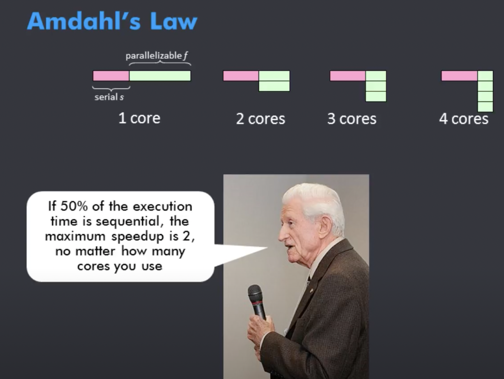
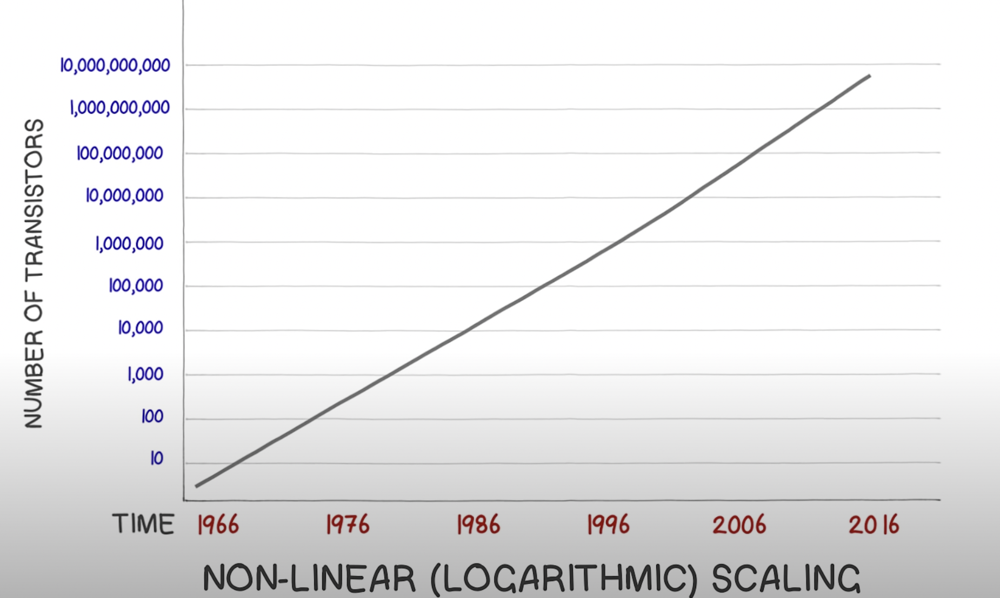
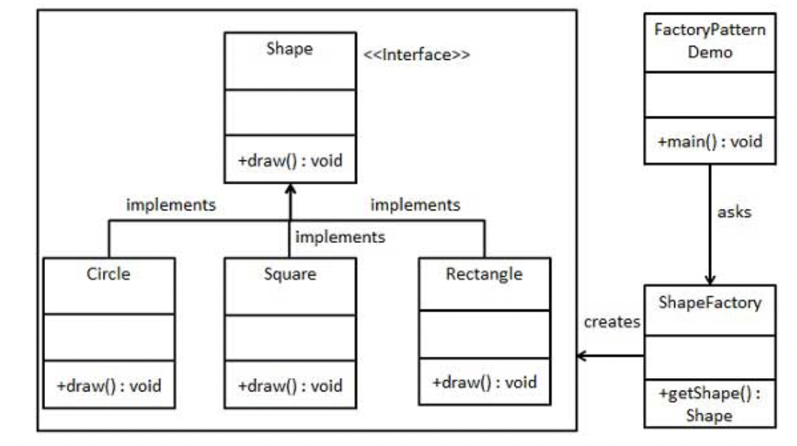

# LLD:Theory

## \#Notes

* \*\*\*\*[**A plain english introduction to CAP Theorem**](http://ksat.me/a-plain-english-introduction-to-cap-theorem)\*\*\*\*
* How to identify **classes, attributes & methods** in system? ✅⭐️🔥😎
  * **Classes =&gt; Noun**
  * **Attribute =&gt; Adjectives**
  * **Methods =&gt; Verbs**
* [VSCode: Using Black to automatically format Python](https://dev.to/adamlombard/how-to-use-the-black-python-code-formatter-in-vscode-3lo0)
* [Ducktyping](https://realpython.com/lessons/duck-typing/)??
  * This term comes from the saying “If it walks like a duck, and it quacks like a duck, then it must be a duck.” \(There are [other variations](https://en.wikipedia.org/wiki/Duck_test#History)\).
  * Duck typing is a concept related to **dynamic typing**, where the type or the class of an object is less important than the methods it defines. When you use duck typing, **you do not check types at all. Instead, you check for the presence of a given method or attribute.**
* **In python, objects are passed by REFERENCE!!!!!!!!!!!!!!!!!!!!!!**
* **Deployment:**
  * for **CLI** apps: [repl.com](https://replit.com/)
    * **Sharing with others**\(as run-only\) : append `?embed=1` in the end of url:
    * E.g: [https://replit.com/@ReaderMango/CardWars](https://replit.com/@ReaderMango/CardWars#main.py)?embed=1
  * for **GUI** apps: django/flask

## 1. Classes & Attributes

```python
"""
* A Class has 3 things:
    1. Attributes
    2. __init__()
    3. Methods

* self is "skipped" in arguments while we create an instance
"""
class Dog:

    id_counter = 1

    def __init__(self, name, age, color="Black"):
        self.id = Dog.id_counter
        self.name = name
        self.age = age
        self.color = color

        Dog.id_counter += 1

    def bark(self):
        print(f"ID = {self.id} name is {self.name} and I am {self.age} years old; col = {self.color}")
        
d1 = Dog("Dot", 4)
d1.bark()
```

## 2. Encapsulation

```python
class Car:

    id_counter = 1

    def __init__(self, name, model, year):
        self._id = Car.id_counter
        self._name = name
        self.model = model
        self.__year = year

        Car.id_counter += 1

    # Getter: Using @property Decorator
    @property
    def name(self):
        return self._name
    
    @name.setter
    def name(self,new_name):
        self._name = new_name
    
    # # getter
    # def get_id(self):
    #     return self._id

    # # setter
    # def set_id(self, new_id):
    #     if isinstance(new_id, int) and new_id > 0:
    #         self._id = new_id
    #     else:
    #         print("Plese enter a valid id")

    # # using property
    # id = property(get_id, set_id)
```

* A Class has 2 main parts: 
  1.  **Interface** : the "visible" part of class with which user can interact 
     * Eg. Power **Switch** \(class = Fan\)
  2. **Implementation**: the actual code level logic which performs the functionality. 
     * Eg. Internal wiring of **fan** \(class = Fan\)
* **Abstraction**: =&gt; Show only the essential attributes & hide unnecessary details from user
* **Encapsulation** is implemented using:
  * public \| private
  * getters \| setters
* **Abstraction vs Encapsulation**
  * Encapsulation hides variables or some implementation that may be changed so often in a class to prevent outsiders access it directly. They must access it via getter and setter methods.
  * Abstraction is used to hide something too, but in a higher degree \(class, **interface**\). Clients who use an abstract class \(or interface\) do not care about what it was, they just need to know what it can do.
* **How to make attributes private:**
  * \(src: official doc\) _actual "**private**" thing doesnt exist in python._
  * However, there is a **convention**\(naming attrs as : `_attrName`\) followed in codes.
  * Technically, you CAN access `_attr` , but as per coding practice; you SHOULDNT
  * 2 ways of making attributes private:
    1. By Convention =&gt; `_<attribute>`
    2. Changing name\("Name Mangling"\)   =&gt; `__<attribute>`  \(used only for some special cases\)
       * Hides the attr more furhter
       * if you give two underscores in attr name \(`__attrName`\); python begins the process of **Name Mangling;** so you shouldnt give two underscores until you're fully sure.
       * **attr1 ==\[Name Mangling\]==&gt; \_class1**attr1
  * **NOTE**: dont use term 'private' for python\(as it doesnt exist\), instead use '**non-public**
* **@property Decorator:**

  * What is **Decorator**:
    * =&gt; A function that takes a function & **extends its behaviour w/o explicitly modifying it.**
    * i.e. its a "special" function extender
  * Why use Decorator:
    * cleaner code
    * easier to read/understand
    * avoid calling `property()` directly
  * SYNTAX:
    * getter: `@propety`
    * setter: `@attName.setter` \(NOTE: its NOT `@property.setter` baby\)
    * deleter: `@attName.deleter`

## 3. Abstraction

```python
from abc import ABC, abstractmethod

class Printer(ABC):
    @abstractmethod
    def print(self, document):
        raise NotImplementedError()


class Scanner(ABC):
    @abstractmethod
    def scan(self, document):
        pass


class MyPrinter(Printer):
    def print(self, document):
        print(document)


class Photocopier(Printer, Scanner):
    def print(self, document):
        print(document)

    def scan(self, document):
        pass  # implement something meaningful here

p = Photocopier()
p.print('hahaha')
```

* **An abstract method:** is a method that is declared, but contains no implementation.
* **Abstract Classes**
  * =&gt; Abstract classes are classes that contain **one or more abstract methods**.
  * Abstract classes cannot be instantiated, and require subclasses to provide implementations for the abstract methods.
  * Python on its own doesn't provide abstract classes. Yet, Python comes with a module which provides the infrastructure for defining **Abstract Base Classes \(ABCs\)**
* **Section Highlights:**
  *  `raise NotImplementedError()` or `pass` =&gt; **both** can be used; as per the needs
  *  `from abc import ABC, abstractmethod`

## 4. Methods

```python
class Cart:
    def __init__(self):
        self._items = []

    @property
    def items(self):
        return self._items

    def add_item(self, item):
        if isinstance(item, str):
            self._items.append(item)
            return self        # Merhod chainging:: prev method SHOULD return `self` in order for next method to work
        else:
            print("Add a valid item please!")

    def add_multiple_items(self, items):
        for item in items:
            self.add_item(item)

    def remove_item(self, item):
        if item in self._items:
            self._items.remove(item)
            return 1
        else:
            return 0

    def has_item(self, item):
        return item in self._item


mycart = Cart()
print(f"Before: items = {mycart.items}")
mycart.add_item("Nike Shoe").add_item("Sports Shoes")    # Method Chainging(see ^)
print(f"After: items = {mycart.items}")
```

## 5. Mutation & Cloning

* **Alisas**
  * =&gt; Two or more references to the same memory address 
  * i.e. Different name, Same object
* **Immutable Data Types in python:**
  * String
  * Tuples
* **Mutable Data Types in python:**
  * list
  * set
  * dict
* **Cloning**
  * =&gt; Creating an exact copy of the obj, completely independent from original obj
  * i.e. Antonym of 'Alias'
  * To clone a **list**: `b = a[:]`
  * To clone a **dict**: `d2 = d1.copy()`
  * **SHALLOW vs DEEP**
    * When you make a shallow copy of an object, you are making a new object in memory, a new reference, but the content of the object will still point to the same objects
    * With a deep copy, in addition to creating a copy of the "container" object, you also create a copy of the elements contained in the object

## 6. Inheritance

```python
class Polygon:
    def __init__(self, num_sides, color):
        self.num_sides = num_sides
        self.color = color
        
    def describe_me(self):
        print(f'I have {self.num_sides} sides & {self.color} color')


class Triangle(Polygon):

    NUM_SIDES = 3

    def __init__(self, base, height, color):
        Polygon.__init__(self, Triangle.NUM_SIDES, color)
        # super().__init__(Triangle.NUM_SIDES,color)
        self.base = base
        self.height = height

    def find_area(self):
        return (self.base*self.height)/2

class Square(Polygon):

    NUM_SIDES = 4

    def __init__(self, side_length, color):
        Polygon.__init__(self, Square.NUM_SIDES, color)
        self.side_length = side_length

    def find_area(self):
        return self.side_length**2

myt = Triangle(3, 5, "red")
mysq = Square(4, "black")
myt.describe_me()
print(myt.find_area())
mysq.describe_me()
print(mysq.find_area())


'''1. Multilevel Inheritence'''

class Vehicle:
    pass


class LandVehicle(Vehicle):
    pass


class Car(LandVehicle):
    pass


''' 2.Multiple Inheritence'''
class Rectangle:
    def __init__(self, length, width, color):
        self.length = length
        self.width = width
        self.color = color


class GUIElement:
    def click(self):
        print("The object was clicked...")


class Button(Rectangle, GUIElement):
    def __init__(self, length, width, color, text):
        Rectangle.__init__(self, length, width, color)
        self.text = text

```

* **Inheritence:**
  * =&gt; Designing classes that inherit attributes & methods from other classes
  * **check if subclass**: `issubclass(Dog, Animal)`
* **On using `super()`:**
  * If subclass doesnt has its own **init**\(\) ; it'll automatically inherit its parent's **init**\(\)
  * If subclass HAS its own **init**\(\) ; have to use SUPER:
    * SYNTAX:
      1. .**init**\(self,\)
      2. super\(\).**init**\(\)
* **Method Overriding**
  * =&gt; customize/extend the functionality of a method which is defined in superclass
  * in case of overriding\(same method name in superclass & subclass\), **method of subclass will be called first**
* **Method Overloading**
  * occurs when two methods in the same class have the same name but different parameters
  * So when you call the method, the version that is executed is determined by the data types of the arguments or by the number of arguments.
  * **Python does not support method overloading**. 
    * The closest thing that you could think of in Python is default arguments, because you can call a method passing a different number of arguments if you want to use the default values. But this is not method overloading per se.
  * Java does support method overloading 
    * because you need to explicitly declare the data type of each argument, so the compiler can match the number, sequence, and data types of the arguments with the number, sequence, and data types of the formal parameters to determine which version of the method it should call.
* **Polymorphism**
  * =&gt; Polymorphism means that an object can take many forms.
  * Tip: Polymorphism can be achieved through **method overriding** and method overloading \(method overloading is not supported in Python per se\).
  * **In Python, polymorphism can be implemented through inheritance** when you **override** methods from the superclass.
* **Section Highlight:** 
  * `Superclass.__init__(self)`
* What's the Object Oriented way to get rich? =&gt; Inheritance 🤣

## 7. Concurrency \(py\)

* **GIL**\(Global Interpreter Lock\) =&gt;
  * is a part of **CPython** \(a typical, mainline Python implementation\) 
  * its function: **No multithreading is allowed**
    * Nevertheless; ****you **can use multithreading in python** due to **fast context switching**
* A **thread** is just a block of code that gets executed.
* **1.Multithreading**: Using threads is like running multiple programs at once. Threads take turn while getting executed. And while one is getting executed; the other sleeps\(until its his turn for execution\)
* **2.Multiprocessing:** In multiprocessing you leverage **multiple CPUs cores** to distribute your calculations. 
  * Since each of the CPUs runs in parallel, you're effectively able to run multiple tasks simultaneously.
* **`3.asyncio`**: asyncio is a library to write **concurrent** code using the **async/await** syntax.
  * is essentially **threading** where **not the CPU but you, as a programmer \(or actually your application\), decide where and when does the context switch happen**.
  *  In Python you use an `await` keyword to suspend the execution of your coroutine \(defined using `async` keyword\).
  * asyncio provides a set of **high-level** APIs to:
    * run Python **coroutines** concurrently and have full control over their execution;
    * perform network IO and IPC;
    * control subprocesses;
    * distribute tasks via **queues**;
    * synchronize concurrent code;
  * **issues with asyncio during HTTP calls:**
    * the `request` module is blocking in nature, i.e. it runs **synchronously**.
    * so even if you use asyncio; the complete process remains synchronous
    * **===&gt;** use **`aiohttp`** instead of `requests` , its smart enough to figure out when to await
    * \`\`
* **Which one to choose:**
  * is it CPU Bound ?  ------------------------------------------------------------------------&gt; USE `multiprocessing`
  * **I/O** Bound, **Fast I/O**, **Limited** Number of Connections ? --------------&gt; USE **`multihreading`** 
  * **I/O** Bound, **Slow** I/O, **Many** connections? ------------------------------------&gt; USE `asyncio`



```python
# 0. ====================== Normal Synchronous way ============================
import requests
import time

from timer import timer

URL = 'https://httpbin.org/uuid'

def fetch(session, url):
    with session.get(url) as response:
        print(response.json()['uuid'])


@timer(1, 1)
def main():
    start_time = time.time()
    with requests.Session() as session:
        for _ in range(100):
            fetch(session, URL)
    total_time = time.time() - start_time
            
# timer.py
import timeit

def timer(number, repeat):
    def wrapper(func):
        runs = timeit.repeat(func, number=number, repeat=repeat)
        print(sum(runs) / len(runs))

    return wrapper
    
# 1. ====================== Using Multiprocessing ============================
from multiprocessing.pool import Pool

import requests
import time

from timer import timer

URL = 'https://httpbin.org/uuid'

def fetch(session, url):
    with session.get(url) as response:
        print(response.json()['uuid'])


@timer(1, 1)
def main():
    start_time = time.time()
    with Pool() as pool:
        with requests.Session() as session:
            pool.starmap(fetch, [(session, URL) for _ in range(100)])
    total_time = time.time() - start_time


# 2. ====================== Using Multithreading ============================

from concurrent.futures import ThreadPoolExecutor

import requests

from timer import timer

URL = 'https://httpbin.org/uuid'

def fetch(session, url):
    with session.get(url) as response:
        print(response.json()['uuid'])


@timer(1, 5)
def main():
    with ThreadPoolExecutor(max_workers=100) as executor:
        with requests.Session() as session:
            executor.map(fetch, [session] * 100, [URL] * 100)
            executor.shutdown(wait=True)


# 3. ====================== Using Asycio(aiohttp) ============================

import asyncio
import aiohttp

from timer import timer

URL = 'https://httpbin.org/uuid'


async def fetch(session, url):
    async with session.get(url) as response:
        json_response = await response.json()
        print(json_response['uuid'])


async def main():
    async with aiohttp.ClientSession() as session:
        tasks = [fetch(session, URL) for _ in range(100)]
        await asyncio.gather(*tasks)


@timer(1, 5)
def func():
    asyncio.run(main())
```



```python
import threading
import time
import random

def executeThread(i):
    # Print when the thread went to sleep
    print("Thread {} sleeps at {}".format(i, time.strftime("%H:%M:%S", time.gmtime())))

    # Generate a random sleep period of between 1 and  5 seconds
    randSleepTime = random.randint(1, 5)

    # Pauses execution of code in this function for a few seconds
    time.sleep(randSleepTime)   #NOTE: this is where the next thread can KICK IN

    # Print out info after the sleep time
    print("Thread {} stops sleeping at {}".format(i, time.strftime("%H:%M:%S", time.gmtime())))

for i in range(5):

    # create a new Thread object here: 
    
    # WHY THE COMMA?: The arguments passed must be a sequence which
    # is why we need the comma with 1 argument
    thread = threading.Thread(target=executeThread, args=(i,))
    thread.start()

    # Display active threads The extra 1 is this for loop executing in the main thread
    print("Active Threads :", threading.activeCount())

    # Returns a list of all active thread objects
    print("Thread Objects :", threading.enumerate())
    
'''
# Output =============================================================
Thread 0 sleeps at 17:07:56
Active Threads : 2
Thread Objects : [<_MainThread(MainThread, started 4370300224)>, <Thread(Thread-1, started 6114996224)>]
Thread 1 sleeps at 17:07:56
Active Threads : 3
Thread Objects : [<_MainThread(MainThread, started 4370300224)>, <Thread(Thread-1, started 6114996224)>, <Thread(Thread-2, started 6131822592)>]
Thread 2 sleeps at 17:07:56
Active Threads : 4
Thread Objects : [<_MainThread(MainThread, started 4370300224)>, <Thread(Thread-1, started 6114996224)>, <Thread(Thread-2, started 6131822592)>, <Thread(Thread-3, started 6148648960)>]
Thread 3 sleeps at 17:07:56
Active Threads : 5
Thread Objects : [<_MainThread(MainThread, started 4370300224)>, <Thread(Thread-1, started 6114996224)>, <Thread(Thread-2, started 6131822592)>, <Thread(Thread-3, started 6148648960)>, <Thread(Thread-4, started 6165475328)>]
Thread 4 sleeps at 17:07:56
Active Threads : 6
Thread Objects : [<_MainThread(MainThread, started 4370300224)>, <Thread(Thread-1, started 6114996224)>, <Thread(Thread-2, started 6131822592)>, <Thread(Thread-3, started 6148648960)>, <Thread(Thread-4, started 6165475328)>, <Thread(Thread-5, started 6182301696)>]
Thread 3 stops sleeping at 17:07:57
Thread 2 stops sleeping at 17:07:58
Thread 0 stops sleeping at 17:07:59
Thread 4 stops sleeping at 17:07:59
Thread 1 stops sleeping at 17:08:01
'''
# =========================== [Using threading Class] =========================

class CustThread(threading.Thread):
    def __init__(self, name):
        threading.Thread.__init__(self)
        self.name = name

    def run(self):
        getTime(self.name)
        print("Thread", self.name, "Execution Ends")


def getTime(name):
    print(
        "Thread {} sleeps at {}".format(name, time.strftime("%H:%M:%S", time.gmtime()))
    )
    randSleepTime = random.randint(1, 5)
    time.sleep(randSleepTime)


# Create thread objects
thread1 = CustThread("1")
thread2 = CustThread("2")

# Start thread execution of run()
thread1.start()
thread2.start()

# Check if thread is alive
print("Thread 1 Alive :", thread1.is_alive())
print("Thread 2 Alive :", thread2.is_alive())

# Get thread name
# You can change it with setName()
print("Thread 1 Name :", thread1.getName())
print("Thread 2 Name :", thread2.getName())

# Wait for threads to exit
thread1.join()
thread2.join()

print("Execution Ends")
'''
Output ============================
Thread 1 sleeps at 17:12:00
Thread 2 sleeps at 17:12:00
Thread 1 Alive : True
Thread 2 Alive : True
Thread 1 Name : 1
Thread 2 Name : 2
Thread 1 Execution Ends
Thread 2 Execution Ends
Execution Ends
'''
```



```python
# ---------- SYNCHRONIZING THREADS ----------
# You can lock other threads from executing

# If we try to model a bank account we have to make sure
# the account is locked down during a transaction so
# that if more then 1 person tries to withdrawal money at
# once we don't give out more money then is in the account


class BankAccount(threading.Thread):

    acctBalance = 100

    def __init__(self, name, moneyRequest):
        threading.Thread.__init__(self)
        self.name = name
        self.moneyRequest = moneyRequest

    def run(self):
        # Get lock to keep other threads from accessing the account
        threadLock.acquire()

        # Call the static method
        BankAccount.getMoney(self)

        # Release lock so other thread can access the account
        threadLock.release()

    @staticmethod   # method that is bound to the class and not the object of the class. A static method can't access or modify the class state
    def getMoney(customer):
        print(
            "{} tries to withdrawal ${} at {}".format(
                customer.name,
                customer.moneyRequest,
                time.strftime("%H:%M:%S", time.gmtime()),
            )
        )

        if BankAccount.acctBalance - customer.moneyRequest > 0:
            BankAccount.acctBalance -= customer.moneyRequest
            print("New account balance is : ${}".format(BankAccount.acctBalance))
        else:
            print("Not enough money in the account")
            print("Current balance : ${}".format(BankAccount.acctBalance))

        time.sleep(3)


# Create a lock to be used by threads
threadLock = threading.Lock()

# Create new threads
doug = BankAccount("Doug", 1)
paul = BankAccount("Paul", 100)
sally = BankAccount("Sally", 50)

# Start new Threads
doug.start()
paul.start()
sally.start()

# Have threads wait for previous threads to terminate
doug.join()
paul.join()
sally.join()

print("Execution Ends")

'''
OUTPUT : =================================================

Doug tries to withdrawal $1 at 17:21:16
New account balance is : $99
Paul tries to withdrawal $100 at 17:21:19
Not enough money in the account
Current balance : $99
Sally tries to withdrawal $50 at 17:21:22
New account balance is : $49
Execution Ends
'''
```



```python
import asyncio

async def find_divisibles(inrange, div_by):
    print("finding nums in range {} divisible by {}".format(inrange, div_by))
    located = []
    for i in range(inrange):
        if i % div_by == 0:
            located.append(i)

        if i % 500000 == 0:
            await asyncio.sleep(0.0001) # stop this and switch to next task in queue
    print("Done w/ nums in range {} divisible by {}".format(inrange, div_by))
    return located


async def main():
    divs1 = loop.create_task(find_divisibles(50800, 34113))
    divs2 = loop.create_task(find_divisibles(100052, 3210))
    divs3 = loop.create_task(find_divisibles(500, 3))
    await asyncio.wait([divs1, divs2, divs3])
    return divs1, divs2, divs3


if __name__ == "__main__":
    try:
        loop = asyncio.get_event_loop()
        loop.set_debug(1)
        d1, d2, d3 = loop.run_until_complete(main())  # get rerturn values
        print(d1.result())  # => [0, 34113]
    except Exception as e:
        # logging...etc
        pass
    finally:
        loop.close()
'''
finding nums in range 50800 divisible by 34113
finding nums in range 100052 divisible by 3210
finding nums in range 500 divisible by 3
Done w/ nums in range 50800 divisible by 34113
Done w/ nums in range 100052 divisible by 3210
Done w/ nums in range 500 divisible by 3
[0, 34113]
'''
```



* **Amdahl's Law**



* **Moore's law**



* **Resources**: 
  * eduvative.io : [Python Concurrency for Senior Engineering Interviews](https://www.educative.io/courses/python-concurrency-for-senior-engineering-interviews) : couldn't find on torrent!
  * concurrency in Python \(videos\): taken from [git:coding-interview-university](https://github.com/jwasham/coding-interview-university)

    *  [Short series on threads](https://www.youtube.com/playlist?list=PL1H1sBF1VAKVMONJWJkmUh6_p8g4F2oy1)
    *  [Python Threads](https://www.youtube.com/watch?v=Bs7vPNbB9JM)
    *  [Understanding the Python GIL \(2010\)](https://www.youtube.com/watch?v=Obt-vMVdM8s)
      * [reference](http://www.dabeaz.com/GIL)
    *  [David Beazley - Python Concurrency From the Ground Up: LIVE! - PyCon 2015](https://www.youtube.com/watch?v=MCs5OvhV9S4)
    *  [Keynote David Beazley - Topics of Interest \(Python Asyncio\)](https://www.youtube.com/watch?v=ZzfHjytDceU)
    *  [Mutex in Python](https://www.youtube.com/watch?v=0zaPs8OtyKY)

## 8. SOLID Design Patterns

### 8.1. SRP =&gt; Single Responsibility Principle

* Its also called SOC \(Separation of Concerns\)
* **IDEA**: =&gt; A class should have a single region to change & that should be its PRIMARY responsibility

```python
class Journal:
    def __init__(self):
        self.entries = []
        self.count = 0

    def add_entry(self, text):
        self.entries.append(f"{self.count}: {text}")
        self.count += 1

    def remove_entry(self, pos):
        del self.entries[pos]

    def __str__(self):
        return "\n".join(self.entries)
    
    
    '''
        SRP: instead of creating below (sort-of isolated) functions in same class; create a SEPARATE class - so that in future further classes can use it
    '''
    # break SRP     
    # def save(self, filename):
    #     file = open(filename, "w")
    #     file.write(str(self))
    #     file.close()

    # def load(self, filename):
    #     pass

    # def load_from_web(self, uri):
    #     pass


class PersistenceManager:
    def save_to_file(journal, filename):
        file = open(filename, "w")
        file.write(str(journal))
        file.close()
        
    def load(self, filename):
        pass

    def load_from_web(self, uri):
        pass


j = Journal()
j.add_entry("I cried today.")
j.add_entry("I ate a bug.")
print(f"Journal entries:\n{j}\n")

p = PersistenceManager()
file = r'c:\temp\journal.txt'
p.save_to_file(j, file)

# verify!
with open(file) as fh:
    print(fh.read())
```

### 8.2. OCP =&gt; Open Close Principle

* **IDEA** =&gt; classes should be OPEN for Extension, but CLOSED for Modification
  * i.e. after you've written a class; if a new business requirement comes =&gt; you should not modify it. You should ONLY extend it

### 8.3. LSP =&gt; Liskov Substituion Principle

### 8.4. ISP =&gt; Interface Segratation Principle

*  IDEA -&gt; Dont stick too many things\(atts/methods\) in an interface

### 8.5. DIP =&gt; Dependency Inversion Principle

* IDEA =&gt; high level modules should not depend on low level modules. Instead, they should depend on abstractions\(Interfaces\)

## 9. Testing in Python✅✅🧪

```python
import unittest
from parking_lot import ParkingLot, Car, Bike, Bus

class TestParkingLot(unittest.TestCase):
    # UT: test each function
    def test_park(self):
        parkingLotObj = ParkingLot(6, 30)
        res2 = parkingLotObj.parkVehicle(Car(10, "Amazon"))
        res3 = parkingLotObj.parkVehicle(Bike(20, "Amazon"))
        res4 = parkingLotObj.parkVehicle(Bus(30, "Microsoft"))

        self.assertEqual(res2, True)
        self.assertEqual(res3, True)
        self.assertEqual(res4, True)
    # IT: integration test
    def test_all(self):
        parkingLotObj = ParkingLot(3, 10)
        self.assertTrue(parkingLotObj.parkVehicle(Car(10, "Google")))

        self.assertTrue(parkingLotObj.leaveOperation(Car(10, "Google")))
        self.assertEqual(parkingLotObj.companyParked("Google"), [])


if __name__ == '__main__':
    unittest.main()    # runs all
```

## 10. Loggin in Python

* **Logging Levels:**
  * **DEBUG**: Detailed information, typically of interest only when diagnosing problems.
  * **INFO**: Confirmation that things are working as expected.
  * **WARNING**: An indication that something unexpected happened, or indicative of some problem in the near future \(e.g. ‘disk space low’\). The software is still working as expected.
  * **ERROR**: Due to a more serious problem, the software has not been able to perform some function.
  * **CRITICAL**: A serious error, indicating that the program itself may be unable to continue running.
* **IMPLEMENTATION:** use python's `logging` lib
  * logging levels\(after which level we should print the logs\) can be configured in beginning



```python
import logging


#setup logging cofig in beginning
# -------------> which file to print logs in(instead of console)
# -------------> minimum level, >= which logs should be printed
# -------------> log format (copy from the docs)
logging.basicConfig(filename='mylogs.log', level=logging.DEBUG,
                    format='%(asctime)s:%(levelname)s:%(message)s')

def add(x, y):
    """Add Function"""
    return x + y


def subtract(x, y):
    """Subtract Function"""
    return x - y


def multiply(x, y):
    """Multiply Function"""
    return x * y


def divide(x, y):
    """Divide Function"""
    return x / y


num_1 = 20
num_2 = 10

add_result = add(num_1, num_2)
logging.debug('Add: {} + {} = {}'.format(num_1, num_2, add_result))

sub_result = subtract(num_1, num_2)
logging.debug('Sub: {} - {} = {}'.format(num_1, num_2, sub_result))

mul_result = multiply(num_1, num_2)
logging.debug('Mul: {} * {} = {}'.format(num_1, num_2, mul_result))

div_result = divide(num_1, num_2)
logging.debug('Div: {} / {} = {}'.format(num_1, num_2, div_result))

'''
# @mylogs.log
2021-09-06 01:33:31,397:DEBUG:Add: 20 + 10 = 30
2021-09-06 01:33:31,397:DEBUG:Sub: 20 - 10 = 10
2021-09-06 01:33:31,397:DEBUG:Mul: 20 * 10 = 200
2021-09-06 01:33:31,397:DEBUG:Div: 20 / 10 = 2.0
'''
```



## 10. Enums in Python OOP

```python
from enum import Enum

class Direction(Enum):
    UP = "UP"
    DOWN = "DOWN"
    NONE = "NONE"

class Elevator:

    def __init__(self, curr_direction=Direction.UP):
        self._id = Elevator.ids
        self._curr_direction = curr_direction

    @property
    def curr_direction(self):
        return Direction[self._curr_direction].name    # returns string 'UP'
if __name__ == "__main__":

    el = Elevator(curr_direction="DOWN", curr_state="IDLE", curr_floor=5)
    print(el.curr_direction)  #  # returns string 'DOWN' 
```

## 11. Design Patterns

### 1. Strategy

* create separate class for each logic of "strategies"
* e.g.: for class **`Queue`**; create separate class: **`FIFO`**, **`LIFO`**, **`RANDOM`** etc
* e.g. for class **`Elevator`**; create separate class for each elevator algo



```python
import string
import random
from typing import List
from abc import ABC, abstractmethod


def generate_id(length=8):
    # helper function for generating an id
    return ''.join(random.choices(string.ascii_uppercase, k=length))


class SupportTicket:

    def __init__(self, customer, issue):
        self.id = generate_id()
        self.customer = customer
        self.issue = issue


class TicketOrderingStrategy(ABC):
    @abstractmethod
    def create_ordering(self, list: List[SupportTicket]) -> List[SupportTicket]:
        pass


class FIFOOrderingStrategy(TicketOrderingStrategy):
    def create_ordering(self, list: List[SupportTicket]) -> List[SupportTicket]:
        return list.copy()


class FILOOrderingStrategy(TicketOrderingStrategy):
    def create_ordering(self, list: List[SupportTicket]) -> List[SupportTicket]:
        list_copy = list.copy()
        list_copy.reverse()
        return list_copy


class RandomOrderingStrategy(TicketOrderingStrategy):
    def create_ordering(self, list: List[SupportTicket]) -> List[SupportTicket]:
        list_copy = list.copy()
        random.shuffle(list_copy)
        return list_copy


class BlackHoleStrategy(TicketOrderingStrategy):
    def create_ordering(self, list: List[SupportTicket]) -> List[SupportTicket]:
        return []


class CustomerSupport:

    def __init__(self, processing_strategy: TicketOrderingStrategy):
        self.tickets = []
        self.processing_strategy = processing_strategy

    def create_ticket(self, customer, issue):
        self.tickets.append(SupportTicket(customer, issue))

    def process_tickets(self):
        # create the ordered list
        ticket_list = self.processing_strategy.create_ordering(self.tickets)

        # if it's empty, don't do anything
        if len(ticket_list) == 0:
            print("There are no tickets to process. Well done!")
            return

        # go through the tickets in the list
        for ticket in ticket_list:
            self.process_ticket(ticket)

    def process_ticket(self, ticket: SupportTicket):
        print("==================================")
        print(f"Processing ticket id: {ticket.id}")
        print(f"Customer: {ticket.customer}")
        print(f"Issue: {ticket.issue}")
        print("==================================")


# create the application
app = CustomerSupport(RandomOrderingStrategy())

# register a few tickets
app.create_ticket("John Smith", "My computer makes strange sounds!")
app.create_ticket("Linus Sebastian", "I can't upload any videos, please help.")
app.create_ticket("Arjan Egges", "VSCode doesn't automatically solve my bugs.")

# process the tickets
app.process_tickets()

```



```python
import string
import random
from typing import List


def generate_id(length=8):
    # helper function for generating an id
    return ''.join(random.choices(string.ascii_uppercase, k=length))


class SupportTicket:

    def __init__(self, customer, issue):
        self.id = generate_id()
        self.customer = customer
        self.issue = issue


class CustomerSupport:

    def __init__(self, processing_strategy: str = "fifo"):
        self.tickets = []
        self.processing_strategy = processing_strategy

    def create_ticket(self, customer, issue):
        self.tickets.append(SupportTicket(customer, issue))

    def process_tickets(self):
        # if it's empty, don't do anything
        if len(self.tickets) == 0:
            print("There are no tickets to process. Well done!")
            return

        if self.processing_strategy == "fifo":
            for ticket in self.tickets:
                self.process_ticket(ticket)
        elif self.processing_strategy == "filo":
            for ticket in reversed(self.tickets):
                self.process_ticket(ticket)
        elif self.processing_strategy == "random":
            list_copy = self.tickets.copy()
            random.shuffle(list_copy)
            for ticket in list_copy:
                self.process_ticket(ticket)

    def process_ticket(self, ticket: SupportTicket):
        print("==================================")
        print(f"Processing ticket id: {ticket.id}")
        print(f"Customer: {ticket.customer}")
        print(f"Issue: {ticket.issue}")
        print("==================================")


# create the application
app = CustomerSupport("filo")

# register a few tickets
app.create_ticket("John Smith", "My computer makes strange sounds!")
app.create_ticket("Linus Sebastian", "I can't upload any videos, please help.")
app.create_ticket("Arjan Egges", "VSCode doesn't automatically solve my bugs.")

# process the tickets
app.process_tickets()

```



### 1. SINGLETON

* "There can only be one!"
* i.e. **at one time; only one instance can exit**
* **e.g.**
  * 1 Moon \(anti `1Q84` hai, par real hai\)
  * 1 Sun
* **How:** each time you want to create a new instance
  * check if an instance exists =&gt; dont create another; just return it
  * if doesnt exit =&gt; create new
* In this way; all our instances will **point to single instance.**
* **@used:** ParkingLot



```python
class ParkingLot:
    # singleton ParkingLot to ensure only one object of ParkingLot in the system,
    # all entrance panels will use this object to create new parking ticket: get_new_parking_ticket(),
    instance = None

    class __OnlyOne:
        def __init__(self, name, address):
            self.__name = name
            self.__address = address
            self.__parking_rate = ParkingRate()

    def __init__(self, name, address):
        if not ParkingLot.instance:
            ParkingLot.instance = ParkingLot.__OnlyOne(name, address)
        else:
            ParkingLot.instance.__name = name
            ParkingLot.instance.__address = address
```



### 2. [BUILDER](https://www.tutorialspoint.com/design_pattern/builder_pattern.htm)

* builds a complex object using simple objects and using a step by step approach.
* **e.g.@Flipkart**:
  * buildMnmFact 
    * buildSupplyObj
      * buildLaudaObj
        * ...
    * buildDemandObj 
      * buildLassanObj
        * ...

### 3. [FACTORY](https://www.tutorialspoint.com/design_pattern/factory_pattern.htm)

* we create object without exposing the creation logic to the client and refer to newly created object using a common interface



### 4. [PROTOTYPE](https://www.tutorialspoint.com/design_pattern/prototype_pattern.htm)

* creating **duplicate** object **instead of a new one**, because creating a new obj is **costly** .
* This pattern is used when creation of object directly is costly. 
* For example, an object is to be created after a **costly database operation**. 
* We can **cache** the object, returns its clone on next request and update the database as and when needed thus reducing database calls.

### 5. [ADAPTER](https://www.tutorialspoint.com/design_pattern/adapter_pattern.htm)

* a single class which is responsible to **join functionalities of independent or incompatible interfaces**. 
* e.g.: **card reader** which acts as an adapter between **memory card** and a **laptop**

### **6. BRIDGE**

### 7. FACADE

* Facade pattern hides the complexities of the system and provides an interface to the client using which the client can access the system
* a single class which provides simplified methods required by client and delegates calls to methods of existing system classes.

### 8. DECORATOR

* Decorator pattern allows a user to add new functionality to an existing object without altering its structure

### 9. OBSERVER

* it consists of 2 things: **Subject** & **Observer**
  * **subject**: does things/changes things
  * after doing things, the **subject notifies the observer** about the changes
* Observer pattern is used when there is **one-to-many** relationship between objects such as **if one object is modified, its dependent objects are to be notified automatically**.
* **NOTE:** this is used in **Even Management Systems** i.e.**API calls/ UI handling /events handling etc**

## \#Things to do:

* [x] Understand OOPs using Python
  * [x] **Beginner**: Udemy: [Python OOP - Object Oriented Programming for Beginners](https://razorpay.udemy.com/course/python-object-oriented-programming-oop/)
    * Implementation of OOPs concepts in python
  * [x] **Beginner:**Udemy: [Python OOP : Four Pillars of OOP in Python 3 for Beginners](https://razorpay.udemy.com/course/python-oops-beginners/)
    * `@abstractMethod`
  * [x] **Adv**: Udemy: [Advanced Python: Python OOP with 10 Real-World Programs](https://razorpay.udemy.com/course/the-python-pro-course/)
    * Structured process of LLD designing 💪
    * Deploying CLI apps\([repl.com](https://replit.com)\)
    * APIs =&gt; Django/Flask
* [x] Learn design principles - with implementation
  * [x] Udemy: [Design Patterns in Python](https://razorpay.udemy.com/course/design-patterns-python/) ☑️\| done **S.O.L.I.D.** \| **TODO**: finish rest later
  * [x] Udemy: [Pragmatic System Design](https://razorpay.udemy.com/course/pragmatic-system-design/)
* [ ] Revise Django, Node, React, Next - & have all the working code ready for interviews
  * [x] React2025
  * [ ] Udemy: [Full Stack Web Development with Python and Django Course](https://razorpay.udemy.com/course/crash-course-web-development-python-django/)
  * [ ] Udemy: [The Python Mega Course: Build 10 Real World Applications](https://razorpay.udemy.com/course/the-python-mega-course/)
  * [ ] Udemy: [React & Django Full Stack: web app, backend API, mobile apps](https://razorpay.udemy.com/course/react-django-full-stack/)
* [ ] Code up all the "stuff" we talk about in HLD & have working code ready.
* [ ] Solve as many questions as possible & have all the WORKING code in a repo
  * [ ] [Grokking the Object Oriented Design Interview](https://www.educative.io/courses/grokking-the-object-oriented-design-interview)
  * [ ] Git: [prasadgujar](https://github.com/prasadgujar)/[**low-level-design-primer**](https://github.com/prasadgujar/low-level-design-primer)
  * [ ] PDF: [Object-Oriented Design- Solutions & Algorithms](https://www.andiamogo.com/S-OOD.pdf)
  * [ ] [Leetcode Questions](https://leetcode.com/discuss/interview-question/object-oriented-design?currentPage=1&orderBy=hot&query)

## 

